# Gallery

<!-- generated by `pnpm gen` from data/examples.json. Edit the JSON, not this file. -->

**293 real websites**, screenshotted and checked by eye, grouped by what they teach. Click any image to visit the live site. Screenshots belong to their owners and are shown for commentary.

[Typography (24)](#typography) · [Colour (17)](#colour) · [Dark mode (17)](#dark-mode) · [Layout & space (12)](#layout-space) · [Hierarchy (13)](#hierarchy) · [Heroes (15)](#heroes) · [Bento grids (13)](#bento-grids) · [Footers (18)](#footers) · [Motion (14)](#motion) · [Scroll stories (17)](#scroll-stories) · [3D & WebGL (19)](#3d-webgl) · [Shaders & gradients (14)](#shaders-gradients) · [Components (19)](#components) · [SaaS landing pages (16)](#saas-landing-pages) · [E-commerce (17)](#e-commerce) · [Portfolios (15)](#portfolios) · [Editorial (8)](#editorial) · [Specimens & design systems (8)](#specimens-design-systems) · [AI products (17)](#ai-products)

## Typography

<table>
<tr><td width="33%" valign="top"> <b><a href="https://klim.co.nz">Klim Type Foundry</a></b> One huge inflated black 'A' fills an orange screen; a single letterform is the whole hero.</td><td width="33%" valign="top"> <b><a href="https://www.instrument.com">Instrument</a></b> Ultra-heavy wordmark set edge to edge as the masthead, with small condensed caps in pill nav.</td><td width="33%" valign="top"> <b><a href="https://commercialtype.com">Commercial Type</a></b> Full-width bands each set one typeface huge: hairline New Doric, fat Orlando serif, Arabic.</td></tr>
<tr><td width="33%" valign="top"> <b><a href="https://www.futurefonts.xyz">Future Fonts</a></b> Giant specimen lines of quirky display serifs and italics fill the page behind a tiny CTA.</td><td width="33%" valign="top"> <b><a href="https://velvetyne.fr">Velvetyne</a></b> Brutalist text-only index with letterspaced labels, then full-bleed specimens like ornate 'Deede la fractura'.</td><td width="33%" valign="top"> <b><a href="https://sharptype.co">Sharp Type</a></b> Sentences mix the fonts they describe inline: slab, mono, grotesque, italic, beside an outline 3D word.</td></tr>
<tr><td width="33%" valign="top"> <b><a href="https://lineto.com">Lineto</a></b> A printed weight ladder, Regular to Black Italic, beside a magazine cover using the same face.</td><td width="33%" valign="top"> <b><a href="https://www.grillitype.com">Grilli Type</a></b> Test-card hero spelling MCNK, then a clean two-column list where each name is set in itself.</td><td width="33%" valign="top"> <b><a href="https://ohnotype.co">OH no Type Co</a></b> Italic mono nav, then black-and-white posters and a bold CAMELION specimen that show the fonts in use.</td></tr>
<tr><td width="33%" valign="top"> <b><a href="https://www.typotheque.com">Typotheque</a></b> Heavy 'Chairman' wordmark over a dense halftone texture, above a row of bright category cards.</td><td width="33%" valign="top"> <b><a href="https://www.wearecollins.com">COLLINS</a></b> A lone classical serif line, 'Rewrite your worth.', centred in a lot of empty space.</td><td width="33%" valign="top"> <b><a href="https://pangrampangram.com">Pangram Pangram Foundry</a></b> Rounded photo cards, each named with its own typeface in huge bold white text, like 'Neue Gstaad'.</td></tr>
<tr><td width="33%" valign="top"> <b><a href="https://www.205.tf">205TF</a></b> One serif word, white on black, fills the slide; monospace nav keeps the interface quiet.</td><td width="33%" valign="top"> <b><a href="https://boldmonday.com">Bold Monday</a></b> Stacked colour bands each set a typeface in weights and italics, mixing families per line.</td><td width="33%" valign="top"> <b><a href="https://bureauroffa.com">Bureau Roffa</a></b> Rotated running text behind a boxed display title shows a typeface at two scales at once.</td></tr>
<tr><td width="33%" valign="top"> <b><a href="https://cotypefoundry.com">CoType Foundry</a></b> Specimen tiles show weights, scripts, glyphs and numerals of Aeonik Soft in bright colour blocks.</td><td width="33%" valign="top"> <b><a href="https://fontwerk.com">Fontwerk</a></b> Arabic display type and Latin caption share one hero, showing a bilingual family in use.</td><td width="33%" valign="top"> <b><a href="https://nouvellenoire.ch">Nouvelle Noire</a></b> Live type tester bar with size slider above huge Arosa Extra Bold sample text.</td></tr>
<tr><td width="33%" valign="top"> <b><a href="https://optimo.ch">Optimo</a></b> Huge monospaced headline in red and black on warm paper; a cropped marquee of type below.</td><td width="33%" valign="top"> <b><a href="https://www.productiontype.com">Production Type</a></b> One typeface name set enormous in its own condensed face, surrounded by generous white space.</td><td width="33%" valign="top"> <b><a href="https://www.schick-toikka.com">Schick Toikka</a></b> Two-column catalogue: each family name set in itself, with monospace metadata above hairline rules.</td></tr>
<tr><td width="33%" valign="top"> <b><a href="https://www.swisstypefaces.com">Swiss Typefaces</a></b> Giant white serif headline over a saturated red-magenta photo makes the type the hero.</td><td width="33%" valign="top"> <b><a href="https://tightype.com">Tightype</a></b> Bull-5 specimen mixes weights, widths and mono styles line by line in one centred block.</td><td width="33%" valign="top"> <b><a href="https://www.typemates.com">TypeMates</a></b> Intro sentence set as large wide display text, with thick underlines doubling as links.</td></tr>
</table>

[↑ back to top](#gallery)

## Colour

<table>
<tr><td width="33%" valign="top"> <b><a href="https://gumroad.com">Gumroad</a></b> Off-white page with black type and one loud pink on the floating outlined coins.</td><td width="33%" valign="top"> <b><a href="https://arc.net">Arc</a></b> Grainy electric-blue bands with wavy edges frame a soft pastel-and-white middle.</td><td width="33%" valign="top"> <b><a href="https://mschf.com">MSCHF</a></b> Black and grey mono list where only three lines glow yellow, blue and red.</td></tr>
<tr><td width="33%" valign="top"> <b><a href="https://resend.com">Resend</a></b> All-black dark mode: grey-to-white gradient serif headline, matte black cube, and no accent hue.</td><td width="33%" valign="top"> <b><a href="https://www.hellomonday.com">Hello Monday</a></b> Pure black-on-white line drawings and serif type, with a black curved panel as the only block.</td><td width="33%" valign="top"> <b><a href="https://wise.com">Wise</a></b> Black heavy caps on white, with lime-green buttons as the single brand accent.</td></tr>
<tr><td width="33%" valign="top"> <b><a href="https://pitch.com">Pitch</a></b> Everything tinted one violet, from banner to background, with a lone lime 'Sign up' button.</td><td width="33%" valign="top"> <b><a href="https://supabase.com">Supabase</a></b> Neutral white and grey UI where green only marks the second headline line and the main CTA.</td><td width="33%" valign="top"> <b><a href="https://www.duolingo.com">Duolingo</a></b> Mostly white screen; bright owl green carries the logo, mascot and main button.</td></tr>
<tr><td width="33%" valign="top"> <b><a href="https://brand.dropbox.com/color">Dropbox Brand — Color</a></b> Paired swatches (lime/forest, pink/rose, orange/rust) on near-black grid show tone-on-tone colour pairing rules.</td><td width="33%" valign="top"> <b><a href="https://flybyjing.com">Fly By Jing</a></b> Chili red, jade green and hot yellow CTA carry the brand; yellow reserved for logo and button.</td><td width="33%" valign="top"> <b><a href="https://drinkghia.com">Ghia</a></b> Burgundy bars, pink accents and warm sand photo form one palette echoing the bottle itself.</td></tr>
<tr><td width="33%" valign="top"> <b><a href="https://drinkolipop.com">OLIPOP</a></b> Deep green panel, cream type and caramel drips pull the hero palette straight from the flavour.</td><td width="33%" valign="top"> <b><a href="https://omsom.com">Omsom</a></b> Acid-yellow starburst with red type pops against warm terracotta photo; lilac stripe adds contrast.</td><td width="33%" valign="top"> <b><a href="https://partiful.com">Partiful</a></b> Grainy blue-to-magenta gradient washes into the party photo, giving the brand one vivid mood.</td></tr>
<tr><td width="33%" valign="top"> <b><a href="https://play.date">Playdate</a></b> Single signature yellow device on neutral grey; purple kept only for the Shop button.</td><td width="33%" valign="top"> <b><a href="https://drinkpoppi.com">poppi</a></b> Hot magenta nav, acid-lime ticker and green product shot clash deliberately into a loud palette.</td></tr>
</table>

[↑ back to top](#gallery)

## Dark mode

<table>
<tr><td width="33%" valign="top"> <b><a href="https://betterstack.com">Better Stack</a></b> Navy-black hero, tilted dark product screenshot fading into the background, one violet call to action.</td><td width="33%" valign="top"> <b><a href="https://huly.io">Huly</a></b> A beam of blue-white light splits the black hero and lights the product window below.</td><td width="33%" valign="top"> <b><a href="https://modal.com">Modal</a></b> Pure black with neon green accents: glowing cube, green headline words, greyed logo wall.</td></tr>
<tr><td width="33%" valign="top"> <b><a href="https://neon.com">Neon</a></b> Blurred green streaks on black behind crisp white type; outline and filled buttons stay legible.</td><td width="33%" valign="top"> <b><a href="https://obsidian.md">Obsidian</a></b> Charcoal, not pure black, with one purple accent and a real dark app screenshot below.</td><td width="33%" valign="top"> <b><a href="https://phantom.land">Phantom</a></b> Curved black grid of colourful project tiles; dark frame makes the work glow, tiny mono labels.</td></tr>
<tr><td width="33%" valign="top"> <b><a href="https://polar.sh">Polar</a></b> Near-black with white and grey type as the only hierarchy; ruler tickers with white pill markers.</td><td width="33%" valign="top"> <b><a href="https://www.rabbit.tech">rabbit</a></b> Black body with signal orange for nav, subhead, button and the glowing selected download card.</td><td width="33%" valign="top"> <b><a href="https://reflect.app">Reflect</a></b> Deep indigo-black with a purple glowing arc rising behind the app; subtle bordered pill nav.</td></tr>
<tr><td width="33%" valign="top"> <b><a href="https://railway.com">Railway</a></b> Illustrated starry night-cloud sky, serif headline, purple CTA, dark product canvas rising from below.</td><td width="33%" valign="top"> <b><a href="https://graphite.dev">Graphite</a></b> Near-black page with a glowing white hexagon ring, big tight headline, soft-glow buttons.</td><td width="33%" valign="top"> <b><a href="https://www.inngest.com">Inngest</a></b> Huge solid and outlined uppercase headline on charcoal, orange particle specks, mono code fragments.</td></tr>
<tr><td width="33%" valign="top"> <b><a href="https://www.unkey.com">Unkey</a></b> Black stage with distressed stencil words cycling past a blue arrow; stark white boxed nav.</td><td width="33%" valign="top"> <b><a href="https://trigger.dev">Trigger.dev</a></b> Tilted, blurred run-timeline UI behind a bold headline; one acid-green CTA on graphite.</td><td width="33%" valign="top"> <b><a href="https://letterboxd.com">Letterboxd</a></b> Film still fades into slate-blue dark UI; bold serif tagline and a single green button.</td></tr>
<tr><td width="33%" valign="top"> <b><a href="https://evervault.com">Evervault</a></b> Deep navy-violet hero, pill nav, grey logo strip, dark product cards with purple toggles.</td><td width="33%" valign="top"> <b><a href="https://www.spacex.com">SpaceX</a></b> Full-bleed Starship launch photo, heavy condensed uppercase title, thin outline button, spaced nav.</td></tr>
</table>

[↑ back to top](#gallery)

## Layout & space

<table>
<tr><td width="33%" valign="top"> <b><a href="https://www.grillitype.com">Grilli Type</a></b> A narrow label column on the left and a wide content column; typeface names line up on a strict grid.</td><td width="33%" valign="top"> <b><a href="https://www.14islands.com">14islands</a></b> The headline is staggered across columns, with a small label offset to the right and wide margins all round.</td><td width="33%" valign="top"> <b><a href="https://sharptype.co">Sharp Type</a></b> Asymmetric: the logo sits in a side column, the storefront image is pushed right, with open white space around it.</td></tr>
<tr><td width="33%" valign="top"> <b><a href="https://obys.agency">Obys Agency</a></b> An editorial three-zone layout: project index on the left, a centred column of images, studio info on the right.</td><td width="33%" valign="top"> <b><a href="https://work.co">Work & Co</a></b> A classic two-column grid: labels in a narrow left column, content in the wide right one, with hairline rules between sections.</td><td width="33%" valign="top"> <b><a href="https://www.kinfolk.com">Kinfolk</a></b> Generous white space: one centred cover and a serif title with lots of room around them.</td></tr>
<tr><td width="33%" valign="top"> <b><a href="https://www.pentagram.com/work">Pentagram — Work</a></b> An uneven one-third / two-thirds project grid under a large 'Work' title, with a consistent left edge.</td><td width="33%" valign="top"> <b><a href="https://www.anothermag.com">AnOther Magazine</a></b> An editorial split: a half-width photo next to a serif headline, with a four-column row of stories below.</td><td width="33%" valign="top"> <b><a href="https://www.basedesign.com">Base</a></b> Dense four-column feed grid mixing image tiles and text tiles, framed by thin-ruled top and bottom bars.</td></tr>
<tr><td width="33%" valign="top"> <b><a href="https://big.dk">BIG</a></b> Project list on a strict two-column axis: logo and caption right-aligned left, photo left-aligned right.</td><td width="33%" valign="top"> <b><a href="https://readymag.com">Readymag</a></b> Overlapping collage of site previews with a white card on top holding headline and one orange button.</td><td width="33%" valign="top"> <b><a href="https://www.stedelijk.nl/en">Stedelijk Museum</a></b> Full-width stacked rows between heavy rules, huge uppercase type running off the edge, small thumbnails inline.</td></tr>
</table>

[↑ back to top](#gallery)

## Hierarchy

<table>
<tr><td width="33%" valign="top"> <b><a href="https://www.wearecollins.com">Collins</a></b> One large serif line in empty space, then a small row of award laurels. The reading order is obvious.</td><td width="33%" valign="top"> <b><a href="https://www.instrument.com">Instrument</a></b> A full-width black INSTRUMENT wordmark dominates, and the featured case study sits clearly below it.</td><td width="33%" valign="top"> <b><a href="https://commercialtype.com">Commercial Type</a></b> Each colour band has one huge typeface name first, with a tiny style count as the second read.</td></tr>
<tr><td width="33%" valign="top"> <b><a href="https://pangrampangram.com">Pangram Pangram</a></b> Reads top to bottom: a huge 'Neue Gstaad' name, a short tagline, then two buttons.</td><td width="33%" valign="top"> <b><a href="https://www.hellomonday.com">Hello Monday / DEPT</a></b> A line illustration leads, then a tiny eyebrow line, then the big serif word 'Branding'.</td><td width="33%" valign="top"> <b><a href="https://arc.net">Arc</a></b> A centred serif headline, a grey subline, one dark 'Try Dia' button, then the product screenshot.</td></tr>
<tr><td width="33%" valign="top"> <b><a href="https://www.loewe.com">LOEWE</a></b> A giant white LOEWE wordmark over one full-bleed product photo. Only two things compete for attention.</td><td width="33%" valign="top"> <b><a href="https://www.apple.com/fi/airpods-pro/">Apple AirPods Pro 3</a></b> Finnish page. Product name, then a huge bold claim, then a small subline, with price and Buy set apart.</td><td width="33%" valign="top"> <b><a href="https://www.are.na">Are.na</a></b> One quiet column: a lettered list, a single bolded fact, then one dark primary button beside a grey one.</td></tr>
<tr><td width="33%" valign="top"> <b><a href="https://www.itsnicethat.com">It's Nice That</a></b> Centred masthead, a compact thumbnail news strip, then large image cards; a floating pill nav holds sections.</td><td width="33%" valign="top"> <b><a href="https://monocle.com">Monocle</a></b> Serif masthead, ruled section nav, then small caps label over a large serif headline: classic editorial order.</td><td width="33%" valign="top"> <b><a href="https://dennissnellenberg.com">Dennis Snellenberg</a></b> Portrait centre, huge name running across the bottom, role in medium type, location tucked in a pill.</td></tr>
<tr><td width="33%" valign="top"> <b><a href="https://culturedcode.com/things/">Things</a></b> Icon, then bold product name, then a short grey paragraph, then one blue video link: a clear top-down read.</td></tr>
</table>

[↑ back to top](#gallery)

## Heroes

<table>
<tr><td width="33%" valign="top"> <b><a href="https://www.wearecollins.com">Collins</a></b> One serif line, 'Rewrite your worth.', centred in vast off-white space above small award laurels.</td><td width="33%" valign="top"> <b><a href="https://www.instrument.com">Instrument</a></b> Edge-to-edge black ultra-heavy wordmark over a rounded case-study video panel; pill nav buttons.</td><td width="33%" valign="top"> <b><a href="https://14islands.com">14islands</a></b> Huge staggered 'Design & Technology' type on grey, grey ampersand, tiny caps tagline, nothing else.</td></tr>
<tr><td width="33%" valign="top"> <b><a href="https://pangrampangram.com">Pangram Pangram</a></b> Rounded photo card of Alps with giant 'Neue Gstaad' set in the typeface, two small CTAs.</td><td width="33%" valign="top"> <b><a href="https://klim.co.nz">Klim Type Foundry</a></b> Single full-bleed image: orange crate stacked on black crate, grey ground, one tiny font label.</td><td width="33%" valign="top"> <b><a href="https://activetheory.net">Active Theory</a></b> Dark WebGL scene: iridescent 3D 'a' logo ring on a looping ribbon, bokeh particles, glass nav pill.</td></tr>
<tr><td width="33%" valign="top"> <b><a href="https://www.hellomonday.com">Hello Monday</a></b> Two hand-drawn characters above rotating serif word 'Products'; black blob menu on right edge.</td><td width="33%" valign="top"> <b><a href="https://arc.net">Arc / Dia</a></b> Wavy blue frame, serif 'Meet Dia' headline, one dark app-icon CTA, browser product shot below.</td><td width="33%" valign="top"> <b><a href="https://www.pentagram.com">Pentagram</a></b> Full-width case-study image (yellow cubes, Isomorphic Labs mark) with interactive 'We design ___ for ___' sentence.</td></tr>
<tr><td width="33%" valign="top"> <b><a href="https://www.paulkalkbrenner.net/">Paul Kalkbrenner</a></b> Huge black name on white with a small photo set inside the wordmark; everything else stays tiny.</td><td width="33%" valign="top"> <b><a href="https://noho.ink">noho</a></b> Split hero: bold tight headline on warm cream at left, staggered grid of colourful product photos at right.</td><td width="33%" valign="top"> <b><a href="https://www.seasats.com/">Seasats</a></b> Calm full-bleed boat photo under a large serif headline, with a colour-stepped nav column on the right.</td></tr>
<tr><td width="33%" valign="top"> <b><a href="https://www.trevornoah.com/">Trevor Noah</a></b> Torn-paper portrait collage with 3D objects bursting from his head, on flat navy: personality over headline.</td><td width="33%" valign="top"> <b><a href="https://www.warmnfuzzy.tv/">Warm & Fuzzy</a></b> Full-screen video of a running shoe, a thin bar nav on top, heavy uppercase tagline anchored bottom-left.</td><td width="33%" valign="top"> <b><a href="https://white-desert.com/">White Desert</a></b> Ice-cave film behind a giant condensed ANTARCTICA; small italic serif line and Watch Film link balance it.</td></tr>
</table>

[↑ back to top](#gallery)

## Bento grids

<table>
<tr><td width="33%" valign="top"> <b><a href="https://www.apple.com/macbook-pro/">MacBook Pro</a></b> Dark rounded tiles of mixed sizes: photo tiles with big claims beside icon-only tiles for ports, gaming.</td><td width="33%" valign="top"> <b><a href="https://supabase.com">Supabase</a></b> One wide Postgres tile plus seven product tiles, each with a small line-art illustration of its feature.</td><td width="33%" valign="top"> <b><a href="https://clerk.com">Clerk</a></b> Dark bento of auth features: tall session-management tile, OTP boxes, SSO node graph, magic-link card.</td></tr>
<tr><td width="33%" valign="top"> <b><a href="https://www.notion.com">Notion</a></b> Two big grey tiles with arrow buttons holding real product UI (meetings table, deal dashboard), wide tile below.</td><td width="33%" valign="top"> <b><a href="https://tailwindcss.com">Tailwind CSS</a></b> Feature tiles each with a live demo: sepia filter photo, draggable light/dark split on a banking card.</td><td width="33%" valign="top"> <b><a href="https://www.mintlify.com">Mintlify</a></b> Wide-plus-narrow top row, three tiles below; soft beige tiles tied together by flowing green lines.</td></tr>
<tr><td width="33%" valign="top"> <b><a href="https://cal.com">Cal.com</a></b> 2x2 grid of white cards, each a benefit headline over a real settings or booking-link UI fragment.</td><td width="33%" valign="top"> <b><a href="https://www.sketch.com">Sketch</a></b> Mixed-size pastel and black tiles: wide pink card with widget UI, dark vector-pen card, template collage.</td><td width="33%" valign="top"> <b><a href="https://cleanshot.com">CleanShot X</a></b> 'Built for everyday Mac workflows' bento: wide Capture History tile, lilac and aurora-gradient cards in uneven widths.</td></tr>
<tr><td width="33%" valign="top"> <b><a href="https://procreate.com">Procreate</a></b> Dark rounded tiles of different sizes: two large iPad product cards, narrow Pocket card, wide photo resources tile.</td><td width="33%" valign="top"> <b><a href="https://www.unkey.com">Unkey</a></b> Monochrome dev bento: ASCII-art keys tile, tall global-network map tile, dotted validation grid, terminal table.</td><td width="33%" valign="top"> <b><a href="https://e2b.dev">E2B</a></b> Black hairline-bordered grid, mono type, red accents: terminal, ports and egress, file tree, CPU chart tiles.</td></tr>
<tr><td width="33%" valign="top"> <b><a href="https://upstash.com">Upstash</a></b> Light rounded cards: latency bar chart, pricing stat chips, wide code tile, edge-network orbit diagram.</td></tr>
</table>

[↑ back to top](#gallery)

## Footers

<table>
<tr><td width="33%" valign="top"> <b><a href="https://www.14islands.com">14islands</a></b> The footer is a closing invitation: a big 'Let's make something great' line, a huge email address, and a minimal social row.</td><td width="33%" valign="top"> <b><a href="https://www.wearecollins.com">Collins</a></b> A dark footer with big serif section links, a pill 'Work with us' button, a newsletter field and socials.</td><td width="33%" valign="top"> <b><a href="https://www.instrument.com">Instrument</a></b> A complete footer: newsletter pitch, three labelled link columns and a legal bar, all on a strict grid.</td></tr>
<tr><td width="33%" valign="top"> <b><a href="https://pangrampangram.com">Pangram Pangram</a></b> A rounded card holding the full font index, grouped links, a newsletter field and payment logos, plus 'Back to top'.</td><td width="33%" valign="top"> <b><a href="https://arc.net">Arc</a></b> A playful footer: a wavy edge, a download CTA band, then two link columns and a serif signature on grainy blue.</td><td width="33%" valign="top"> <b><a href="https://koto.studio">Koto</a></b> The footer is a contact page, with labelled rows for press, recruitment and channels, and a studio video tile.</td></tr>
<tr><td width="33%" valign="top"> <b><a href="https://sharptype.co">Sharp Type</a></b> Every typeface is listed with a coloured dot, in three columns, beside a newsletter sign-up and utility links.</td><td width="33%" valign="top"> <b><a href="https://work.co">Work & Co</a></b> A calm, complete footer: subscribe prompt, then Contact, Headquarters and Utilities columns with real addresses.</td><td width="33%" valign="top"> <b><a href="https://rive.app">Rive</a></b> A dark product footer: six labelled link columns (Product to Case Studies), a wordmark, legal text and a row of social icons.</td></tr>
<tr><td width="33%" valign="top"> <b><a href="https://displaay.net">Displaay</a></b> Fonts are grouped by style (Sans, Serif, Other), with site links, socials, the 'DD' logo mark and a legal bar.</td><td width="33%" valign="top"> <b><a href="https://www.affinity.studio">Affinity</a></b> Giant cream 'affinity' wordmark on black, one letter shown as a vector outline with editing handles and a cursor label.</td><td width="33%" valign="top"> <b><a href="https://www.turionspace.com">Turion Space</a></b> Huge black TURION wordmark with 3D satellite and floating asteroids over lavender haze, mono link columns above.</td></tr>
<tr><td width="33%" valign="top"> <b><a href="https://www.eclipse.space">Eclipse Space</a></b> Full-bleed mountain lake scene, halftone eclipse ring cut-out, link columns and satellite icons along the bottom.</td><td width="33%" valign="top"> <b><a href="https://playfolly.com">Playfolly</a></b> Warm orange product photo of kids on play sculpture, giant white 'Play beautiful' slogan cropped at the bottom edge.</td><td width="33%" valign="top"> <b><a href="https://www.etched.com">Etched</a></b> Fine-line chip circuit drawing leads into a quiet footer: big 'Etched is faster', address, black Get Access button.</td></tr>
<tr><td width="33%" valign="top"> <b><a href="https://www.reality-is.com">Reality Is__</a></b> Soft blue-violet gradient, big 'Reality is__' wordmark bottom-left, London and Milano addresses in tidy uppercase columns.</td><td width="33%" valign="top"> <b><a href="https://buck.co">BUCK</a></b> Solid orange-red footer listing studios with large live local times, addresses, emails and B Corp badge.</td><td width="33%" valign="top"> <b><a href="https://cronicle.me">Cronicle</a></b> Calm cream closing CTA, App Store QR code, underlined socials, faded giant CRONICLE wordmark with tiny flower.</td></tr>
</table>

[↑ back to top](#gallery)

## Motion

<table>
<tr><td width="33%" valign="top"> <b><a href="https://www.hellomonday.com">Hello Monday</a></b> Hand-drawn animated couple above a rotating serif word, with a curved black menu edge peeking in.</td><td width="33%" valign="top"> <b><a href="https://aristidebenoist.com">Aristide Benoist</a></b> Caught mid-intro: thin vertical photo strips sliding into place under a tick-mark progress bar.</td><td width="33%" valign="top"> <b><a href="https://activetheory.net">Active Theory</a></b> Real-time WebGL scene: glossy chrome ribbon logo floating among drifting golden particles and a jellyfish.</td></tr>
<tr><td width="33%" valign="top"> <b><a href="https://monopo.london">monopo london</a></b> Grainy animated orange-and-blue gradient waves behind the headline, with a glass lens cursor bottom right.</td><td width="33%" valign="top"> <b><a href="https://makemepulse.com">makemepulse</a></b> Kinetic staggered headline, 'global creative studio.', whose letters morph between typeface styles.</td><td width="33%" valign="top"> <b><a href="https://gsap.com">GSAP</a></b> 'Animate anything' hero with playful 3D squiggle and pinwheel shapes animating over giant type.</td></tr>
<tr><td width="33%" valign="top"> <b><a href="https://rive.app">Rive</a></b> Column of live interactive animation demos (thermostat, game UI, mobile app) running beside the pitch.</td><td width="33%" valign="top"> <b><a href="https://dogstudio.co">Dogstudio</a></b> Iridescent 3D wolf with drifting leaves behind a huge serif headline. Headline contains a swear word.</td><td width="33%" valign="top"> <b><a href="https://www.exoape.com">Exo Ape</a></b> Full-bleed Venice dome photo with an oversized 'Digital' wordmark sliding up from the bottom edge.</td></tr>
<tr><td width="33%" valign="top"> <b><a href="https://boc.studio">Boc.Studio</a></b> Black spheres tumble over glowing red letterforms, cut by a scrolling orange ticker band carrying the logo.</td><td width="33%" valign="top"> <b><a href="https://cuberto.com">Cuberto</a></b> Calm centred headline over a rounded video card of a 3D screen scene; motion lives inside the media.</td><td width="33%" valign="top"> <b><a href="https://pensatori-irrazionali.com/">Pensatori Irrazionali</a></b> Rendered fabric ribbons with client logos sweep across the frame like a flag, beside a quiet grey statement.</td></tr>
<tr><td width="33%" valign="top"> <b><a href="https://poppr.be">poppr</a></b> Heavy staggered headline overlaps a rounded video card, with a pill CTA and circular scroll cue.</td><td width="33%" valign="top"> <b><a href="https://www.rejouice.com">Rejouice</a></b> Full-width white wordmark on black, with a video reel rising from below as the next reveal.</td></tr>
</table>

[↑ back to top](#gallery)

## Scroll stories

<table>
<tr><td width="33%" valign="top"> <b><a href="https://jeskojets.com">Jesko Jets</a></b> Scroll-scrubbed paragraph: words fill from faded to solid white as you scroll over clouds.</td><td width="33%" valign="top"> <b><a href="https://oryzo.ai">Oryzo</a></b> Pinned 3D cork coaster rotating mid-scroll between the headline and copy, lit like a product film.</td><td width="33%" valign="top"> <b><a href="https://zentry.com">Zentry</a></b> Mid-scroll, a skewed 3D-tilted media card sits under heavy condensed type, transforming as the page moves.</td></tr>
<tr><td width="33%" valign="top"> <b><a href="https://www.shopify.com/editions/summer2025">Shopify Editions Summer '25</a></b> Storefront mockup tilted in 3D perspective with a purple glow, and a pill-shaped chapter nav on the left.</td><td width="33%" valign="top"> <b><a href="https://www.adaline.ai">Adaline</a></b> Product UI panel pinned over a painted fantasy landscape, zooming in as the story scrolls.</td><td width="33%" valign="top"> <b><a href="https://landonorris.com">Lando Norris</a></b> Staggered parallax photos and a signed quote drifting at different speeds over contour-line background.</td></tr>
<tr><td width="33%" valign="top"> <b><a href="https://opalcamera.com">Opal</a></b> Manifesto text scrolls over a pinned still life of prototypes and parts on a glass table.</td><td width="33%" valign="top"> <b><a href="https://pudding.cool/2017/05/song-repetition/">The Pudding: Song Repetition</a></b> Classic scrollytelling: step cards on the left update a sticky lyrics graphic on the right.</td><td width="33%" valign="top"> <b><a href="https://www.apple.com/apple-vision-pro/">Apple Vision Pro</a></b> Headline fades out as a full-bleed video of floating app icons scrolls into view.</td></tr>
<tr><td width="33%" valign="top"> <b><a href="https://aardvarkbookclub.com">Aardvark Book Club</a></b> Tilted colourful book cards drift in a row above a rounded pink 'How it works' panel.</td><td width="33%" valign="top"> <b><a href="https://cerebrium.ai/">Cerebrium</a></b> Sticky feature list highlights the active item while the right panel swaps to a benchmark chart.</td><td width="33%" valign="top"> <b><a href="https://ciechanow.ski/mechanical-watch/">Mechanical Watch</a></b> Long-form article pauses for an interactive 3D spring with a slider, colour-keyed to the text.</td></tr>
<tr><td width="33%" valign="top"> <b><a href="https://www.era-residence.com">ERA Residence</a></b> Full-bleed poolside render with hotspot markers, a vertical scroll cue and a 'view apartments' ring.</td><td width="33%" valign="top"> <b><a href="https://www.firewatchgame.com">Firewatch</a></b> Layered painted silhouettes of cliffs and trees sit ready to parallax over an orange sunset.</td><td width="33%" valign="top"> <b><a href="https://www.rockstargames.com/VI">Grand Theft Auto VI</a></b> Full-bleed key art of two characters at dusk, with a centred title and play button.</td></tr>
<tr><td width="33%" valign="top"> <b><a href="https://global.honda/jp/wingmark/">Wing Mark History</a></b> Red light-streak scene with a year counter (1953) and vertical progress dots tracking the timeline.</td><td width="33%" valign="top"> <b><a href="https://whiteout.overvac.com">WHITEOUT</a></b> 3D snowy base camp with an altitude counter and camp-by-camp side index; 'scroll to climb'.</td></tr>
</table>

[↑ back to top](#gallery)

## 3D & WebGL

<table>
<tr><td width="33%" valign="top"> <b><a href="https://threeui.com">ThreeUI</a></b> A library of three.js landing pages, hero sections and shaders: browse, copy, install via CLI.</td><td width="33%" valign="top"> <b><a href="https://messenger.abeto.co">Messenger</a></b> Tiny cel-shaded 3D planet of houses and trees with blocky 3D title letters floating over it.</td><td width="33%" valign="top"> <b><a href="https://oryzo.ai">Oryzo</a></b> Photoreal real-time cork coaster on a cutting mat, pencils and knife lit like a product shoot.</td></tr>
<tr><td width="33%" valign="top"> <b><a href="https://dogstudio.co">Dogstudio</a></b> Iridescent 3D wolf with drifting leaves behind a huge serif headline, lit in violet and teal.</td><td width="33%" valign="top"> <b><a href="https://spline.design">Spline</a></b> Soft glossy 3D shapes and a voxel bunny float over a perspective grid around a prompt box.</td><td width="33%" valign="top"> <b><a href="https://www.shopify.com/editions/winter2024">Shopify Editions Winter '24</a></b> Pale lilac 3D plinths hold product cards, chrome sparkles and a terminal, under giant FOUNDATIONS type.</td></tr>
<tr><td width="33%" valign="top"> <b><a href="https://dala.craftedbygc.com">Dala</a></b> A brain built from thousands of colored 3D triangle particles beside a big white sans headline.</td><td width="33%" valign="top"> <b><a href="https://zentry.com">Zentry</a></b> Glowing wireframe crystal form rendered inside a clipped, tilted black frame on electric violet.</td><td width="33%" valign="top"> <b><a href="https://chipsa.design">Chipsa</a></b> Textured grey 3D rock forms rise from the bottom of a quiet light page with condensed caps headline.</td></tr>
<tr><td width="33%" valign="top"> <b><a href="https://david-hckh.com">David Heckhoff</a></b> Clay-style 3D room of a developer at a desk with monitors, plant and penguin, as a portfolio hero.</td><td width="33%" valign="top"> <b><a href="https://noomoagency.com">Noomo</a></b> Frosted-glass 3D pixel shapes refract and blur the large mono headline they float across.</td><td width="33%" valign="top"> <b><a href="https://www.butter.video/">Butter</a></b> Glossy 3D keychain charms dangle above a huge neutral headline, making the product feel tactile.</td></tr>
<tr><td width="33%" valign="top"> <b><a href="https://www.mindrobotics.com/">Mind Robotics</a></b> Outlined, toon-shaded robot arm cuts diagonally through giant rounded wordmark on warm grey.</td><td width="33%" valign="top"> <b><a href="https://shapeofintelligence.com/">The Shape of Intelligence</a></b> Wireframe metallic surface weaves between huge title letters; slider reshapes it across three chapters.</td><td width="33%" valign="top"> <b><a href="https://singularity.engl.design/">Singularität</a></b> Deep-blue particle tunnel with radiating lines frames a centred headline; 'scroll to dive in' cue.</td></tr>
<tr><td width="33%" valign="top"> <b><a href="https://sobha-privy-collection.com/">The Privy Collection</a></b> Monochrome satin ribbon rendered in 3D behind serif type; a 3D map thumbnail sits bottom-right.</td><td width="33%" valign="top"> <b><a href="https://threeui.com/landing-pages/kage.html">Kage</a></b> Night temple scene with blood moon, falling maple leaves and grass; giant letters layered in depth.</td><td width="33%" valign="top"> <b><a href="https://threeui.com/three-js/sylva-living-world">Sylva Living World</a></b> Procedural mossy root arches in soft fog, a whole Three.js world shown with four variants.</td></tr>
<tr><td width="33%" valign="top"> <b><a href="https://whiteout.overvac.com/">WHITEOUT · An Ascent</a></b> Real-time snowy mountain base camp; altitude counter and side altitude rail drive a scroll-to-climb story.</td></tr>
</table>

[↑ back to top](#gallery)

## Shaders & gradients

<table>
<tr><td width="33%" valign="top"> <b><a href="https://monopo.london">Monopo London</a></b> Grainy orange and blue light ribbons sweep across black behind white headline, full-bleed shader field.</td><td width="33%" valign="top"> <b><a href="https://shadergradient.co">ShaderGradient</a></b> Full-screen grainy orange-to-pink moving gradient with an elegant serif title laid over it.</td><td width="33%" valign="top"> <b><a href="https://shaders.paper.design">Paper Shaders</a></b> Grid of the same flower photo run through paper texture, fluted glass, water and halftone shaders.</td></tr>
<tr><td width="33%" valign="top"> <b><a href="https://radiant-shaders.com">Radiant</a></b> A glowing black-hole accretion disk shader in a starfield, with live chromatic, intensity and speed sliders.</td><td width="33%" valign="top"> <b><a href="https://unicorn.studio">Unicorn Studio</a></b> Violet aurora light beams with sparkles glow up from the bottom of a dark hero card.</td><td width="33%" valign="top"> <b><a href="https://ertdfgcvb.xyz">ertdfgcvb</a></b> The whole page is a generative ASCII field: characters flow in columns around plain text links.</td></tr>
<tr><td width="33%" valign="top"> <b><a href="https://www.kentatoshikura.com">Kenta Toshikura</a></b> Film-grain, dust and RGB-split distortion on a circular image behind bold stencil type.</td><td width="33%" valign="top"> <b><a href="https://www.hume.ai">Hume AI</a></b> Generative flowing line waves in pink, peach and lilac fill a rounded panel under a warm light hero.</td><td width="33%" valign="top"> <b><a href="https://alexharri.com/blog/webgl-gradients">A flowing WebGL gradient</a></b> A live tilted band of flowing magenta-orange noise gradient cuts across a dark article page.</td></tr>
<tr><td width="33%" valign="top"> <b><a href="https://cobe.vercel.app">COBE</a></b> Minimal white dotted WebGL globe with arcs and labelled markers, drawn by a 5KB shader.</td><td width="33%" valign="top"> <b><a href="https://austensor.com">Austensor</a></b> Wordmark formed from thousands of coloured particles; toggles switch tensor state between manifold and sphere.</td><td width="33%" valign="top"> <b><a href="https://digitalmeadow.studio/">Digital Meadow</a></b> ASCII rain and glyph cloud rendered live inside an editor-style layout with file-tree navigation.</td></tr>
<tr><td width="33%" valign="top"> <b><a href="https://huly.io">Huly</a></b> Volumetric blue light beam crashes onto the product screenshot, glowing edges lead the eye downward.</td><td width="33%" valign="top"> <b><a href="https://juncastudio.com/">Junca Studio</a></b> Smoky red noise field washes over a 3D robot terminal, tinting the whole hero one colour.</td></tr>
</table>

[↑ back to top](#gallery)

## Components

<table>
<tr><td width="33%" valign="top"> <b><a href="https://ui.shadcn.com">shadcn/ui</a></b> Live component wall: pill buttons, inputs, badges, checkbox and toggle row, bar-chart card, QR card.</td><td width="33%" valign="top"> <b><a href="https://www.radix-ui.com/themes">Radix Themes</a></b> Serif headline beside real cards: team list with invite field, notification toggles in blue.</td><td width="33%" valign="top"> <b><a href="https://park-ui.com">Park UI</a></b> Tilted stack of working cards: sign-up form, payment method picker, black toggles, product tile.</td></tr>
<tr><td width="33%" valign="top"><a href="https://rive.app">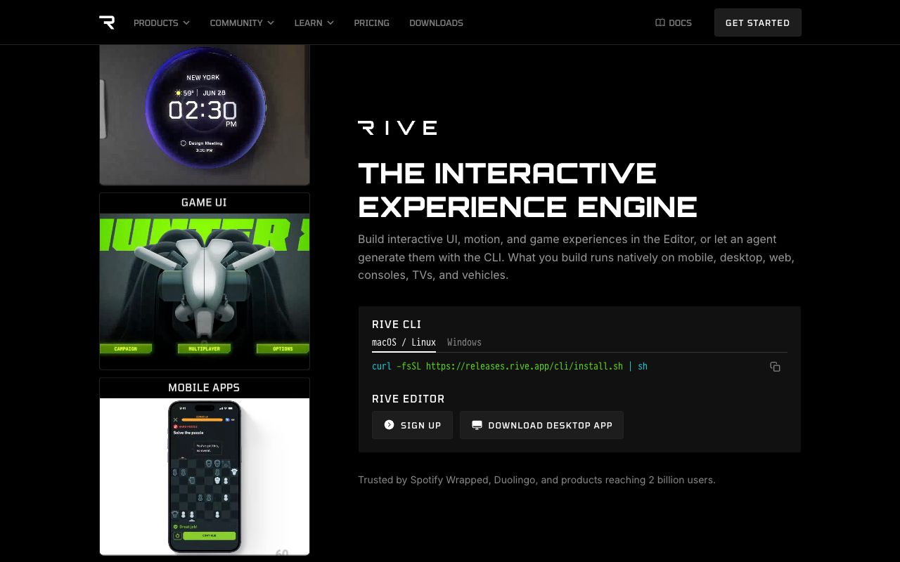</a> <b><a href="https://rive.app">Rive</a></b> Column of interactive UI demos (smart-watch face, game menu, mobile puzzle) beside tabbed CLI install card.</td><td width="33%" valign="top"><a href="https://www.8bitcn.com">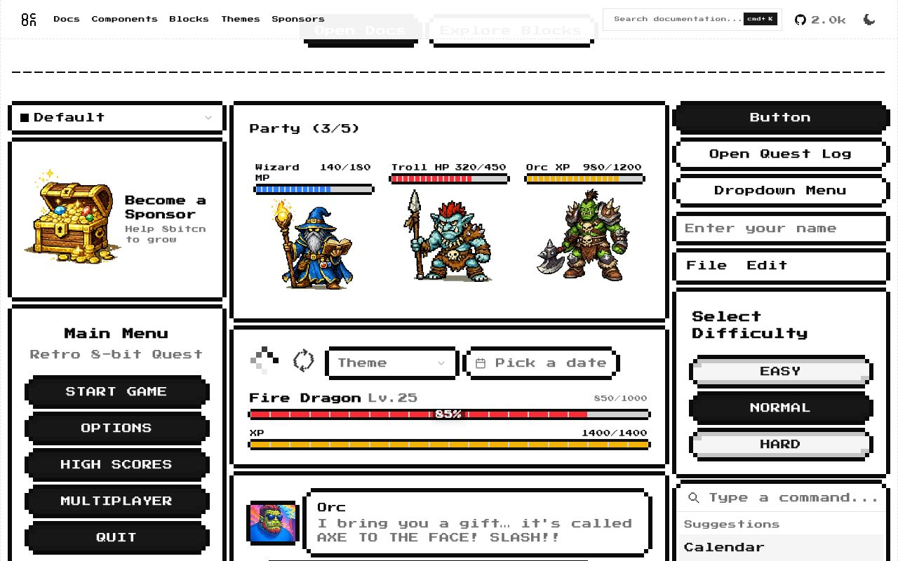</a> <b><a href="https://www.8bitcn.com">8bitcn</a></b> Playful pixel-art system: chunky 8-bit buttons, HP progress bars, dropdowns, dialogue box, command menu.</td><td width="33%" valign="top"><a href="https://www.retroui.dev">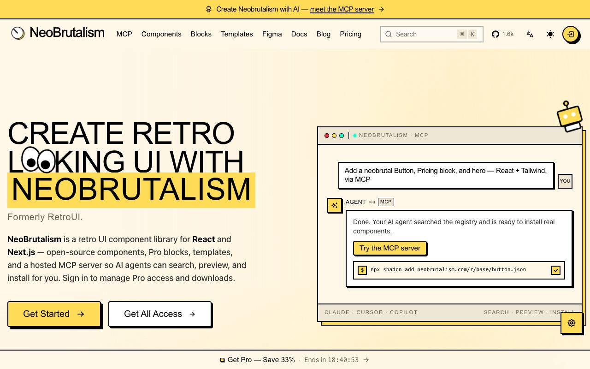</a> <b><a href="https://www.retroui.dev">NeoBrutalism (RetroUI)</a></b> Brutalist buttons with hard offset shadows, yellow highlight headline, bordered chat card with inline CTA.</td></tr>
<tr><td width="33%" valign="top"><a href="https://ui.aceternity.com/components">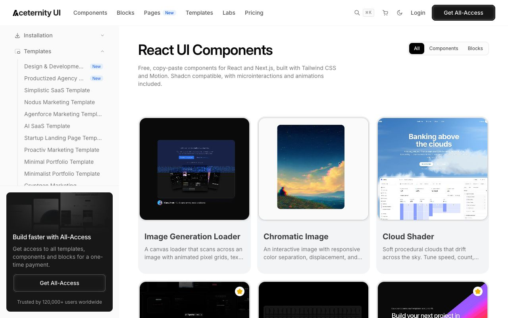</a> <b><a href="https://ui.aceternity.com/components">Aceternity UI components</a></b> Component gallery grid: each card previews an effect (generation loader, chromatic image, cloud shader).</td><td width="33%" valign="top"><a href="https://motion.dev/examples">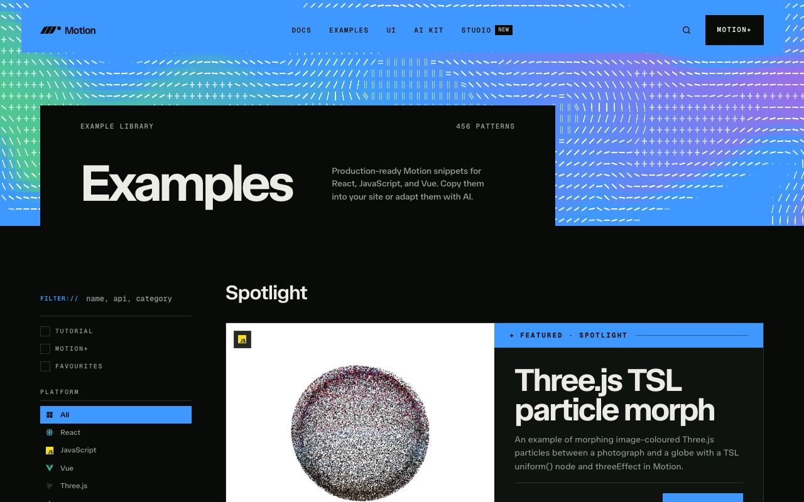</a> <b><a href="https://motion.dev/examples">Motion Examples</a></b> Pattern library UI: ASCII-glyph banner, filter checkboxes, platform list, featured particle-morph spotlight card.</td><td width="33%" valign="top"><a href="https://carbondesignsystem.com">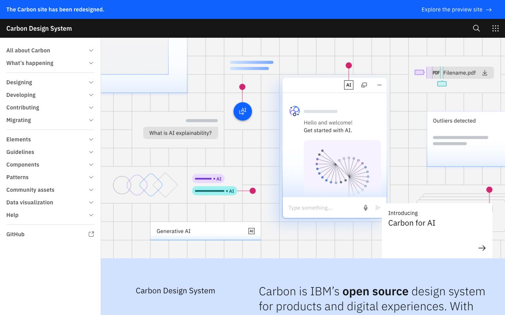</a> <b><a href="https://carbondesignsystem.com">Carbon Design System</a></b> Grid canvas of floating AI components: chat panel, tags, file chip, all sharing one visual language.</td></tr>
<tr><td width="33%" valign="top"><a href="https://chakra-ui.com">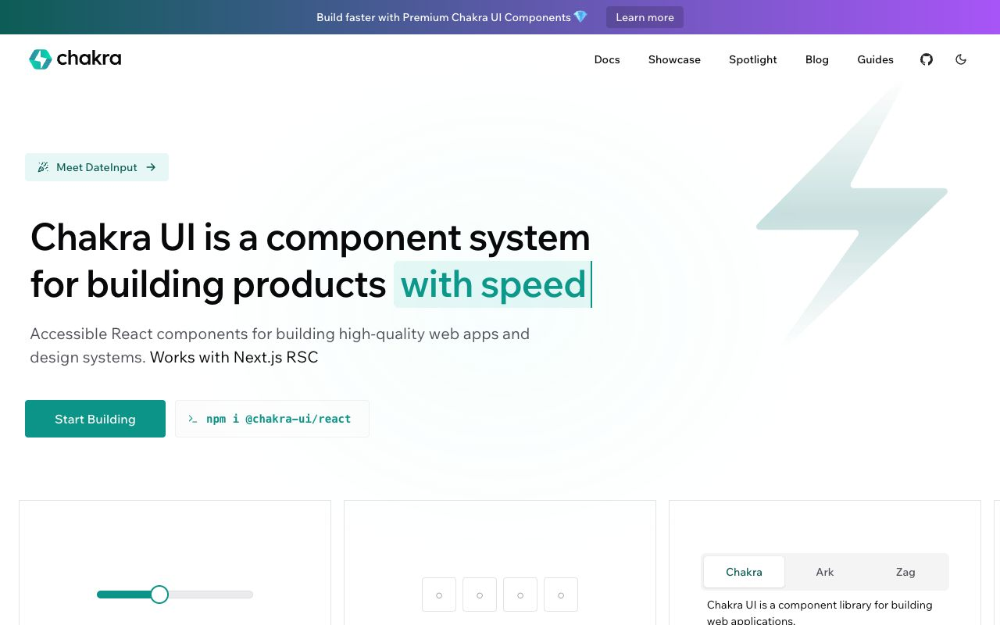</a> <b><a href="https://chakra-ui.com">Chakra UI</a></b> Hero sits above live component cards: slider, pin input and segmented tabs demoed right on the page.</td><td width="33%" valign="top"><a href="https://www.cult-ui.com">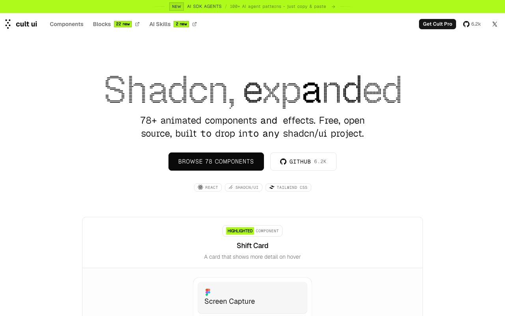</a> <b><a href="https://www.cult-ui.com">cult ui</a></b> Dot-matrix display headline, lime tags and a highlighted Shift Card component previewed in a framed stage.</td><td width="33%" valign="top"><a href="https://daisyui.com">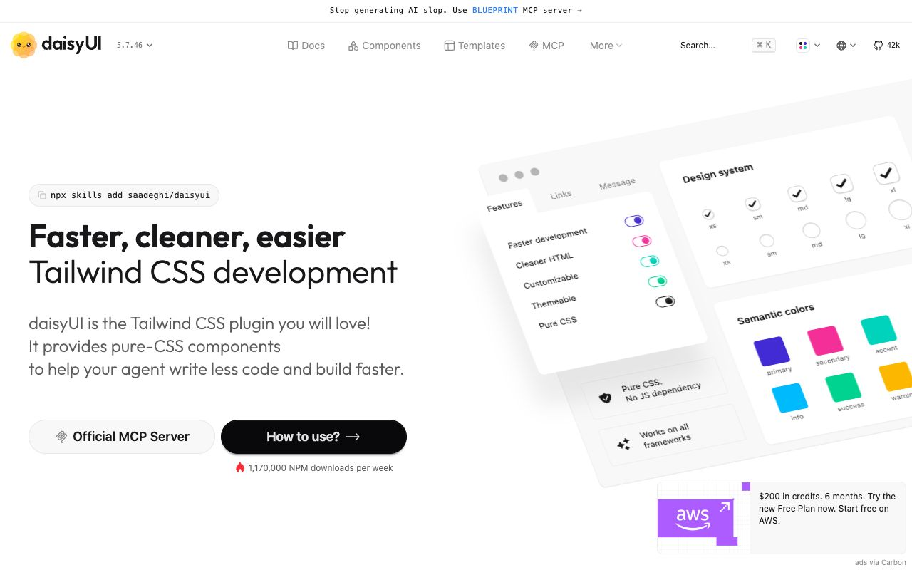</a> <b><a href="https://daisyui.com">daisyUI</a></b> Tilted panel of real toggles, checkbox sizes and semantic colour swatches shows the component system at a glance.</td></tr>
<tr><td width="33%" valign="top"><a href="https://kokonutui.com">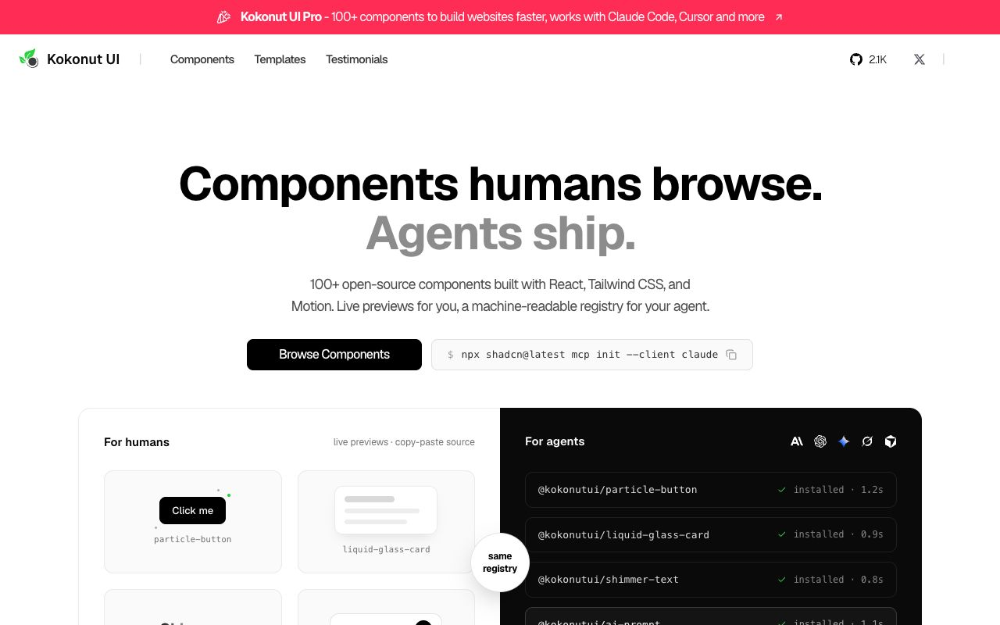</a> <b><a href="https://kokonutui.com">Kokonut UI</a></b> Split card: light live component previews for humans beside a dark install log for agents.</td><td width="33%" valign="top"><a href="https://mui.com">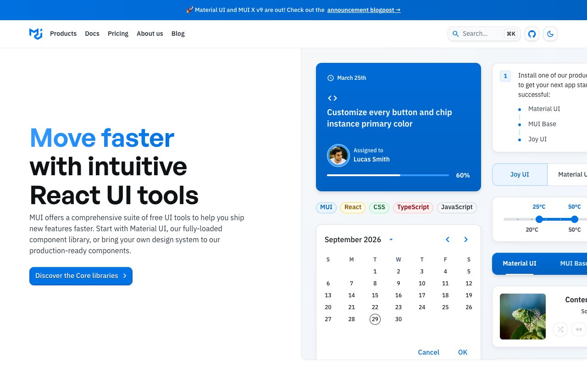</a> <b><a href="https://mui.com">MUI</a></b> Collage of working components: task card, chips, date picker, range slider and tabs in one blue theme.</td><td width="33%" valign="top"><a href="https://ui.nuxt.com">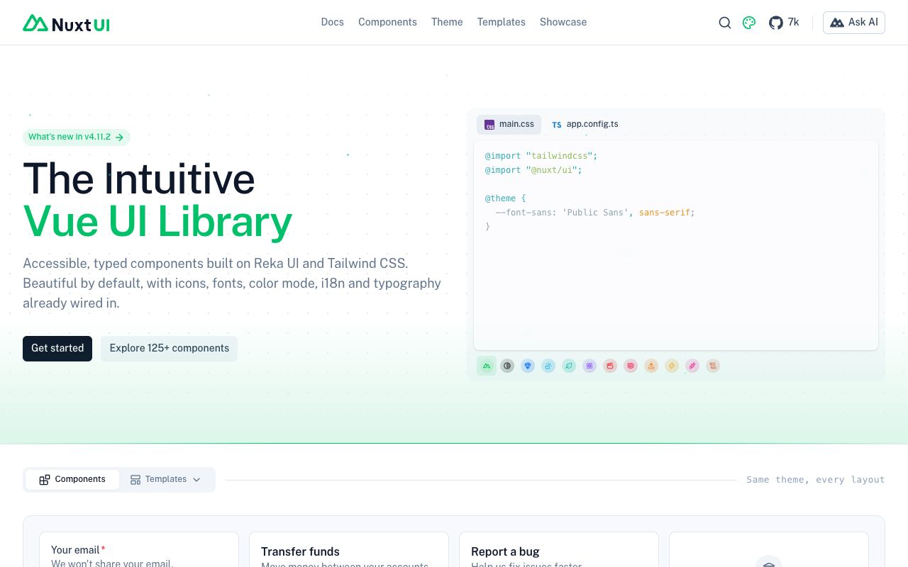</a> <b><a href="https://ui.nuxt.com">Nuxt UI</a></b> Theme code editor with colour presets above a strip of form cards sharing one theme.</td></tr>
<tr><td width="33%" valign="top"><a href="https://react-spectrum.adobe.com/react-aria/">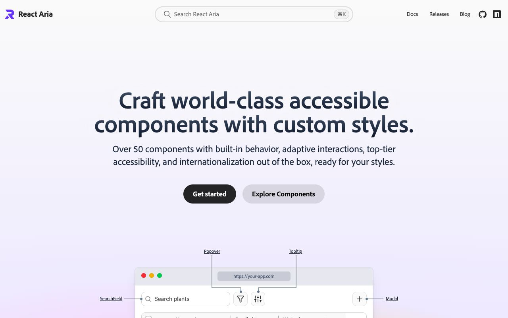</a> <b><a href="https://react-spectrum.adobe.com/react-aria/">React Aria</a></b> App mockup with callout labels naming each part: SearchField, Popover, Tooltip, Modal.</td><td width="33%" valign="top"><a href="https://reactbits.dev">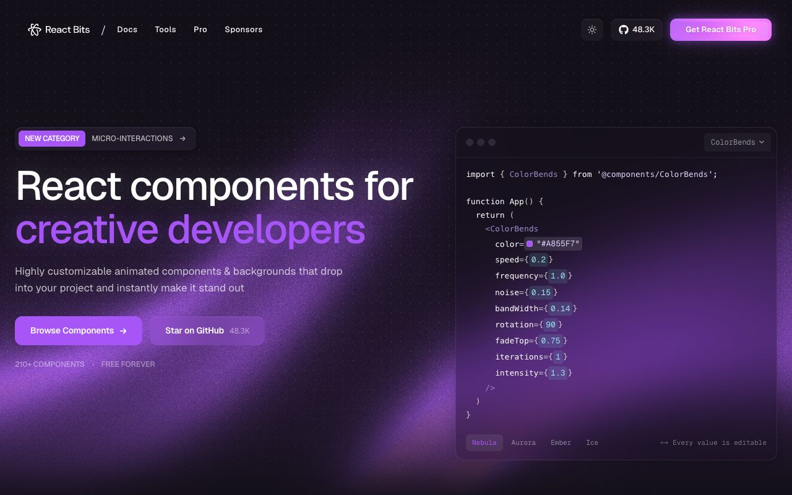</a> <b><a href="https://reactbits.dev">React Bits</a></b> Dark hero over a live ColorBends background, with an editable props panel driving the effect.</td><td width="33%" valign="top"><a href="https://tremor.so">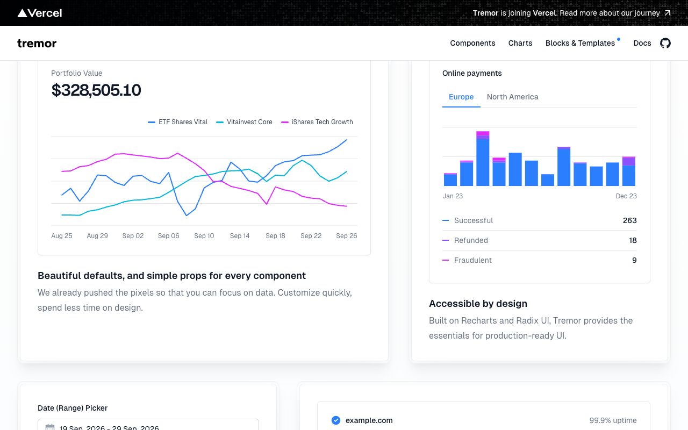</a> <b><a href="https://tremor.so">Tremor</a></b> Dashboard components on show: multi-line chart, stacked bar chart with tabs, legend totals, date range picker.</td></tr>
<tr><td width="33%" valign="top"><a href="https://www.untitledui.com">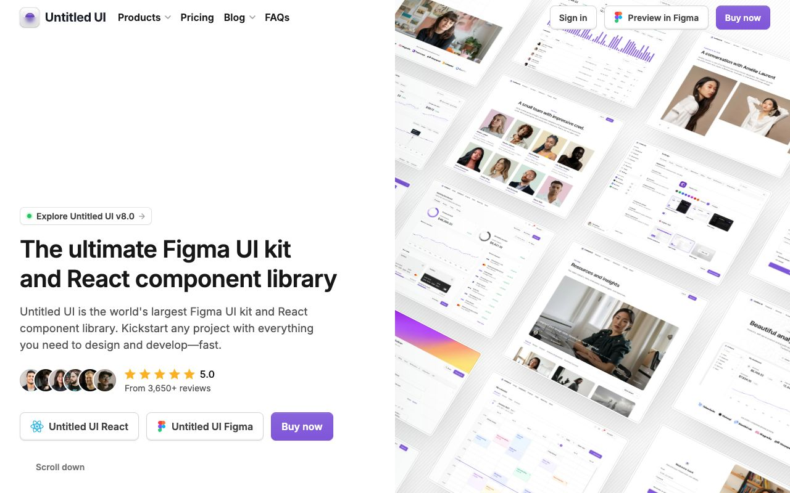</a> <b><a href="https://www.untitledui.com">Untitled UI</a></b> Isometric wall of full page templates beside the pitch shows a kit's breadth in one image.</td></tr>
</table>

[↑ back to top](#gallery)

## SaaS landing pages

<table>
<tr><td width="33%" valign="top"> <b><a href="https://attio.com">Attio</a></b> Textbook SaaS hero: pill announcement, bold centred headline, two buttons, then the real app window.</td><td width="33%" valign="top"> <b><a href="https://www.clay.com">Clay</a></b> Claymation 3D funnel, magnifier and bar chart on green hills give a data tool real personality.</td><td width="33%" valign="top"> <b><a href="https://www.craft.do">Craft</a></b> Torn-paper collage and sky clouds frame a colourful docs grid; serif headline and glassy floating nav.</td></tr>
<tr><td width="33%" valign="top"><a href="https://dub.co">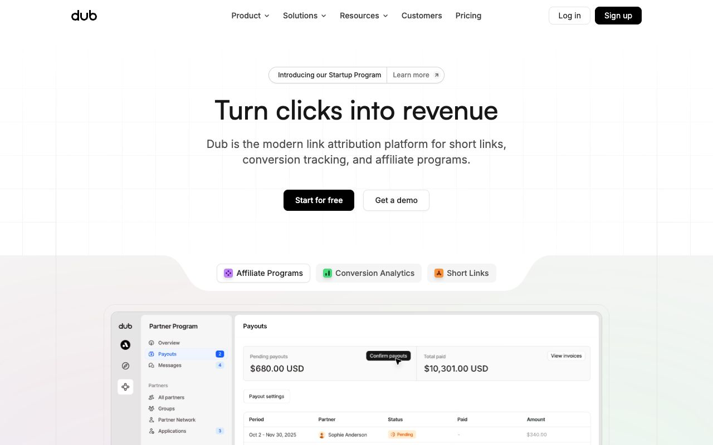</a> <b><a href="https://dub.co">Dub</a></b> Faint grid backdrop, tight headline, and tabbed product views showing a real payouts dashboard with cursor.</td><td width="33%" valign="top"><a href="https://fly.io">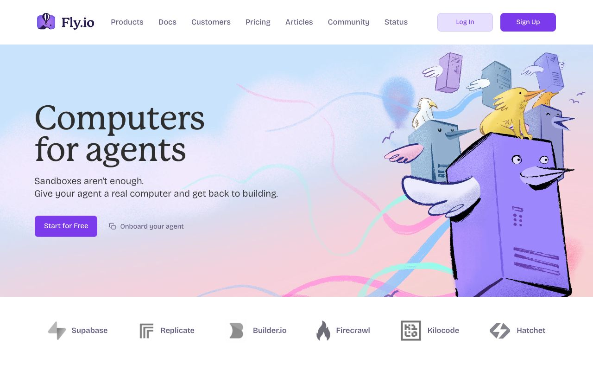</a> <b><a href="https://fly.io">Fly.io</a></b> Hand-drawn servers with bird beaks on pastel sky make infrastructure friendly; soft serif headline on left.</td><td width="33%" valign="top"><a href="https://www.granola.ai">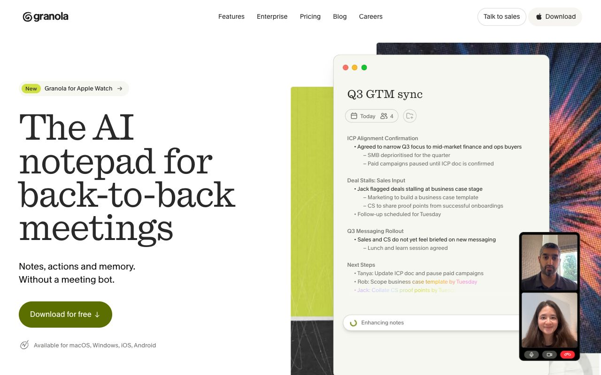</a> <b><a href="https://www.granola.ai">Granola</a></b> Big typewriter-serif headline beside a notes window being enhanced live, with a video-call overlay.</td></tr>
<tr><td width="33%" valign="top"><a href="https://hex.tech">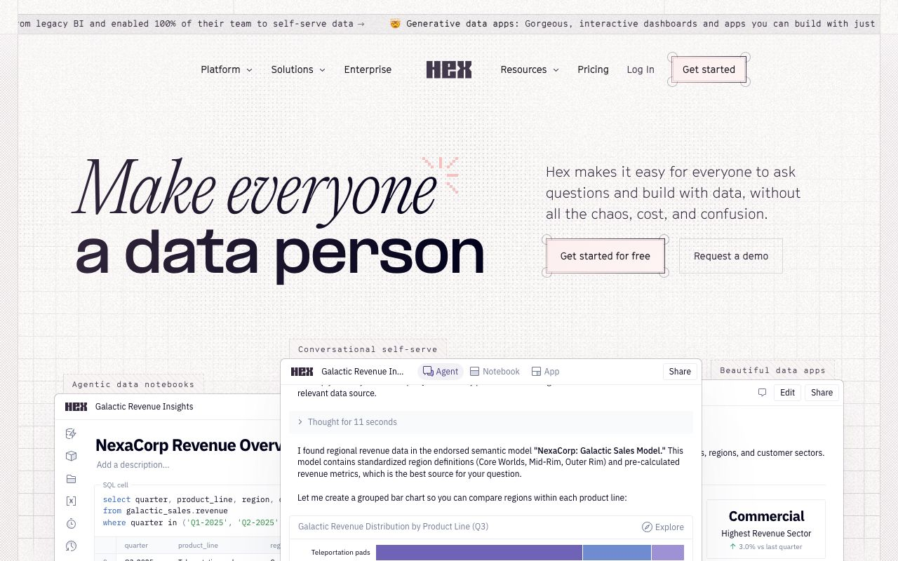</a> <b><a href="https://hex.tech">Hex</a></b> Italic-serif plus wide-grotesk headline, monospace labels and layered notebook, agent and app windows.</td><td width="33%" valign="top"><a href="https://www.hey.com">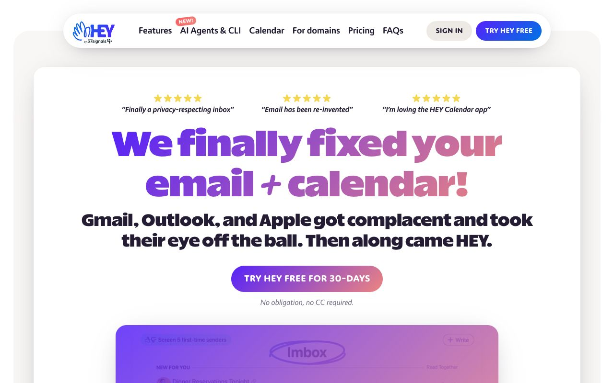</a> <b><a href="https://www.hey.com">HEY</a></b> Loud heavy rounded type with purple-pink gradient, star quotes up top: opinionated voice as brand.</td><td width="33%" valign="top"><a href="https://liveblocks.io">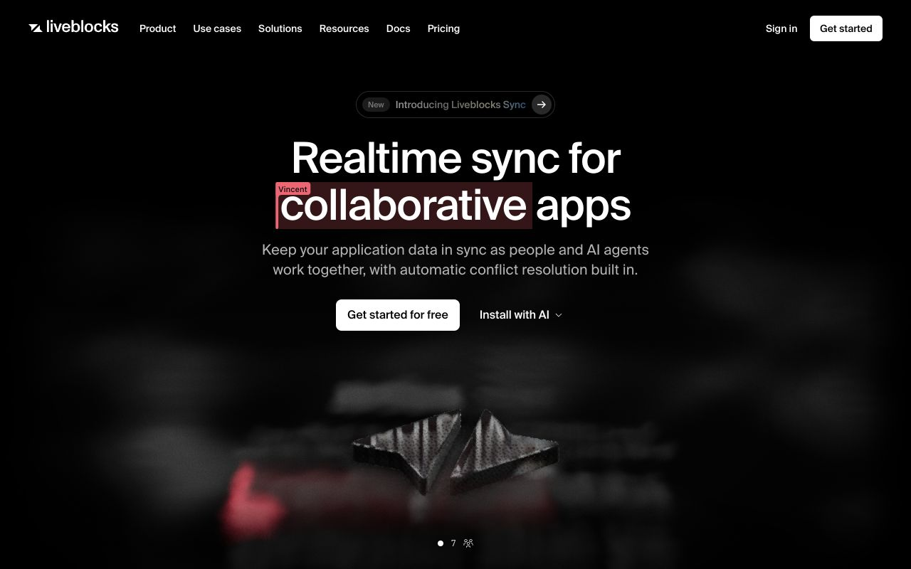</a> <b><a href="https://liveblocks.io">Liveblocks</a></b> Headline word wears a named collaborator's selection highlight, demonstrating realtime sync right in the copy.</td></tr>
<tr><td width="33%" valign="top"><a href="https://mercury.com">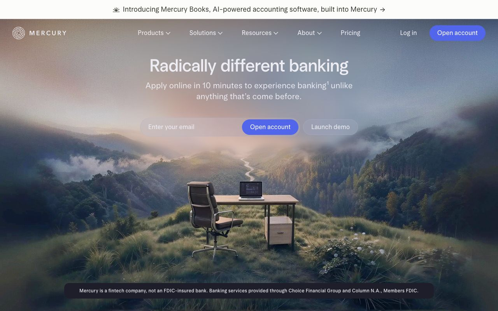</a> <b><a href="https://mercury.com">Mercury</a></b> Serene misty-valley desk image, inline email field and demo button make banking feel calm and premium.</td><td width="33%" valign="top"><a href="https://mymind.com">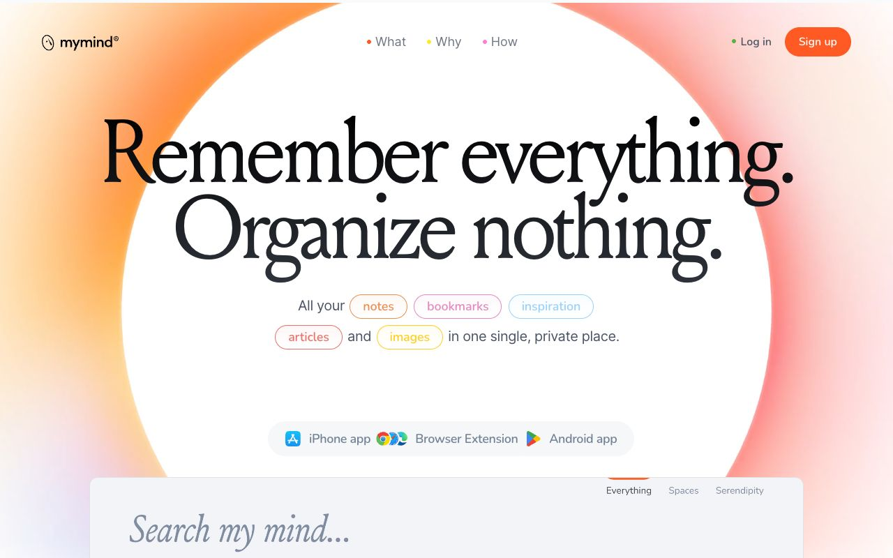</a> <b><a href="https://mymind.com">mymind</a></b> Oversized serif promise inside a glowing orange halo; coloured pill tags name everything you can save.</td><td width="33%" valign="top"><a href="https://planetscale.com">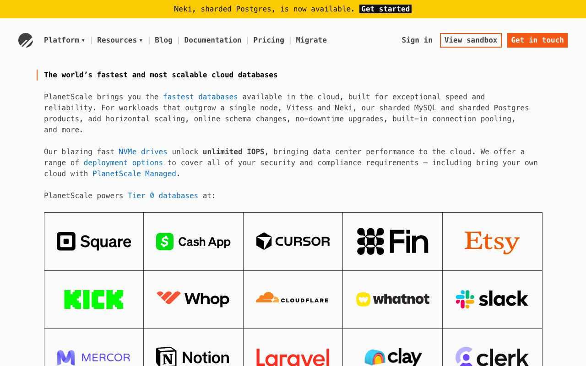</a> <b><a href="https://planetscale.com">PlanetScale</a></b> Anti-marketing: all-monospace plain text, blue links and a bordered grid of customer logos.</td></tr>
<tr><td width="33%" valign="top"><a href="https://posthog.com">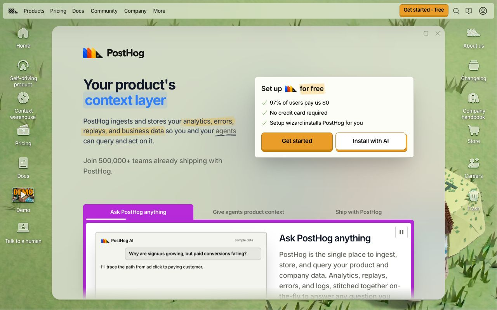</a> <b><a href="https://posthog.com">PostHog</a></b> Whole site styled as a desktop OS: icons, draggable window, highlighter-marked copy over grassy wallpaper.</td><td width="33%" valign="top"><a href="https://www.sanity.io">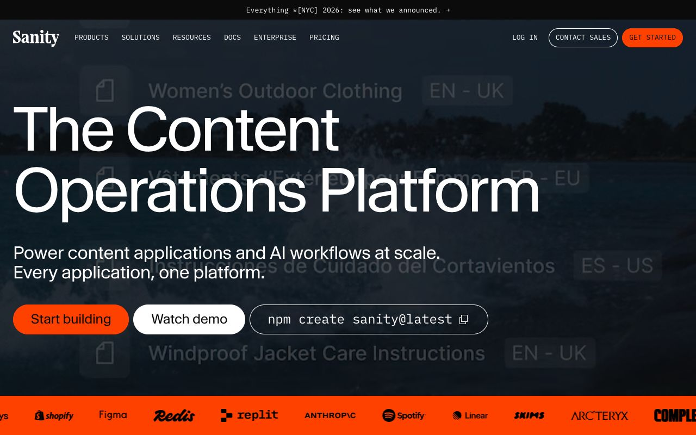</a> <b><a href="https://www.sanity.io">Sanity</a></b> Huge white headline over faded localised content entries, orange CTAs and an orange logo marquee.</td><td width="33%" valign="top"><a href="https://www.warp.dev">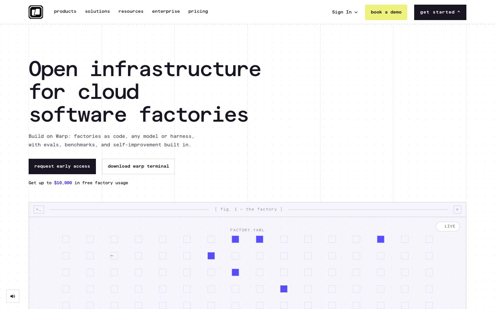</a> <b><a href="https://www.warp.dev">Warp</a></b> All-monospace lowercase UI, visible column grid and a live 'fig. 1' factory diagram of squares.</td></tr>
<tr><td width="33%" valign="top"><a href="https://zed.dev">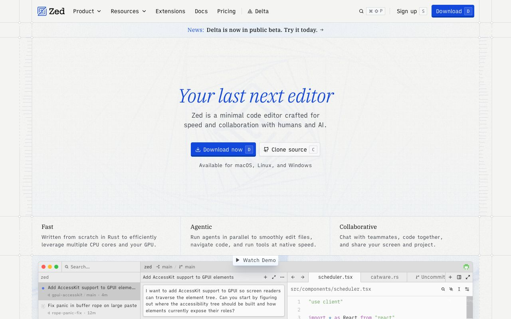</a> <b><a href="https://zed.dev">Zed</a></b> Blueprint grid lines, italic serif headline and keyboard-shortcut hints on every button, then the editor.</td></tr>
</table>

[↑ back to top](#gallery)

## E-commerce

<table>
<tr><td width="33%" valign="top"> <b><a href="https://aarke.com">Aarke</a></b> Warm lifestyle product shot fills the hero; one mono headline and an outline 'Shop now' button.</td><td width="33%" valign="top"> <b><a href="https://www.byredo.com">Byredo</a></b> Bold red campaign portrait under a stencil wordmark, with a shoppable product card pinned bottom-right.</td><td width="33%" valign="top"> <b><a href="https://framacph.com">Frama</a></b> Two equal category tiles, candles and seating, each with big caps title and an outline Discover button.</td></tr>
<tr><td width="33%" valign="top"><a href="https://www.graza.co">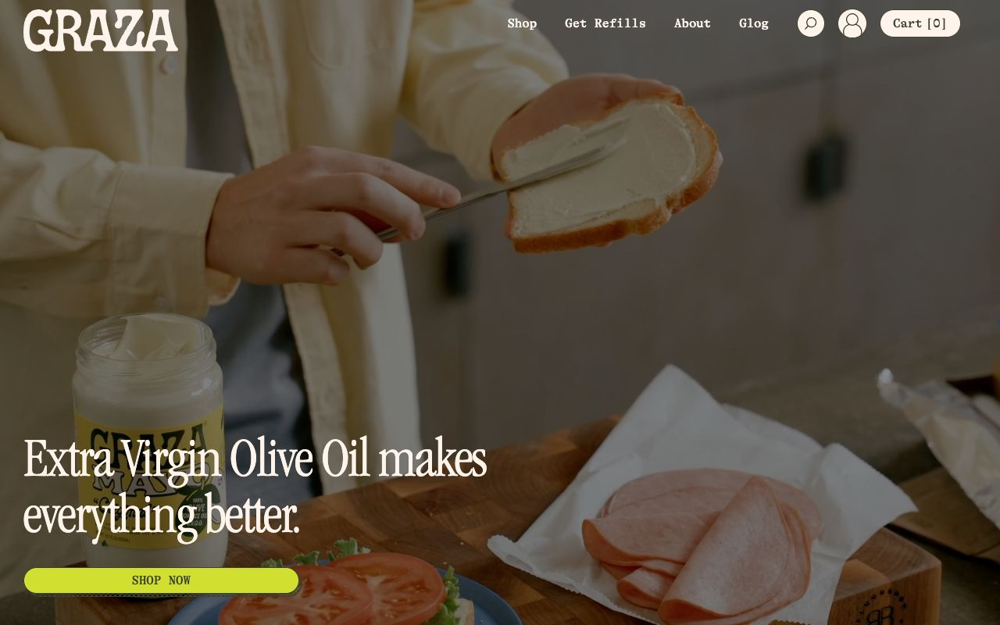</a> <b><a href="https://www.graza.co">Graza</a></b> Candid kitchen photo, playful serif headline and a lime Shop Now pill give the brand voice.</td><td width="33%" valign="top"><a href="https://www.hay.com">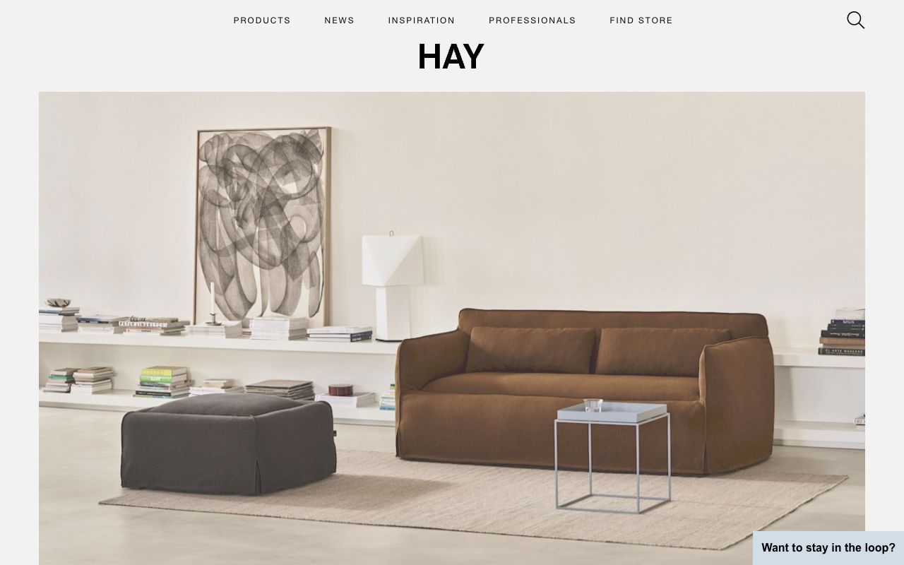</a> <b><a href="https://www.hay.com">HAY</a></b> Centred wordmark, spaced caps nav and one large inset room photo let the furniture sell itself.</td><td width="33%" valign="top"><a href="https://www.lemaire.fr">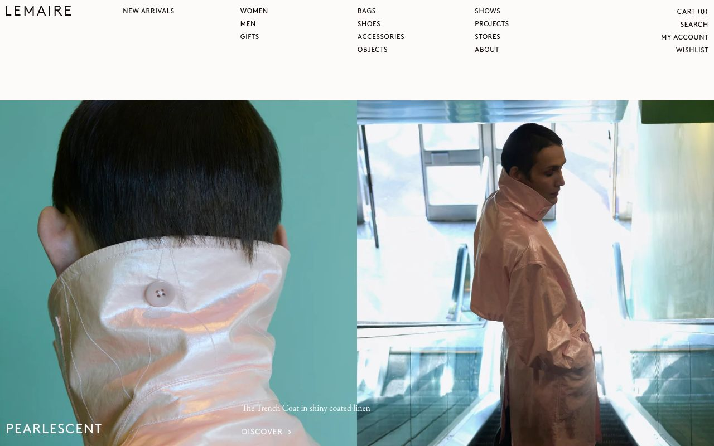</a> <b><a href="https://www.lemaire.fr">Lemaire</a></b> Columned text menu over a split campaign spread; small caption and Discover link name the product.</td></tr>
<tr><td width="33%" valign="top"><a href="https://www.ourlegacy.com">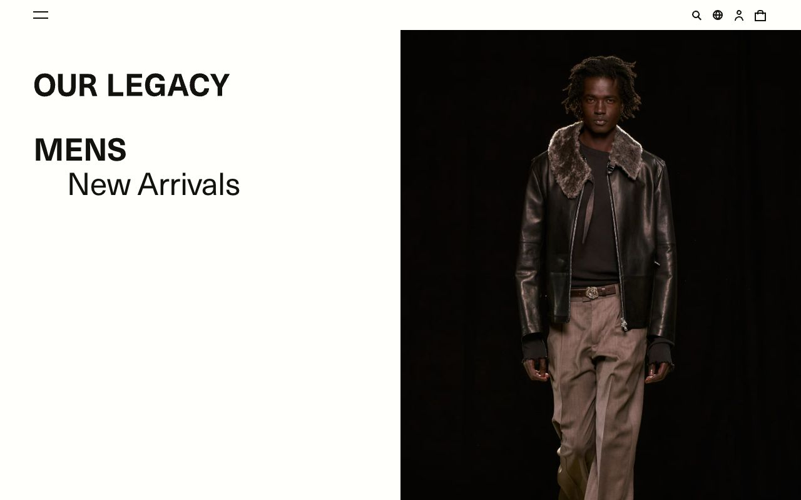</a> <b><a href="https://www.ourlegacy.com">Our Legacy</a></b> Half white type panel, half runway photo: bold grotesk 'MENS New Arrivals' as the whole navigation cue.</td><td width="33%" valign="top"><a href="https://teklafabrics.com">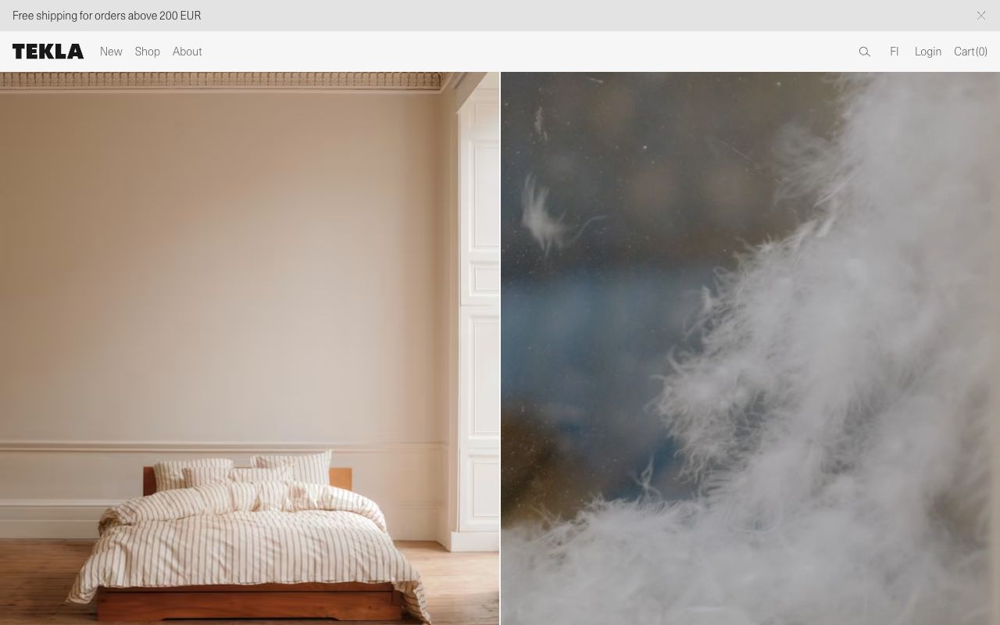</a> <b><a href="https://teklafabrics.com">Tekla</a></b> Split hero pairs a striped-bedding room with a close-up of down feathers; tiny quiet header.</td><td width="33%" valign="top"><a href="https://toteme-studio.com">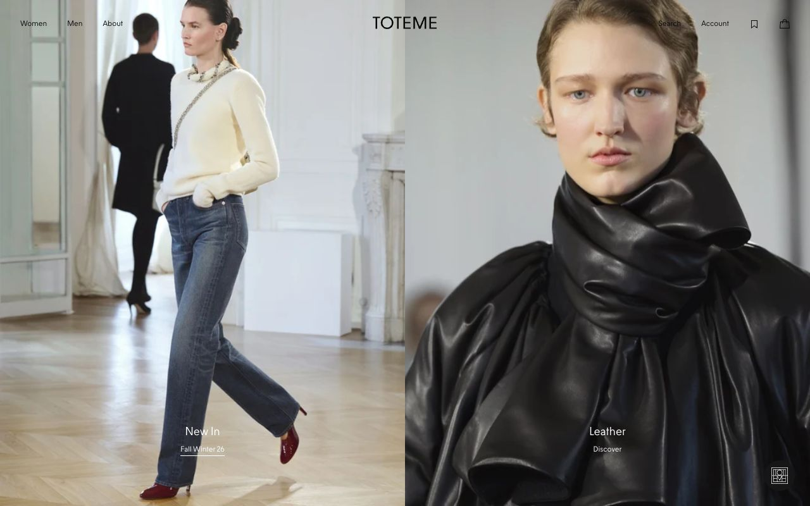</a> <b><a href="https://toteme-studio.com">TOTEME</a></b> Two full-height editorial photos split the screen, each with a small centred category label.</td></tr>
<tr><td width="33%" valign="top"><a href="https://www.glossier.com">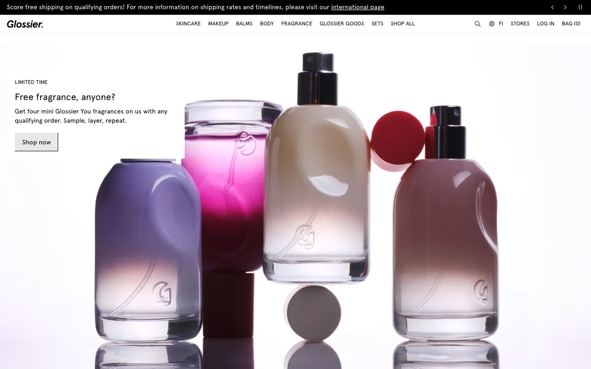</a> <b><a href="https://www.glossier.com">Glossier</a></b> Full-bleed glass perfume bottles on white; small editorial offer card top-left, tidy uppercase nav.</td><td width="33%" valign="top"><a href="https://nothing.tech">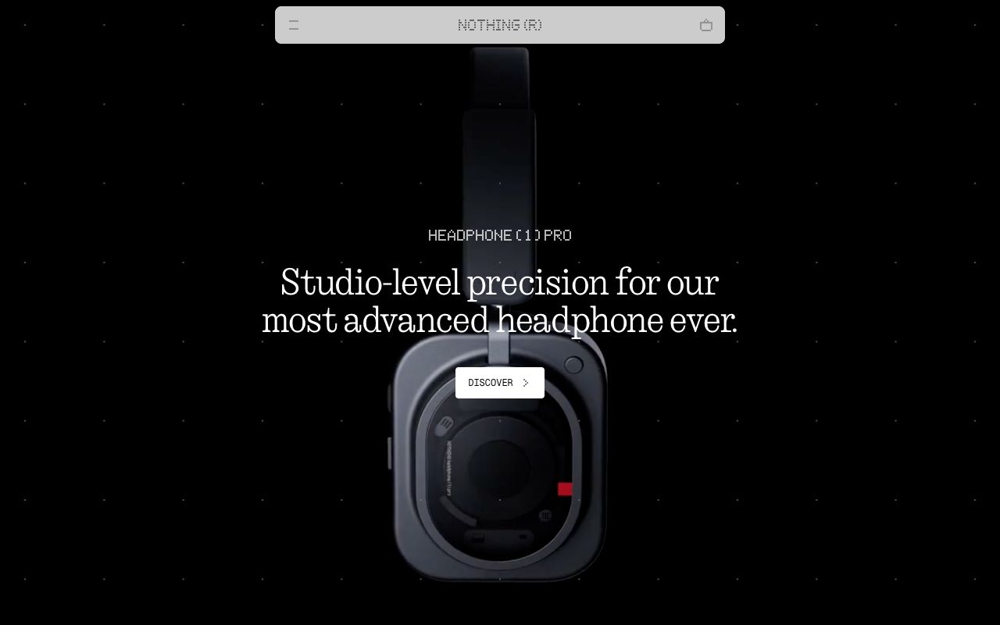</a> <b><a href="https://nothing.tech">Nothing</a></b> Black dot-grid stage, headphone product centred, serif headline, dot-matrix labels and floating pill nav.</td><td width="33%" valign="top"><a href="https://www.aesop.com">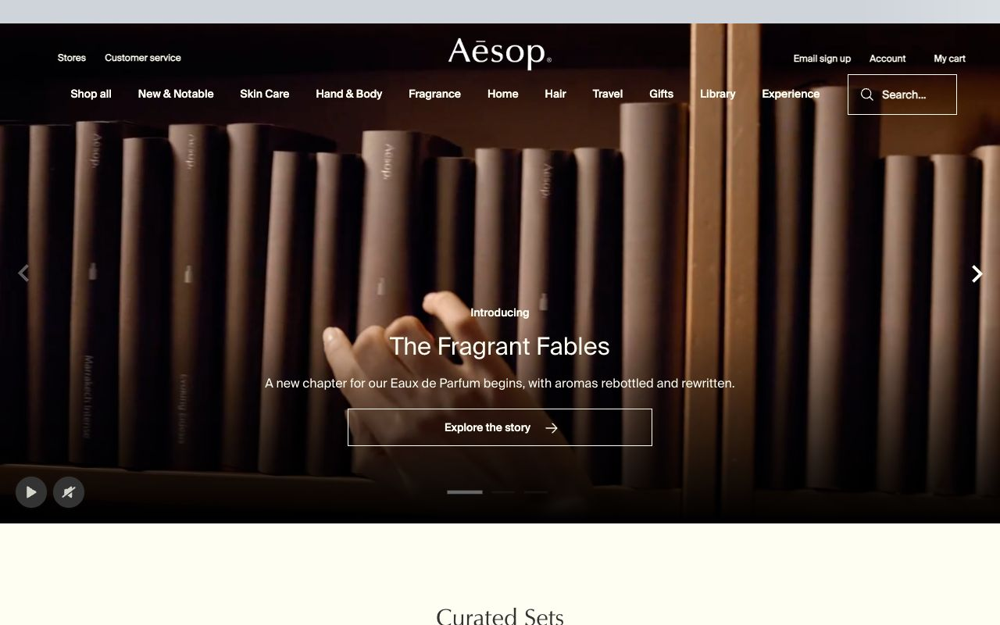</a> <b><a href="https://www.aesop.com">Aesop</a></b> Moody brown video hero of bottle 'books' on a shelf; centred story headline, outline CTA.</td></tr>
<tr><td width="33%" valign="top"><a href="https://www.rhodeskin.com">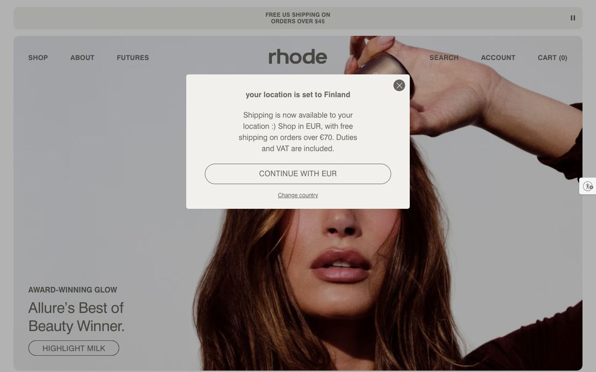</a> <b><a href="https://www.rhodeskin.com">Rhode</a></b> Rounded inset hero card with close-up portrait and product; soft grey palette, quiet uppercase nav.</td><td width="33%" valign="top"><a href="https://www.bang-olufsen.com/en/us">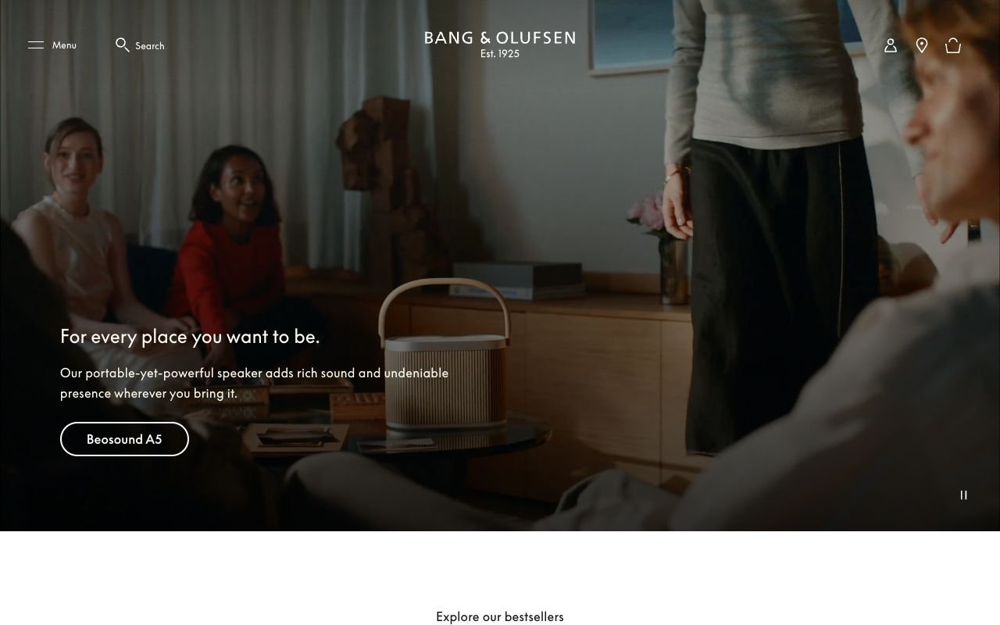</a> <b><a href="https://www.bang-olufsen.com/en/us">Bang & Olufsen</a></b> Cinematic lifestyle video with the speaker in a living room; restrained copy and outline pill button.</td><td width="33%" valign="top"><a href="https://www.acnestudios.com/us/en/home">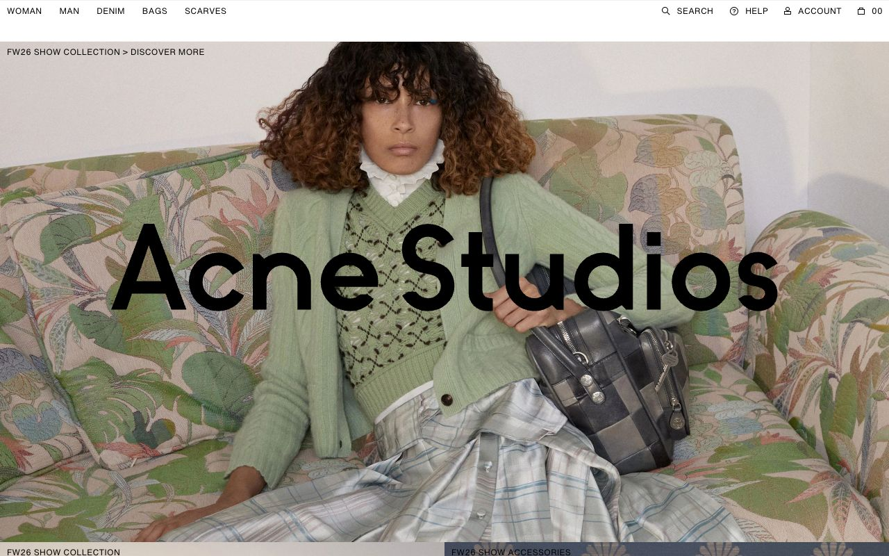</a> <b><a href="https://www.acnestudios.com/us/en/home">Acne Studios</a></b> Full-bleed campaign photo with a giant black wordmark over it; tiny uppercase nav and labels.</td></tr>
<tr><td width="33%" valign="top"><a href="https://www.diptyqueparis.com/en_us">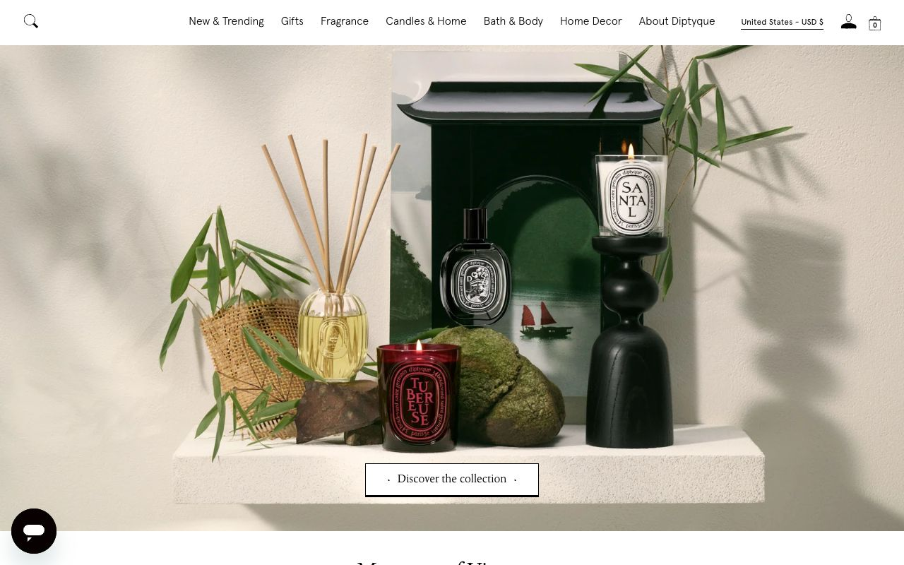</a> <b><a href="https://www.diptyqueparis.com/en_us">Diptyque</a></b> Styled still life of candles and diffuser on a plinth; single boxed 'Discover the collection' button.</td><td width="33%" valign="top"><a href="https://fromourplace.com">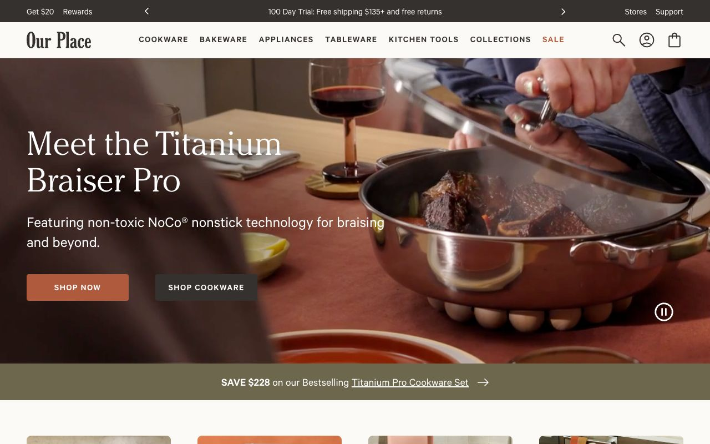</a> <b><a href="https://fromourplace.com">Our Place</a></b> Warm cooking video hero, serif headline, terracotta and charcoal buttons, olive promo band below.</td></tr>
</table>

[↑ back to top](#gallery)

## Portfolios

<table>
<tr><td width="33%" valign="top"> <b><a href="https://dennissnellenberg.com">Dennis Snellenberg</a></b> Cut-out portrait with his name as a giant marquee running behind, plus a location pill and role.</td><td width="33%" valign="top"> <b><a href="https://gilhuybrecht.com/">Gil Huybrecht</a></b> Black index page: services and awards up top, then numbered project screenshots in a strict grid.</td><td width="33%" valign="top"> <b><a href="https://www.gionatannese.com">GN.D</a></b> Small work thumbnails float in a loose sphere on white space, with a tiny tabbed header.</td></tr>
<tr><td width="33%" valign="top"> <b><a href="https://jesperlandberg.com">Jesper Landberg</a></b> Project cards curve around a 3D carousel over a grid floor; minimal corner labels frame the work.</td><td width="33%" valign="top"> <b><a href="https://www.meermohsin.me/">Meer Mohsin</a></b> Red-graded portrait with a chrome tribal mask, giant slogan type behind, and a Tension/Immersion/Impact footer bar.</td><td width="33%" valign="top"> <b><a href="https://olivierlarose.com">Olivier Larose</a></b> One centred type block mixing serif, script initials and pixel glyphs to carry the whole personality.</td></tr>
<tr><td width="33%" valign="top"> <b><a href="https://www.robin-noguier.com">Robin Noguier</a></b> Case study slider: big serif title and blurb left, warped project images right, dot pagination.</td><td width="33%" valign="top"> <b><a href="https://brittanychiang.com">Brittany Chiang</a></b> Deep navy two-column layout: sticky name and section nav left, bio and experience scrolling right.</td><td width="33%" valign="top"> <b><a href="https://lynnandtonic.com">Lynn Fisher</a></b> Paper-textured page, ornate display serif name, table-of-contents menu with dotted leaders and roman numerals.</td></tr>
<tr><td width="33%" valign="top"> <b><a href="https://cydstumpel.nl">Cyd Stumpel</a></b> Giant red condensed name marquee, playful stickers, italic serif headline and cut-out speaker photo.</td><td width="33%" valign="top"> <b><a href="https://paco.me">Paco Coursey</a></b> Quiet text-only page: short bio, then three tidy columns of Building, Projects and Writing links.</td><td width="33%" valign="top"> <b><a href="https://www.niccolomiranda.com">The Paper Portfolio</a></b> Newspaper-style paper texture, condensed serif headlines, draggable work strip above a huge MIRANDA masthead.</td></tr>
<tr><td width="33%" valign="top"> <b><a href="https://jhey.dev">Jhey Tompkins</a></b> Bold serif headline, red inline links, hand-drawn signature and live status widgets over a faint grid.</td><td width="33%" valign="top"> <b><a href="https://matthieugivelet.com">Matthieu Givelet</a></b> Huge black grotesk name with a project image set inside the word, clean white Swiss layout.</td><td width="33%" valign="top"> <b><a href="https://vanschneider.com">Tobias van Schneider</a></b> Black page with fine gothic-arch linework, engraved cherubs, red HOVS tab and a giant 'I create' manifesto.</td></tr>
</table>

[↑ back to top](#gallery)

## Editorial

<table>
<tr><td width="33%" valign="top"> <b><a href="https://eyeondesign.aiga.org">Eye on Design</a></b> Salmon category labels, chunky rounded headlines and bold illustrated feature images in a two-then-three column grid.</td><td width="33%" valign="top"> <b><a href="https://restofworld.org">Rest of World</a></b> Electric blue wordmark with diacritics, mono section labels, collage illustration lead story and latest-stories rail.</td><td width="33%" valign="top"> <b><a href="https://032c.com">032c</a></b> Heavy black logo, four-up grid of magazine covers and merch, then full-bleed photo with red headline.</td></tr>
<tr><td width="33%" valign="top"><a href="https://www.quantamagazine.org">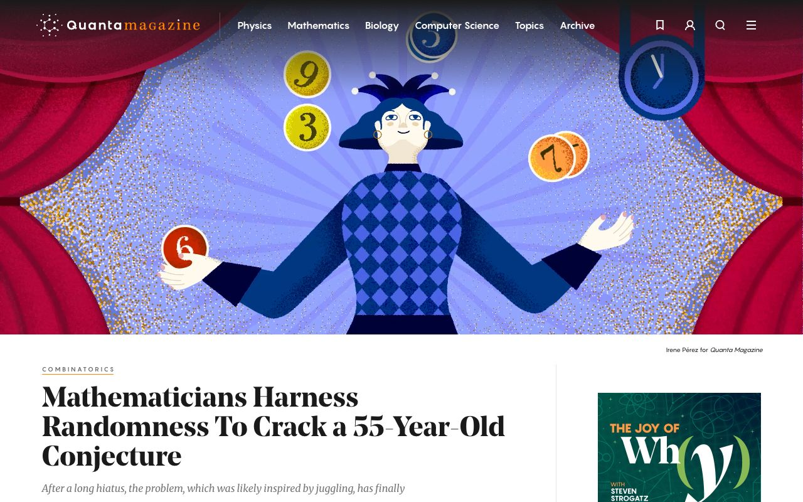</a> <b><a href="https://www.quantamagazine.org">Quanta Magazine</a></b> Full-width commissioned illustration under the nav, then a big high-contrast serif headline and italic dek.</td><td width="33%" valign="top"><a href="https://aeon.co">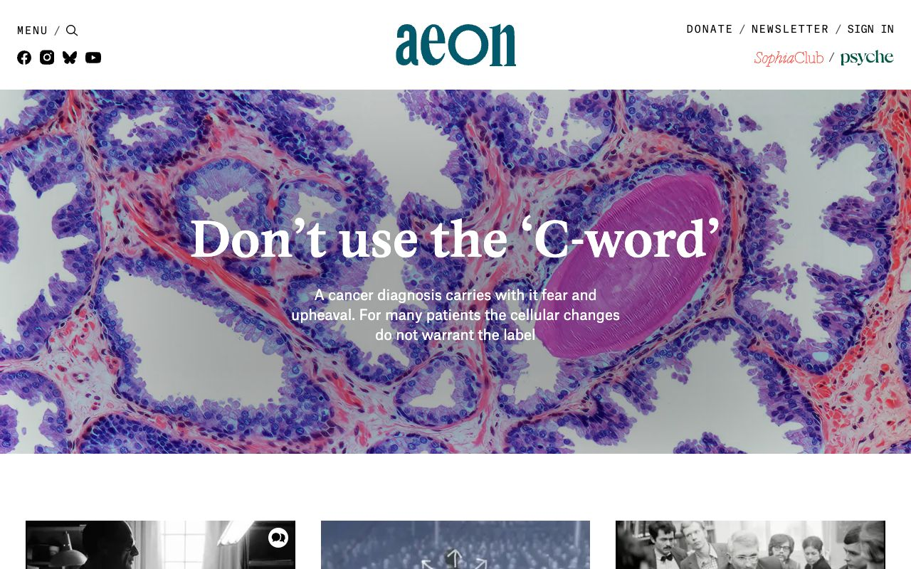</a> <b><a href="https://aeon.co">Aeon</a></b> Teal serif wordmark, full-bleed micrograph behind a large centred serif essay title, mono utility nav.</td><td width="33%" valign="top"><a href="https://www.nytimes.com/projects/2012/snow-fall/index.html">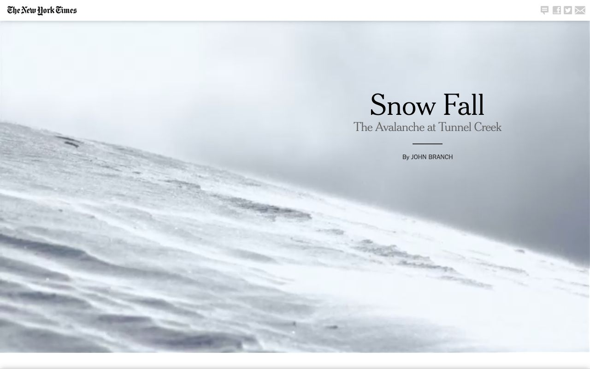</a> <b><a href="https://www.nytimes.com/projects/2012/snow-fall/index.html">Snow Fall</a></b> Full-bleed moving snow footage with a quiet serif title and byline: the classic long-form opener.</td></tr>
<tr><td width="33%" valign="top"><a href="https://readcereal.com">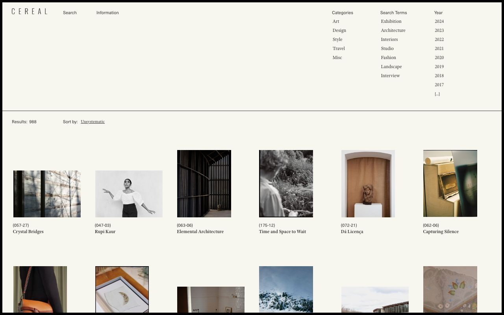</a> <b><a href="https://readcereal.com">Cereal</a></b> Letterspaced wordmark, index-style filters by category, term and year, calm six-column photo archive grid.</td><td width="33%" valign="top"><a href="https://thegentlewoman.co.uk">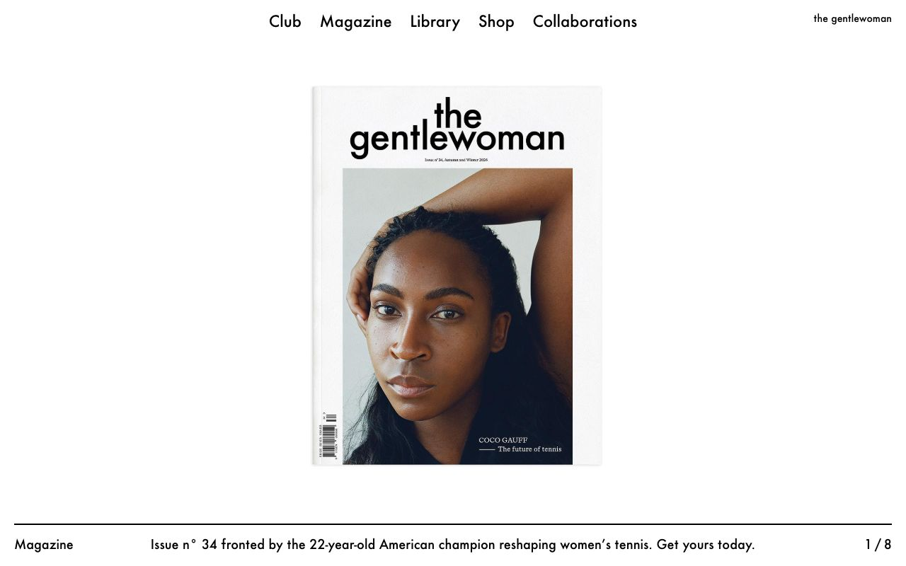</a> <b><a href="https://thegentlewoman.co.uk">The Gentlewoman</a></b> Pure white page, single centred issue cover, Futura nav and a ruled caption bar with slide count.</td></tr>
</table>

[↑ back to top](#gallery)

## Specimens & design systems

<table>
<tr><td width="33%" valign="top"> <b><a href="https://rsms.me/inter/">Inter typeface</a></b> Giant black 'The Inter typeface family' set in Inter on white, with three columns of specimen notes.</td><td width="33%" valign="top"> <b><a href="https://www.futurefonts.xyz">Future Fonts</a></b> Wall of huge in-progress display type (wavy 'Agent Mushy') with a small centred 'Type in progress' card.</td><td width="33%" valign="top"> <b><a href="https://abcdinamo.com">Dinamo</a></b> Plain text-list nav and pill filters above a 3D logistics scene showing off the ABC Schengen typeface.</td></tr>
<tr><td width="33%" valign="top"><a href="https://www.fontshare.com">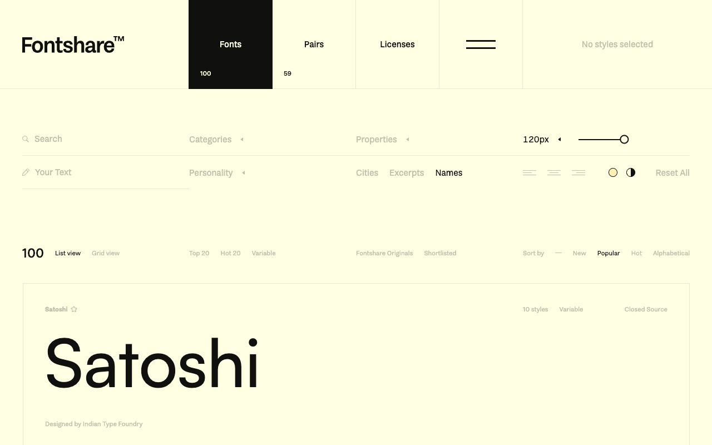</a> <b><a href="https://www.fontshare.com">Fontshare</a></b> Pale-yellow gridded tester: a size slider, sample-text controls and a large 'Satoshi' specimen row.</td><td width="33%" valign="top"><a href="https://base.uber.com">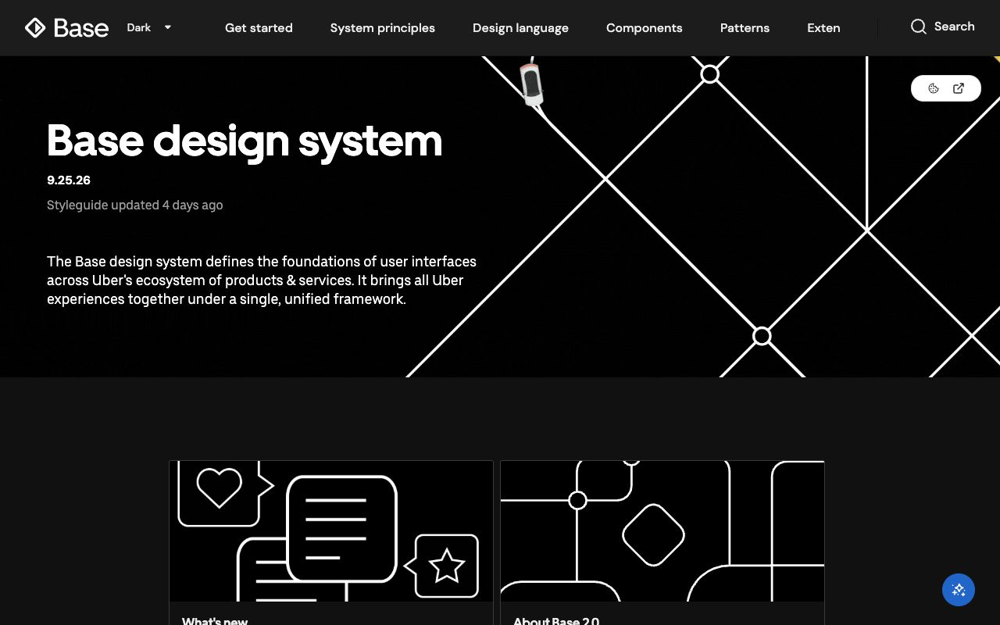</a> <b><a href="https://base.uber.com">Uber Base</a></b> Black hero 'Base design system' over white line-art road network with a tiny car, plus illustrated cards.</td><td width="33%" valign="top"><a href="https://atlassian.design">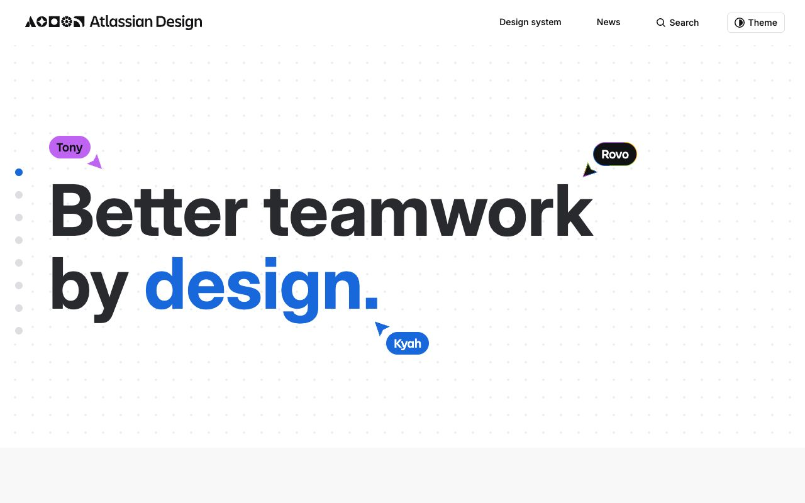</a> <b><a href="https://atlassian.design">Atlassian Design</a></b> Huge 'Better teamwork by design.' on a dotted grid, with coloured multiplayer cursor name tags.</td></tr>
<tr><td width="33%" valign="top"><a href="https://m3.material.io">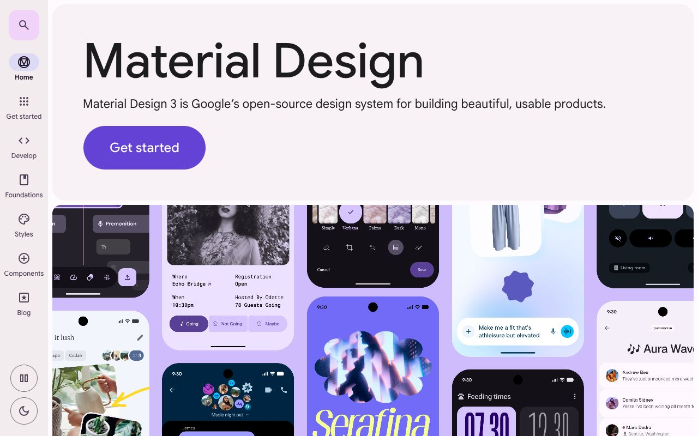</a> <b><a href="https://m3.material.io">Material Design 3</a></b> Big 'Material Design' header card above a lavender collage of expressive phone screens and components.</td><td width="33%" valign="top"><a href="https://design-system.service.gov.uk">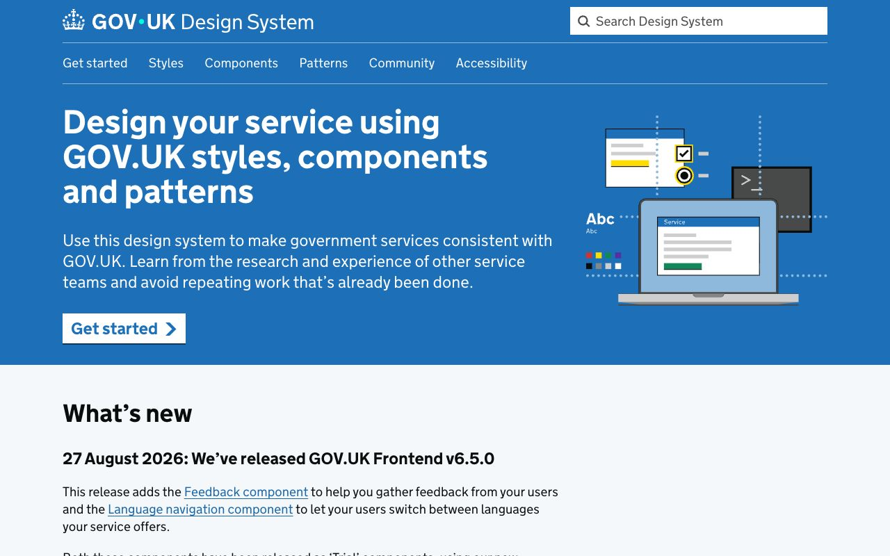</a> <b><a href="https://design-system.service.gov.uk">GOV.UK Design System</a></b> Bold blue hero in GDS Transport with a flat illustration of type, swatches and form components.</td></tr>
</table>

[↑ back to top](#gallery)

## AI products

<table>
<tr><td width="33%" valign="top"> <b><a href="https://cursor.com">Cursor</a></b> Quiet warm-grey hero lets a real agent session window, laid over painted landscape art, sell the product.</td><td width="33%" valign="top"> <b><a href="https://www.diabrowser.com">Dia</a></b> Huge ornate serif wordmark on sunny yellow blur; the browser window shows an AI-written daily brief.</td><td width="33%" valign="top"> <b><a href="https://elevenlabs.io">ElevenLabs</a></b> Grainy gradient orbs stand in for voices; tabbed product switcher keeps an AI platform calm and clear.</td></tr>
<tr><td width="33%" valign="top"> <b><a href="https://www.krea.ai">Krea</a></b> Dark cinematic desk scene with a lit monitor running the app; gradient-faded wordmark in the headline.</td><td width="33%" valign="top"> <b><a href="https://lumalabs.ai">Luma</a></b> Full-bleed fashion-shoot video behind a centred promise, with a prompt box inviting you straight in.</td><td width="33%" valign="top"> <b><a href="https://mistral.ai">Mistral AI</a></b> Ruled editorial grid, giant sans headline and an orange pixel-block mosaic with a tiny pixel cat.</td></tr>
<tr><td width="33%" valign="top"> <b><a href="https://runwayml.com">Runway</a></b> Rounded cinematic video card with left-aligned statement copy, then a greyscale partner logo row beneath.</td><td width="33%" valign="top"> <b><a href="https://www.sesame.com">Sesame</a></b> No UI at all: warm lifestyle photo of a man with earbuds says voice companion better than screenshots.</td><td width="33%" valign="top"> <b><a href="https://suno.com">Suno</a></b> Headline types out a sample prompt above a chat box; tilted song cards float in warm grainy gradient.</td></tr>
<tr><td width="33%" valign="top"> <b><a href="https://www.anthropic.com">Anthropic</a></b> Warm off-white page, heavy grotesk headline with underlined words beside a serif paragraph, then a macro-photo band.</td><td width="33%" valign="top"> <b><a href="https://pika.art">Pika</a></b> Full-bleed AI portrait (a woman in a green feather collar) under a huge uppercase headline and a floating pill nav.</td><td width="33%" valign="top"> <b><a href="https://www.moonvalley.com">Moonvalley</a></b> Near-black page, thin wide wordmark, and a cinematic generated video of a figure on a lunar plain.</td></tr>
<tr><td width="33%" valign="top"> <b><a href="https://bfl.ai">Black Forest Labs</a></b> FLUX 3 hero over a misty generated-video sky, with small mono chips for image, video and audio.</td><td width="33%" valign="top"> <b><a href="https://deepmind.google">Google DeepMind</a></b> Carousel of large rounded cards: a soft blue 3D mic, a line-diagram schematic, and a glowing DNA helix.</td><td width="33%" valign="top"> <b><a href="https://www.harvey.ai">Harvey</a></b> Editorial serif headline on cream, and a product dashboard set on a painterly textured background.</td></tr>
<tr><td width="33%" valign="top"> <b><a href="https://cohere.com">Cohere</a></b> Centred mono-serif 'Your AI. Your rules.' above a product UI set into an organic, painterly landscape.</td><td width="33%" valign="top"> <b><a href="https://poolside.ai">Poolside</a></b> Quiet left-rail nav, one-line headline with coloured model badges, and a live agent terminal on noise.</td></tr>
</table>

[↑ back to top](#gallery)
