# Frontend Design Basics

**A design guide: the tools I use, the principles I've learnt, and what I build.**

- **The website**, [frontenddesignbasics.vercel.app](https://frontenddesignbasics.vercel.app), is the live guide. Every tool, example and principle runs in the browser.
- **This repo** is the same guide in Markdown ([`guide/`](guide/)), plus [`toolkit/toolkit.json`](toolkit/toolkit.json): which tool to use for which job, in a form your AI agent can read at the start of a project.

| I want to… | Go to |
|---|---|
| pick the right tool for a job | [/tools](https://frontenddesignbasics.vercel.app/tools) · [toolkit.json](toolkit/toolkit.json) |
| see what you can build with them | [/make](https://frontenddesignbasics.vercel.app/make) |
| study real sites | [/sites](https://frontenddesignbasics.vercel.app/sites) · [/inspiration](https://frontenddesignbasics.vercel.app/inspiration) |
| learn the how-tos and rules | [/docs](https://frontenddesignbasics.vercel.app/docs) · [guide/](guide/) |
| give my agent the toolkit | `npx skills add br9704/frontenddesignbasics` |

<p align="center">
  <a href="https://frontenddesignbasics.vercel.app">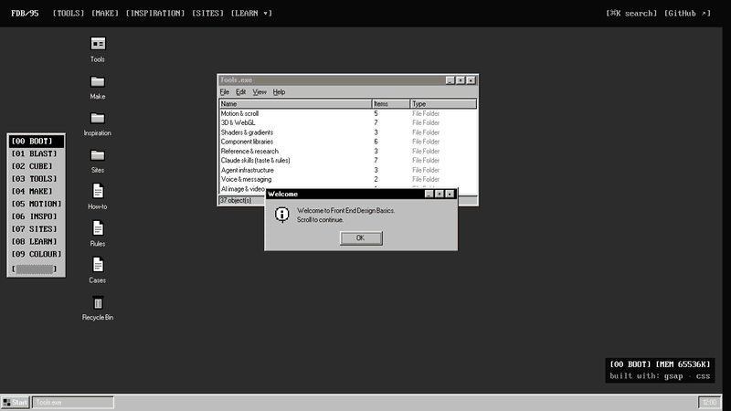</a>
</p>

<p align="center">
  <a href="https://frontenddesignbasics.vercel.app">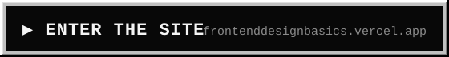</a>
</p>

```text
 ███████╗██████╗ ██████╗        frontend design basics
 ██╔════╝██╔══██╗██╔══██╗       ─────────────────────────────────────────
 █████╗  ██║  ██║██████╔╝       the guide to complete, beautiful web design.
 ██╔══╝  ██║  ██║██╔══██╗       a journey through the toolkit: win95 boot →
 ██║     ██████╔╝██████╔╝       pixel blast → black & white 3d → full colour.
 ╚═╝     ╚═════╝ ╚═════╝        tools, principles and examples, all live.
```

<!-- directory:begin -->
<!-- generated by `pnpm gen` -->

```text
┌─ frontenddesignbasics.vercel.app ─────────────────────────────┐
│  /make            33  experiences built by mixing the tools   │
│  /tools           51  libraries, MCPs and skills I use daily  │
│  /inspiration     19  design inspiration, by principle        │
│  /sites          293  real websites, filterable               │
│  /docs/how-to     20  short numbered task guides              │
│  /docs/rules       9  rules and conventions, TL;DR first      │
│  /docs/cases      10  great sites, broken down                │
└───────────────────────────────────────────────────────────────┘
```

<!-- directory:end -->

> **The site is the guide.** Everything below is also on
> [frontenddesignbasics.vercel.app](https://frontenddesignbasics.vercel.app), live and interactive.
> This README is the map.

## [01] /make: 30 experiences

Small, finished pieces built by mixing the tools: 3D blocks that resolve from pixels to high-def, neon
light paths, shaders, motion design, kinetic type, Win95 retro. Click any one to open it live.

<!-- experiences:begin -->
<!-- generated by `pnpm gen` -->

<table>
<tr><td width="33%" valign="top"><a href="https://frontenddesignbasics.vercel.app/lab/pixel-to-hd-cube">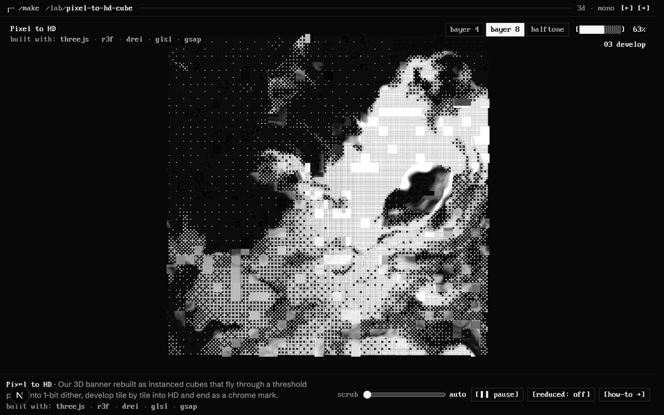</a><br/><b><a href="https://frontenddesignbasics.vercel.app/lab/pixel-to-hd-cube">Pixel to HD</a></b> <sub>· mono · 3d</sub><br/><sub>Our 3D banner rebuilt as instanced cubes that fly through a threshold plane into 1-bit dither, develop tile by tile into HD and end as a chrome mark.</sub><br/><sub><code>threejs · r3f · drei · glsl · gsap</code></sub></td><td width="33%" valign="top"><a href="https://frontenddesignbasics.vercel.app/lab/voxel-type-assembly">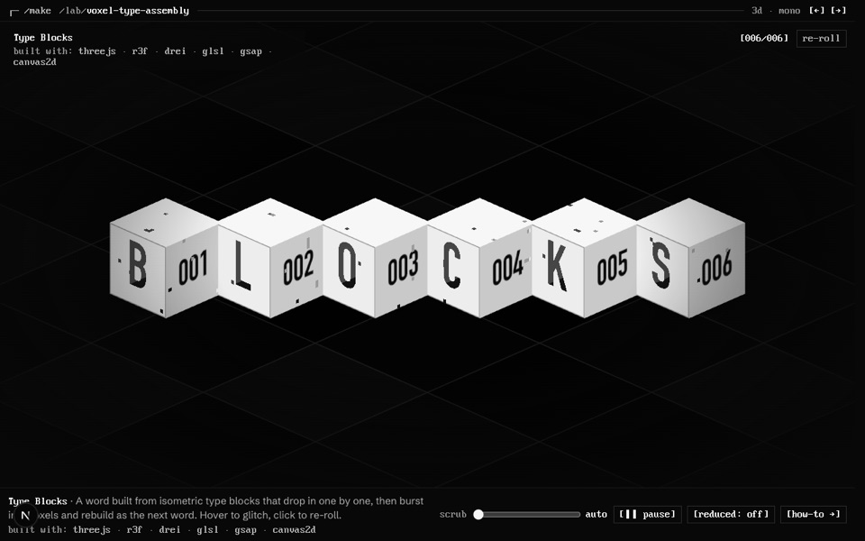</a><br/><b><a href="https://frontenddesignbasics.vercel.app/lab/voxel-type-assembly">Type Blocks</a></b> <sub>· mono · 3d</sub><br/><sub>A word built from isometric type blocks that drop in one by one, then burst into voxels and rebuild as the next word. Hover to glitch, click to re-roll.</sub><br/><sub><code>threejs · r3f · drei · glsl · gsap</code></sub></td><td width="33%" valign="top"><a href="https://frontenddesignbasics.vercel.app/lab/ascii-3d">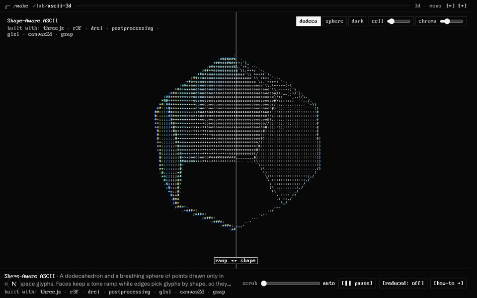</a><br/><b><a href="https://frontenddesignbasics.vercel.app/lab/ascii-3d">Shape-Aware ASCII</a></b> <sub>· mono · 3d</sub><br/><sub>A dodecahedron and a breathing sphere of points drawn only in monospace glyphs. Faces keep a tone ramp while edges pick glyphs by shape, so they follow the silhouette. Drag the split to compare with a plain ramp.</sub><br/><sub><code>threejs · r3f · drei · postprocessing · glsl</code></sub></td></tr>
<tr><td width="33%" valign="top"><a href="https://frontenddesignbasics.vercel.app/lab/neon-block-city">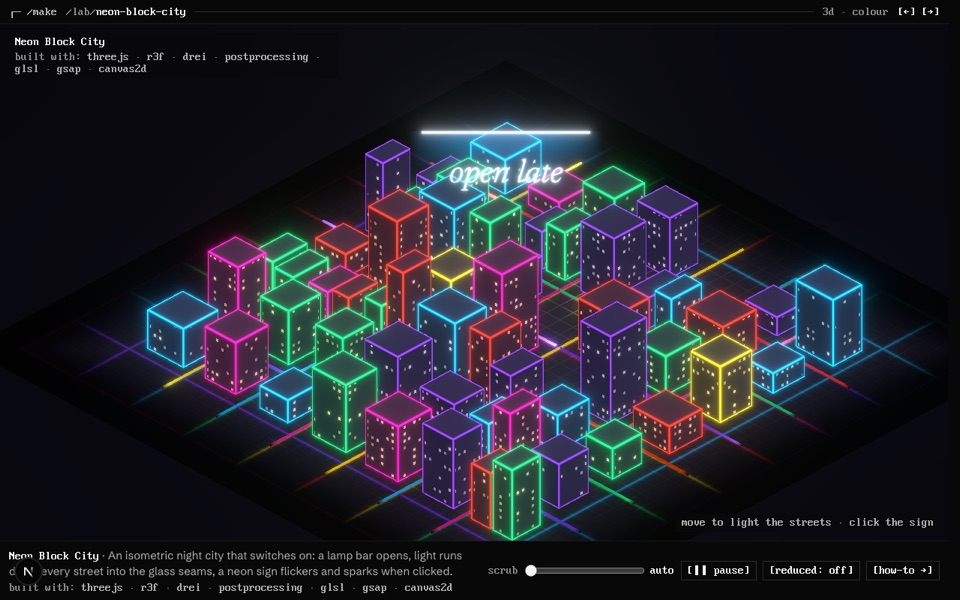</a><br/><b><a href="https://frontenddesignbasics.vercel.app/lab/neon-block-city">Neon Block City</a></b> <sub>· colour · 3d</sub><br/><sub>An isometric night city that switches on: a lamp bar opens, light runs down every street into the glass seams, a neon sign flickers and sparks when clicked.</sub><br/><sub><code>threejs · r3f · drei · postprocessing · glsl</code></sub></td><td width="33%" valign="top"><a href="https://frontenddesignbasics.vercel.app/lab/crystal-type-rings">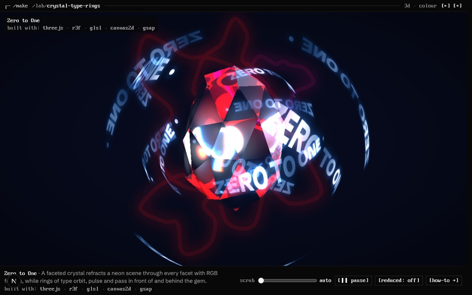</a><br/><b><a href="https://frontenddesignbasics.vercel.app/lab/crystal-type-rings">Zero to One</a></b> <sub>· colour · 3d</sub><br/><sub>A faceted crystal refracts a neon scene through every facet with RGB fringes, while rings of type orbit, pulse and pass in front of and behind the gem.</sub><br/><sub><code>threejs · r3f · glsl · canvas2d · gsap</code></sub></td><td width="33%" valign="top"><a href="https://frontenddesignbasics.vercel.app/lab/dither-wave">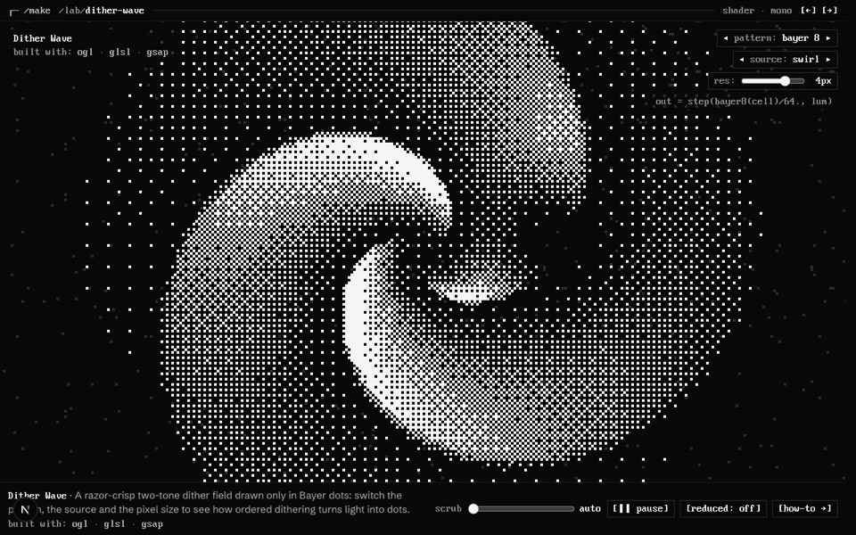</a><br/><b><a href="https://frontenddesignbasics.vercel.app/lab/dither-wave">Dither Wave</a></b> <sub>· mono · shader</sub><br/><sub>A razor-crisp two-tone dither field drawn only in Bayer dots: switch the pattern, the source and the pixel size to see how ordered dithering turns light into dots.</sub><br/><sub><code>ogl · glsl · gsap</code></sub></td></tr>
<tr><td width="33%" valign="top"><a href="https://frontenddesignbasics.vercel.app/lab/liquid-gradient">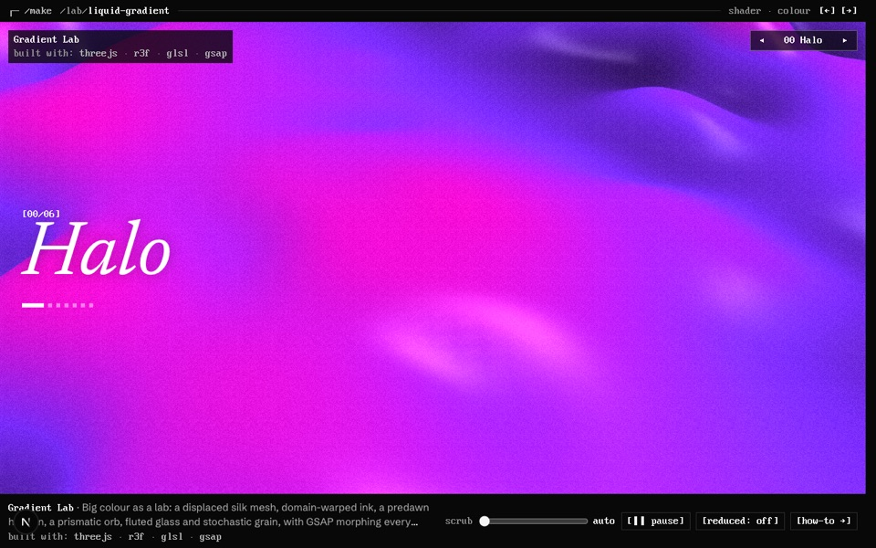</a><br/><b><a href="https://frontenddesignbasics.vercel.app/lab/liquid-gradient">Gradient Lab</a></b> <sub>· colour · shader</sub><br/><sub>Big colour as a lab: a displaced silk mesh, domain-warped ink, a predawn horizon, a prismatic orb, fluted glass and stochastic grain, with GSAP morphing every uniform between numbered presets.</sub><br/><sub><code>threejs · r3f · glsl · gsap</code></sub></td><td width="33%" valign="top"><a href="https://frontenddesignbasics.vercel.app/lab/glass-lens">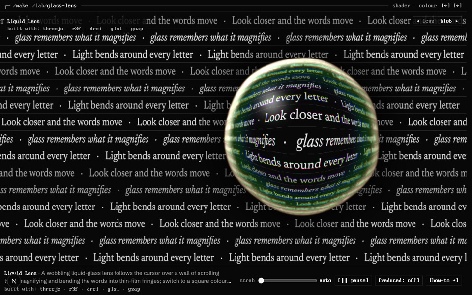</a><br/><b><a href="https://frontenddesignbasics.vercel.app/lab/glass-lens">Liquid Lens</a></b> <sub>· colour · shader</sub><br/><sub>A wobbling liquid-glass lens follows the cursor over a wall of scrolling type, magnifying and bending the words into thin-film fringes; switch to a square colour lens, fluted glass or a real transmission disc.</sub><br/><sub><code>threejs · r3f · drei · glsl · gsap</code></sub></td><td width="33%" valign="top"><a href="https://frontenddesignbasics.vercel.app/lab/light-painting">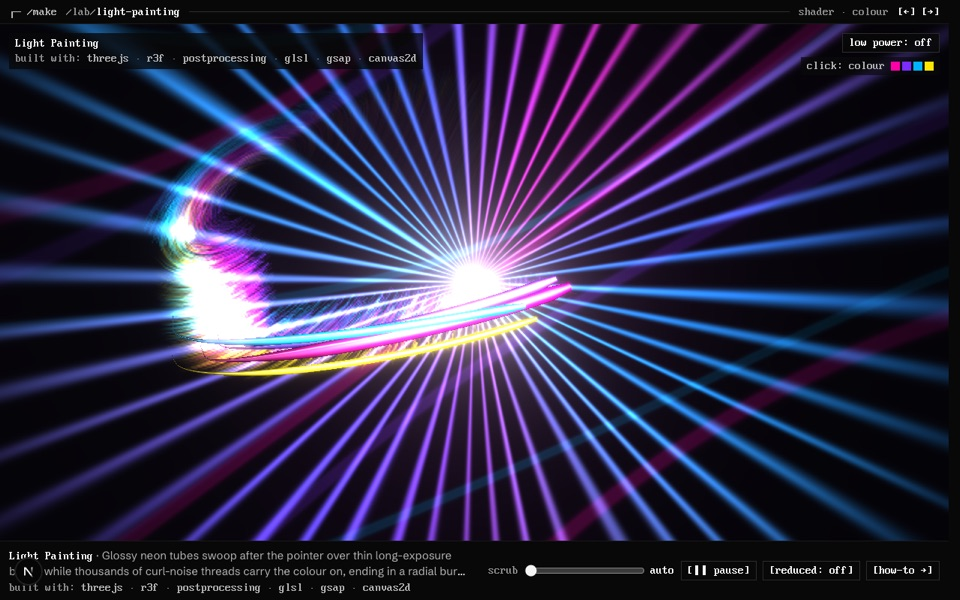</a><br/><b><a href="https://frontenddesignbasics.vercel.app/lab/light-painting">Light Painting</a></b> <sub>· colour · shader</sub><br/><sub>Glossy neon tubes swoop after the pointer over thin long-exposure bands while thousands of curl-noise threads carry the colour on, ending in a radial burst; click to change the palette.</sub><br/><sub><code>threejs · r3f · postprocessing · glsl · gsap</code></sub></td></tr>
<tr><td width="33%" valign="top"><a href="https://frontenddesignbasics.vercel.app/lab/crt-signal-lost">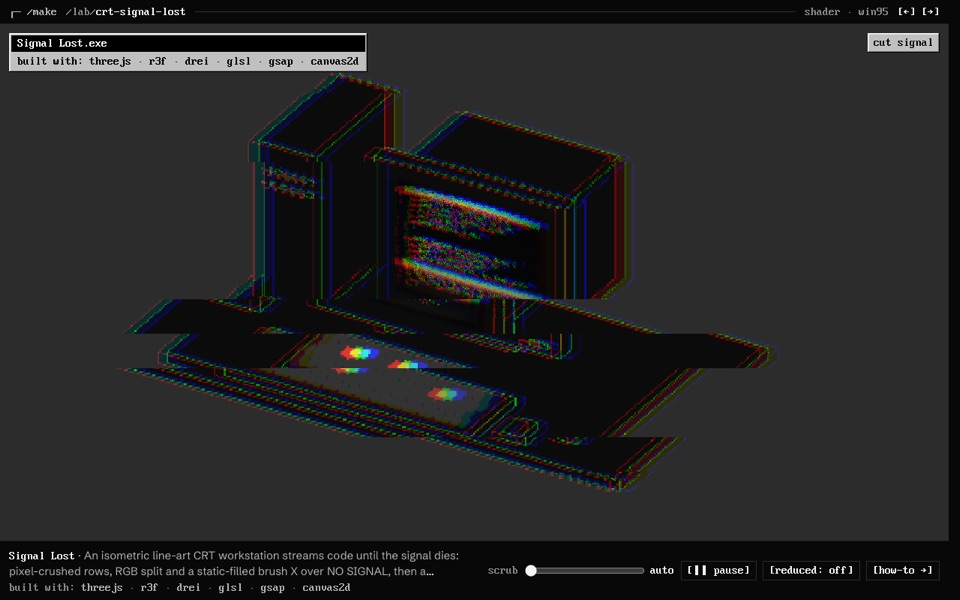</a><br/><b><a href="https://frontenddesignbasics.vercel.app/lab/crt-signal-lost">Signal Lost</a></b> <sub>· win95 · shader</sub><br/><sub>An isometric line-art CRT workstation streams code until the signal dies: pixel-crushed rows, RGB split and a static-filled brush X over NO SIGNAL, then a datamosh drags old pixels until the picture returns.</sub><br/><sub><code>threejs · r3f · drei · glsl · gsap</code></sub></td><td width="33%" valign="top"><a href="https://frontenddesignbasics.vercel.app/lab/flying-type">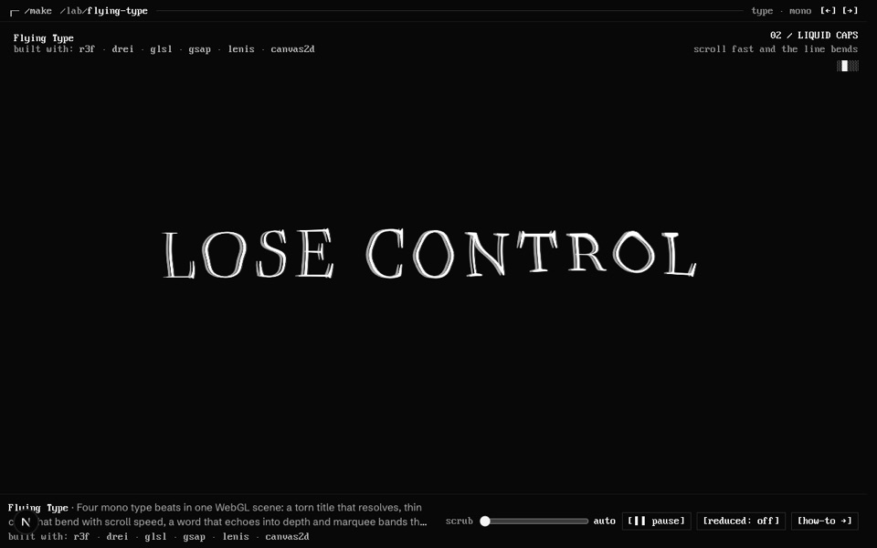</a><br/><b><a href="https://frontenddesignbasics.vercel.app/lab/flying-type">Flying Type</a></b> <sub>· mono · type</sub><br/><sub>Four mono type beats in one WebGL scene: a torn title that resolves, thin caps that bend with scroll speed, a word that echoes into depth and marquee bands that melt at a seam.</sub><br/><sub><code>r3f · drei · glsl · gsap · lenis</code></sub></td><td width="33%" valign="top"><a href="https://frontenddesignbasics.vercel.app/lab/circuit-board">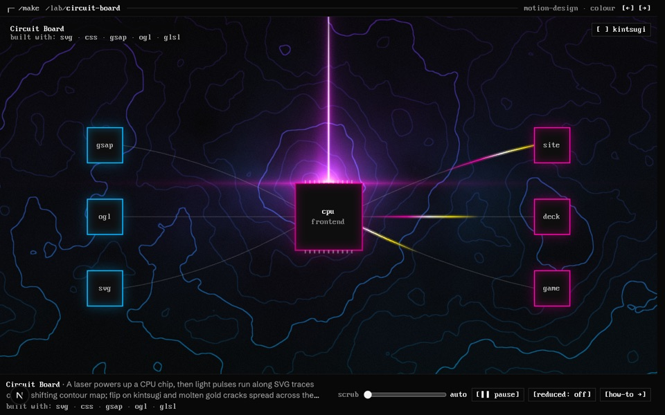</a><br/><b><a href="https://frontenddesignbasics.vercel.app/lab/circuit-board">Circuit Board</a></b> <sub>· colour · motion-design</sub><br/><sub>A laser powers up a CPU chip, then light pulses run along SVG traces over a shifting contour map; flip on kintsugi and molten gold cracks spread across the board.</sub><br/><sub><code>svg · css · gsap · ogl · glsl</code></sub></td></tr>
<tr><td width="33%" valign="top"><a href="https://frontenddesignbasics.vercel.app/lab/easing-lab">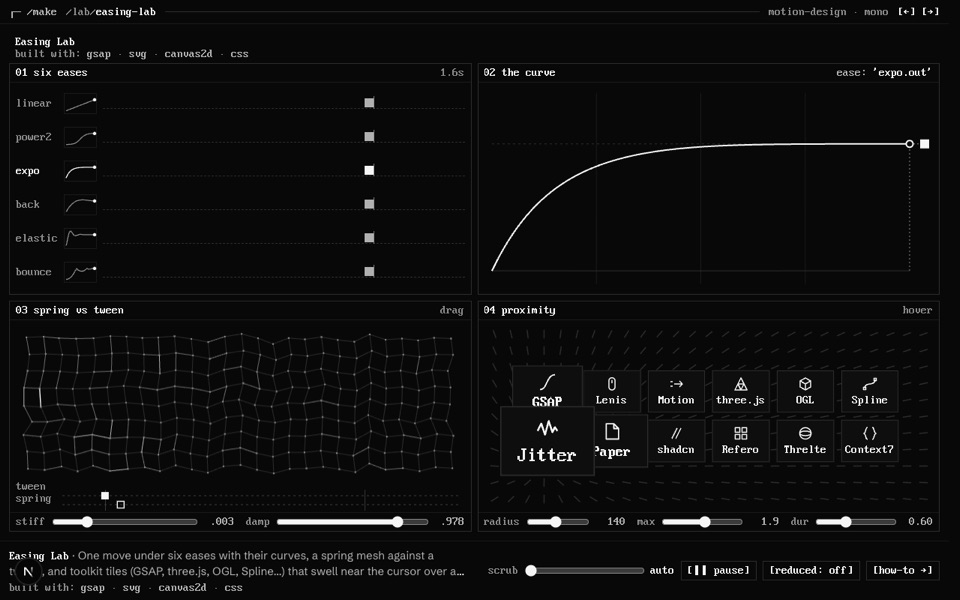</a><br/><b><a href="https://frontenddesignbasics.vercel.app/lab/easing-lab">Easing Lab</a></b> <sub>· mono · motion-design</sub><br/><sub>One move under six eases with their curves, a spring mesh against a tween, and toolkit tiles (GSAP, three.js, OGL, Spline...) that swell near the cursor over a field of iron-filing dashes: how motion feels, in black and white.</sub><br/><sub><code>gsap · svg · canvas2d · css</code></sub></td><td width="33%" valign="top"><a href="https://frontenddesignbasics.vercel.app/lab/kinetic-poster">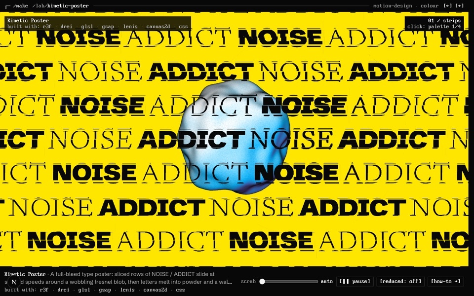</a><br/><b><a href="https://frontenddesignbasics.vercel.app/lab/kinetic-poster">Kinetic Poster</a></b> <sub>· colour · motion-design</sub><br/><sub>A full-bleed type poster: sliced rows of NOISE / ADDICT slide at seeded speeds around a wobbling fresnel blob, then letters melt into powder and a wall of type waves in depth. Click to change the palette.</sub><br/><sub><code>r3f · drei · glsl · gsap · lenis</code></sub></td><td width="33%" valign="top"><a href="https://frontenddesignbasics.vercel.app/lab/wave-extrude-type">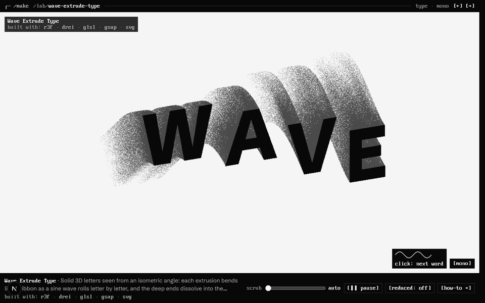</a><br/><b><a href="https://frontenddesignbasics.vercel.app/lab/wave-extrude-type">Wave Extrude Type</a></b> <sub>· mono · type</sub><br/><sub>Solid 3D letters seen from an isometric angle: each extrusion bends like a ribbon as a sine wave rolls letter by letter, and the deep ends dissolve into the paper through a grainy airbrush fade.</sub><br/><sub><code>r3f · drei · glsl · gsap · svg</code></sub></td></tr>
<tr><td width="33%" valign="top"><a href="https://frontenddesignbasics.vercel.app/lab/pinned-chapters">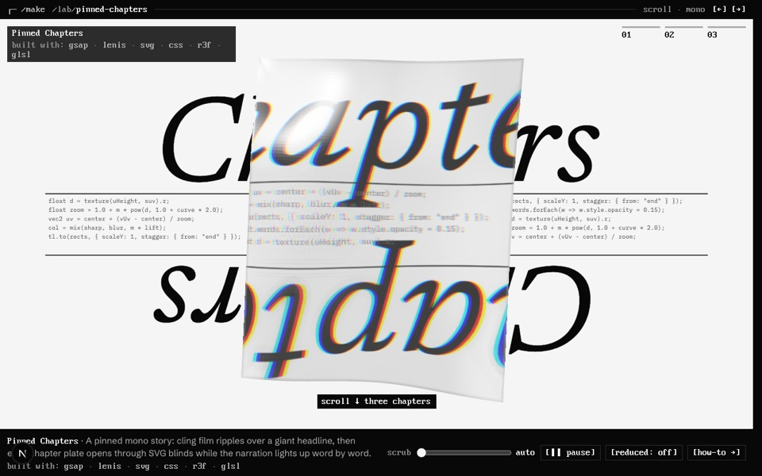</a><br/><b><a href="https://frontenddesignbasics.vercel.app/lab/pinned-chapters">Pinned Chapters</a></b> <sub>· mono · scroll</sub><br/><sub>A pinned mono story: cling film ripples over a giant headline, then each chapter plate opens through SVG blinds while the narration lights up word by word.</sub><br/><sub><code>gsap · lenis · svg · css · r3f</code></sub></td><td width="33%" valign="top"><a href="https://frontenddesignbasics.vercel.app/lab/velocity-gallery">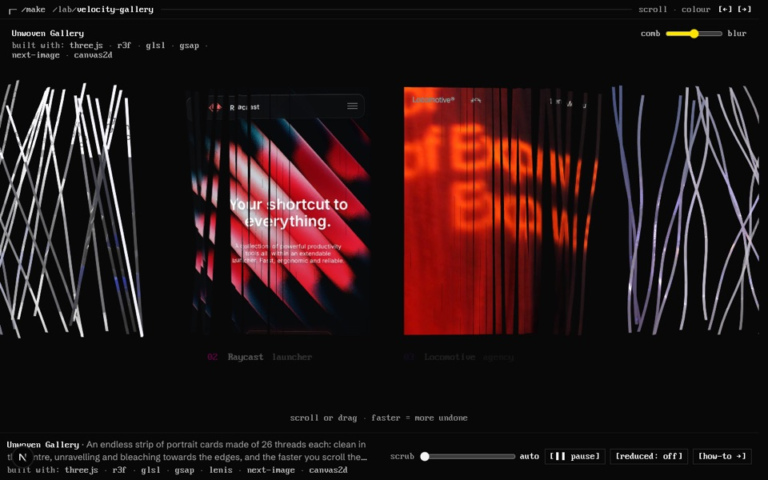</a><br/><b><a href="https://frontenddesignbasics.vercel.app/lab/velocity-gallery">Unwoven Gallery</a></b> <sub>· colour · scroll</sub><br/><sub>An endless strip of portrait cards made of 26 threads each: clean in the centre, unravelling and bleaching towards the edges, and the faster you scroll the more it comes undone.</sub><br/><sub><code>threejs · r3f · glsl · gsap · lenis</code></sub></td><td width="33%" valign="top"><a href="https://frontenddesignbasics.vercel.app/lab/type-vortex">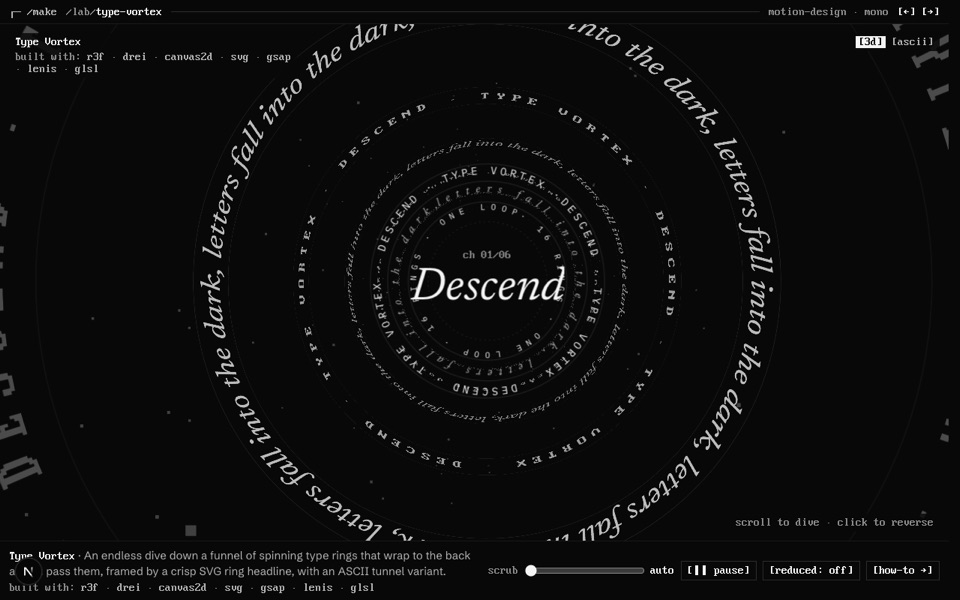</a><br/><b><a href="https://frontenddesignbasics.vercel.app/lab/type-vortex">Type Vortex</a></b> <sub>· mono · motion-design</sub><br/><sub>An endless dive down a funnel of spinning type rings that wrap to the back as you pass them, framed by a crisp SVG ring headline, with an ASCII tunnel variant.</sub><br/><sub><code>r3f · drei · canvas2d · svg · gsap</code></sub></td></tr>
<tr><td width="33%" valign="top"><a href="https://frontenddesignbasics.vercel.app/lab/flip-bento">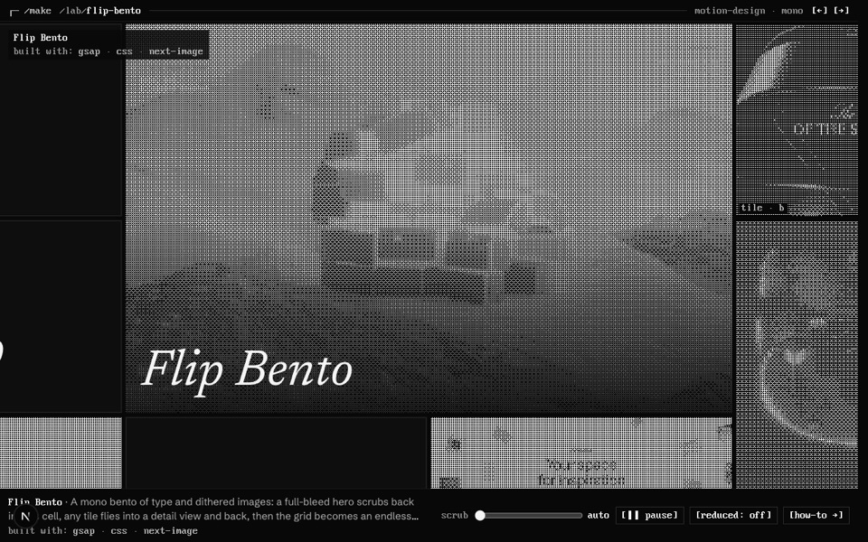</a><br/><b><a href="https://frontenddesignbasics.vercel.app/lab/flip-bento">Flip Bento</a></b> <sub>· mono · motion-design</sub><br/><sub>A mono bento of type and dithered images: a full-bleed hero scrubs back into its cell, any tile flies into a detail view and back, then the grid becomes an endless scatter.</sub><br/><sub><code>gsap · css · next-image</code></sub></td><td width="33%" valign="top"><a href="https://frontenddesignbasics.vercel.app/lab/page-transitions">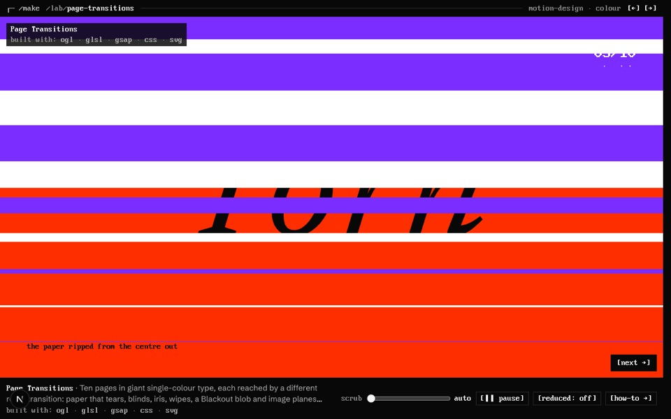</a><br/><b><a href="https://frontenddesignbasics.vercel.app/lab/page-transitions">Page Transitions</a></b> <sub>· colour · motion-design</sub><br/><sub>Ten pages in giant single-colour type, each reached by a different route transition: paper that tears, blinds, iris, wipes, a Blackout blob and image planes that glide to their new slots.</sub><br/><sub><code>ogl · glsl · gsap · css · svg</code></sub></td><td width="33%" valign="top"><a href="https://frontenddesignbasics.vercel.app/lab/win95-boot">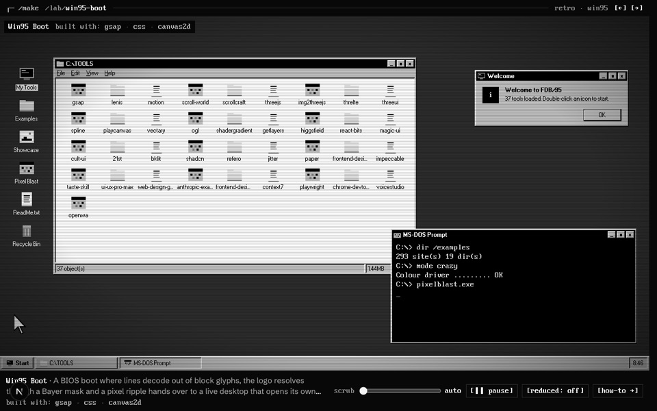</a><br/><b><a href="https://frontenddesignbasics.vercel.app/lab/win95-boot">Win95 Boot</a></b> <sub>· win95 · retro</sub><br/><sub>A BIOS boot where lines decode out of block glyphs, the logo resolves through a Bayer mask and a pixel ripple hands over to a live desktop that opens its own windows under CRT scanlines: GSAP ScrambleText, snap and steps() eases.</sub><br/><sub><code>gsap · css · canvas2d</code></sub></td></tr>
<tr><td width="33%" valign="top"><a href="https://frontenddesignbasics.vercel.app/lab/pixel-blast">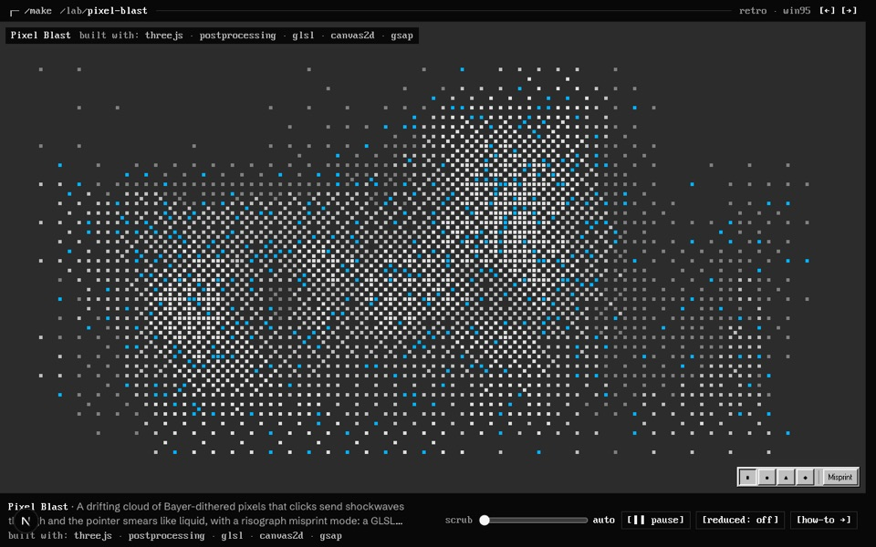</a><br/><b><a href="https://frontenddesignbasics.vercel.app/lab/pixel-blast">Pixel Blast</a></b> <sub>· win95 · retro</sub><br/><sub>A drifting cloud of Bayer-dithered pixels that clicks send shockwaves through and the pointer smears like liquid, with a risograph misprint mode: a GLSL fragment plus a custom postprocessing Effect.</sub><br/><sub><code>threejs · postprocessing · glsl · canvas2d · gsap</code></sub></td><td width="33%" valign="top"><a href="https://frontenddesignbasics.vercel.app/lab/pipes-screensaver">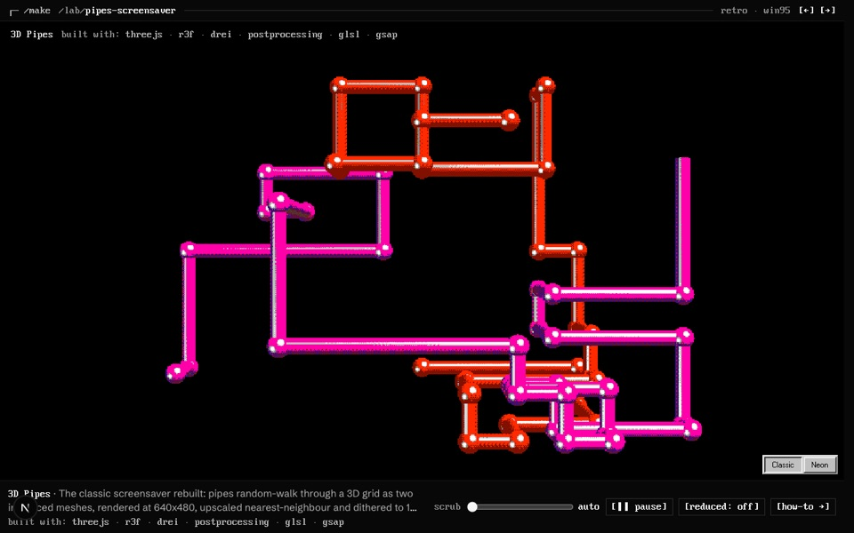</a><br/><b><a href="https://frontenddesignbasics.vercel.app/lab/pipes-screensaver">3D Pipes</a></b> <sub>· win95 · retro</sub><br/><sub>The classic screensaver rebuilt: pipes random-walk through a 3D grid as two instanced meshes, rendered at 640x480, upscaled nearest-neighbour and dithered to 16 colours, with a neon mode that glows through Bloom.</sub><br/><sub><code>threejs · r3f · drei · postprocessing · glsl</code></sub></td><td width="33%" valign="top"><a href="https://frontenddesignbasics.vercel.app/lab/ascii-cursor-field">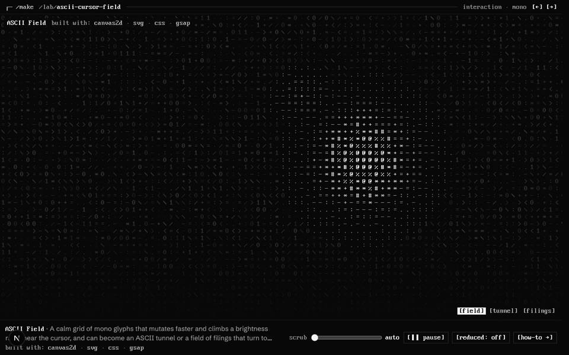</a><br/><b><a href="https://frontenddesignbasics.vercel.app/lab/ascii-cursor-field">ASCII Field</a></b> <sub>· mono · interaction</sub><br/><sub>A calm grid of mono glyphs that mutates faster and climbs a brightness ramp near the cursor, and can become an ASCII tunnel or a field of filings that turn to face you: Canvas2D, SVG and gsap.quickTo.</sub><br/><sub><code>canvas2d · svg · css · gsap</code></sub></td></tr>
<tr><td width="33%" valign="top"><a href="https://frontenddesignbasics.vercel.app/lab/win95-desktop">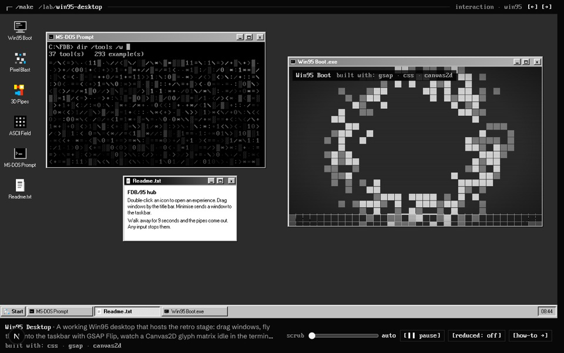</a><br/><b><a href="https://frontenddesignbasics.vercel.app/lab/win95-desktop">Win95 Desktop</a></b> <sub>· win95 · interaction</sub><br/><sub>A working Win95 desktop that hosts the retro stage: drag windows, fly them into the taskbar with GSAP Flip, watch a Canvas2D glyph matrix idle in the terminal, and walk away to wake the pipes screensaver.</sub><br/><sub><code>css · gsap · canvas2d</code></sub></td><td width="33%" valign="top"><a href="https://frontenddesignbasics.vercel.app/lab/event-horizon">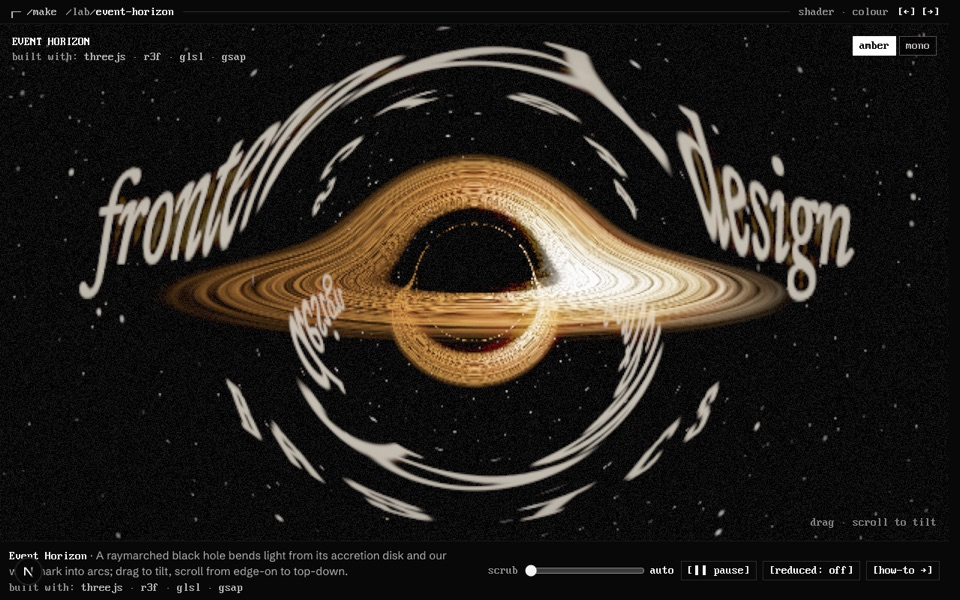</a><br/><b><a href="https://frontenddesignbasics.vercel.app/lab/event-horizon">Event Horizon</a></b> <sub>· colour · shader</sub><br/><sub>A raymarched black hole bends light from its accretion disk and our wordmark into arcs; drag to tilt, scroll from edge-on to top-down.</sub><br/><sub><code>threejs · r3f · glsl · gsap</code></sub></td><td width="33%" valign="top"><a href="https://frontenddesignbasics.vercel.app/lab/halftone-develop">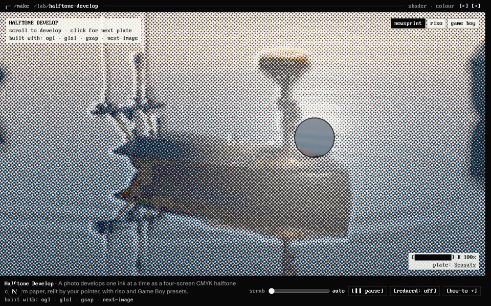</a><br/><b><a href="https://frontenddesignbasics.vercel.app/lab/halftone-develop">Halftone Develop</a></b> <sub>· colour · shader</sub><br/><sub>A photo develops one ink at a time as a four-screen CMYK halftone on warm paper, relit by your pointer, with riso and Game Boy presets.</sub><br/><sub><code>ogl · glsl · gsap · next-image</code></sub></td></tr>
<tr><td width="33%" valign="top"><a href="https://frontenddesignbasics.vercel.app/lab/colour-riot">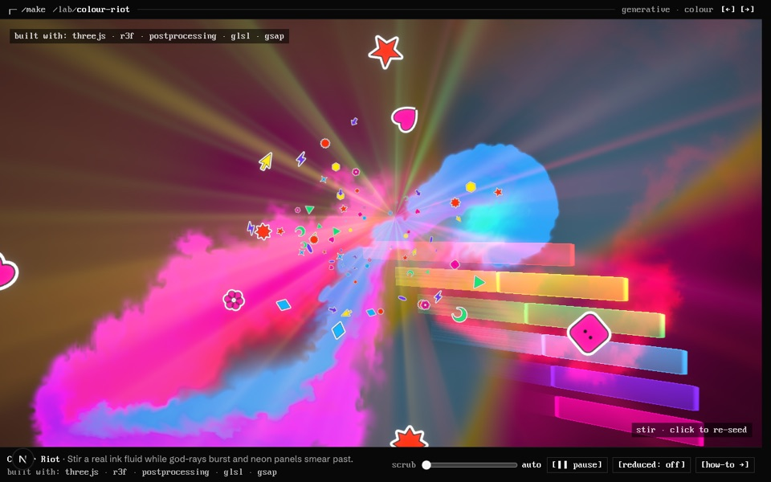</a><br/><b><a href="https://frontenddesignbasics.vercel.app/lab/colour-riot">Colour Riot</a></b> <sub>· colour · generative</sub><br/><sub>Stir a real ink fluid while god-rays burst and neon panels smear past.</sub><br/><sub><code>threejs · r3f · postprocessing · glsl · gsap</code></sub></td><td width="33%" valign="top"><a href="https://frontenddesignbasics.vercel.app/lab/site-wall-3d">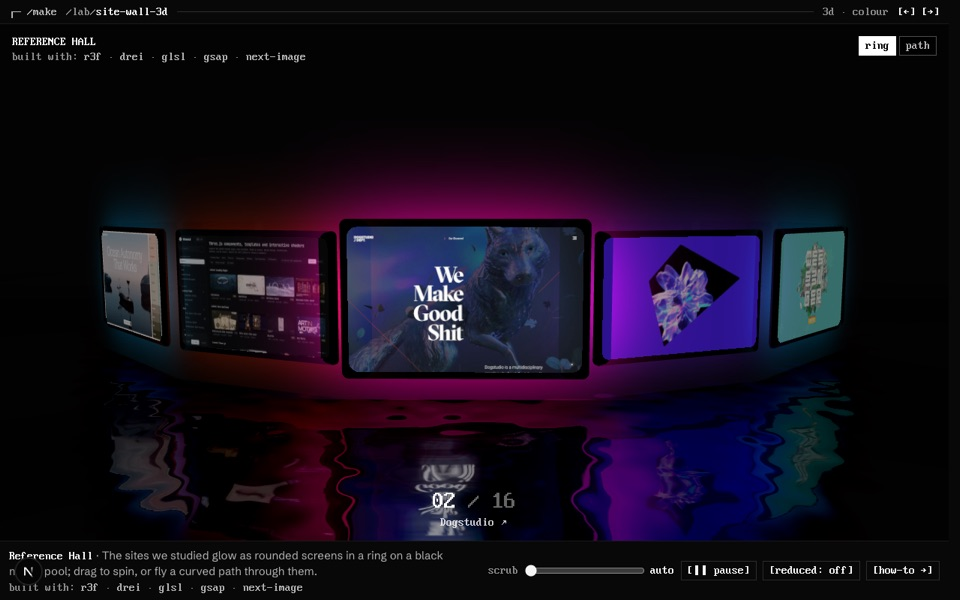</a><br/><b><a href="https://frontenddesignbasics.vercel.app/lab/site-wall-3d">Reference Hall</a></b> <sub>· colour · 3d</sub><br/><sub>The sites we studied glow as rounded screens in a ring on a black mirror pool; drag to spin, or fly a curved path through them.</sub><br/><sub><code>r3f · drei · glsl · gsap · next-image</code></sub></td><td width="33%" valign="top"><a href="https://frontenddesignbasics.vercel.app/lab/tool-blocks">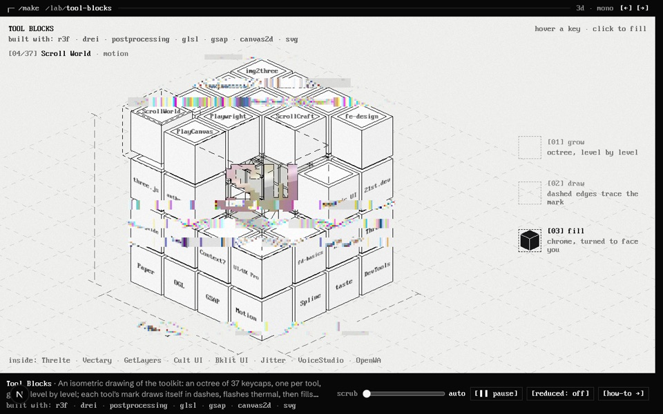</a><br/><b><a href="https://frontenddesignbasics.vercel.app/lab/tool-blocks">Tool Blocks</a></b> <sub>· mono · 3d</sub><br/><sub>An isometric drawing of the toolkit: an octree of 37 keycaps, one per tool, grows level by level; each tool's mark draws itself in dashes, flashes thermal, then fills with chrome.</sub><br/><sub><code>r3f · drei · postprocessing · glsl · gsap</code></sub></td></tr>
<tr><td width="33%" valign="top"><a href="https://frontenddesignbasics.vercel.app/lab/ease-racetrack">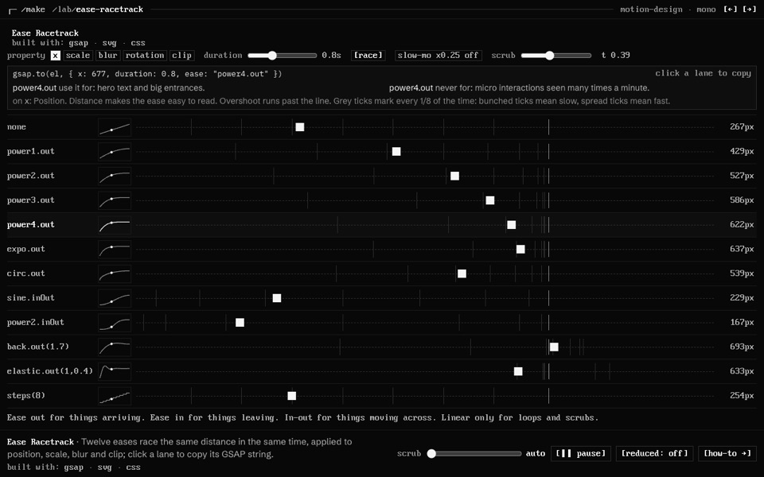</a><br/><b><a href="https://frontenddesignbasics.vercel.app/lab/ease-racetrack">Ease Racetrack</a></b> <sub>· mono · motion-design</sub><br/><sub>Twelve eases race the same distance in the same time, applied to position, scale, blur and clip; click a lane to copy its GSAP string.</sub><br/><sub><code>gsap · svg · css</code></sub></td><td width="33%" valign="top"><a href="https://frontenddesignbasics.vercel.app/lab/blur-lab">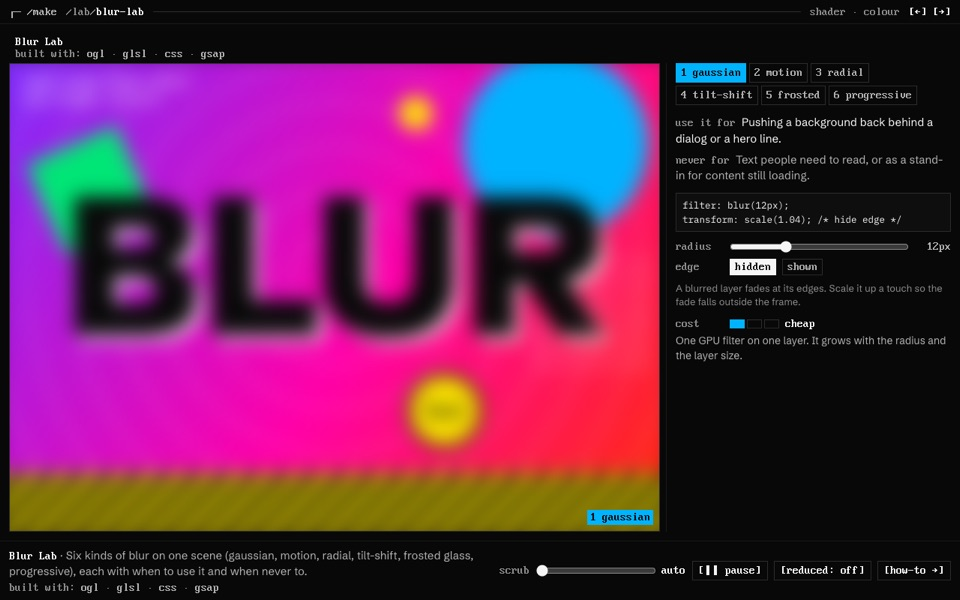</a><br/><b><a href="https://frontenddesignbasics.vercel.app/lab/blur-lab">Blur Lab</a></b> <sub>· colour · shader</sub><br/><sub>Six kinds of blur on one scene (gaussian, motion, radial, tilt-shift, frosted glass, progressive), each with when to use it and when never to.</sub><br/><sub><code>ogl · glsl · css · gsap</code></sub></td><td width="33%" valign="top"><a href="https://frontenddesignbasics.vercel.app/lab/transition-deck">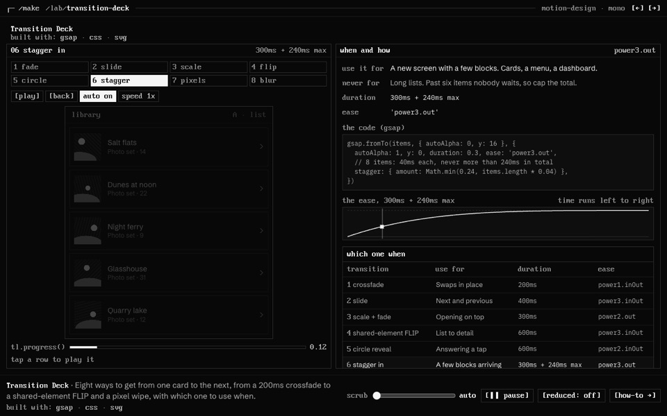</a><br/><b><a href="https://frontenddesignbasics.vercel.app/lab/transition-deck">Transition Deck</a></b> <sub>· mono · motion-design</sub><br/><sub>Eight ways to get from one card to the next, from a 200ms crossfade to a shared-element FLIP and a pixel wipe, with which one to use when.</sub><br/><sub><code>gsap · css · svg</code></sub></td></tr>
</table>

Source for each lives in [`components/experiences/`](components/experiences), registered in [`lib/experiences/`](lib/experiences).

<!-- experiences:end -->

## [02] /docs: learn how

<!-- learn:begin -->
<!-- generated by `pnpm gen` -->

### How-tos

Short, numbered task guides. Each links to a live experience that uses the technique.

**Setup**
- [How to start a project with the toolkit](https://frontenddesignbasics.vercel.app/docs/how-to/start-a-project) · [md](guide/how-to/start-a-project.md)
- [How to drive any component from progress 0..1](https://frontenddesignbasics.vercel.app/docs/how-to/progress-driven-components) · [md](guide/how-to/progress-driven-components.md)

**3D**
- [How to decide if you need 3D, and which tool](https://frontenddesignbasics.vercel.app/docs/how-to/pick-a-3d-tool) · [md](guide/how-to/pick-a-3d-tool.md)
- [How to go from pixel to HD, three ways](https://frontenddesignbasics.vercel.app/docs/how-to/pixel-to-hd) · [md](guide/how-to/pixel-to-hd.md)
- [How to draw thousands of blocks in one call](https://frontenddesignbasics.vercel.app/docs/how-to/instanced-blocks) · [md](guide/how-to/instanced-blocks.md)
- [How to stack post-processing without jank](https://frontenddesignbasics.vercel.app/docs/how-to/post-processing-stack) · [md](guide/how-to/post-processing-stack.md)

**Shaders**
- [How to write a shader background](https://frontenddesignbasics.vercel.app/docs/how-to/shader-background) · [md](guide/how-to/shader-background.md)
- [How to render anything as ASCII or 1-bit](https://frontenddesignbasics.vercel.app/docs/how-to/ascii-and-dither) · [md](guide/how-to/ascii-and-dither.md)
- [How to make neon light paths](https://frontenddesignbasics.vercel.app/docs/how-to/neon-light-paths) · [md](guide/how-to/neon-light-paths.md)
- [How to make colour look expensive](https://frontenddesignbasics.vercel.app/docs/how-to/make-colour-look-expensive) · [md](guide/how-to/make-colour-look-expensive.md)

**Motion**
- [How to pick the right ease (and when to use a spring)](https://frontenddesignbasics.vercel.app/docs/how-to/pick-an-ease) · [md](guide/how-to/pick-an-ease.md)
- [How to make kinetic type and motion posters](https://frontenddesignbasics.vercel.app/docs/how-to/kinetic-type-and-posters) · [md](guide/how-to/kinetic-type-and-posters.md)
- [How to draw and morph SVG](https://frontenddesignbasics.vercel.app/docs/how-to/draw-and-morph-svg) · [md](guide/how-to/draw-and-morph-svg.md)
- [How to animate layouts and pages with Flip](https://frontenddesignbasics.vercel.app/docs/how-to/flip-layouts-and-page-transitions) · [md](guide/how-to/flip-layouts-and-page-transitions.md)

**Scroll and layout**
- [How to add scroll effects without hijacking the page](https://frontenddesignbasics.vercel.app/docs/how-to/scroll-without-hijacking) · [md](guide/how-to/scroll-without-hijacking.md)
- [How to build a hero, a bento grid and a footer](https://frontenddesignbasics.vercel.app/docs/how-to/hero-bento-footer) · [md](guide/how-to/hero-bento-footer.md)
- [How to own your components](https://frontenddesignbasics.vercel.app/docs/how-to/own-your-components) · [md](guide/how-to/own-your-components.md)

**Images**
- [How to show hundreds of images, and their palettes](https://frontenddesignbasics.vercel.app/docs/how-to/images-at-scale) · [md](guide/how-to/images-at-scale.md)
- [How to generate AI assets for the web](https://frontenddesignbasics.vercel.app/docs/how-to/ai-assets) · [md](guide/how-to/ai-assets.md)

**Verify**
- [How to build Win95 chrome, and prove it all moves](https://frontenddesignbasics.vercel.app/docs/how-to/win95-chrome-and-verify) · [md](guide/how-to/win95-chrome-and-verify.md)

### Rules and conventions

TL;DR first, then the detail, with sources.
- [Tokens and colour](https://frontenddesignbasics.vercel.app/docs/rules/tokens-and-colour) · [md](guide/rules/tokens-and-colour.md)
- [Scales and type](https://frontenddesignbasics.vercel.app/docs/rules/scales-and-type) · [md](guide/rules/scales-and-type.md)
- [Breakpoints and layout](https://frontenddesignbasics.vercel.app/docs/rules/breakpoints-and-layout) · [md](guide/rules/breakpoints-and-layout.md)
- [Components and states](https://frontenddesignbasics.vercel.app/docs/rules/components-and-states) · [md](guide/rules/components-and-states.md)
- [Motion tokens](https://frontenddesignbasics.vercel.app/docs/rules/motion-tokens) · [md](guide/rules/motion-tokens.md)
- [Media](https://frontenddesignbasics.vercel.app/docs/rules/media) · [md](guide/rules/media.md)
- [Accessibility](https://frontenddesignbasics.vercel.app/docs/rules/accessibility) · [md](guide/rules/accessibility.md)
- [Copy](https://frontenddesignbasics.vercel.app/docs/rules/copy) · [md](guide/rules/copy.md)
- [Structure and performance](https://frontenddesignbasics.vercel.app/docs/rules/structure-and-performance) · [md](guide/rules/structure-and-performance.md)

### Case studies

Great sites broken down from their makers' own write-ups, plus two of mine.
- [BR95: Windows 95 in the browser](https://frontenddesignbasics.vercel.app/docs/cases/br95) · [md](guide/cases/br95.md)
- [Balatro deck: cloning a look from its real assets](https://frontenddesignbasics.vercel.app/docs/cases/balatro-deck) · [md](guide/cases/balatro-deck.md)
- [GitHub globe: live data as a WebGL scene](https://frontenddesignbasics.vercel.app/docs/cases/github-globe) · [md](guide/cases/github-globe.md)
- [Stripe Connect: motion that stays fast](https://frontenddesignbasics.vercel.app/docs/cases/stripe-connect) · [md](guide/cases/stripe-connect.md)
- [Linear: redesigning a dense dark UI](https://frontenddesignbasics.vercel.app/docs/cases/linear-redesign) · [md](guide/cases/linear-redesign.md)
- [Vercel Ship badge: a lanyard you can grab](https://frontenddesignbasics.vercel.app/docs/cases/vercel-3d-badge) · [md](guide/cases/vercel-3d-badge.md)
- [Igloo Inc.: a company site carved out of ice](https://frontenddesignbasics.vercel.app/docs/cases/igloo-inc) · [md](guide/cases/igloo-inc.md)
- [Bruno Simon: a portfolio you drive](https://frontenddesignbasics.vercel.app/docs/cases/bruno-simon-folio) · [md](guide/cases/bruno-simon-folio.md)
- [Sonner: how a toast earns its polish](https://frontenddesignbasics.vercel.app/docs/cases/emil-sonner) · [md](guide/cases/emil-sonner.md)
- [Josh W. Comeau: whimsy, explained by its maker](https://frontenddesignbasics.vercel.app/docs/cases/josh-comeau) · [md](guide/cases/josh-comeau.md)

<!-- learn:end -->

## [03] /sites: website inspiration

Every chapter of the guide has an "In the wild" row of real websites. Three from each section below;
**[see all of them in GALLERY.md →](GALLERY.md)** or browse them on
[/sites](https://frontenddesignbasics.vercel.app/sites) with filters and search.

<!-- gallery:begin -->
<!-- generated by `pnpm gen` from data/examples.json -->

### Typography

<table>
<tr><td width="33%" valign="top"><a href="https://klim.co.nz">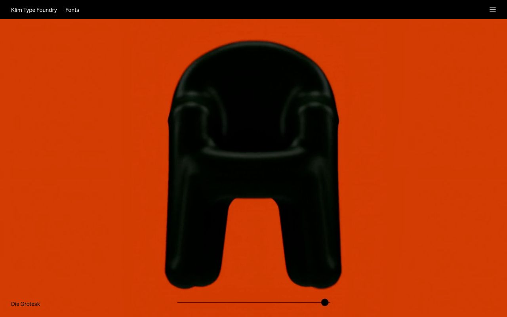</a><br/><b><a href="https://klim.co.nz">Klim Type Foundry</a></b><br/><sub>One huge inflated black 'A' fills an orange screen; a single letterform is the whole hero.</sub></td><td width="33%" valign="top"><a href="https://www.instrument.com">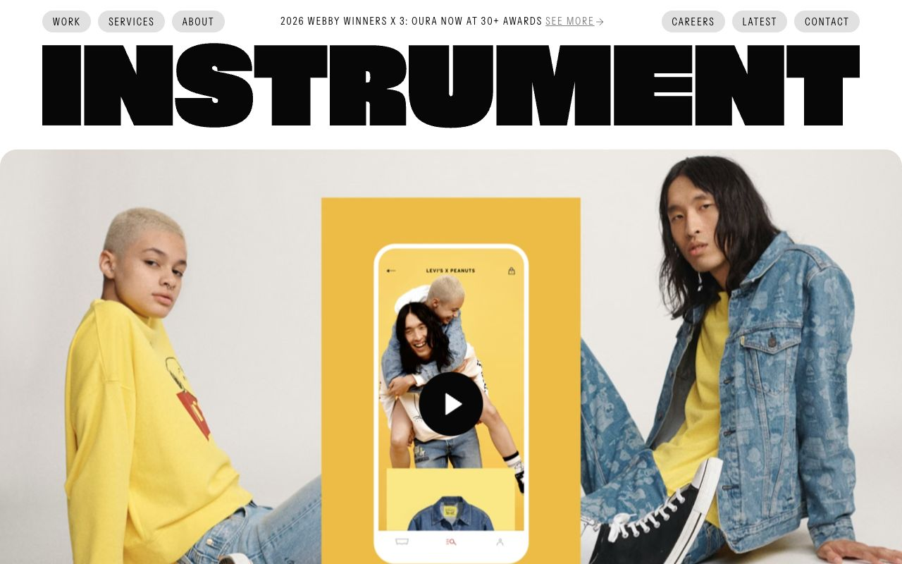</a><br/><b><a href="https://www.instrument.com">Instrument</a></b><br/><sub>Ultra-heavy wordmark set edge to edge as the masthead, with small condensed caps in pill nav.</sub></td><td width="33%" valign="top"><a href="https://commercialtype.com"></a><br/><b><a href="https://commercialtype.com">Commercial Type</a></b><br/><sub>Full-width bands each set one typeface huge: hairline New Doric, fat Orlando serif, Arabic.</sub></td></tr>
</table>

[All 24 typography examples →](GALLERY.md#typography)

### Colour

<table>
<tr><td width="33%" valign="top"><a href="https://gumroad.com"></a><br/><b><a href="https://gumroad.com">Gumroad</a></b><br/><sub>Off-white page with black type and one loud pink on the floating outlined coins.</sub></td><td width="33%" valign="top"><a href="https://arc.net"></a><br/><b><a href="https://arc.net">Arc</a></b><br/><sub>Grainy electric-blue bands with wavy edges frame a soft pastel-and-white middle.</sub></td><td width="33%" valign="top"><a href="https://mschf.com"></a><br/><b><a href="https://mschf.com">MSCHF</a></b><br/><sub>Black and grey mono list where only three lines glow yellow, blue and red.</sub></td></tr>
</table>

[All 17 colour examples →](GALLERY.md#colour)

### Dark mode

<table>
<tr><td width="33%" valign="top"><a href="https://betterstack.com">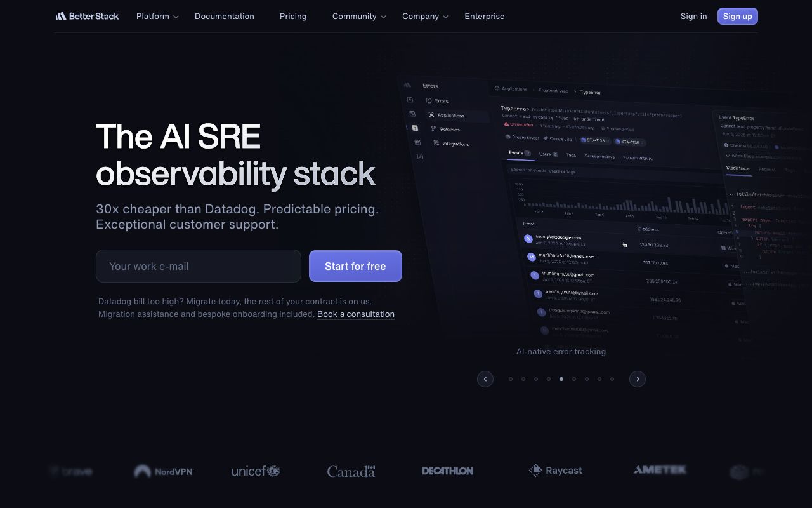</a><br/><b><a href="https://betterstack.com">Better Stack</a></b><br/><sub>Navy-black hero, tilted dark product screenshot fading into the background, one violet call to action.</sub></td><td width="33%" valign="top"><a href="https://huly.io">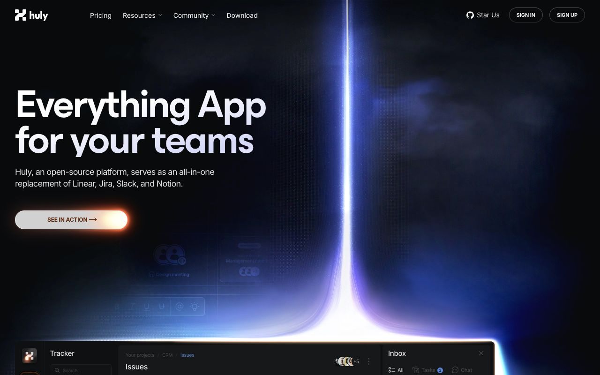</a><br/><b><a href="https://huly.io">Huly</a></b><br/><sub>A beam of blue-white light splits the black hero and lights the product window below.</sub></td><td width="33%" valign="top"><a href="https://modal.com">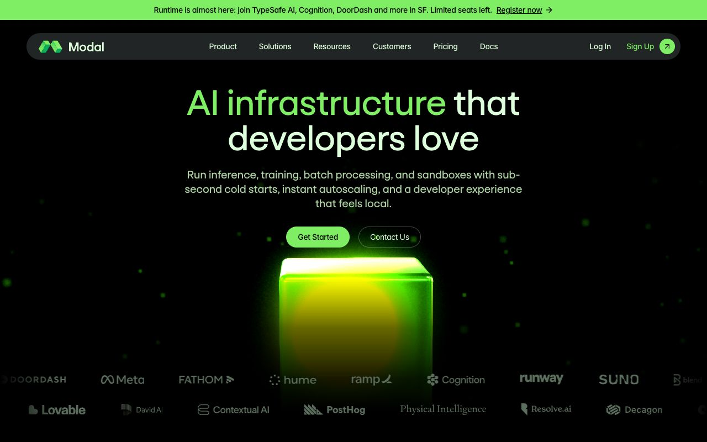</a><br/><b><a href="https://modal.com">Modal</a></b><br/><sub>Pure black with neon green accents: glowing cube, green headline words, greyed logo wall.</sub></td></tr>
</table>

[All 17 dark mode examples →](GALLERY.md#dark-mode)

### Layout & space

<table>
<tr><td width="33%" valign="top"><a href="https://www.grillitype.com">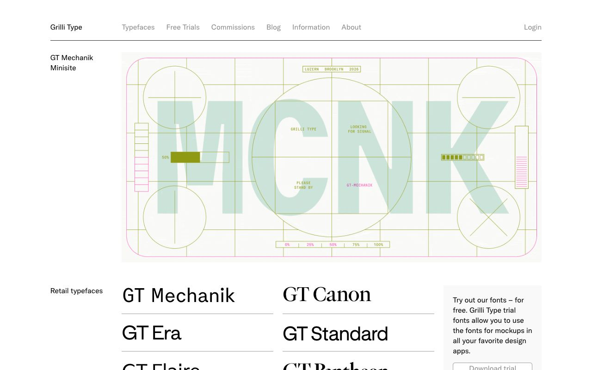</a><br/><b><a href="https://www.grillitype.com">Grilli Type</a></b><br/><sub>A narrow label column on the left and a wide content column; typeface names line up on a strict grid.</sub></td><td width="33%" valign="top"><a href="https://www.14islands.com"></a><br/><b><a href="https://www.14islands.com">14islands</a></b><br/><sub>The headline is staggered across columns, with a small label offset to the right and wide margins all round.</sub></td><td width="33%" valign="top"><a href="https://sharptype.co">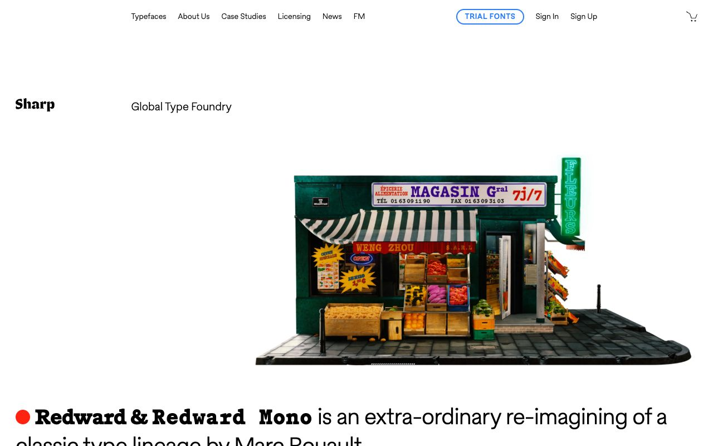</a><br/><b><a href="https://sharptype.co">Sharp Type</a></b><br/><sub>Asymmetric: the logo sits in a side column, the storefront image is pushed right, with open white space around it.</sub></td></tr>
</table>

[All 12 layout & space examples →](GALLERY.md#layout-space)

### Hierarchy

<table>
<tr><td width="33%" valign="top"><a href="https://www.wearecollins.com">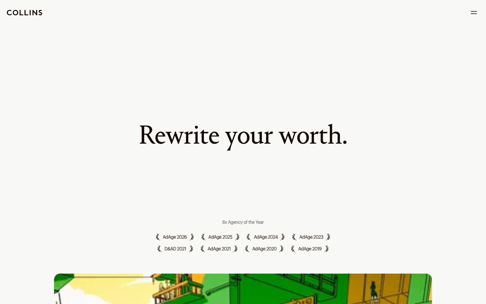</a><br/><b><a href="https://www.wearecollins.com">Collins</a></b><br/><sub>One large serif line in empty space, then a small row of award laurels. The reading order is obvious.</sub></td><td width="33%" valign="top"><a href="https://www.instrument.com">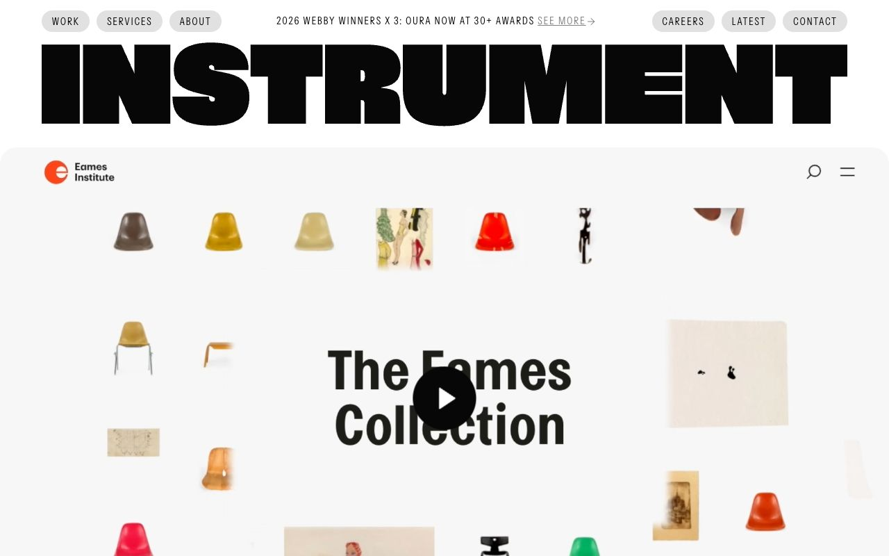</a><br/><b><a href="https://www.instrument.com">Instrument</a></b><br/><sub>A full-width black INSTRUMENT wordmark dominates, and the featured case study sits clearly below it.</sub></td><td width="33%" valign="top"><a href="https://commercialtype.com">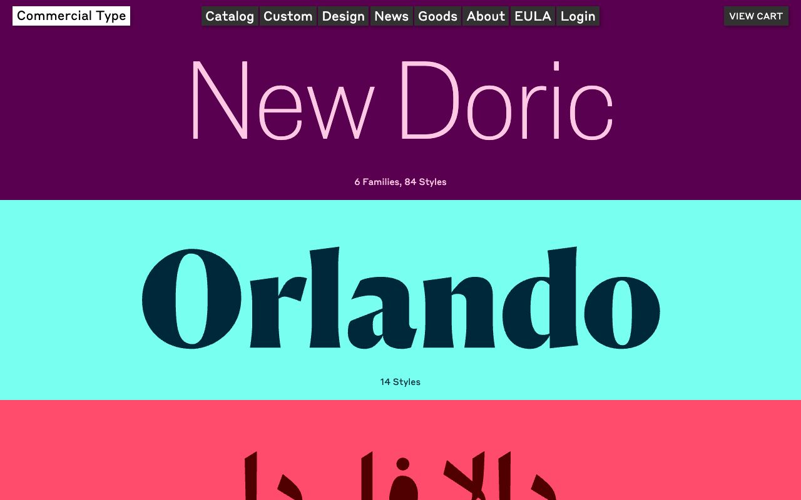</a><br/><b><a href="https://commercialtype.com">Commercial Type</a></b><br/><sub>Each colour band has one huge typeface name first, with a tiny style count as the second read.</sub></td></tr>
</table>

[All 13 hierarchy examples →](GALLERY.md#hierarchy)

### Heroes

<table>
<tr><td width="33%" valign="top"><a href="https://www.wearecollins.com"></a><br/><b><a href="https://www.wearecollins.com">Collins</a></b><br/><sub>One serif line, 'Rewrite your worth.', centred in vast off-white space above small award laurels.</sub></td><td width="33%" valign="top"><a href="https://www.instrument.com">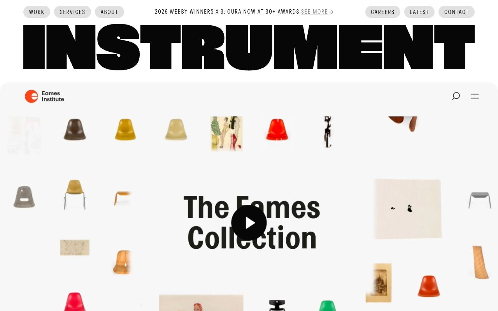</a><br/><b><a href="https://www.instrument.com">Instrument</a></b><br/><sub>Edge-to-edge black ultra-heavy wordmark over a rounded case-study video panel; pill nav buttons.</sub></td><td width="33%" valign="top"><a href="https://14islands.com">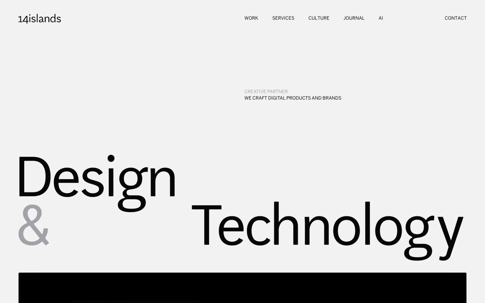</a><br/><b><a href="https://14islands.com">14islands</a></b><br/><sub>Huge staggered 'Design & Technology' type on grey, grey ampersand, tiny caps tagline, nothing else.</sub></td></tr>
</table>

[All 15 heroes examples →](GALLERY.md#heroes)

### Bento grids

<table>
<tr><td width="33%" valign="top"><a href="https://www.apple.com/macbook-pro/">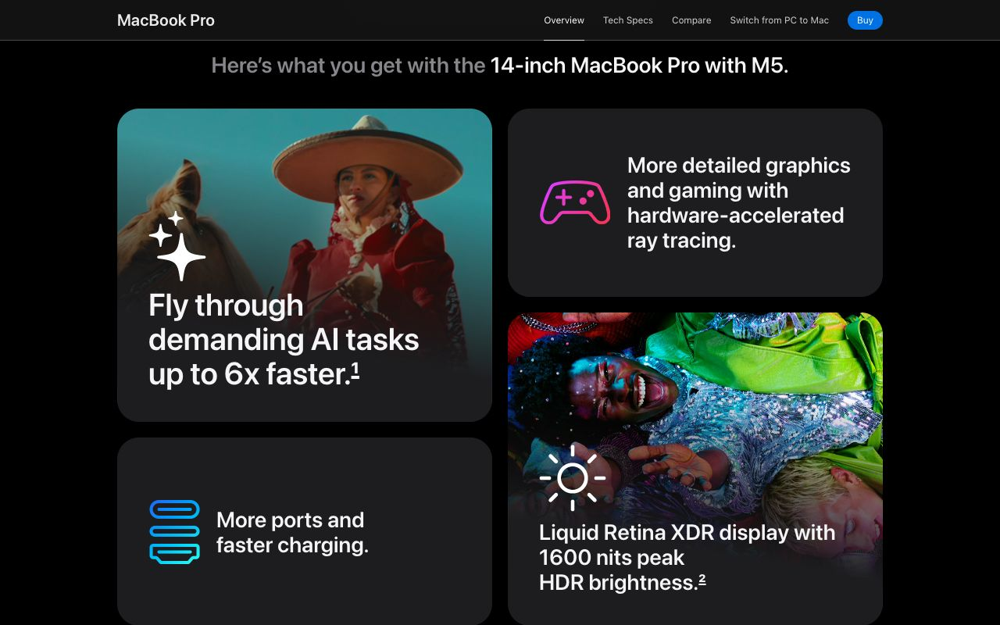</a><br/><b><a href="https://www.apple.com/macbook-pro/">MacBook Pro</a></b><br/><sub>Dark rounded tiles of mixed sizes: photo tiles with big claims beside icon-only tiles for ports, gaming.</sub></td><td width="33%" valign="top"><a href="https://supabase.com">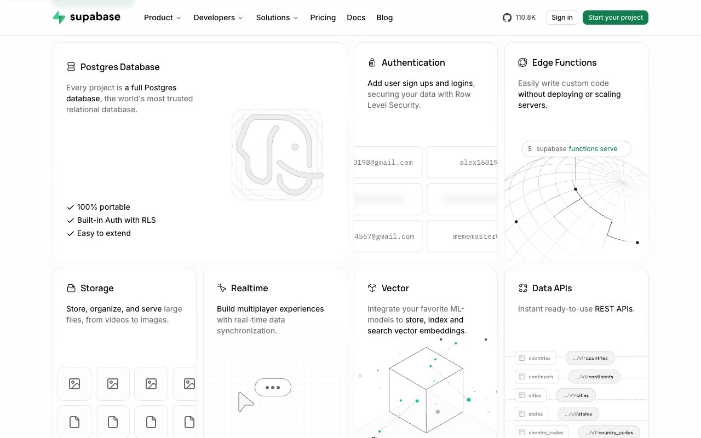</a><br/><b><a href="https://supabase.com">Supabase</a></b><br/><sub>One wide Postgres tile plus seven product tiles, each with a small line-art illustration of its feature.</sub></td><td width="33%" valign="top"><a href="https://clerk.com">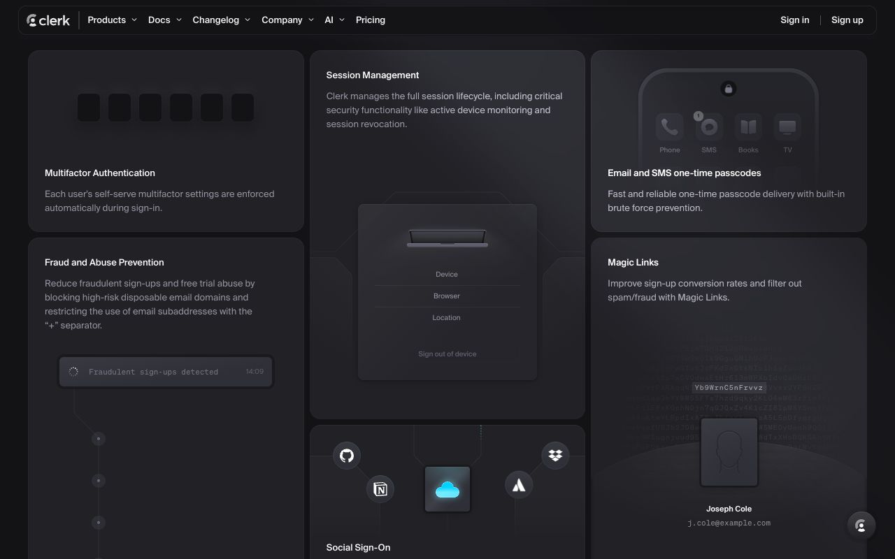</a><br/><b><a href="https://clerk.com">Clerk</a></b><br/><sub>Dark bento of auth features: tall session-management tile, OTP boxes, SSO node graph, magic-link card.</sub></td></tr>
</table>

[All 13 bento grids examples →](GALLERY.md#bento-grids)

### Footers

<table>
<tr><td width="33%" valign="top"><a href="https://www.14islands.com">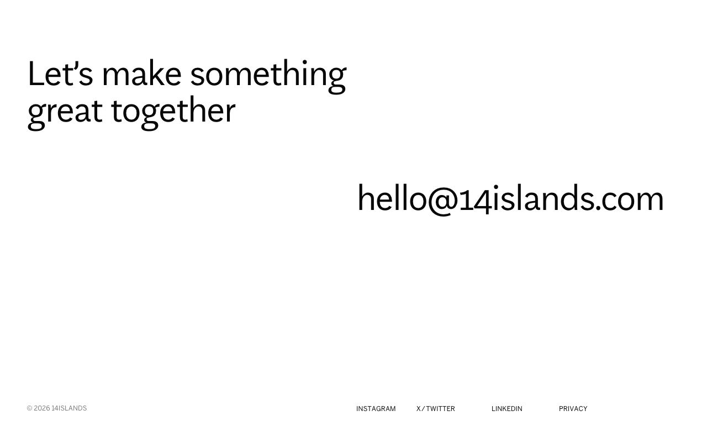</a><br/><b><a href="https://www.14islands.com">14islands</a></b><br/><sub>The footer is a closing invitation: a big 'Let's make something great' line, a huge email address, and a minimal social row.</sub></td><td width="33%" valign="top"><a href="https://www.wearecollins.com">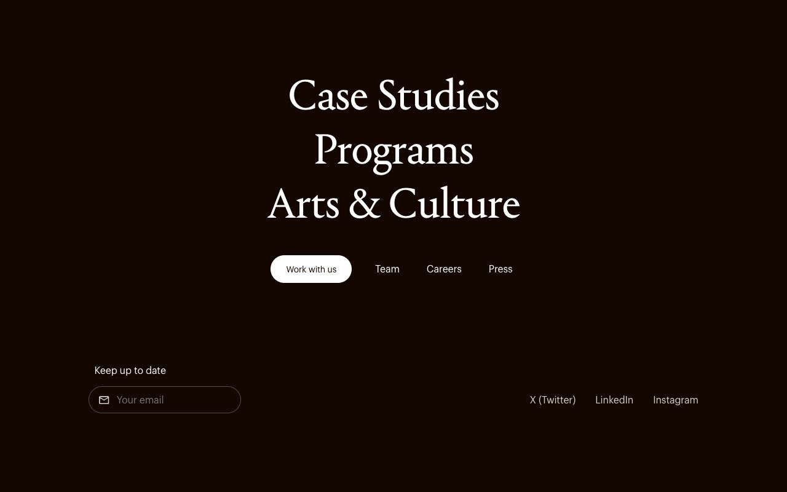</a><br/><b><a href="https://www.wearecollins.com">Collins</a></b><br/><sub>A dark footer with big serif section links, a pill 'Work with us' button, a newsletter field and socials.</sub></td><td width="33%" valign="top"><a href="https://www.instrument.com">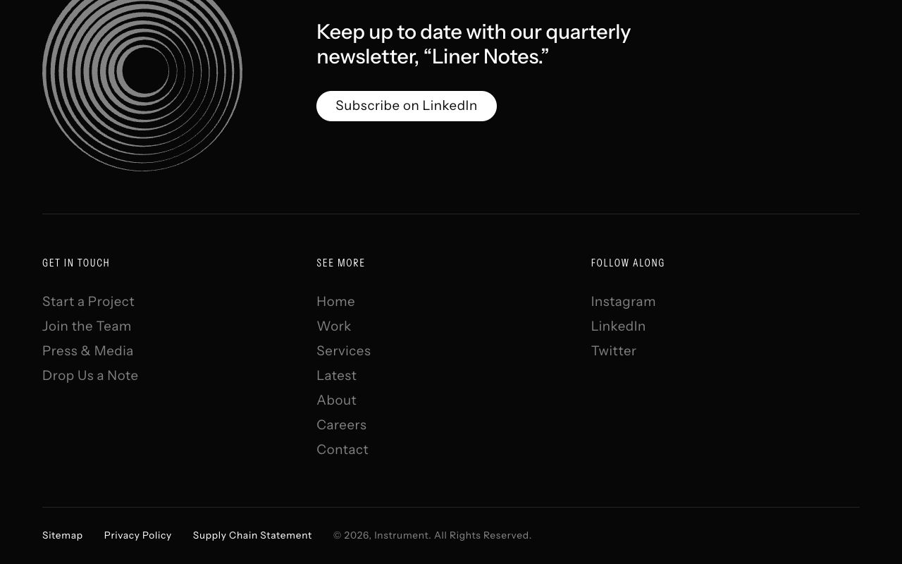</a><br/><b><a href="https://www.instrument.com">Instrument</a></b><br/><sub>A complete footer: newsletter pitch, three labelled link columns and a legal bar, all on a strict grid.</sub></td></tr>
</table>

[All 18 footers examples →](GALLERY.md#footers)

### Motion

<table>
<tr><td width="33%" valign="top"><a href="https://www.hellomonday.com"></a><br/><b><a href="https://www.hellomonday.com">Hello Monday</a></b><br/><sub>Hand-drawn animated couple above a rotating serif word, with a curved black menu edge peeking in.</sub></td><td width="33%" valign="top"><a href="https://aristidebenoist.com"></a><br/><b><a href="https://aristidebenoist.com">Aristide Benoist</a></b><br/><sub>Caught mid-intro: thin vertical photo strips sliding into place under a tick-mark progress bar.</sub></td><td width="33%" valign="top"><a href="https://activetheory.net"></a><br/><b><a href="https://activetheory.net">Active Theory</a></b><br/><sub>Real-time WebGL scene: glossy chrome ribbon logo floating among drifting golden particles and a jellyfish.</sub></td></tr>
</table>

[All 14 motion examples →](GALLERY.md#motion)

### Scroll stories

<table>
<tr><td width="33%" valign="top"><a href="https://jeskojets.com">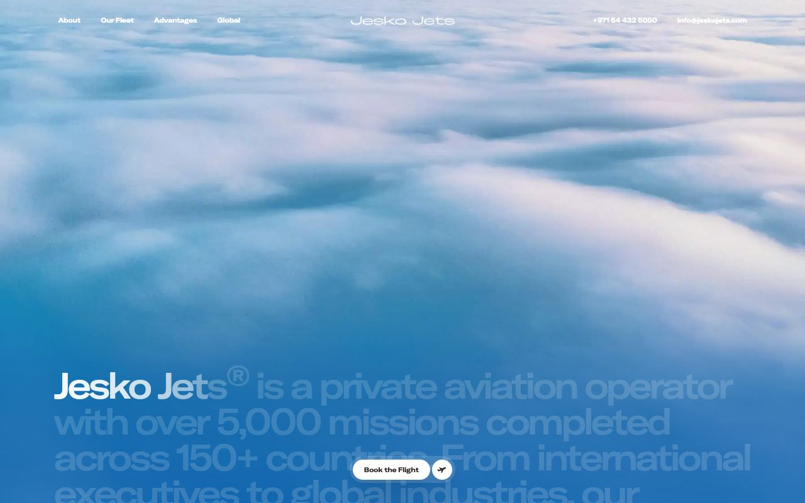</a><br/><b><a href="https://jeskojets.com">Jesko Jets</a></b><br/><sub>Scroll-scrubbed paragraph: words fill from faded to solid white as you scroll over clouds.</sub></td><td width="33%" valign="top"><a href="https://oryzo.ai">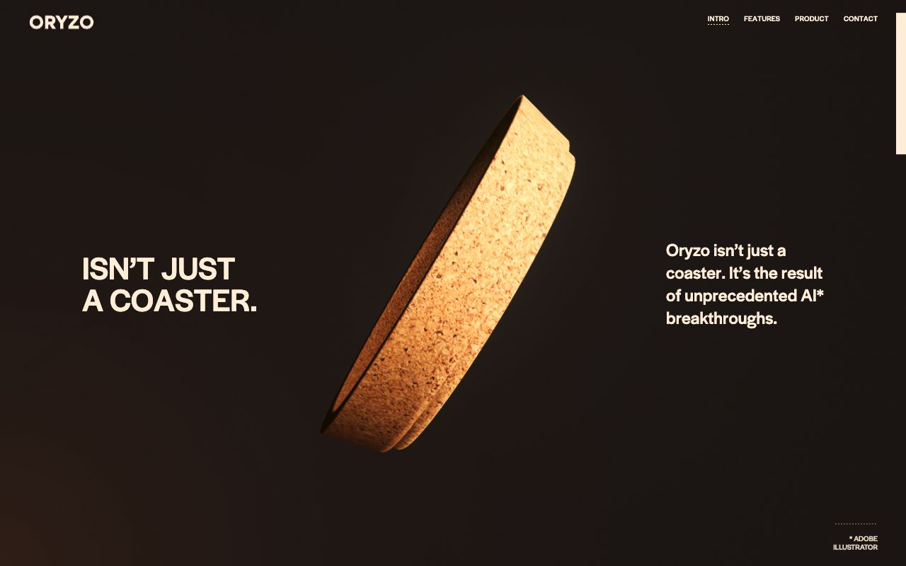</a><br/><b><a href="https://oryzo.ai">Oryzo</a></b><br/><sub>Pinned 3D cork coaster rotating mid-scroll between the headline and copy, lit like a product film.</sub></td><td width="33%" valign="top"><a href="https://zentry.com">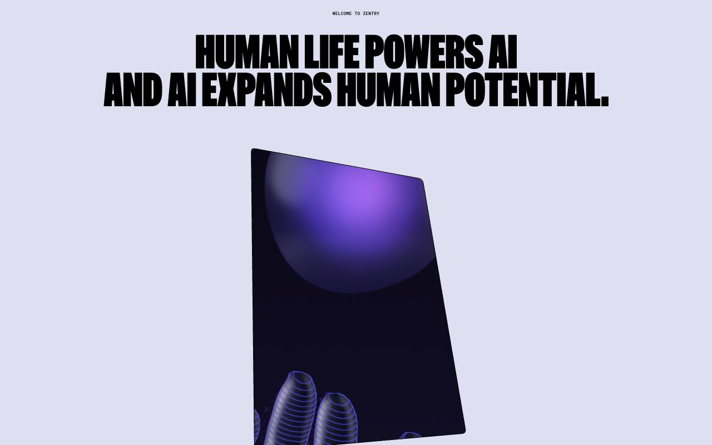</a><br/><b><a href="https://zentry.com">Zentry</a></b><br/><sub>Mid-scroll, a skewed 3D-tilted media card sits under heavy condensed type, transforming as the page moves.</sub></td></tr>
</table>

[All 17 scroll stories examples →](GALLERY.md#scroll-stories)

### 3D & WebGL

<table>
<tr><td width="33%" valign="top"><a href="https://threeui.com">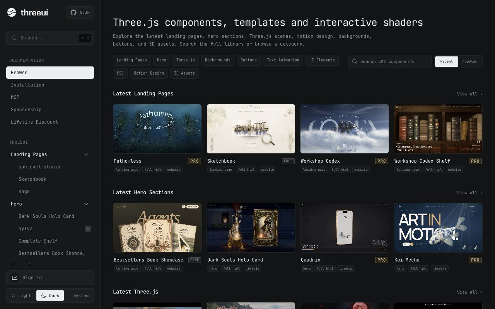</a><br/><b><a href="https://threeui.com">ThreeUI</a></b><br/><sub>A library of three.js landing pages, hero sections and shaders: browse, copy, install via CLI.</sub></td><td width="33%" valign="top"><a href="https://messenger.abeto.co">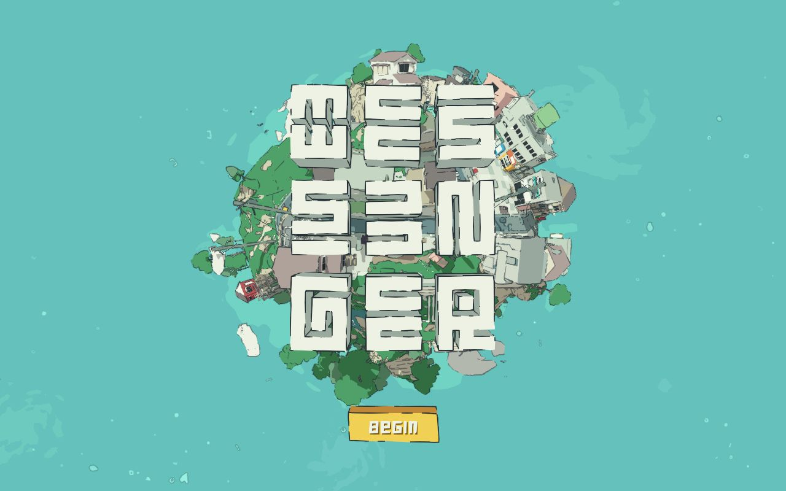</a><br/><b><a href="https://messenger.abeto.co">Messenger</a></b><br/><sub>Tiny cel-shaded 3D planet of houses and trees with blocky 3D title letters floating over it.</sub></td><td width="33%" valign="top"><a href="https://oryzo.ai">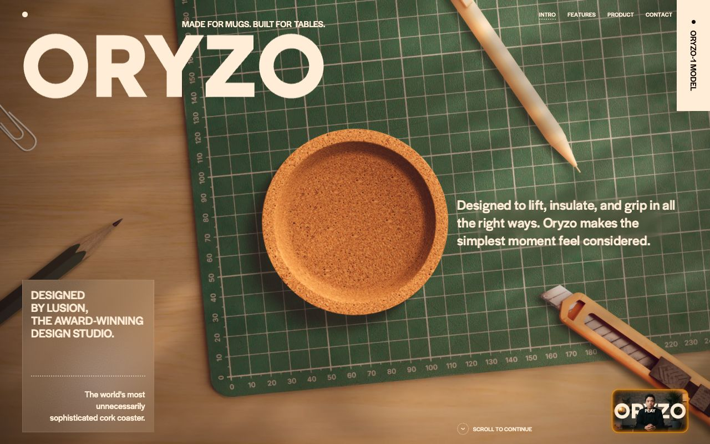</a><br/><b><a href="https://oryzo.ai">Oryzo</a></b><br/><sub>Photoreal real-time cork coaster on a cutting mat, pencils and knife lit like a product shoot.</sub></td></tr>
</table>

[All 19 3d & webgl examples →](GALLERY.md#3d-webgl)

### Shaders & gradients

<table>
<tr><td width="33%" valign="top"><a href="https://monopo.london"></a><br/><b><a href="https://monopo.london">Monopo London</a></b><br/><sub>Grainy orange and blue light ribbons sweep across black behind white headline, full-bleed shader field.</sub></td><td width="33%" valign="top"><a href="https://shadergradient.co"></a><br/><b><a href="https://shadergradient.co">ShaderGradient</a></b><br/><sub>Full-screen grainy orange-to-pink moving gradient with an elegant serif title laid over it.</sub></td><td width="33%" valign="top"><a href="https://shaders.paper.design"></a><br/><b><a href="https://shaders.paper.design">Paper Shaders</a></b><br/><sub>Grid of the same flower photo run through paper texture, fluted glass, water and halftone shaders.</sub></td></tr>
</table>

[All 14 shaders & gradients examples →](GALLERY.md#shaders-gradients)

### Components

<table>
<tr><td width="33%" valign="top"><a href="https://ui.shadcn.com">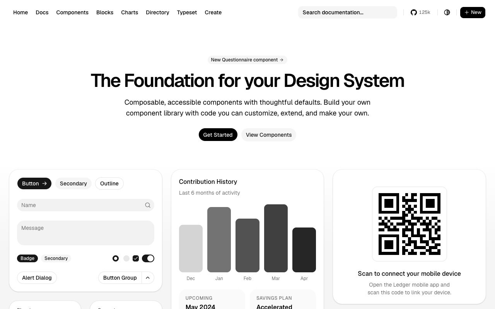</a><br/><b><a href="https://ui.shadcn.com">shadcn/ui</a></b><br/><sub>Live component wall: pill buttons, inputs, badges, checkbox and toggle row, bar-chart card, QR card.</sub></td><td width="33%" valign="top"><a href="https://www.radix-ui.com/themes">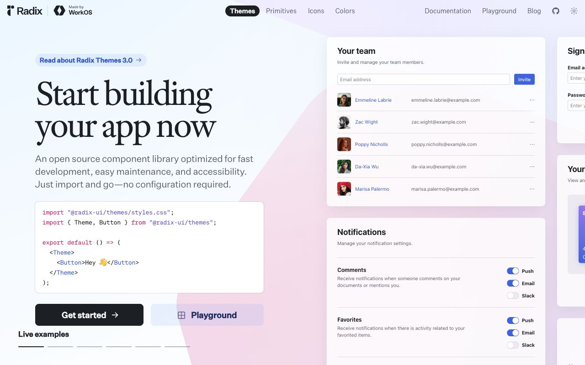</a><br/><b><a href="https://www.radix-ui.com/themes">Radix Themes</a></b><br/><sub>Serif headline beside real cards: team list with invite field, notification toggles in blue.</sub></td><td width="33%" valign="top"><a href="https://park-ui.com">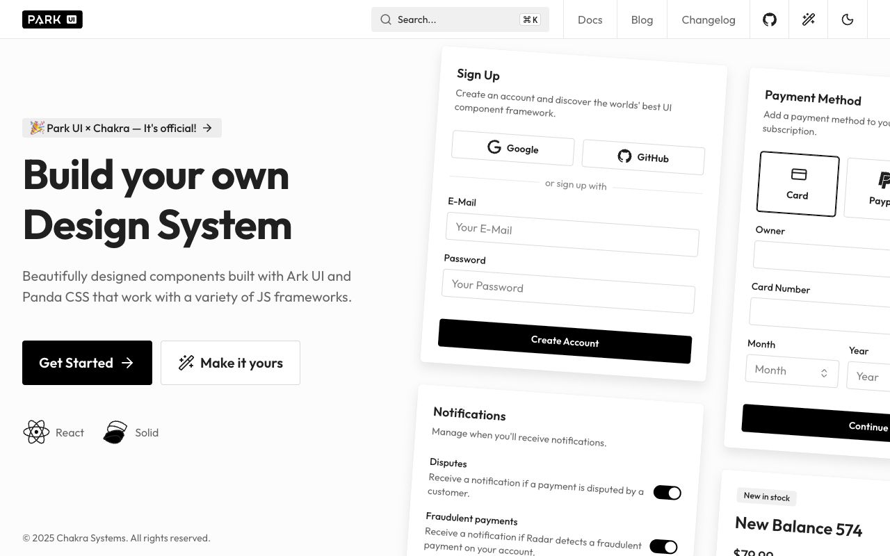</a><br/><b><a href="https://park-ui.com">Park UI</a></b><br/><sub>Tilted stack of working cards: sign-up form, payment method picker, black toggles, product tile.</sub></td></tr>
</table>

[All 19 components examples →](GALLERY.md#components)

### SaaS landing pages

<table>
<tr><td width="33%" valign="top"><a href="https://attio.com">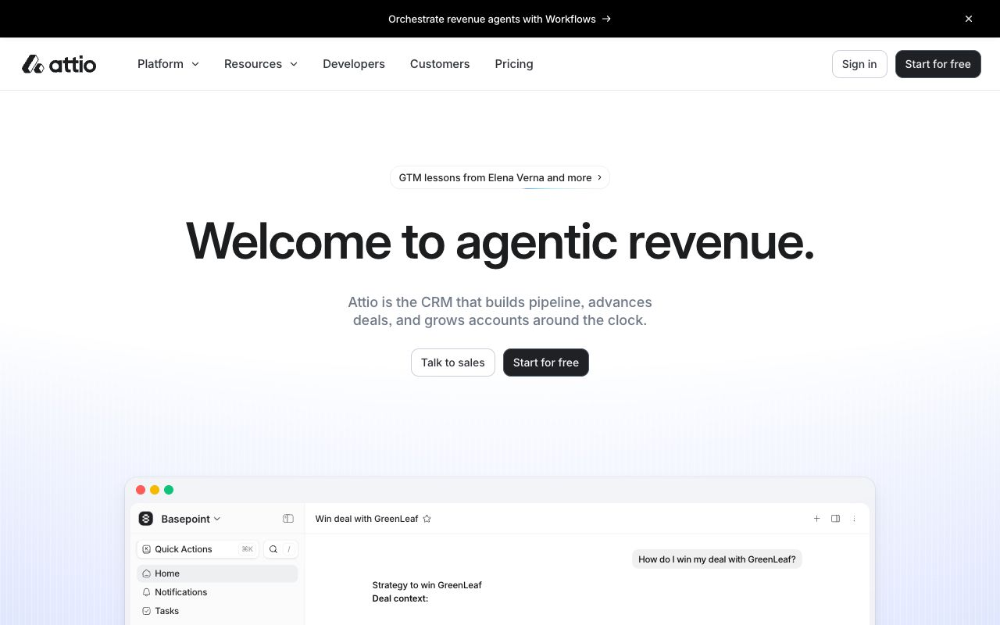</a><br/><b><a href="https://attio.com">Attio</a></b><br/><sub>Textbook SaaS hero: pill announcement, bold centred headline, two buttons, then the real app window.</sub></td><td width="33%" valign="top"><a href="https://www.clay.com">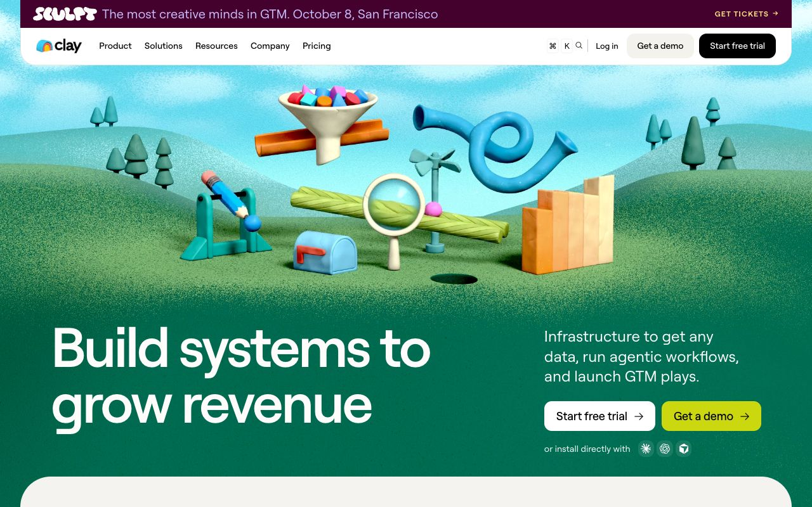</a><br/><b><a href="https://www.clay.com">Clay</a></b><br/><sub>Claymation 3D funnel, magnifier and bar chart on green hills give a data tool real personality.</sub></td><td width="33%" valign="top"><a href="https://www.craft.do">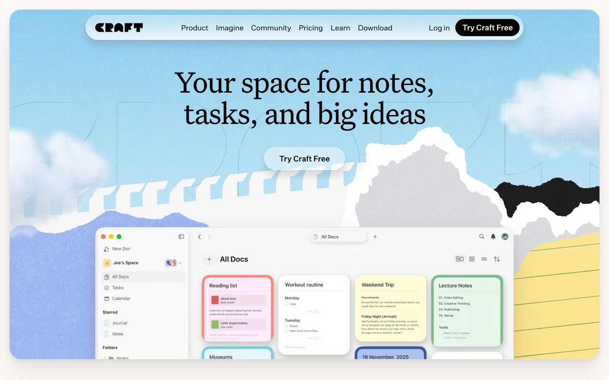</a><br/><b><a href="https://www.craft.do">Craft</a></b><br/><sub>Torn-paper collage and sky clouds frame a colourful docs grid; serif headline and glassy floating nav.</sub></td></tr>
</table>

[All 16 saas landing pages examples →](GALLERY.md#saas-landing-pages)

### E-commerce

<table>
<tr><td width="33%" valign="top"><a href="https://aarke.com">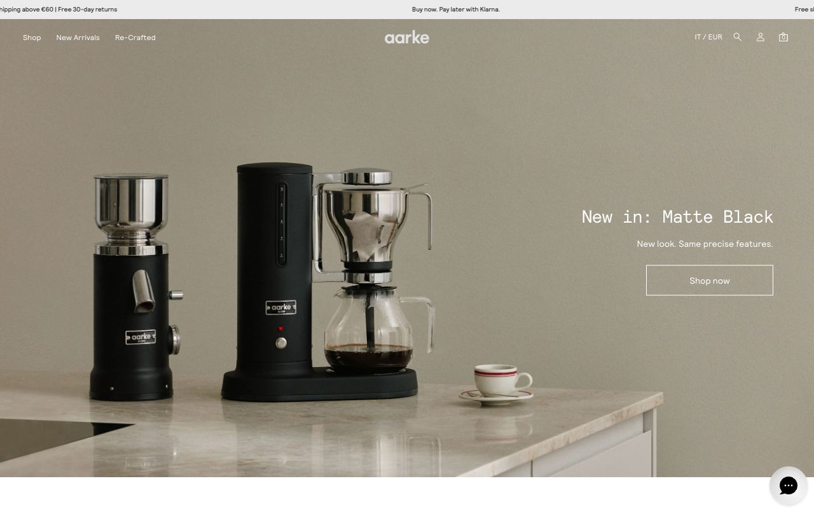</a><br/><b><a href="https://aarke.com">Aarke</a></b><br/><sub>Warm lifestyle product shot fills the hero; one mono headline and an outline 'Shop now' button.</sub></td><td width="33%" valign="top"><a href="https://www.byredo.com">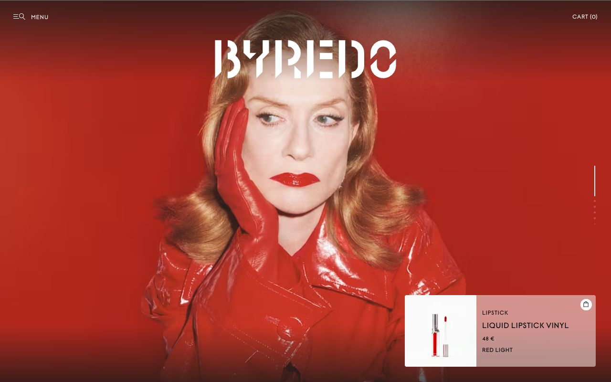</a><br/><b><a href="https://www.byredo.com">Byredo</a></b><br/><sub>Bold red campaign portrait under a stencil wordmark, with a shoppable product card pinned bottom-right.</sub></td><td width="33%" valign="top"><a href="https://framacph.com">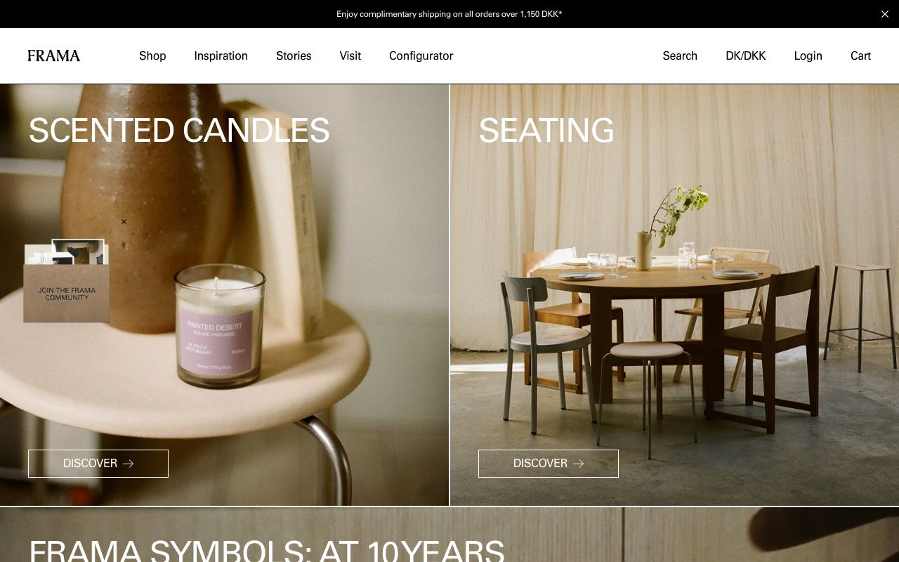</a><br/><b><a href="https://framacph.com">Frama</a></b><br/><sub>Two equal category tiles, candles and seating, each with big caps title and an outline Discover button.</sub></td></tr>
</table>

[All 17 e-commerce examples →](GALLERY.md#e-commerce)

### Portfolios

<table>
<tr><td width="33%" valign="top"><a href="https://dennissnellenberg.com">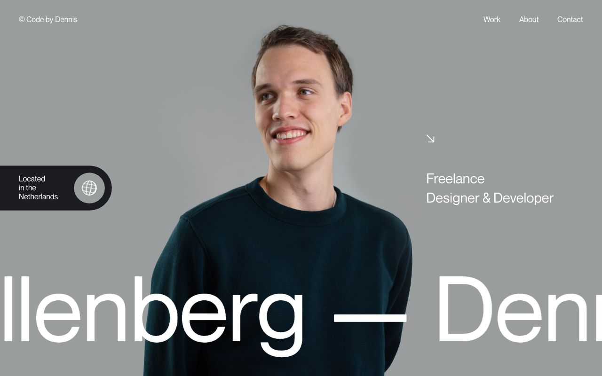</a><br/><b><a href="https://dennissnellenberg.com">Dennis Snellenberg</a></b><br/><sub>Cut-out portrait with his name as a giant marquee running behind, plus a location pill and role.</sub></td><td width="33%" valign="top"><a href="https://gilhuybrecht.com/">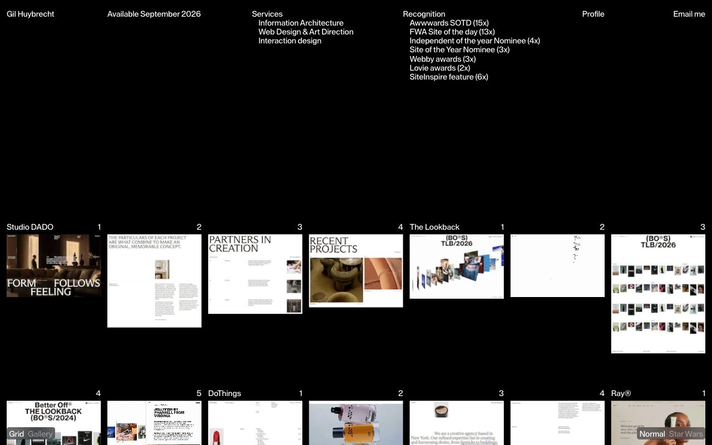</a><br/><b><a href="https://gilhuybrecht.com/">Gil Huybrecht</a></b><br/><sub>Black index page: services and awards up top, then numbered project screenshots in a strict grid.</sub></td><td width="33%" valign="top"><a href="https://www.gionatannese.com">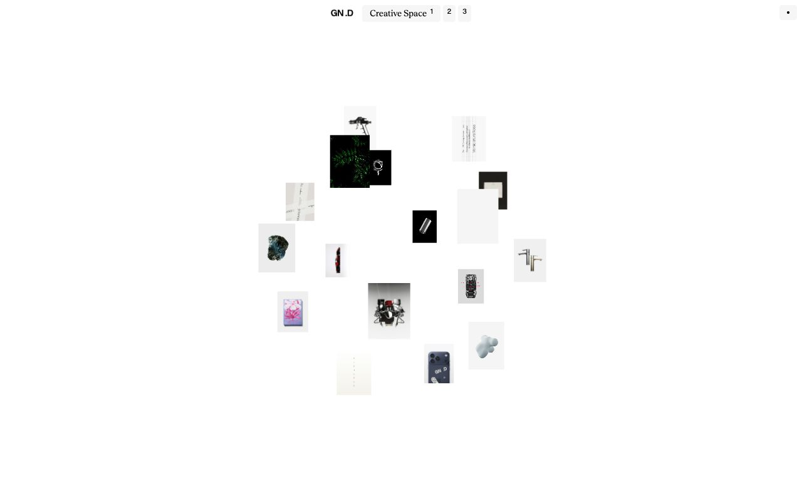</a><br/><b><a href="https://www.gionatannese.com">GN.D</a></b><br/><sub>Small work thumbnails float in a loose sphere on white space, with a tiny tabbed header.</sub></td></tr>
</table>

[All 15 portfolios examples →](GALLERY.md#portfolios)

### Editorial

<table>
<tr><td width="33%" valign="top"><a href="https://eyeondesign.aiga.org">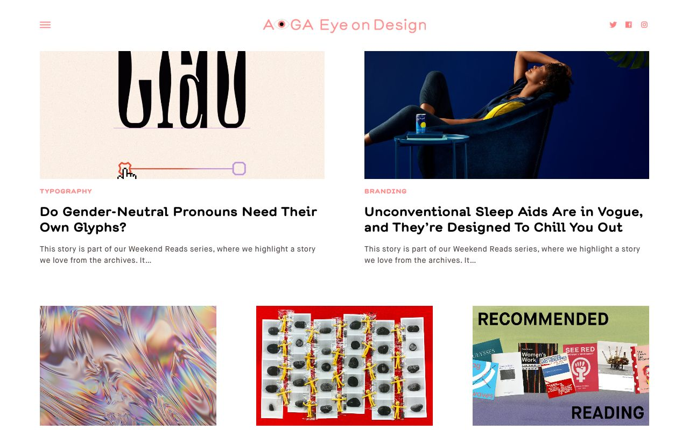</a><br/><b><a href="https://eyeondesign.aiga.org">Eye on Design</a></b><br/><sub>Salmon category labels, chunky rounded headlines and bold illustrated feature images in a two-then-three column grid.</sub></td><td width="33%" valign="top"><a href="https://restofworld.org">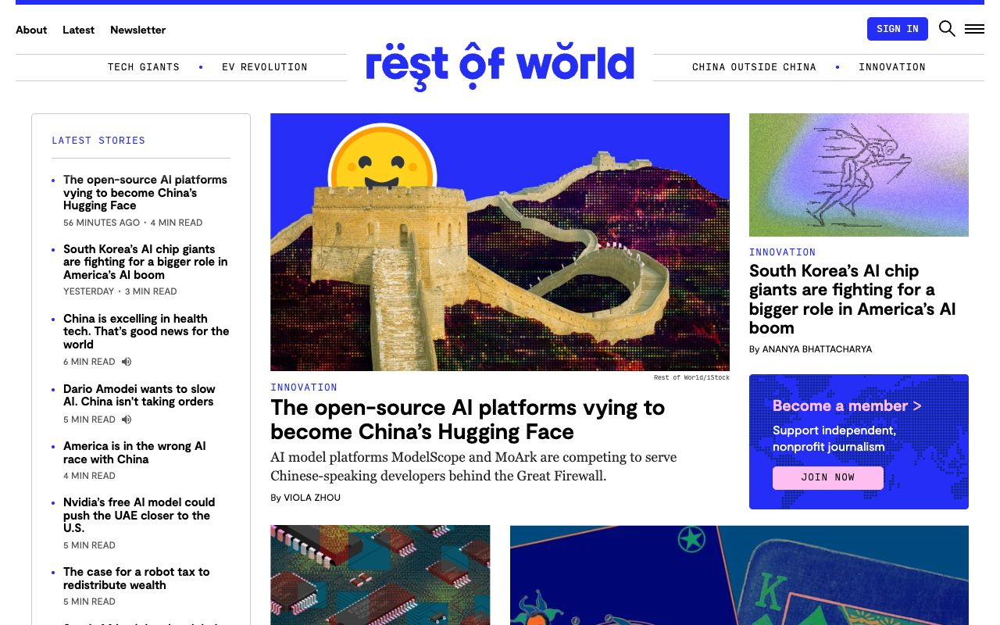</a><br/><b><a href="https://restofworld.org">Rest of World</a></b><br/><sub>Electric blue wordmark with diacritics, mono section labels, collage illustration lead story and latest-stories rail.</sub></td><td width="33%" valign="top"><a href="https://032c.com">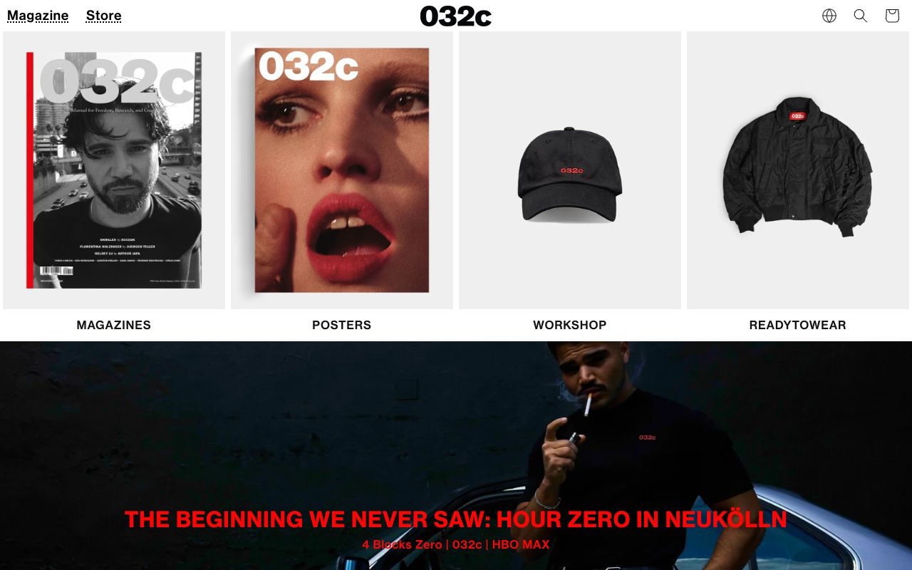</a><br/><b><a href="https://032c.com">032c</a></b><br/><sub>Heavy black logo, four-up grid of magazine covers and merch, then full-bleed photo with red headline.</sub></td></tr>
</table>

[All 8 editorial examples →](GALLERY.md#editorial)

### Specimens & design systems

<table>
<tr><td width="33%" valign="top"><a href="https://rsms.me/inter/">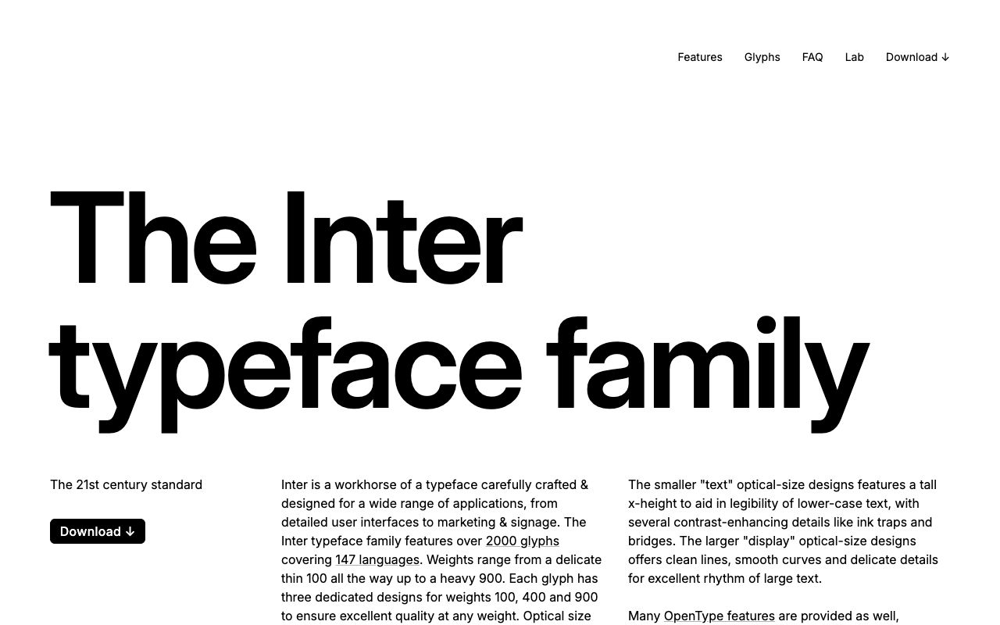</a><br/><b><a href="https://rsms.me/inter/">Inter typeface</a></b><br/><sub>Giant black 'The Inter typeface family' set in Inter on white, with three columns of specimen notes.</sub></td><td width="33%" valign="top"><a href="https://www.futurefonts.xyz">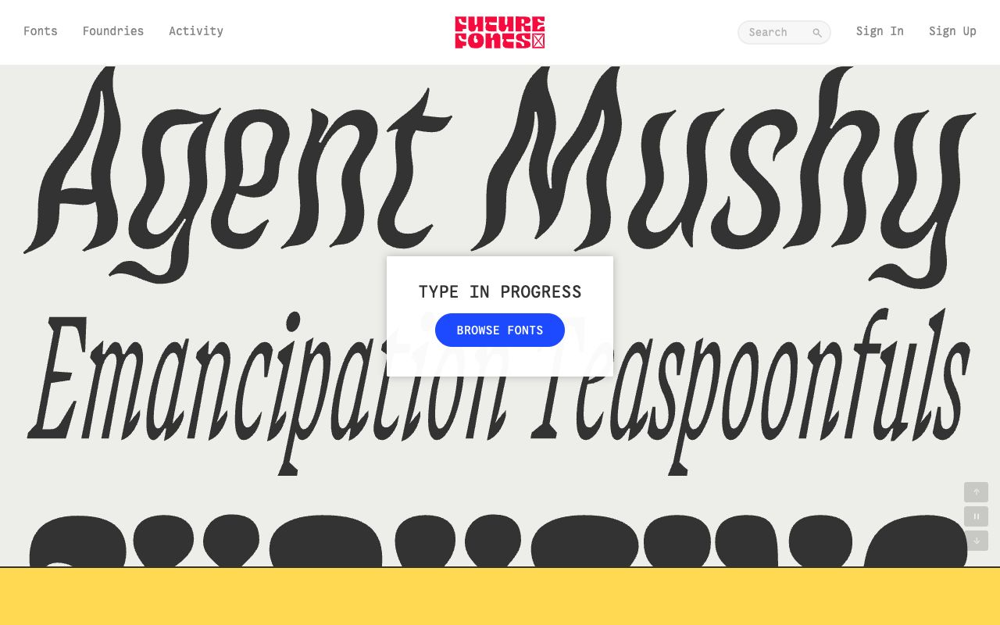</a><br/><b><a href="https://www.futurefonts.xyz">Future Fonts</a></b><br/><sub>Wall of huge in-progress display type (wavy 'Agent Mushy') with a small centred 'Type in progress' card.</sub></td><td width="33%" valign="top"><a href="https://abcdinamo.com">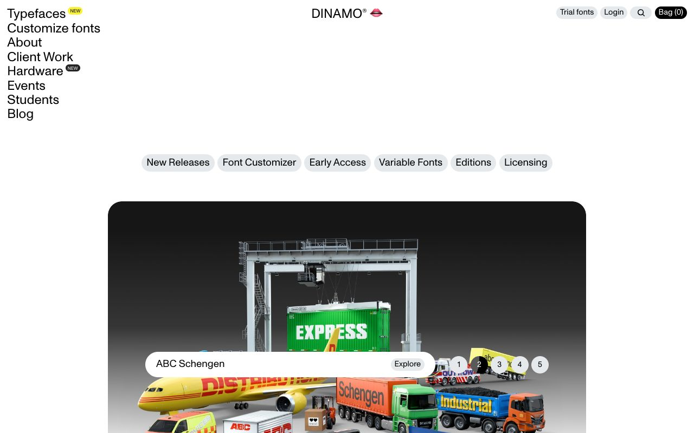</a><br/><b><a href="https://abcdinamo.com">Dinamo</a></b><br/><sub>Plain text-list nav and pill filters above a 3D logistics scene showing off the ABC Schengen typeface.</sub></td></tr>
</table>

[All 8 specimens & design systems examples →](GALLERY.md#specimens-design-systems)

### AI products

<table>
<tr><td width="33%" valign="top"><a href="https://cursor.com">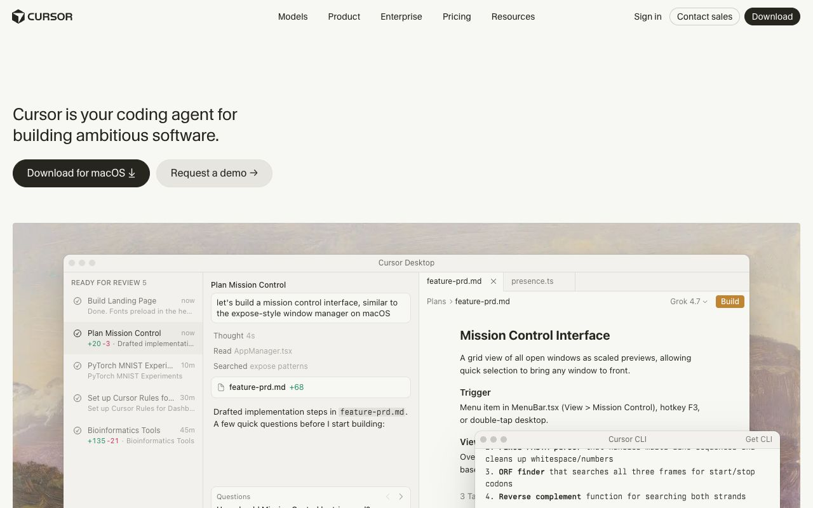</a><br/><b><a href="https://cursor.com">Cursor</a></b><br/><sub>Quiet warm-grey hero lets a real agent session window, laid over painted landscape art, sell the product.</sub></td><td width="33%" valign="top"><a href="https://www.diabrowser.com">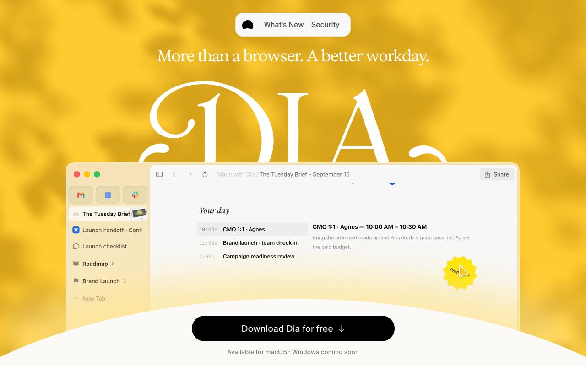</a><br/><b><a href="https://www.diabrowser.com">Dia</a></b><br/><sub>Huge ornate serif wordmark on sunny yellow blur; the browser window shows an AI-written daily brief.</sub></td><td width="33%" valign="top"><a href="https://elevenlabs.io">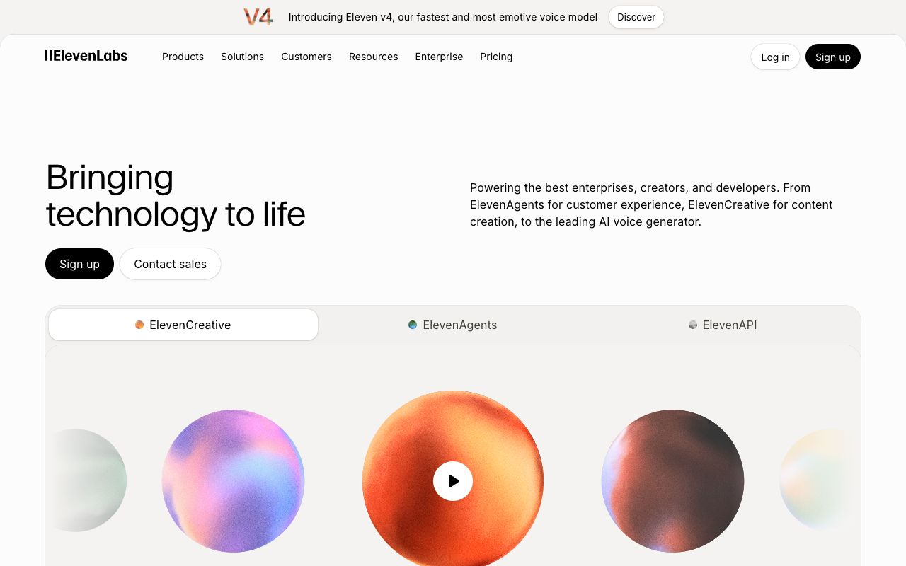</a><br/><b><a href="https://elevenlabs.io">ElevenLabs</a></b><br/><sub>Grainy gradient orbs stand in for voices; tabbed product switcher keeps an AI platform calm and clear.</sub></td></tr>
</table>

[All 17 ai products examples →](GALLERY.md#ai-products)

<!-- gallery:end -->

## [04] /tools: the toolkit

Every library, MCP server and agent skill the guide uses, with what it's for. Searchable, with
screenshots and "make with it" links, on [/tools](https://frontenddesignbasics.vercel.app/tools).

<!-- toolkit:begin -->
<!-- generated by `pnpm gen` from toolkit/toolkit.json. Edit the JSON, not this table. -->

**Motion & scroll**

| Tool | What | Status |
|---|---|---|
| [GSAP](https://gsap.com) | The animation engine. Timelines, ScrollTrigger, SplitText, MorphSVG, Flip, all plugins now free. | `live` |
| [Lenis](https://lenis.darkroom.engineering) | Smooth scroll that keeps native scroll semantics. Pairs with GSAP ScrollTrigger. | `library` |
| [Motion (motion.dev)](https://motion.dev) | React/JS animation with springs, layout animation and gestures. Formerly Framer Motion. | `live` |
| [Scroll World](https://github.com/oso95/scroll-world) | Agent skill that turns a brand into a scrollable 3D-world landing page. | `live` |
| [ScrollCraft](https://github.com/nateherkai/scroll-craft) | Skill for premium scroll-driven landing pages: scrubbed video, pinned sections, one signature move. | `live` |
| [View Transition API](https://developer.mozilla.org/en-US/docs/Web/API/View_Transition_API) | The browser animates between two DOM states or two pages: crossfades and shared-element morphs with CSS. | `library` |
| [Anime.js v4](https://animejs.com) | A small animation engine with timelines, springs, SVG morphing, draggables and scroll-linked animation. | `library` |
| [dotLottie](https://lottiefiles.com) | Plays After Effects and Lottie Creator animations on the web, small and crisp at any size. | `library` |
| [Taxi.js](https://taxi.js.org) | Page transitions for multi-page sites: fetches the next page and lets you animate out and in. | `library` |

**3D & WebGL**

| Tool | What | Status |
|---|---|---|
| [three.js](https://threejs.org) | The 3D library of the web. R3F wraps it for React. | `live` |
| [img2threejs](https://github.com/img2threejs/img2threejs) | Skill that rebuilds an object from a reference image as a procedural, animation-ready three.js model. | `live` |
| [Threlte](https://threlte.xyz) | three.js for Svelte, declarative and typed. | `library` |
| [ThreeUI](https://threeui.com) | Library of three.js landing pages, hero sections, scenes, backgrounds and buttons by Design+Code. Community edition is MIT; Pro adds source, CLI and MCP. | `dormant` |
| [Spline](https://spline.design) | Browser/desktop 3D design tool with exportable interactive scenes. | `live` |
| [PlayCanvas](https://playcanvas.com) | WebGL/WebGPU game engine with a collaborative editor. | `on-demand` |
| [Vectary](https://www.vectary.com) | No-code 3D and AR design in the browser. (Logged from 'Vectory.com': vectory.com is a sensor company.) | `tool` |
| [postprocessing](https://github.com/pmndrs/postprocessing) | Full-screen effects after a three.js scene renders: bloom, pixelation, chromatic split, depth of field. | `library` |
| [Poly Haven](https://polyhaven.com) | Free HDRIs, textures and 3D models to light and dress a three.js scene. | `library` |

**Shaders & gradients**

| Tool | What | Status |
|---|---|---|
| [OGL](https://github.com/oframe/ogl) | Tiny WebGL library. This site's hero shader runs on it. | `library` |
| [ShaderGradient](https://shadergradient.co) | Moving 3D gradients for React, Framer and Figma, tuned in a visual editor. | `library` |
| [GetLayers](https://www.getlayers.ai) | Library of prompts plus source for templates, 3D/WebGL scenes, motion sections and animated backgrounds. | `dormant` |
| [Unicorn Studio](https://www.unicorn.studio) | A visual editor for WebGL scenes: layered shaders, media, 3D and mouse or scroll interaction, published as an embed. | `tool` |
| [Paper Shaders](https://shaders.paper.design) | Ready-made, tunable shader components for React: mesh gradients, grain, dithering, liquid metal. | `library` |

**Component libraries**

| Tool | What | Status |
|---|---|---|
| [React Bits](https://reactbits.dev) | Animated React components with live prop controls, in JS/TS × CSS/Tailwind variants. | `live` |
| [Magic UI](https://magicui.design) | Motion-first shadcn-style components for landing pages. | `live` |
| [Cult UI](https://www.cult-ui.com) | shadcn-compatible animated components with character. | `live` |
| [21st.dev](https://21st.dev) | Community component catalogue plus AI UI generation. | `needs-key` |
| [Bklit UI](https://ui.bklit.com) | UI and chart components shipped as a shadcn registry. | `live` |
| [shadcn/ui](https://ui.shadcn.com) | Copy-in component system and the registry protocol most libraries above ship through. | `live` |
| [Motion Primitives](https://motion-primitives.com) | Copy-paste animated React components built on Motion: text effects, morphing dialogs, carousels. | `library` |
| [Lucide](https://lucide.dev) | A clean, consistent open icon set with a React package; the shadcn default. | `library` |

**Reference & research**

| Tool | What | Status |
|---|---|---|
| [Refero](https://refero.design) | Searchable library of real app and web screens, flows and styles. | `needs-key` |
| [Jitter](https://jitter.video) | Web motion-design tool for animating UI and exporting video/Lottie. | `tool` |
| [Paper](https://paper.design) | Design canvas with a local MCP. Bruno uses it to scope ideas. | `on-demand` |
| [Tweakpane](https://tweakpane.github.io/docs/) | A small panel of sliders and pickers for tuning values live while you build. | `library` |
| [OKLCH Color Picker](https://oklch.com) | A colour picker in OKLCH, the colour space where equal steps look equal. | `tool` |
| [Fontshare](https://www.fontshare.com) | Free, quality typefaces from Indian Type Foundry, with web embeds. | `tool` |
| [easings.net + cubic-bezier.com](https://easings.net) | Reference charts of every standard ease, and an editor for your own cubic-bezier curves. | `tool` |

**Claude skills (taste & rules)**

| Tool | What | Status |
|---|---|---|
| [frontend-design (official)](https://github.com/anthropics/skills) | Anthropic's skill for distinctive, non-templated visual direction. | `live` |
| [impeccable](https://github.com/pbakaus/impeccable) | Design language and audit skill: critique, polish, harden, animate, colourise. | `live` |
| [taste-skill](https://github.com/Leonxlnx/taste-skill) | design-taste-frontend, high-end-visual-design and redesign-existing-projects: anti-generic rules. | `live` |
| [UI/UX Pro Max](https://github.com/nextlevelbuilder/ui-ux-pro-max-skill) | Searchable database of 79 styles, 192 palettes and 74 font pairings. | `live` |
| [Web Interface Guidelines](https://vercel.com/design/guidelines) | Rauno/Vercel's MUST/SHOULD interface rules as a review skill, plus React best practices, composition patterns and view transitions. | `live` |
| [Anthropic example skills](https://github.com/anthropics/skills) | canvas-design, theme-factory, algorithmic-art, web-artifacts-builder, brand-guidelines, webapp-testing. | `live` |
| [frontend-design-basics (Bruno's)](https://github.com/br9704/frontenddesignbasics) | Reads this toolkit and the Principles chapter, then asks which tools and principles fit the brief. | `live` |

**Agent infrastructure**

| Tool | What | Status |
|---|---|---|
| [Context7](https://context7.com) | Current, versioned library docs on demand (GSAP, three.js, Lenis, Next.js…). | `live` |
| [Playwright MCP](https://github.com/microsoft/playwright-mcp) | Drive a real browser: screenshots, frames, interaction. | `live` |
| [Chrome DevTools MCP](https://github.com/ChromeDevTools/chrome-devtools-mcp) | Performance traces, console, network from a live Chrome. | `live` |

**Voice & messaging**

| Tool | What | Status |
|---|---|---|
| [VoiceStudio](https://github.com/debpalash/VoiceStudio) | Local, open-source voice cloning, TTS, dubbing and transcription. | `on-demand` |
| [OpenWA](https://github.com/rmyndharis/OpenWA) | Self-hosted WhatsApp API gateway with a built-in MCP. | `on-demand` |

**AI image & video**

| Tool | What | Status |
|---|---|---|
| [Higgsfield](https://higgsfield.ai) | One MCP for many image, video, audio and 3D models: stills, image-to-video, motion transfer, upscaling, background removal, image-to-GLB. | `needs-key` |

<!-- toolkit:end -->

## [05] Use it with your agent

The guide ships as an agent skill. At the start of every project it reads the toolkit and the rules,
proposes what fits your brief, and asks you to choose before anything is designed.

```bash
npx skills add br9704/frontenddesignbasics
```

The whole guide is also served as [`/llms.txt`](https://frontenddesignbasics.vercel.app/llms.txt), and
[`AGENTS.md`](AGENTS.md) has the rules for agents working on this repo.

## [06] Run it locally

```bash
git clone https://github.com/br9704/frontenddesignbasics && cd frontenddesignbasics
pnpm install
pnpm dev              # http://localhost:3000
pnpm build            # production build
pnpm gen              # regenerate README sections, GALLERY.md and AGENTS.md from the data
pnpm posters          # re-render the 30 experience posters (needs the site on :3000)
pnpm journey:gif      # re-record the README journey GIF (needs the site on :3000)
pnpm verify           # motion, reduced-motion and 390px checks (needs the site on :3000)
pnpm export:md        # export every docs page to GitHub markdown in guide/
```

The design contract is in [`DESIGN.md`](DESIGN.md): tokens, type, ASCII, 3D and motion rules.

## Contributing

Suggest a site for the gallery or a tool for the toolkit by opening an issue. Gallery entries credit
and link the owner and never copy their code or assets.

## License

Code is [MIT](LICENSE). Website screenshots belong to their owners, are shown for commentary with
credit and a link, and are removed on request. Pixel fonts: see
[`public/fonts/LICENSES.md`](public/fonts/LICENSES.md).

Made by [Bruno Jaamaa](https://brunojaamaa.dev).
