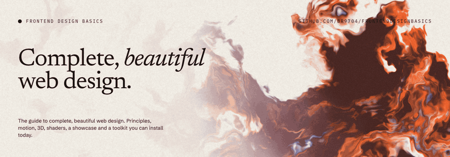
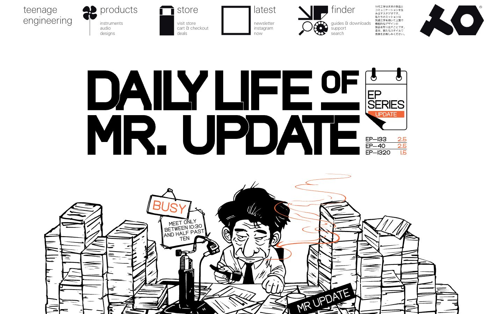
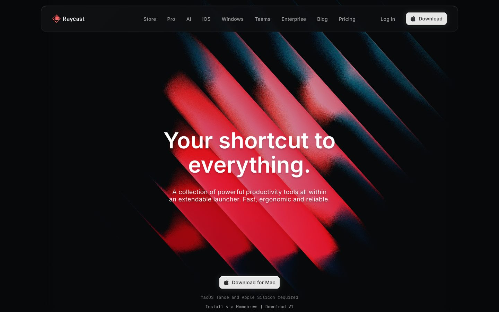
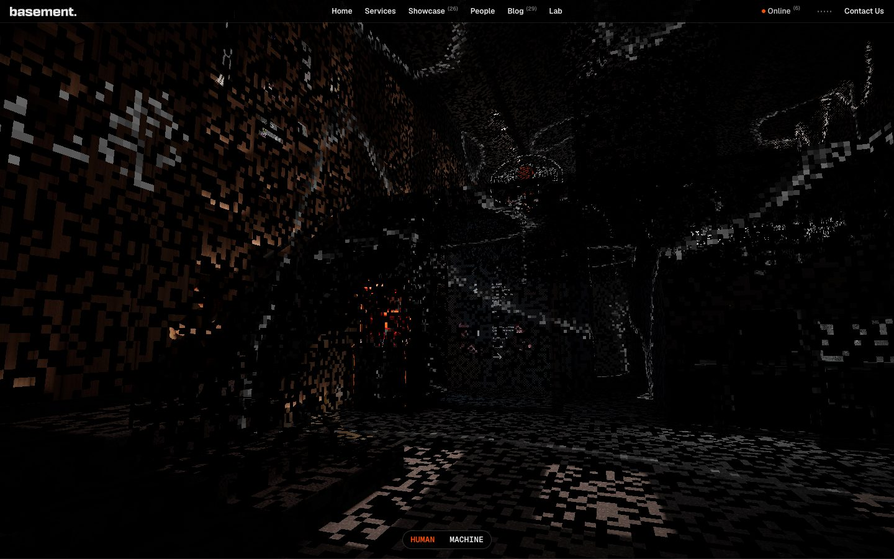

<p align="center">
  
</p>

# Frontend Design Basics

**The guide to complete, beautiful web design.** Principles, motion, 3D, shaders, AI assets, a
showcase of standout sites, and a toolkit of libraries, MCP servers and agent skills you can install today.

Every page follows one template: **a live demo → a diagram → real examples → the code → how to install it → why it works.**

<table>
  <tr>
    <td width="33%"></td>
    <td width="33%"></td>
    <td width="33%"></td>
  </tr>
  <tr>
    <td><sub>Lusion: WebGL as craft</sub></td>
    <td><sub>Igloo Inc.: scroll as a camera</sub></td>
    <td><sub>teenage engineering: type as image</sub></td>
  </tr>
  <tr>
    <td width="33%"></td>
    <td width="33%"></td>
    <td width="33%"></td>
  </tr>
  <tr>
    <td><sub>Raycast: grain on gradients</sub></td>
    <td><sub>basement.studio: dithered 3D</sub></td>
    <td><sub>BR95: the first case study</sub></td>
  </tr>
</table>

## Gallery

Every chapter of the guide has an "In the wild" row of real websites. Here are three from each section.
**[See all of them in GALLERY.md →](GALLERY.md)**

<!-- gallery:begin -->
<!-- generated by `pnpm gen` from data/examples.json -->

### Typography

<table>
<tr><td width="33%" valign="top"><a href="https://klim.co.nz"></a><br/><b><a href="https://klim.co.nz">Klim Type Foundry</a></b><br/><sub>One huge inflated black 'A' fills an orange screen; a single letterform is the whole hero.</sub></td><td width="33%" valign="top"><a href="https://www.instrument.com"></a><br/><b><a href="https://www.instrument.com">Instrument</a></b><br/><sub>Ultra-heavy wordmark set edge to edge as the masthead, with small condensed caps in pill nav.</sub></td><td width="33%" valign="top"><a href="https://commercialtype.com"></a><br/><b><a href="https://commercialtype.com">Commercial Type</a></b><br/><sub>Full-width bands each set one typeface huge: hairline New Doric, fat Orlando serif, Arabic.</sub></td></tr>
</table>

[All 24 typography examples →](GALLERY.md#typography)

### Colour

<table>
<tr><td width="33%" valign="top"><a href="https://gumroad.com"></a><br/><b><a href="https://gumroad.com">Gumroad</a></b><br/><sub>Off-white page with black type and one loud pink on the floating outlined coins.</sub></td><td width="33%" valign="top"><a href="https://arc.net"></a><br/><b><a href="https://arc.net">Arc</a></b><br/><sub>Grainy electric-blue bands with wavy edges frame a soft pastel-and-white middle.</sub></td><td width="33%" valign="top"><a href="https://mschf.com"></a><br/><b><a href="https://mschf.com">MSCHF</a></b><br/><sub>Black and grey mono list where only three lines glow yellow, blue and red.</sub></td></tr>
</table>

[All 17 colour examples →](GALLERY.md#colour)

### Dark mode

<table>
<tr><td width="33%" valign="top"><a href="https://betterstack.com"></a><br/><b><a href="https://betterstack.com">Better Stack</a></b><br/><sub>Navy-black hero, tilted dark product screenshot fading into the background, one violet call to action.</sub></td><td width="33%" valign="top"><a href="https://huly.io"></a><br/><b><a href="https://huly.io">Huly</a></b><br/><sub>A beam of blue-white light splits the black hero and lights the product window below.</sub></td><td width="33%" valign="top"><a href="https://modal.com"></a><br/><b><a href="https://modal.com">Modal</a></b><br/><sub>Pure black with neon green accents: glowing cube, green headline words, greyed logo wall.</sub></td></tr>
</table>

[All 17 dark mode examples →](GALLERY.md#dark-mode)

### Layout & space

<table>
<tr><td width="33%" valign="top"><a href="https://www.grillitype.com"></a><br/><b><a href="https://www.grillitype.com">Grilli Type</a></b><br/><sub>A narrow label column on the left and a wide content column; typeface names line up on a strict grid.</sub></td><td width="33%" valign="top"><a href="https://www.14islands.com"></a><br/><b><a href="https://www.14islands.com">14islands</a></b><br/><sub>The headline is staggered across columns, with a small label offset to the right and wide margins all round.</sub></td><td width="33%" valign="top"><a href="https://sharptype.co"></a><br/><b><a href="https://sharptype.co">Sharp Type</a></b><br/><sub>Asymmetric: the logo sits in a side column, the storefront image is pushed right, with open white space around it.</sub></td></tr>
</table>

[All 12 layout & space examples →](GALLERY.md#layout-space)

### Hierarchy

<table>
<tr><td width="33%" valign="top"><a href="https://www.wearecollins.com"></a><br/><b><a href="https://www.wearecollins.com">Collins</a></b><br/><sub>One large serif line in empty space, then a small row of award laurels. The reading order is obvious.</sub></td><td width="33%" valign="top"><a href="https://www.instrument.com"></a><br/><b><a href="https://www.instrument.com">Instrument</a></b><br/><sub>A full-width black INSTRUMENT wordmark dominates, and the featured case study sits clearly below it.</sub></td><td width="33%" valign="top"><a href="https://commercialtype.com"></a><br/><b><a href="https://commercialtype.com">Commercial Type</a></b><br/><sub>Each colour band has one huge typeface name first, with a tiny style count as the second read.</sub></td></tr>
</table>

[All 13 hierarchy examples →](GALLERY.md#hierarchy)

### Heroes

<table>
<tr><td width="33%" valign="top"><a href="https://www.wearecollins.com"></a><br/><b><a href="https://www.wearecollins.com">Collins</a></b><br/><sub>One serif line, 'Rewrite your worth.', centred in vast off-white space above small award laurels.</sub></td><td width="33%" valign="top"><a href="https://www.instrument.com"></a><br/><b><a href="https://www.instrument.com">Instrument</a></b><br/><sub>Edge-to-edge black ultra-heavy wordmark over a rounded case-study video panel; pill nav buttons.</sub></td><td width="33%" valign="top"><a href="https://14islands.com"></a><br/><b><a href="https://14islands.com">14islands</a></b><br/><sub>Huge staggered 'Design & Technology' type on grey, grey ampersand, tiny caps tagline, nothing else.</sub></td></tr>
</table>

[All 15 heroes examples →](GALLERY.md#heroes)

### Bento grids

<table>
<tr><td width="33%" valign="top"><a href="https://www.apple.com/macbook-pro/"></a><br/><b><a href="https://www.apple.com/macbook-pro/">MacBook Pro</a></b><br/><sub>Dark rounded tiles of mixed sizes: photo tiles with big claims beside icon-only tiles for ports, gaming.</sub></td><td width="33%" valign="top"><a href="https://supabase.com"></a><br/><b><a href="https://supabase.com">Supabase</a></b><br/><sub>One wide Postgres tile plus seven product tiles, each with a small line-art illustration of its feature.</sub></td><td width="33%" valign="top"><a href="https://clerk.com"></a><br/><b><a href="https://clerk.com">Clerk</a></b><br/><sub>Dark bento of auth features: tall session-management tile, OTP boxes, SSO node graph, magic-link card.</sub></td></tr>
</table>

[All 13 bento grids examples →](GALLERY.md#bento-grids)

### Footers

<table>
<tr><td width="33%" valign="top"><a href="https://www.14islands.com"></a><br/><b><a href="https://www.14islands.com">14islands</a></b><br/><sub>The footer is a closing invitation: a big 'Let's make something great' line, a huge email address, and a minimal social row.</sub></td><td width="33%" valign="top"><a href="https://www.wearecollins.com"></a><br/><b><a href="https://www.wearecollins.com">Collins</a></b><br/><sub>A dark footer with big serif section links, a pill 'Work with us' button, a newsletter field and socials.</sub></td><td width="33%" valign="top"><a href="https://www.instrument.com"></a><br/><b><a href="https://www.instrument.com">Instrument</a></b><br/><sub>A complete footer: newsletter pitch, three labelled link columns and a legal bar, all on a strict grid.</sub></td></tr>
</table>

[All 18 footers examples →](GALLERY.md#footers)

### Motion

<table>
<tr><td width="33%" valign="top"><a href="https://www.hellomonday.com"></a><br/><b><a href="https://www.hellomonday.com">Hello Monday</a></b><br/><sub>Hand-drawn animated couple above a rotating serif word, with a curved black menu edge peeking in.</sub></td><td width="33%" valign="top"><a href="https://aristidebenoist.com"></a><br/><b><a href="https://aristidebenoist.com">Aristide Benoist</a></b><br/><sub>Caught mid-intro: thin vertical photo strips sliding into place under a tick-mark progress bar.</sub></td><td width="33%" valign="top"><a href="https://activetheory.net"></a><br/><b><a href="https://activetheory.net">Active Theory</a></b><br/><sub>Real-time WebGL scene: glossy chrome ribbon logo floating among drifting golden particles and a jellyfish.</sub></td></tr>
</table>

[All 14 motion examples →](GALLERY.md#motion)

### Scroll stories

<table>
<tr><td width="33%" valign="top"><a href="https://jeskojets.com"></a><br/><b><a href="https://jeskojets.com">Jesko Jets</a></b><br/><sub>Scroll-scrubbed paragraph: words fill from faded to solid white as you scroll over clouds.</sub></td><td width="33%" valign="top"><a href="https://oryzo.ai"></a><br/><b><a href="https://oryzo.ai">Oryzo</a></b><br/><sub>Pinned 3D cork coaster rotating mid-scroll between the headline and copy, lit like a product film.</sub></td><td width="33%" valign="top"><a href="https://zentry.com"></a><br/><b><a href="https://zentry.com">Zentry</a></b><br/><sub>Mid-scroll, a skewed 3D-tilted media card sits under heavy condensed type, transforming as the page moves.</sub></td></tr>
</table>

[All 17 scroll stories examples →](GALLERY.md#scroll-stories)

### 3D & WebGL

<table>
<tr><td width="33%" valign="top"><a href="https://threeui.com"></a><br/><b><a href="https://threeui.com">ThreeUI</a></b><br/><sub>A library of three.js landing pages, hero sections and shaders: browse, copy, install via CLI.</sub></td><td width="33%" valign="top"><a href="https://messenger.abeto.co"></a><br/><b><a href="https://messenger.abeto.co">Messenger</a></b><br/><sub>Tiny cel-shaded 3D planet of houses and trees with blocky 3D title letters floating over it.</sub></td><td width="33%" valign="top"><a href="https://oryzo.ai"></a><br/><b><a href="https://oryzo.ai">Oryzo</a></b><br/><sub>Photoreal real-time cork coaster on a cutting mat, pencils and knife lit like a product shoot.</sub></td></tr>
</table>

[All 19 3d & webgl examples →](GALLERY.md#3d-webgl)

### Shaders & gradients

<table>
<tr><td width="33%" valign="top"><a href="https://monopo.london"></a><br/><b><a href="https://monopo.london">Monopo London</a></b><br/><sub>Grainy orange and blue light ribbons sweep across black behind white headline, full-bleed shader field.</sub></td><td width="33%" valign="top"><a href="https://shadergradient.co"></a><br/><b><a href="https://shadergradient.co">ShaderGradient</a></b><br/><sub>Full-screen grainy orange-to-pink moving gradient with an elegant serif title laid over it.</sub></td><td width="33%" valign="top"><a href="https://shaders.paper.design"></a><br/><b><a href="https://shaders.paper.design">Paper Shaders</a></b><br/><sub>Grid of the same flower photo run through paper texture, fluted glass, water and halftone shaders.</sub></td></tr>
</table>

[All 14 shaders & gradients examples →](GALLERY.md#shaders-gradients)

### Components

<table>
<tr><td width="33%" valign="top"><a href="https://ui.shadcn.com"></a><br/><b><a href="https://ui.shadcn.com">shadcn/ui</a></b><br/><sub>Live component wall: pill buttons, inputs, badges, checkbox and toggle row, bar-chart card, QR card.</sub></td><td width="33%" valign="top"><a href="https://www.radix-ui.com/themes"></a><br/><b><a href="https://www.radix-ui.com/themes">Radix Themes</a></b><br/><sub>Serif headline beside real cards: team list with invite field, notification toggles in blue.</sub></td><td width="33%" valign="top"><a href="https://park-ui.com"></a><br/><b><a href="https://park-ui.com">Park UI</a></b><br/><sub>Tilted stack of working cards: sign-up form, payment method picker, black toggles, product tile.</sub></td></tr>
</table>

[All 19 components examples →](GALLERY.md#components)

### SaaS landing pages

<table>
<tr><td width="33%" valign="top"><a href="https://attio.com"></a><br/><b><a href="https://attio.com">Attio</a></b><br/><sub>Textbook SaaS hero: pill announcement, bold centred headline, two buttons, then the real app window.</sub></td><td width="33%" valign="top"><a href="https://www.clay.com"></a><br/><b><a href="https://www.clay.com">Clay</a></b><br/><sub>Claymation 3D funnel, magnifier and bar chart on green hills give a data tool real personality.</sub></td><td width="33%" valign="top"><a href="https://www.craft.do"></a><br/><b><a href="https://www.craft.do">Craft</a></b><br/><sub>Torn-paper collage and sky clouds frame a colourful docs grid; serif headline and glassy floating nav.</sub></td></tr>
</table>

[All 16 saas landing pages examples →](GALLERY.md#saas-landing-pages)

### E-commerce

<table>
<tr><td width="33%" valign="top"><a href="https://aarke.com"></a><br/><b><a href="https://aarke.com">Aarke</a></b><br/><sub>Warm lifestyle product shot fills the hero; one mono headline and an outline 'Shop now' button.</sub></td><td width="33%" valign="top"><a href="https://www.byredo.com"></a><br/><b><a href="https://www.byredo.com">Byredo</a></b><br/><sub>Bold red campaign portrait under a stencil wordmark, with a shoppable product card pinned bottom-right.</sub></td><td width="33%" valign="top"><a href="https://framacph.com"></a><br/><b><a href="https://framacph.com">Frama</a></b><br/><sub>Two equal category tiles, candles and seating, each with big caps title and an outline Discover button.</sub></td></tr>
</table>

[All 17 e-commerce examples →](GALLERY.md#e-commerce)

### Portfolios

<table>
<tr><td width="33%" valign="top"><a href="https://dennissnellenberg.com"></a><br/><b><a href="https://dennissnellenberg.com">Dennis Snellenberg</a></b><br/><sub>Cut-out portrait with his name as a giant marquee running behind, plus a location pill and role.</sub></td><td width="33%" valign="top"><a href="https://gilhuybrecht.com/"></a><br/><b><a href="https://gilhuybrecht.com/">Gil Huybrecht</a></b><br/><sub>Black index page: services and awards up top, then numbered project screenshots in a strict grid.</sub></td><td width="33%" valign="top"><a href="https://www.gionatannese.com"></a><br/><b><a href="https://www.gionatannese.com">GN.D</a></b><br/><sub>Small work thumbnails float in a loose sphere on white space, with a tiny tabbed header.</sub></td></tr>
</table>

[All 15 portfolios examples →](GALLERY.md#portfolios)

### Editorial

<table>
<tr><td width="33%" valign="top"><a href="https://eyeondesign.aiga.org"></a><br/><b><a href="https://eyeondesign.aiga.org">Eye on Design</a></b><br/><sub>Salmon category labels, chunky rounded headlines and bold illustrated feature images in a two-then-three column grid.</sub></td><td width="33%" valign="top"><a href="https://restofworld.org"></a><br/><b><a href="https://restofworld.org">Rest of World</a></b><br/><sub>Electric blue wordmark with diacritics, mono section labels, collage illustration lead story and latest-stories rail.</sub></td><td width="33%" valign="top"><a href="https://032c.com"></a><br/><b><a href="https://032c.com">032c</a></b><br/><sub>Heavy black logo, four-up grid of magazine covers and merch, then full-bleed photo with red headline.</sub></td></tr>
</table>

[All 8 editorial examples →](GALLERY.md#editorial)

### Specimens & design systems

<table>
<tr><td width="33%" valign="top"><a href="https://rsms.me/inter/"></a><br/><b><a href="https://rsms.me/inter/">Inter typeface</a></b><br/><sub>Giant black 'The Inter typeface family' set in Inter on white, with three columns of specimen notes.</sub></td><td width="33%" valign="top"><a href="https://www.futurefonts.xyz"></a><br/><b><a href="https://www.futurefonts.xyz">Future Fonts</a></b><br/><sub>Wall of huge in-progress display type (wavy 'Agent Mushy') with a small centred 'Type in progress' card.</sub></td><td width="33%" valign="top"><a href="https://abcdinamo.com"></a><br/><b><a href="https://abcdinamo.com">Dinamo</a></b><br/><sub>Plain text-list nav and pill filters above a 3D logistics scene showing off the ABC Schengen typeface.</sub></td></tr>
</table>

[All 8 specimens & design systems examples →](GALLERY.md#specimens-design-systems)

### AI products

<table>
<tr><td width="33%" valign="top"><a href="https://cursor.com"></a><br/><b><a href="https://cursor.com">Cursor</a></b><br/><sub>Quiet warm-grey hero lets a real agent session window, laid over painted landscape art, sell the product.</sub></td><td width="33%" valign="top"><a href="https://www.diabrowser.com"></a><br/><b><a href="https://www.diabrowser.com">Dia</a></b><br/><sub>Huge ornate serif wordmark on sunny yellow blur; the browser window shows an AI-written daily brief.</sub></td><td width="33%" valign="top"><a href="https://elevenlabs.io"></a><br/><b><a href="https://elevenlabs.io">ElevenLabs</a></b><br/><sub>Grainy gradient orbs stand in for voices; tabbed product switcher keeps an AI platform calm and clear.</sub></td></tr>
</table>

[All 17 ai products examples →](GALLERY.md#ai-products)

<!-- gallery:end -->

## Chapters

| | Chapter | What's in it |
|---|---|---|
| 01 | [Principles](content/docs/principles) | Hierarchy, type scale, colour budget, proximity, and the MUST/SHOULD rules |
| 02 | [Motion](content/docs/motion.mdx) | Easing curves plotted, a playground, durations, GSAP, Lenis, reduced motion, proving motion |
| 03 | [3D](content/docs/3d.mdx) | A decision tree, CSS depth first, then three.js/R3F, Threlte, Spline, PlayCanvas |
| 04 | [Shaders](content/docs/shaders.mdx) | The ink shader behind this README, live on sliders, as a 5-step pipeline |
| 05 | [Components](content/docs/components.mdx) | The registry model: React Bits, Magic UI, Cult UI, Bklit, 21st.dev |
| 06 | [Recipes](content/docs/recipes.mdx) | Hero anatomy, bento grid, pinned scroll story, footer |
| 07 | [AI assets](content/docs/ai-assets.mdx) | Higgsfield model routing, still → motion → ship, prompt anatomy and a prompt library |
| 08 | [Specimen](content/docs/specimen.mdx) | This site's own system printed as type, colour and motion posters |
| 09 | [Rules & conventions](content/docs/conventions) | Tokens and naming, scales, breakpoints, component states, motion tokens, media, accessibility, copy, structure and performance budgets |
| 10 | [Case studies](content/docs/case-studies) | BR95 (a Windows 95 portfolio that keeps its SEO) and the Balatro deck (cloning a look from real assets) |
| 11 | [Showcase](content/docs/showcase.mdx) | 19 annotated sites, plus SaaS, e-commerce, portfolio, editorial and dark-mode galleries |
| 12 | [Toolkit](content/docs/toolkit.mdx) | Every tool below, searchable and filterable |
| 13 | [Workflow](content/docs/workflow.mdx) | Building with an agent without generic results |

**293 real-site examples.** Every chapter has an "In the wild" row of big screenshots of award-level
sites that show its idea, each captured and checked by eye ([`data/examples.json`](data/examples.json)).

## Install the skill

The guide ships as an agent skill. At the start of every project it reads the toolkit and the
principles, proposes what fits your brief, and asks you to choose before anything is designed.

```bash
npx skills add br9704/frontenddesignbasics
```

## Use it with your agent

Point your coding agent at this repo at the start of a project and ask *"what in here fits this
brief?"* It reads [`toolkit/toolkit.json`](toolkit/toolkit.json) and [`AGENTS.md`](AGENTS.md), then
proposes tools and principles for you to choose from. The site also serves `/llms.txt`.

## Toolkit

<!-- toolkit:begin -->
<!-- generated by `pnpm gen` from toolkit/toolkit.json. Edit the JSON, not this table. -->

**Motion & scroll**

| Tool | What | Status |
|---|---|---|
| [GSAP](https://gsap.com) | The animation engine. Timelines, ScrollTrigger, SplitText, MorphSVG, Flip, all plugins now free. | `live` |
| [Lenis](https://lenis.darkroom.engineering) | Smooth scroll that keeps native scroll semantics. Pairs with GSAP ScrollTrigger. | `library` |
| [Motion (motion.dev)](https://motion.dev) | React/JS animation with springs, layout animation and gestures. Formerly Framer Motion. | `live` |
| [Scroll World](https://github.com/oso95/scroll-world) | Agent skill that turns a brand into a scrollable 3D-world landing page. | `live` |
| [ScrollCraft](https://github.com/nateherkai/scroll-craft) | Skill for premium scroll-driven landing pages: scrubbed video, pinned sections, one signature move. | `live` |

**3D & WebGL**

| Tool | What | Status |
|---|---|---|
| [three.js](https://threejs.org) | The 3D library of the web. R3F wraps it for React. | `live` |
| [img2threejs](https://github.com/img2threejs/img2threejs) | Skill that rebuilds an object from a reference image as a procedural, animation-ready three.js model. | `live` |
| [Threlte](https://threlte.xyz) | three.js for Svelte, declarative and typed. | `library` |
| [ThreeUI](https://threeui.com) | Library of three.js landing pages, hero sections, scenes, backgrounds and buttons by Design+Code. Community edition is MIT; Pro adds source, CLI and MCP. | `dormant` |
| [Spline](https://spline.design) | Browser/desktop 3D design tool with exportable interactive scenes. | `live` |
| [PlayCanvas](https://playcanvas.com) | WebGL/WebGPU game engine with a collaborative editor. | `on-demand` |
| [Vectary](https://www.vectary.com) | No-code 3D and AR design in the browser. (Logged from 'Vectory.com': vectory.com is a sensor company.) | `tool` |

**Shaders & gradients**

| Tool | What | Status |
|---|---|---|
| [OGL](https://github.com/oframe/ogl) | Tiny WebGL library. This site's hero shader runs on it. | `library` |
| [ShaderGradient](https://shadergradient.co) | Moving 3D gradients for React, Framer and Figma, tuned in a visual editor. | `library` |
| [GetLayers](https://www.getlayers.ai) | Library of prompts plus source for templates, 3D/WebGL scenes, motion sections and animated backgrounds. | `dormant` |

**Component libraries**

| Tool | What | Status |
|---|---|---|
| [React Bits](https://reactbits.dev) | Animated React components with live prop controls, in JS/TS × CSS/Tailwind variants. | `live` |
| [Magic UI](https://magicui.design) | Motion-first shadcn-style components for landing pages. | `live` |
| [Cult UI](https://www.cult-ui.com) | shadcn-compatible animated components with character. | `live` |
| [21st.dev](https://21st.dev) | Community component catalogue plus AI UI generation. | `needs-key` |
| [Bklit UI](https://ui.bklit.com) | UI and chart components shipped as a shadcn registry. | `live` |
| [shadcn/ui](https://ui.shadcn.com) | Copy-in component system and the registry protocol most libraries above ship through. | `live` |

**Reference & research**

| Tool | What | Status |
|---|---|---|
| [Refero](https://refero.design) | Searchable library of real app and web screens, flows and styles. | `needs-key` |
| [Jitter](https://jitter.video) | Web motion-design tool for animating UI and exporting video/Lottie. | `tool` |
| [Paper](https://paper.design) | Design canvas with a local MCP. Bruno uses it to scope ideas. | `on-demand` |

**Claude skills (taste & rules)**

| Tool | What | Status |
|---|---|---|
| [frontend-design (official)](https://github.com/anthropics/skills) | Anthropic's skill for distinctive, non-templated visual direction. | `live` |
| [impeccable](https://github.com/pbakaus/impeccable) | Design language and audit skill: critique, polish, harden, animate, colourise. | `live` |
| [taste-skill](https://github.com/Leonxlnx/taste-skill) | design-taste-frontend, high-end-visual-design and redesign-existing-projects: anti-generic rules. | `live` |
| [UI/UX Pro Max](https://github.com/nextlevelbuilder/ui-ux-pro-max-skill) | Searchable database of 79 styles, 192 palettes and 74 font pairings. | `live` |
| [Web Interface Guidelines](https://vercel.com/design/guidelines) | Rauno/Vercel's MUST/SHOULD interface rules as a review skill, plus React best practices, composition patterns and view transitions. | `live` |
| [Anthropic example skills](https://github.com/anthropics/skills) | canvas-design, theme-factory, algorithmic-art, web-artifacts-builder, brand-guidelines, webapp-testing. | `live` |
| [frontend-design-basics (Bruno's)](https://github.com/br9704/frontenddesignbasics) | Reads this toolkit and the Principles chapter, then asks which tools and principles fit the brief. | `live` |

**Agent infrastructure**

| Tool | What | Status |
|---|---|---|
| [Context7](https://context7.com) | Current, versioned library docs on demand (GSAP, three.js, Lenis, Next.js…). | `live` |
| [Playwright MCP](https://github.com/microsoft/playwright-mcp) | Drive a real browser: screenshots, frames, interaction. | `live` |
| [Chrome DevTools MCP](https://github.com/ChromeDevTools/chrome-devtools-mcp) | Performance traces, console, network from a live Chrome. | `live` |

**Voice & messaging**

| Tool | What | Status |
|---|---|---|
| [VoiceStudio](https://github.com/debpalash/VoiceStudio) | Local, open-source voice cloning, TTS, dubbing and transcription. | `on-demand` |
| [OpenWA](https://github.com/rmyndharis/OpenWA) | Self-hosted WhatsApp API gateway with a built-in MCP. | `on-demand` |

**AI image & video**

| Tool | What | Status |
|---|---|---|
| [Higgsfield](https://higgsfield.ai) | One MCP for many image, video, audio and 3D models: stills, image-to-video, motion transfer, upscaling, background removal, image-to-GLB. | `needs-key` |

<!-- toolkit:end -->

## See the full interactive guide

The live demos, shaders, scroll gallery and all the chapters run as a local site:

```bash
git clone https://github.com/br9704/frontenddesignbasics && cd frontenddesignbasics
pnpm install && pnpm dev   # open http://localhost:3000
```

## Run it locally

```bash
pnpm install
pnpm dev            # http://localhost:3000
pnpm build          # production build
pnpm gen            # regenerate README table + AGENTS.md from toolkit.json
pnpm shots          # recapture showcase screenshots (Playwright)
pnpm banners        # re-render banners from the site's own shader (needs the site on :3000)
pnpm verify         # motion, reduced-motion and 390px checks (needs the site on :3000)
```

## Contributing

Suggest a site for the Showcase or a tool for the Toolkit by opening an issue. Showcase entries credit
and link the owner, and never copy their code or assets.

## License

Code is [MIT](LICENSE). Showcase screenshots belong to their respective owners, are shown for
commentary with credit and a link, and are removed on request.

Made by [Bruno Jaamaa](https://brunojaamaa.dev).
