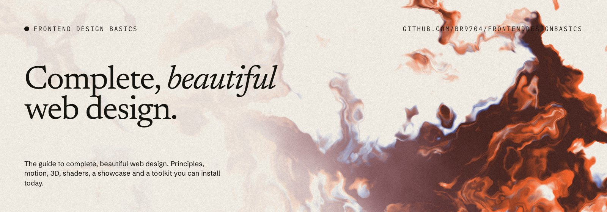
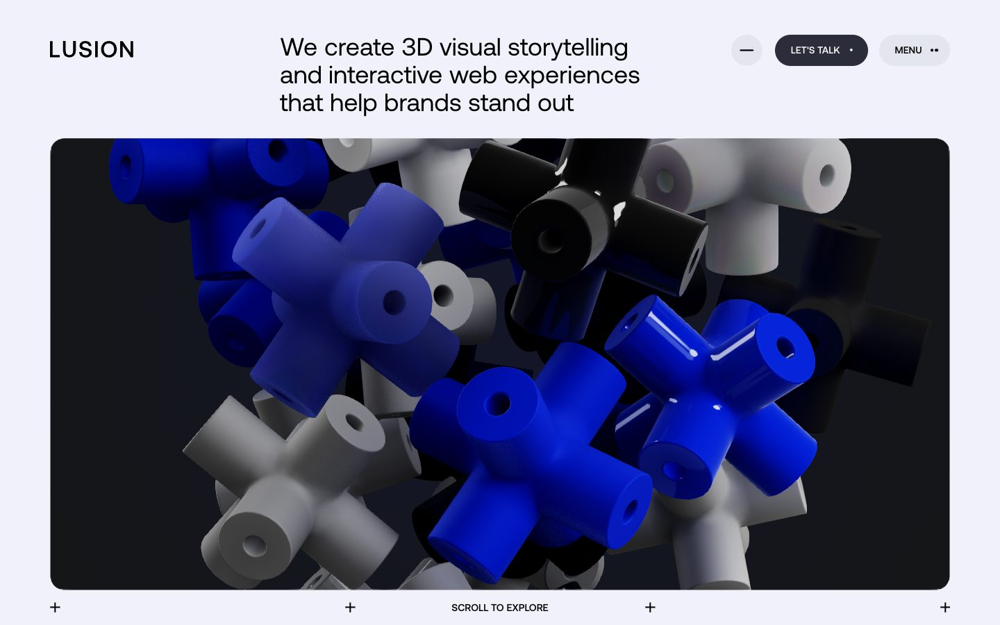
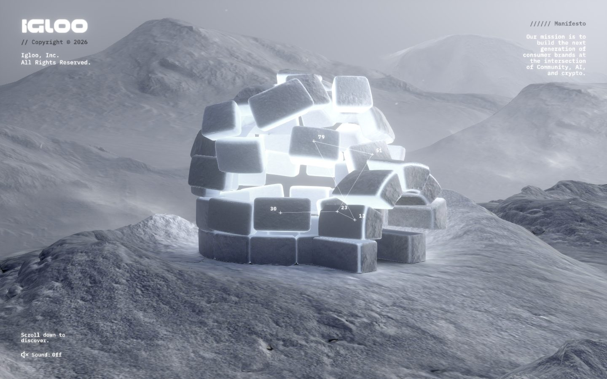
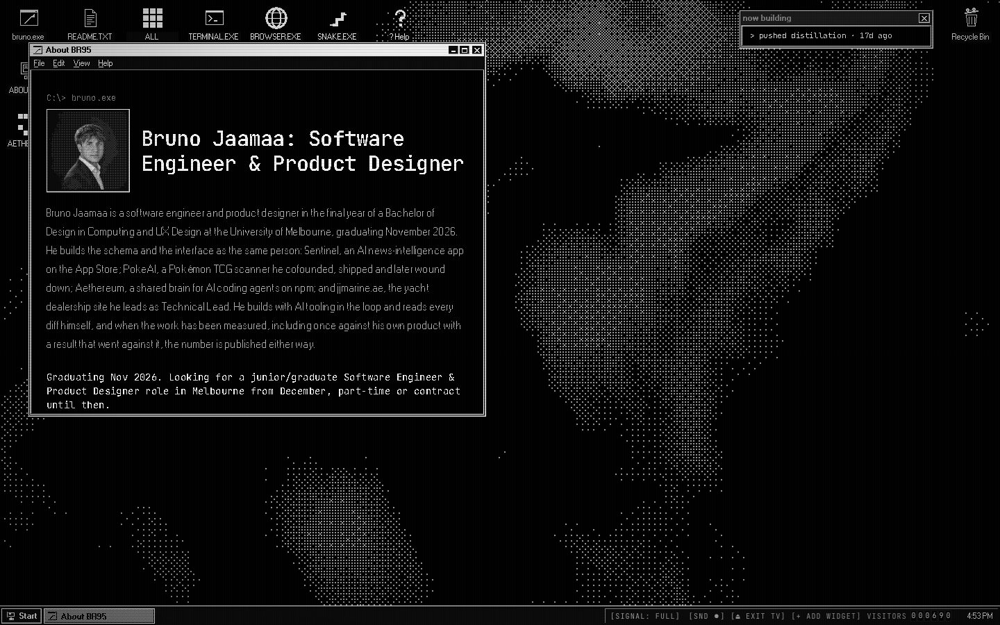

<p align="center">
  
</p>

# Frontend Design Basics

**The guide to complete, beautiful web design.** Principles, motion, 3D, shaders, a showcase of
standout sites, and a toolkit of libraries, MCP servers and agent skills you can install today.

Every page follows one template: **a live demo → the code → how to install it → why it works.**

<table>
  <tr>
    <td width="33%"></td>
    <td width="33%"></td>
    <td width="33%"></td>
  </tr>
  <tr>
    <td><sub>Lusion: WebGL as craft</sub></td>
    <td><sub>Igloo Inc.: scroll as a camera</sub></td>
    <td><sub>BR95: the first case study</sub></td>
  </tr>
</table>

## Chapters

| | Chapter | What's in it |
|---|---|---|
| 01 | [Principles](content/docs/principles) | Type scale, colour, space and layout, and the MUST/SHOULD rules |
| 02 | [Motion](content/docs/motion.mdx) | Easing playground, durations, GSAP, Lenis, reduced motion, proving motion with frames |
| 03 | [3D](content/docs/3d.mdx) | CSS depth first, then three.js/R3F, Threlte, Spline, PlayCanvas, with performance rules |
| 04 | [Shaders](content/docs/shaders.mdx) | The ink shader behind this README, live on sliders; noise, warping, grain |
| 05 | [Components](content/docs/components.mdx) | The registry model: React Bits, Magic UI, Cult UI, Bklit, 21st.dev |
| 06 | [Recipes](content/docs/recipes.mdx) | Hero anatomy, bento grid, pinned scroll story, footer |
| 07 | [Case studies](content/docs/case-studies) | BR95, a Windows 95 portfolio that keeps its SEO |
| 08 | [Showcase](content/docs/showcase.mdx) | Linear, Stripe, Lusion, Igloo, Rauno, Emil Kowalski, darkroom, Bruno Simon |
| 09 | [Toolkit](content/docs/toolkit.mdx) | Every tool below, searchable and filterable |
| 10 | [Workflow](content/docs/workflow.mdx) | Building with an agent without generic results |

## Use it with your agent

Point your coding agent at this repo at the start of a project and ask *"what in here fits this
brief?"* It reads [`toolkit/toolkit.json`](toolkit/toolkit.json) and [`AGENTS.md`](AGENTS.md), then
proposes tools and principles for you to choose from. The site also serves `/llms.txt`.

## Toolkit

<!-- toolkit:begin -->
<!-- generated by `pnpm gen` from toolkit/toolkit.json. Edit the JSON, not this table. -->

**Motion & scroll**

| Tool | What | Status |
|---|---|---|
| [GSAP](https://gsap.com) | The animation engine. Timelines, ScrollTrigger, SplitText, MorphSVG, Flip, all plugins now free. | `live` |
| [Lenis](https://lenis.darkroom.engineering) | Smooth scroll that keeps native scroll semantics. Pairs with GSAP ScrollTrigger. | `library` |
| [Motion (motion.dev)](https://motion.dev) | React/JS animation with springs, layout animation and gestures. Formerly Framer Motion. | `live` |
| [Scroll World](https://github.com/oso95/scroll-world) | Agent skill that turns a brand into a scrollable 3D-world landing page. | `live` |
| [ScrollCraft](https://github.com/nateherkai/scroll-craft) | Skill for premium scroll-driven landing pages: scrubbed video, pinned sections, one signature move. | `live` |

**3D & WebGL**

| Tool | What | Status |
|---|---|---|
| [three.js](https://threejs.org) | The 3D library of the web. R3F wraps it for React. | `live` |
| [img2threejs](https://github.com/img2threejs/img2threejs) | Skill that rebuilds an object from a reference image as a procedural, animation-ready three.js model. | `live` |
| [Threlte](https://threlte.xyz) | three.js for Svelte, declarative and typed. | `library` |
| [ThreeUI](https://threeui.com) | Catalogue of three.js UI components by Design+Code. Community edition is open source. | `library` |
| [Spline](https://spline.design) | Browser/desktop 3D design tool with exportable interactive scenes. | `needs-key` |
| [PlayCanvas](https://playcanvas.com) | WebGL/WebGPU game engine with a collaborative editor. | `on-demand` |
| [Vectary](https://www.vectary.com) | No-code 3D and AR design in the browser. (Logged from 'Vectory.com': vectory.com is a sensor company.) | `tool` |

**Shaders & gradients**

| Tool | What | Status |
|---|---|---|
| [OGL](https://github.com/oframe/ogl) | Tiny WebGL library. This site's hero shader runs on it. | `library` |
| [ShaderGradient](https://shadergradient.co) | Moving 3D gradients for React, Framer and Figma, tuned in a visual editor. | `library` |
| [GetLayers](https://www.getlayers.ai) | Library of prompts plus source for templates, 3D/WebGL scenes, motion sections and animated backgrounds. | `dormant` |

**Component libraries**

| Tool | What | Status |
|---|---|---|
| [React Bits](https://reactbits.dev) | Animated React components with live prop controls, in JS/TS × CSS/Tailwind variants. | `live` |
| [Magic UI](https://magicui.design) | Motion-first shadcn-style components for landing pages. | `live` |
| [Cult UI](https://www.cult-ui.com) | shadcn-compatible animated components with character. | `live` |
| [21st.dev](https://21st.dev) | Community component catalogue plus AI UI generation. | `needs-key` |
| [Bklit UI](https://ui.bklit.com) | UI and chart components shipped as a shadcn registry. | `live` |
| [shadcn/ui](https://ui.shadcn.com) | Copy-in component system and the registry protocol most libraries above ship through. | `live` |

**Reference & research**

| Tool | What | Status |
|---|---|---|
| [Refero](https://refero.design) | Searchable library of real app and web screens, flows and styles. | `needs-key` |
| [Jitter](https://jitter.video) | Web motion-design tool for animating UI and exporting video/Lottie. | `tool` |
| [Paper](https://paper.design) | Design canvas with a local MCP. Bruno uses it to scope ideas. | `on-demand` |

**Claude skills (taste & rules)**

| Tool | What | Status |
|---|---|---|
| [frontend-design (official)](https://github.com/anthropics/skills) | Anthropic's skill for distinctive, non-templated visual direction. | `live` |
| [impeccable](https://github.com/pbakaus/impeccable) | Design language and audit skill: critique, polish, harden, animate, colourise. | `live` |
| [taste-skill](https://github.com/Leonxlnx/taste-skill) | design-taste-frontend, high-end-visual-design and redesign-existing-projects: anti-generic rules. | `live` |
| [UI/UX Pro Max](https://github.com/nextlevelbuilder/ui-ux-pro-max-skill) | Searchable database of 79 styles, 192 palettes and 74 font pairings. | `live` |
| [Web Interface Guidelines](https://vercel.com/design/guidelines) | Rauno/Vercel's MUST/SHOULD interface rules as a review skill, plus React best practices, composition patterns and view transitions. | `live` |
| [Anthropic example skills](https://github.com/anthropics/skills) | canvas-design, theme-factory, algorithmic-art, web-artifacts-builder, brand-guidelines, webapp-testing. | `live` |
| [frontend-design-basics (Bruno's)](https://github.com/br9704/frontenddesignbasics) | Reads this toolkit and the Principles chapter, then asks which tools and principles fit the brief. | `live` |

**Agent infrastructure**

| Tool | What | Status |
|---|---|---|
| [Context7](https://context7.com) | Current, versioned library docs on demand (GSAP, three.js, Lenis, Next.js…). | `live` |
| [Playwright MCP](https://github.com/microsoft/playwright-mcp) | Drive a real browser: screenshots, frames, interaction. | `live` |
| [Chrome DevTools MCP](https://github.com/ChromeDevTools/chrome-devtools-mcp) | Performance traces, console, network from a live Chrome. | `live` |

**Voice & messaging**

| Tool | What | Status |
|---|---|---|
| [VoiceStudio](https://github.com/debpalash/VoiceStudio) | Local, open-source voice cloning, TTS, dubbing and transcription. | `on-demand` |
| [OpenWA](https://github.com/rmyndharis/OpenWA) | Self-hosted WhatsApp API gateway with a built-in MCP. | `on-demand` |

<!-- toolkit:end -->

## Run it locally

```bash
pnpm install
pnpm dev            # http://localhost:3000
pnpm build          # production build
pnpm gen            # regenerate README table + AGENTS.md from toolkit.json
pnpm shots          # recapture showcase screenshots (Playwright)
pnpm banners        # re-render banners from the site's own shader (needs the site on :3000)
pnpm verify         # motion, reduced-motion and 390px checks (needs the site on :3000)
```

## Contributing

Suggest a site for the Showcase or a tool for the Toolkit by opening an issue. Showcase entries credit
and link the owner, and never copy their code or assets.

## License

Code is [MIT](LICENSE). Showcase screenshots belong to their respective owners, are shown for
commentary with credit and a link, and are removed on request.

Made by [Bruno Jaamaa](https://brunojaamaa.dev).
