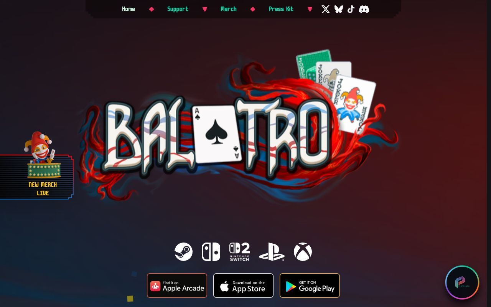
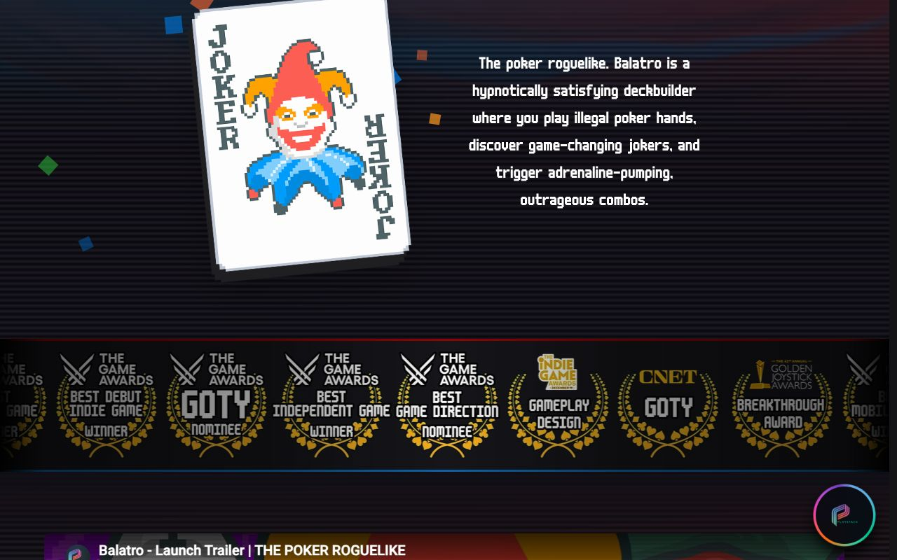

<!-- generated by `pnpm export:md` from content/docs/cases/balatro-deck.mdx. Edit the MDX, not this file. -->

# Balatro deck: cloning a look from its real assets

*A slide deck built to look, move and sound exactly like the card game Balatro, by reading the real palette, shaders and timings from the game's own files instead of eyeballing screenshots.*

<sub>📖 [Read this chapter on the live site](https://frontenddesignbasics.vercel.app/docs/cases/balatro-deck) for the interactive version · [← Guide contents](../README.md)</sub>

> - Every colour is an exact value from the game's code, and Tailwind's default palette is wiped so nothing else can leak in.
> - The backgrounds are ports of the game's own swirl and paint shaders, running on one WebGL canvas for the whole talk.
> - Motion ("juice") comes from one timing table read from the game's source, with a CRT effect kept barely there.



*The reference, not the deck: the official Balatro site. The deck itself uses the game's own assets,
so it isn't shown here.*

## What it is

A university presentation about the card game *Balatro* by LocalThunk, built as a web app. Slides
look like the game's menus and run screens, buttons press like the game's buttons, and the soundtrack
changes layer as the talk moves between sections. It was a non-commercial class project, labelled
fan-made and unofficial, with a credits slide naming the studio, publisher and font author.

The method is the point: **clone from the source's real materials, not from memory or screenshots.**
A screenshot gives you compressed colours, a scaled font and one frame of an animation. The real
values were sitting in the game files all along.

## How it's built

**Stack:** Vite, React 19, Motion, OGL for the shaders, Tailwind v4, and Playwright for visual checks.

Balatro is made with the LÖVE engine, so the game's `Balatro.love` file is a plain zip. From a copy he
owns, Bruno read the palette from `globals.lua`, the sprite sheet grid from `game.lua`, the shaders
from `resources/shaders/` and the button timings from `engine/ui.lua`.

```text
  Balatro.love (a zip, from your own copy)
     |
     +- globals.lua ------> tokens.css      every colour, nothing else
     +- game.lua ---------> sheets.ts       sprite grid, 71 x 95 cards
     +- splash.fs ----+
     +- background.fs +--> one OGL canvas   ported line by line
     +- engine/ui.lua ----> motion.ts       100ms hold, juice timings
     +- music1..5 --------> WebAudio        5 synced layers, gains only

  one canvas for the whole visit:
  slide sets a target look --> render loop eases uniforms (about 0.6s)
                               uMenu 1 = vortex ... 0 = in-run paint
```

- **Palette.** Red `#fe5f55` for MULT, blue `#009dff` for CHIPS, all straight from the game's colour
  table. `--color-*: initial` wipes Tailwind's palette first.
- **Shaders.** The React Bits `<Balatro />` background was the starting point, but the finished deck
  runs ports of the game's own `splash.fs` (the menu vortex) and `background.fs` (the in-run paint).
  The ports keep the original constant names so a diff against the source stays readable. The
  program is never rebuilt on a slide change: the render loop eases every uniform toward the new
  target, so the vortex melts into the paint.
- **Pixel font.** m6x11plus by Daniel Linssen, with font smoothing off and sizes only at multiples of
  its design size.
- **Juice.** One timing table drives both CSS and JS: a 60ms button press, a 100ms hold (the game's
  own `G.TIMERS.REAL - 0.1`), a 400ms decaying wobble on hover, and a 300ms ease-out counter roll.

## Design decisions



- **Hard shadows, stepped corners.** The game's buttons and cards drop onto a solid offset shadow, as
  on the joker card above. The deck builds its buttons with a 20-point `clip-path` for stepped
  corners, no `border-radius`, and a face that drops 6px onto the shadow when pressed.
- **The CRT effect is barely there.** Faint scanlines like the ones in the shot above: 2px lines at 4%
  opacity and one vignette. Enough to read as a screen, not enough to fight the text.
- **One unit rules the layout.** The spacing unit is 96px, a twentieth of the 1920 × 1080 stage.
  Layouts were measured from a real 1920 × 1080 capture of the game's menu.
- **Progress in the game's language.** Slides advance as blinds and antes, not page numbers, and the
  background shifts to the game state that fits each section, like boss red for the limits.
- **Tuned for the room.** On a projector the background looked frozen, so it runs at 2.5× speed with
  contrast raised to 1.35. Music sits at -18 dB and sound is off by default.
- **Reduced motion slows, it doesn't stop.** Under `prefers-reduced-motion` the swirl runs at a
  quarter speed, because a frozen swirl looks broken, and animated cards are parked in fixed spots.

## Steal this

1. **Read the values, don't sample them.** Open the source (a game file, a stylesheet, a token file)
   and copy exact colours and timings. Then wipe the defaults so only those exist. See
   [Make colour look expensive](../how-to/make-colour-look-expensive.md).
2. **Keep one WebGL canvas and ease its uniforms.** Changing a target and lerping toward it makes a
   shader its own transition. See it in [liquid-gradient](/lab/liquid-gradient).
3. **Make the screen effect subtle.** Scanlines, vignette and noise should be felt, not seen. Build
   the stack with [Post-processing stack](../how-to/post-processing-stack.md) and compare with
   [crt-signal-lost](/lab/crt-signal-lost).

## Sources

- Bruno's build notes, *Design Cloning and Animation*, written from the deck's repo on 14 September 2026 (private build notes, not public)
- [playbalatro.com](https://www.playbalatro.com), the official Balatro site (the reference screenshots)
- [React Bits Balatro background](https://reactbits.dev/backgrounds/balatro), the shader starting point
- [m6x11 by Daniel Linssen](https://managore.itch.io/m6x11), the pixel font
