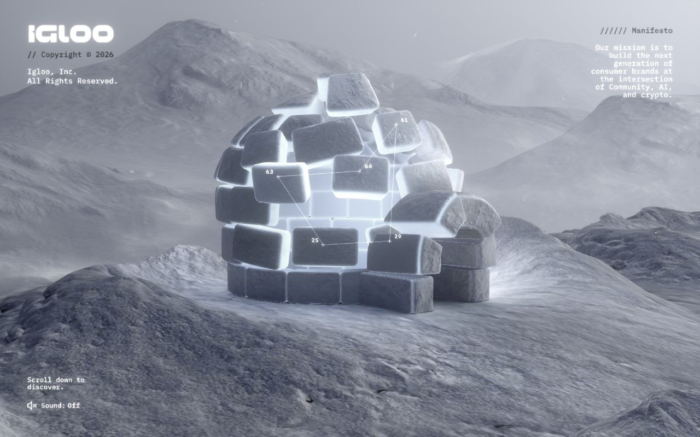
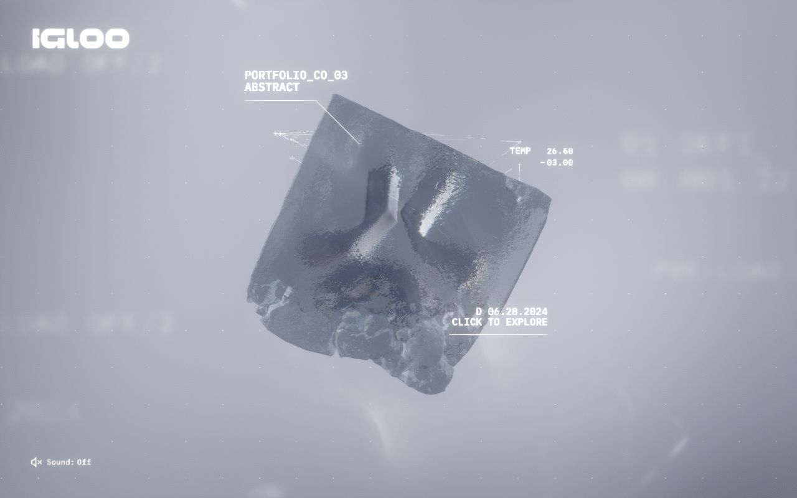
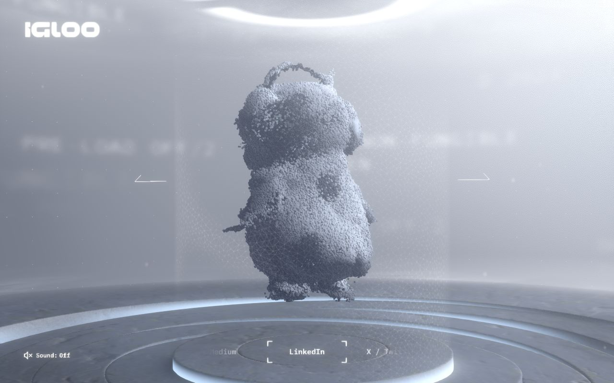

<!-- generated by `pnpm export:md` from content/docs/cases/igloo-inc.mdx. Edit the MDX, not this file. -->

# Igloo Inc.: a company site carved out of ice

*How abeto built the Awwwards Site of the Year with procedural ice, compressed volume data and a WebGL interface, all in three.js.*

<sub>📖 [Read this chapter on the live site](https://frontenddesignbasics.vercel.app/docs/cases/igloo-inc) for the interactive version · [← Guide contents](../README.md)</sub>

> - A scroll journey through a frozen world: an igloo, ice-encased portfolio pieces and a particle
>   footer that reshapes itself.
> - The studio, abeto, built its own tools: a procedural ice growth algorithm, a VDB exporter and
>   background shader compilation.
> - Even the interface text lives in WebGL, so glitches and letter scrambles are cheap shader tricks.



## What it is

Igloo Inc. is a company site. Its own manifesto says it builds consumer brands at the intersection
of community, AI and crypto. The site was made by **abeto**, a
team of technical artists, with the creative team at **Bureaux**, who also provided the audio. It won
Awwwards Site of the Year and Developer Site of the Year, which abeto announced on X.

You open on an igloo in a snowstorm and scroll down into it. Portfolio companies appear as frozen
objects you can click to explore, and the journey ends on a platform of particles.

## How it's built

From the case study's tools list:

- **3D and textures:** Houdini and Blender.
- **UI design:** Figma, Photoshop and Affinity Photo.
- **Code:** three.js, three-mesh-bvh, Svelte, GSAP, Vite and vanilla JavaScript.
- **Audio:** DaVinci Resolve.

The studio says it prefers custom solutions for each project, and several parts of this site are
their own tools rather than off-the-shelf ones.

```text
   AUTHORING                         EXPORT                       BROWSER (three.js)
 ┌──────────────┐   ice growth    ┌──────────────┐           ┌──────────────────────┐
 │ Houdini      │── algorithm ───▶│ ice meshes   │──────────▶│ scroll scene (GSAP)  │
 │ Blender      │                 │ per project  │           │  igloo → ice blocks  │
 └──────────────┘                 └──────────────┘           │  → particle footer   │
 ┌──────────────┐  custom VDB     ┌──────────────┐           │                      │
 │ VDB volumes  │── exporter ────▶│ compressed,  │──────────▶│ volume effects       │
 └──────────────┘                 │ smaller than │           │                      │
                                  │ a web image  │           │ WebGL UI text (SDF)  │
                                  └──────────────┘           │  glitch · scramble   │
                                                             └──────────▲───────────┘
                                   shaders compiled in the background ──┘
```

- **Procedural ice.** Each portfolio piece gets its own ice block. Rather than model each one by
  hand, the team wrote an algorithm that mimics ice crystals growing inside a container. They pick a
  base shape, such as a cube or cylinder, and the algorithm grows the detail.
- **Volume data made small.** Instead of shipping volumes as stacks of image slices, they wrote an
  exporter that converts VDB data into a compressed, browser-friendly format. They say the files end
  up smaller than a typical website image.
- **Interactive particles.** In the footer, a particle simulation shifts into a new shape for each
  external link you select. Particles change colour with speed and glow while they transform, in time
  with Bureaux's audio.
- **WebGL interface text.** The UI is drawn in WebGL. Glitches are a simple shader, and text scrambles
  change letters by offsetting an SDF texture, so nothing has to be recalculated in the DOM.
- **Loading strategy.** Textures load and shaders compile in stages, both at first load and in the
  background, to keep the first visit fast.



## Design decisions

- **One material, one mood.** Everything is ice, snow and fog in cool greys. The screenshots show
  almost no colour at all, which makes the glowing light inside the igloo the focal point.
- **Interface as instrument readout.** Labels like `PORTFOLIO_CO_03`, `TEMP 26.60` and thin leader
  lines make the UI feel like a scientific scan. Monospace type throughout keeps it consistent.
- **Content as objects.** Portfolio companies are not cards in a grid. Each is its own frozen object
  with a unique ice shape, which is why the procedural algorithm was worth building.
- **Sound is opt-in.** A small "Sound: Off" toggle sits bottom left on every screen. The audio is
  designed, but it never starts on its own.
- **A clear first instruction.** The opening screen says "Scroll down to discover" and nothing else.



## Steal this

1. **Start low-fi, resolve to detail.** Igloo's ice grows detail from a simple base shape. The same
   idea drives [pixel-to-hd-cube](/lab/pixel-to-hd-cube): begin chunky, end crisp. Steps are in
   [Pixel to HD](../how-to/pixel-to-hd.md).
2. **Put hard-to-animate text in the canvas.** When text has to glitch or scramble every frame, a
   shader beats DOM updates. [Post-processing stack](../how-to/post-processing-stack.md) shows a glitch pass. Keep real text
   in the DOM for accessibility.
3. **Budget the first load like a feature.** Compile shaders and load heavy assets in the
   background. The home journey here follows the same rule; see
   [Structure and performance](../rules/structure-and-performance.md).

## Sources

- [Igloo Inc: Case Study](https://www.awwwards.com/igloo-inc-case-study.html), abeto, Awwwards, 31 October 2024
- [abeto on X: "We won Site of the Year and Developer Site of the Year"](https://x.com/abeto_co/status/1900152588768579701)
- [Igloo Inc on Awwwards](https://www.awwwards.com/sites/igloo-inc)
- [igloo.inc](https://www.igloo.inc)
