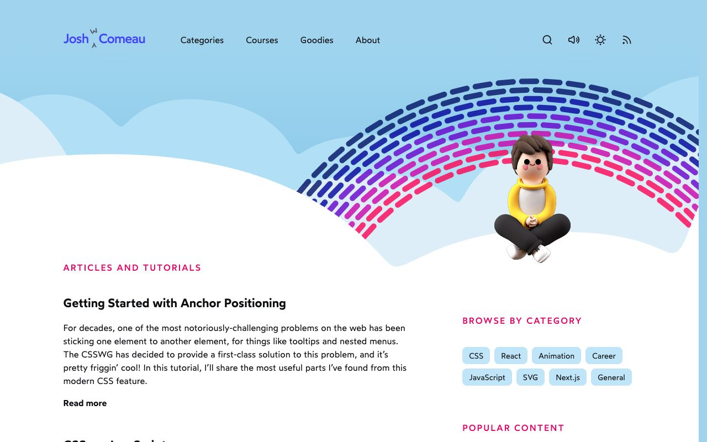
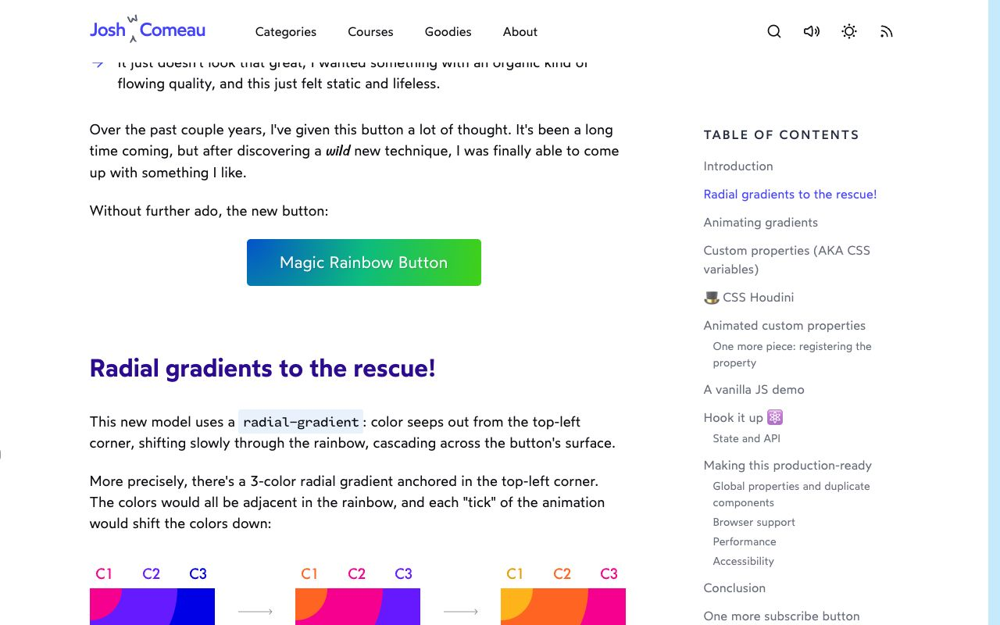
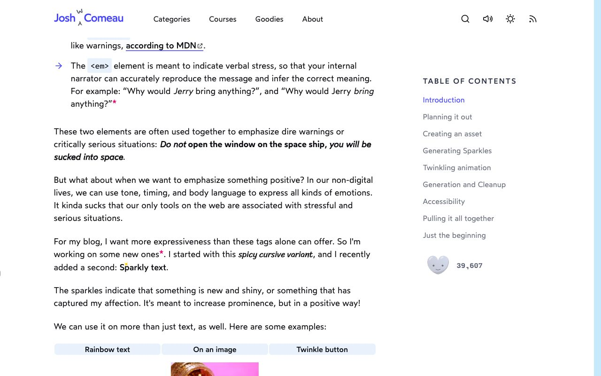

<!-- generated by `pnpm export:md` from content/docs/cases/josh-comeau.mdx. Edit the MDX, not this file. -->

# Josh W. Comeau: whimsy, explained by its maker

*How Josh Comeau builds the playful details on his blog, from randomised sparkles to a rainbow button powered by registered custom properties.*

<sub>📖 [Read this chapter on the live site](https://frontenddesignbasics.vercel.app/docs/cases/josh-comeau) for the interactive version · [← Guide contents](../README.md)</sub>

> - The blog is a teaching site with a playful skin: clouds, a rainbow arc, a 3D mascot and
>   interactive demos inside every article.
> - He writes up his own tricks: sparkles use randomness in size, position and timing, and a rainbow
>   button animates a gradient by registering custom properties with CSS Houdini.
> - Every effect is built on cheap properties (`transform`, a single paint) and has a reduced-motion
>   path.



## What it is

Josh W. Comeau teaches CSS, React and animation. His blog is known for interactive explanations and
for small moments of delight. The homepage opens on a sky with clouds, a dashed rainbow and a 3D
character, and the header has search, a sound toggle, a theme toggle and RSS.

What makes it a good case study is that he has written up how several of those details work, on the
same site.

## How it's built

### Animated sparkles

"Sparkly text" wraps content in small four-pointed stars that appear and fade.

- **Random, within limits.** Each sparkle gets a random size between 10 and 20, a random `top` and
  `left` between 0% and 100%, a colour and a creation time.
- **Irregular rhythm.** A custom `useRandomInterval(callback, 50, 500)` hook adds sparkles at random
  gaps between 50ms and 500ms, which feels organic rather than mechanical.
- **Two separate animations.** One scales from 0 to 1 and back to 0 with `ease-in-out`. The other
  rotates 0 to 180 degrees with linear easing over 1000ms. Keeping them apart avoids a jerky,
  synchronised feel.
- **Cleanup.** Sparkles older than 750ms are filtered out, so the DOM never fills up.
- **Reduced motion.** The animations are disabled with a media query, the random interval is paused
  by passing `null`, and a few static sparkles still render.
- **Inline SVG.** The star is an SVG path with `fill={color}`, so there are no image requests.

### The magic rainbow button

You can't use `transition` to interpolate between two background gradients. His fix uses CSS
Houdini:

```text
  CSS.registerProperty({ name: '--color-1', syntax: '<color>', ... })
  CSS.registerProperty({ name: '--color-2', ... })
  CSS.registerProperty({ name: '--color-3', ... })

  palette (10 colours):  [ c0  c1  c2  c3  c4  c5  c6  c7  c8  c9 ]
  tick n:                      └──┬──┘
  tick n+1:                        └──┬──┘      setInterval shifts the window
                                   │
                     --color-1/2/3 transition (the browser knows they are colours)
                                   │
         background: radial-gradient(at top left, var(--color-1), var(--color-2), var(--color-3))
```

- A three-colour radial gradient is anchored in the top-left corner. The three colours are
  neighbours in a 10-colour rainbow.
- Each tick of an interval shifts the window along the palette.
- Because each custom property is registered with the `<color>` syntax, the browser can transition
  it, and the gradient repaints smoothly.
- Each button instance gets unique property names, to avoid an "already registered" error.
- If `CSS.registerProperty` is missing, the hook bails out and you get a static gradient.
- He measured the repaint at about 0.3ms, around 2% of a 60fps frame budget, because it triggers
  paint but no layout.



### Transforms

His guide, The World of CSS Transforms, explains the rules the rest relies on: `translate` percentages refer to
the element's own size, every transform runs from a `transform-origin`, the order of functions
changes the result, and transforms don't change an element's place in the flow, so they avoid layout
work. Transforms also don't apply to inline elements, so switch to `inline-block`, flex or grid.

## Design decisions

- **Friendly, not childish.** Soft blues, a pink accent for section labels, rounded category chips
  and plain article text keep the whimsy at the edges while reading stays calm.
- **Delight marks importance.** He describes sparkles as a positive alternative to `<strong>`: a way
  to say "new and shiny" rather than "warning".
- **Ideas get a demo.** The rainbow article shows the finished button first, then diagrams of how
  the colours shift, then the code. The screenshot shows the C1, C2, C3 strip under the heading.
- **Long reads need wayfinding.** Articles have a sticky table of contents that highlights where you
  are.
- **Sound is a choice.** A speaker toggle sits in the header next to search and the theme switch.



## Steal this

1. **Randomise within limits.** Random size, position and timing make a loop feel alive. Try it on
   the looping SVG traces in [circuit-board](/lab/circuit-board), built as in
   [Draw and morph SVG](../how-to/draw-and-morph-svg.md).
2. **Register a custom property to animate the "unanimatable".** Gradients, and borders built from
   gradients, become animatable. It is the trick behind a moving border beam like the one in
   [flip-bento](/lab/flip-bento).
3. **Split motion into independent layers.** Scale and rotate on separate timelines look richer
   than one combined keyframe. [kinetic-poster](/lab/kinetic-poster) layers type the same way; see
   [Kinetic type and posters](../how-to/kinetic-type-and-posters.md).

## Sources

- [How to animate sparkle text in React](https://www.joshwcomeau.com/react/animated-sparkles-in-react/), Josh W. Comeau
- [Magical Rainbow Gradients with CSS Houdini and React Hooks](https://www.joshwcomeau.com/react/rainbow-button/), Josh W. Comeau
- [The World of CSS Transforms](https://www.joshwcomeau.com/css/transforms/), Josh W. Comeau
- [joshwcomeau.com](https://www.joshwcomeau.com)
