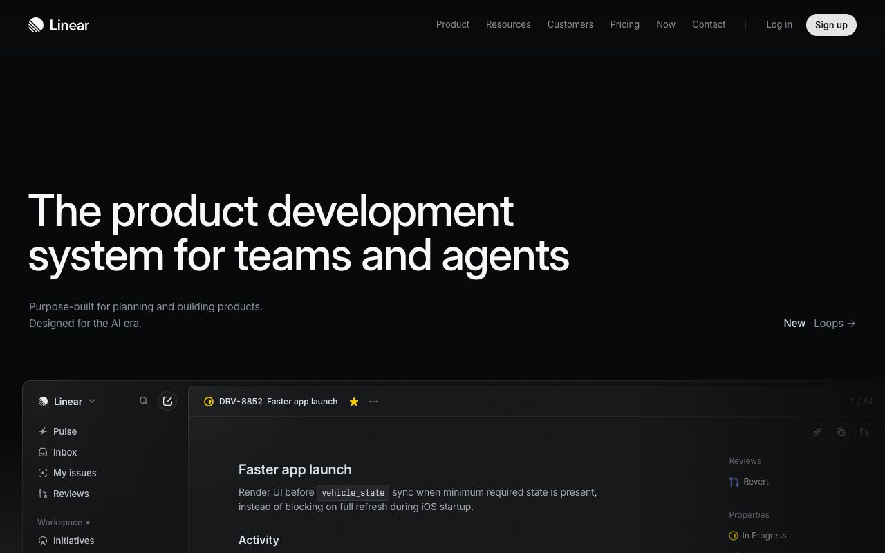
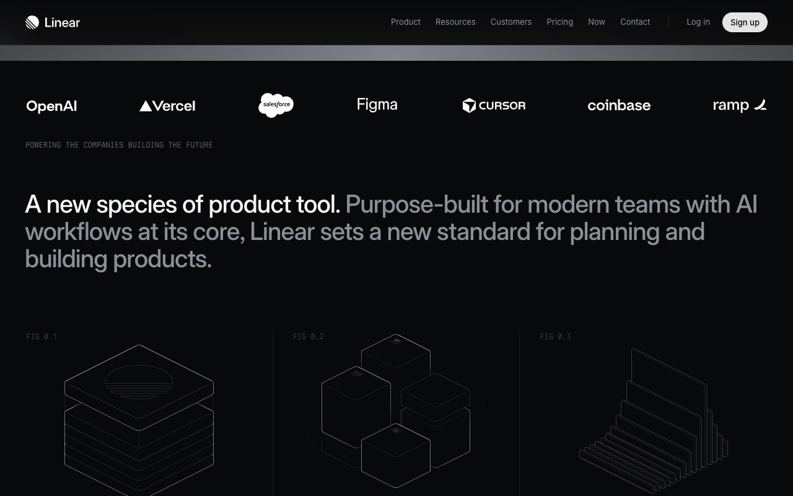

<!-- generated by `pnpm export:md` from content/docs/cases/linear-redesign.mdx. Edit the MDX, not this file. -->

# Linear: redesigning a dense dark UI

*How Linear cut visual noise, rebuilt its themes in LCH from three inputs, and shipped a full UI redesign in about six weeks, from its own write-up.*

<sub>📖 [Read this chapter on the live site](https://frontenddesignbasics.vercel.app/docs/cases/linear-redesign) for the interactive version · [← Guide contents](../README.md)</sub>

> - Themes went from 98 hand-set variables to three inputs (base colour, accent colour, contrast), generated in the LCH colour space.
> - The redesign cut chrome: less blue in the neutrals, calmer sidebar, tabs and headers, and stronger contrast for content.
> - It shipped in about six weeks through stress tests, a feature flag, a private beta and a gradual rollout.



## What it is

Linear is an issue tracker and product development tool, and it is known for a dark, precise interface.
In March 2024 Linear published a two-part series on redesigning the app. Part two covers how they did
it, "no infinite-loop processes, workshops, or sticky notes" involved.

The aim was to adjust the sidebar, tabs, headers and panels to "reduce visual noise, maintain visual
alignment, and increase the hierarchy and density of navigation elements", so Linear could grow from
an issue tracker into a system for product development.

## How it's built

The redesign was a design system change more than a new layout. Co-founder Karri Saarinen explored
concepts in Figma, mostly using opacities of black and white to set elevation and hierarchy. The team
then rebuilt how themes are generated.

```text
  BEFORE: 98 variables per theme, each set by hand

  AFTER:  3 inputs per theme
          base colour --+
          accent -------+--> LCH theme generator
          contrast -----+          |
                                   v
          surfaces: background, foreground, panels,
                    dialogs, modals
          text, icons, controls (aliases of core variables)

          contrast 30 ... 100  --> high-contrast themes for free
```

- **LCH instead of HSL.** In LCH, a red and a yellow at the same lightness look about equally light to
  the eye. HSL doesn't do that, so generated themes looked uneven. Custom themes already used an LCH
  generator for elevated and translucent surfaces; the redesign moved the main light and dark themes
  onto it as well.
- **Contrast is an input.** A contrast value controls how contrasty a theme is, so very high-contrast
  themes come out of the same system for people who need them.
- **Type.** Inter Display for headings, to add expression while staying readable, and regular Inter
  for everything else.
- **Works everywhere.** Linear runs in Electron on macOS and Windows and in any browser, so back and
  forward buttons, history and tabs had to be removable for the browser version.

## Design decisions



- **Less chrome, more content.** The team limited how much blue went into the colour calculations, to
  get back to "a more neutral and timeless appearance". On the marketing site, the same restraint shows:
  near-black ground, white type, grey secondary text and almost no accent colour.
- **Hierarchy through brightness, not size.** In the second shot the statement runs at one size, with
  the first sentence in white and the rest in grey. It is the black-and-white opacity method from the
  concept work, applied to type.
- **Stronger contrast for content.** Text and neutral icons got darker in light mode and lighter in dark
  mode, so content stands out from the chrome around it.
- **Alignment you feel.** Labels, icons and buttons in the sidebar and tabs were aligned both ways. The
  write-up says you won't see it at once, but you'll feel it after a few minutes.
- **Scope held tight.** Navigation problems were set aside because fixing them needed deep engineering
  work, so the project stayed a redesign. Stress tests across the main views came before any code.
- **Ship fast behind a flag.** A small dedicated team, a feature flag for staff, an internal toolbar
  toggle to compare old and new, then a private beta and a rollout to a share of workspaces each day.

## Steal this

1. **Generate your theme from a few inputs.** Pick a base, an accent and a contrast level, and derive
   every surface in a perceptual space like LCH or OKLCH. See
   [Tokens and colour](../rules/tokens-and-colour.md) and
   [Make colour look expensive](../how-to/make-colour-look-expensive.md).
2. **Use brightness steps for hierarchy.** On a dark UI, white, grey and dim grey do more than extra
   font sizes or colours. Try it on a layout that moves, like [flip-bento](/lab/flip-bento), and read
   [Flip layouts and page transitions](../how-to/flip-layouts-and-page-transitions.md).
3. **Treat a redesign as a project with milestones.** Stress-test the direction on your densest screens
   first, then ship behind a flag and roll out gradually.

## Sources

- [How we redesigned the Linear UI (part II)](https://linear.app/now/how-we-redesigned-the-linear-ui), Linear, 28 March 2024
- [A design reset (part I)](https://linear.app/blog/a-design-reset), Linear
- [linear.app](https://linear.app), the live site
