<!-- generated by `pnpm export:md` from content/docs/how-to/ai-assets.mdx. Edit the MDX, not this file. -->

# How to generate AI assets for the web

*Brief, generate, animate and ship images, loops and 3D models without breaking the rules.*

<sub>📖 [Read this chapter on the live site](https://frontenddesignbasics.vercel.app/docs/how-to/ai-assets) for the interactive version · [← Guide contents](../README.md)</sub>

> - The prompt is a brief. You still art-direct and reject most of the output.
> - Approve a still before you animate it.
> - Ship video muted, with a poster frame that doubles as the reduced-motion version.

**Goal:** hero stills, textures, ambient loops and 3D objects that look chosen, not generated.

## You need

- Higgsfield (through its MCP) or another generator. It runs on credits, so check the balance first.
- Your palette as hex values.

```text
 brief ──► still ──► motion ──► finish ──► ship
 subject    2-4        image to    upscale,    compress, poster,
 hex, zone  variants   video 4-8s  cut out     reduced-motion fallback
            pick one   loopable    reframe
```

## Steps

### 1. Write the brief like a layout spec

1. **Canvas first.** Size, aspect, and what it is for ("hero background, text on the left third").
2. **Hex, not names.** `#0F3D2E` is a colour. "Forest green" is a guess.
3. **Zones.** Say where things go: "upper third", "right side, behind the subject".
4. **One style sentence, repeated** on every prompt in a set.
5. **No text in the image.** Set real text on top in HTML.
6. **A safety line.** No real people, logos, flags or weapons without the rights.

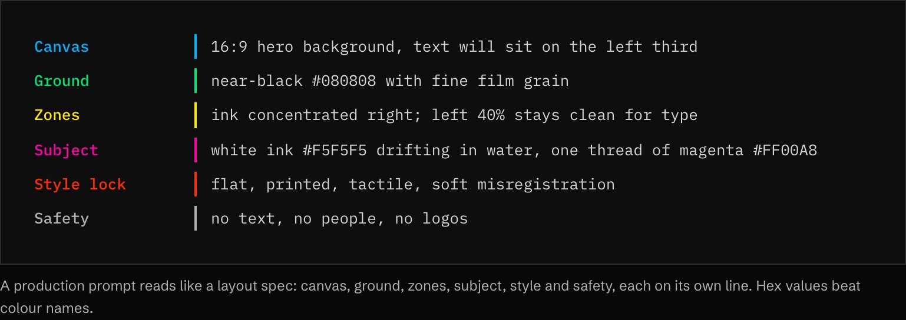

### 2. Pick the model for the job

| Job | Model / tool | Notes |
|---|---|---|
| General image, typography, reference edits | `gpt_image_2_5` | The default for ordinary generation |
| Product, commercial, ad imagery | `marketing_studio_image` | Product shots and ad layouts |
| Portraits, fashion, editorial people | `soul_2` | With a trained Soul ID for a consistent person |
| General image → video | `seedance_2_5` | The default video model |
| Multi-shot, audio, motion transfer | `kling3_0` | Longer, directed sequences |
| 2K keyframes, mixed references | `minimax_h3` | Higher-resolution motion |
| Copy motion from a video onto a still | `hf_mult_motion_control` | "Genjutsu" motion transfer |
| Image → 3D model (GLB) | `generate_3d` | Drop the GLB straight into three.js / R3F |
| Clean-up | `upscale_image`, `upscale_video`, `remove_background`, `outpaint_image`, `reframe` | Finish assets for each placement |

### 3. Approve a still, then animate it

Generate two to four variants. Pick one. Only then turn it into a 4 to 8 second loop. Video costs more
and inherits every flaw of the frame it starts from.

### 4. Copy a prompt from the library

Copy, then change the bracketed parts.

**Hero texture**

```text
Wide 16:9 hero background for a website. Abstract risograph ink in water: two ink colours,
[#FF5C1F] and [#2F4EC2], overprinted on warm paper [#F2EEE6] with visible paper grain.
Ink concentrated on the right half; the left 40% stays almost clean paper for headline text.
Soft misregistration between the two inks. No text, no objects, no people. Flat, printed, tactile.
```

**Product still**

```text
Square product photograph of [a matte ceramic pour-over coffee dripper] on a seamless
[#E8E2D6] backdrop. Single soft key light from the upper left, gentle shadow to the right,
shallow depth of field. Centred with generous negative space above for a headline.
No text, no logos, no props. Editorial, calm, premium.
```

**Editorial illustration**

```text
[4:5] editorial illustration in a flat-vector, screen-printed style.
Background: solid [#16140F] with subtle paper-grain texture.
Subject, lower two-thirds: [a hand holding a phone above a city at dusk], limited palette of
[#FF5C1F] and [#ECE6DA], soft shading, no photorealism.
Keep the upper third empty: text will be set on top in HTML.
No text inside the illustration. No real people, flags, weapons or logos.
```

**Ambient loop**

```text
Image-to-video from the approved still. [6] seconds, seamless loop.
Very slow drift of the ink to the right, as if in still water; camera locked, no zoom,
no cuts, no new elements. Motion subtle enough to sit behind text.
```

**3D object**

```text
Single object on a plain background, three-quarter view, even studio light, no shadows
on the backdrop: [a retro beige desktop computer with a CRT monitor]. Clean silhouette,
no text or logos. (Then: generate_3d → GLB → compress with Draco before shipping.)
```

### 5. Ship it with a poster

```html
<div class="hero-media">
            <!-- still frame: loading state + reduced motion -->
  <video autoplay muted loop playsinline preload="metadata" poster="/hero-poster.jpg">
    <source src="/hero.av1.mp4" type="video/mp4; codecs=av01.0.05M.08" />
    <source src="/hero.h264.mp4" type="video/mp4" />
  </video>
</div>
```

```css
.hero-media { position: relative; }
.hero-media > * { position: absolute; inset: 0; width: 100%; height: 100%; object-fit: cover; }
@media (prefers-reduced-motion: reduce) {
  .hero-media video { display: none; }          /* the  underneath stays visible */
}
```

- Set `muted` and `playsinline`, or phones will not autoplay.
- Compress hard: a background video over 3 MB is a performance bug.
- Check the loop point with two frames, like any motion. See [how to verify](./win95-chrome-and-verify.md).

## Why it works

Generation removes the cost of *making* an asset, not the cost of *choosing* one. Sites that look
designed are the ones where someone wrote a real brief, rejected most of the output, and set the text
themselves.

**AI products with great design · 17 examples**

<table>
<tr><td width="33%" valign="top"><a href="https://cursor.com"></a><br/><b><a href="https://cursor.com">Cursor</a></b><br/><sub>Quiet warm-grey hero lets a real agent session window, laid over painted landscape art, sell the product.</sub></td><td width="33%" valign="top"><a href="https://www.diabrowser.com"></a><br/><b><a href="https://www.diabrowser.com">Dia</a></b><br/><sub>Huge ornate serif wordmark on sunny yellow blur; the browser window shows an AI-written daily brief.</sub></td><td width="33%" valign="top"><a href="https://elevenlabs.io"></a><br/><b><a href="https://elevenlabs.io">ElevenLabs</a></b><br/><sub>Grainy gradient orbs stand in for voices; tabbed product switcher keeps an AI platform calm and clear.</sub></td></tr>
<tr><td width="33%" valign="top"><a href="https://www.krea.ai">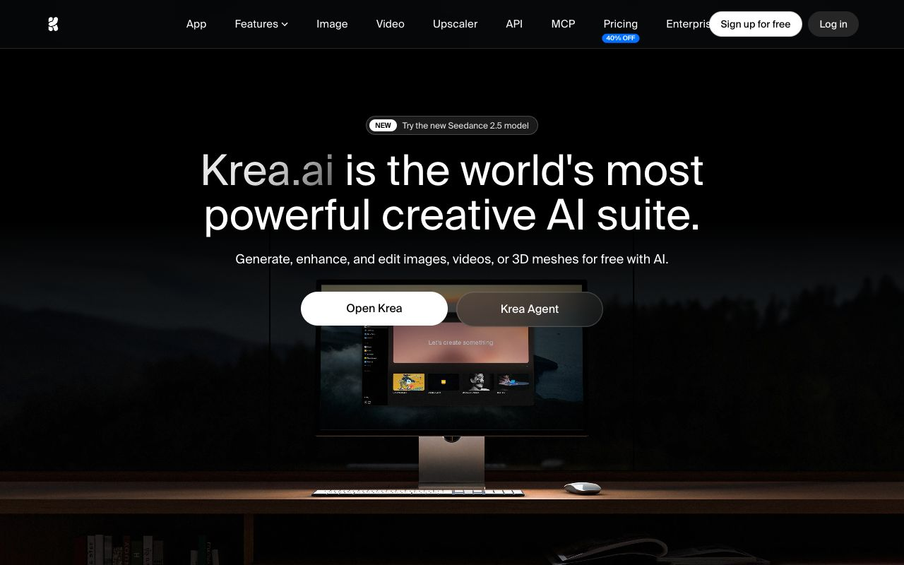</a><br/><b><a href="https://www.krea.ai">Krea</a></b><br/><sub>Dark cinematic desk scene with a lit monitor running the app; gradient-faded wordmark in the headline.</sub></td><td width="33%" valign="top"><a href="https://lumalabs.ai">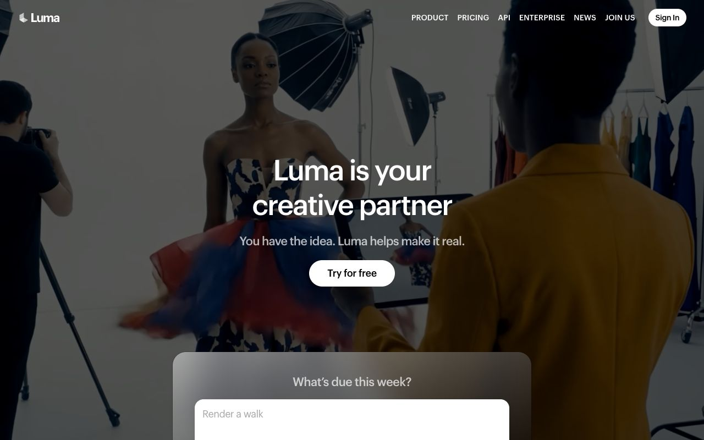</a><br/><b><a href="https://lumalabs.ai">Luma</a></b><br/><sub>Full-bleed fashion-shoot video behind a centred promise, with a prompt box inviting you straight in.</sub></td><td width="33%" valign="top"><a href="https://mistral.ai">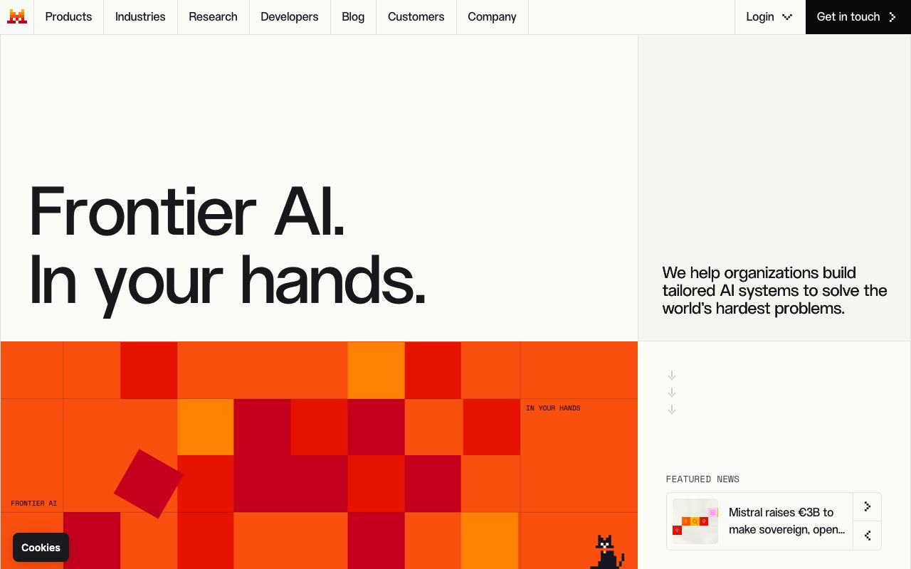</a><br/><b><a href="https://mistral.ai">Mistral AI</a></b><br/><sub>Ruled editorial grid, giant sans headline and an orange pixel-block mosaic with a tiny pixel cat.</sub></td></tr>
<tr><td width="33%" valign="top"><a href="https://runwayml.com">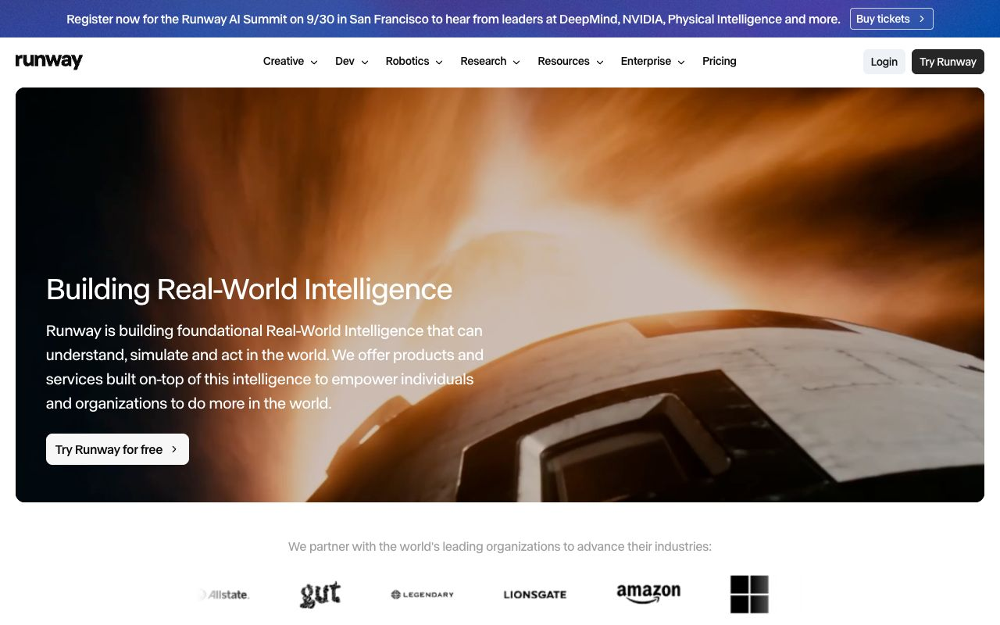</a><br/><b><a href="https://runwayml.com">Runway</a></b><br/><sub>Rounded cinematic video card with left-aligned statement copy, then a greyscale partner logo row beneath.</sub></td><td width="33%" valign="top"><a href="https://www.sesame.com">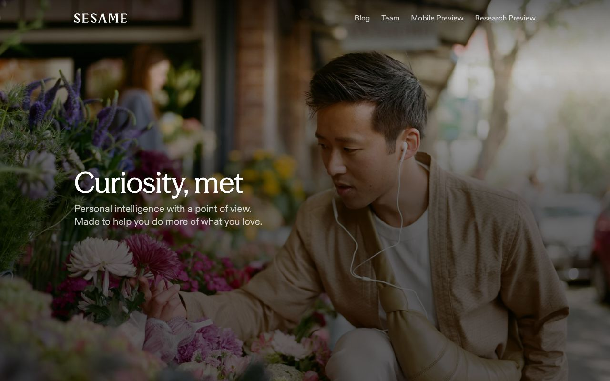</a><br/><b><a href="https://www.sesame.com">Sesame</a></b><br/><sub>No UI at all: warm lifestyle photo of a man with earbuds says voice companion better than screenshots.</sub></td><td width="33%" valign="top"><a href="https://suno.com">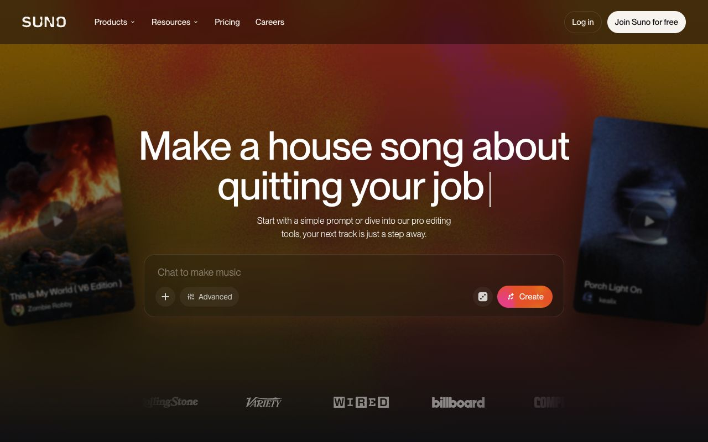</a><br/><b><a href="https://suno.com">Suno</a></b><br/><sub>Headline types out a sample prompt above a chat box; tilted song cards float in warm grainy gradient.</sub></td></tr>
<tr><td width="33%" valign="top"><a href="https://www.anthropic.com">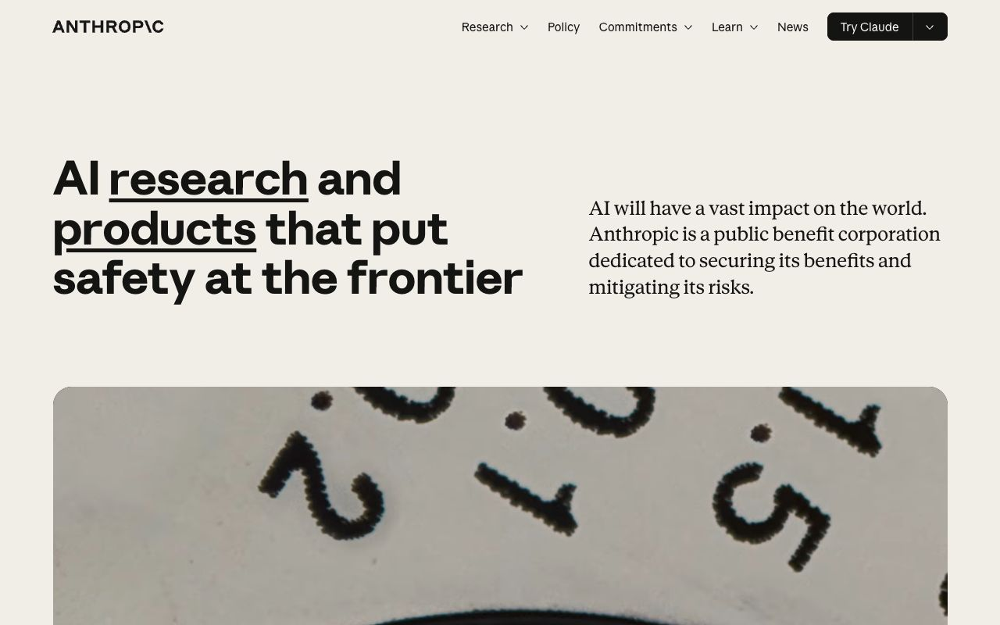</a><br/><b><a href="https://www.anthropic.com">Anthropic</a></b><br/><sub>Warm off-white page, heavy grotesk headline with underlined words beside a serif paragraph, then a macro-photo band.</sub></td><td width="33%" valign="top"><a href="https://pika.art">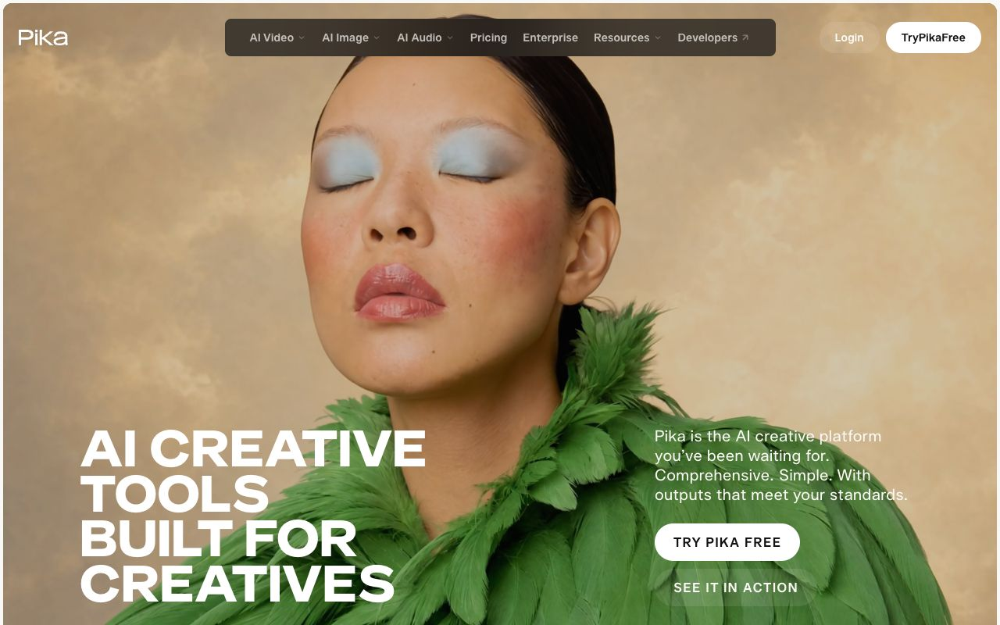</a><br/><b><a href="https://pika.art">Pika</a></b><br/><sub>Full-bleed AI portrait (a woman in a green feather collar) under a huge uppercase headline and a floating pill nav.</sub></td><td width="33%" valign="top"><a href="https://www.moonvalley.com">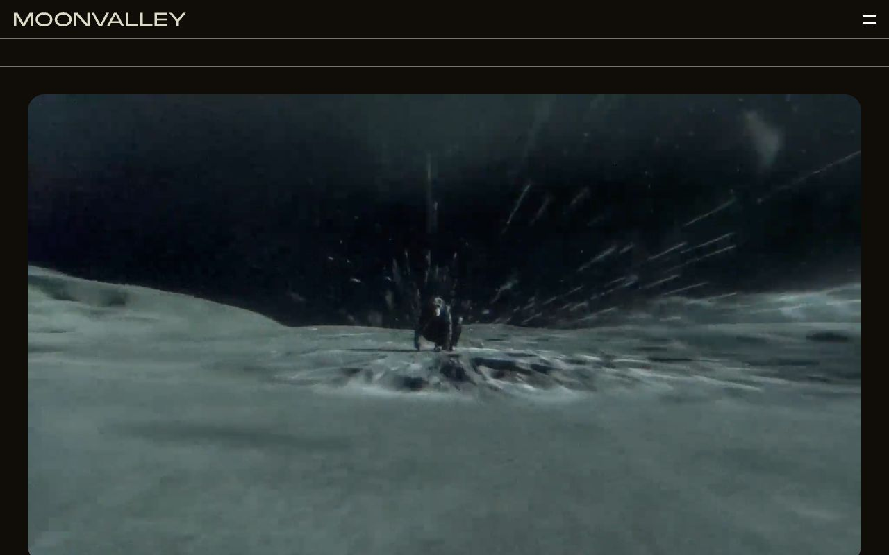</a><br/><b><a href="https://www.moonvalley.com">Moonvalley</a></b><br/><sub>Near-black page, thin wide wordmark, and a cinematic generated video of a figure on a lunar plain.</sub></td></tr>
<tr><td width="33%" valign="top"><a href="https://bfl.ai">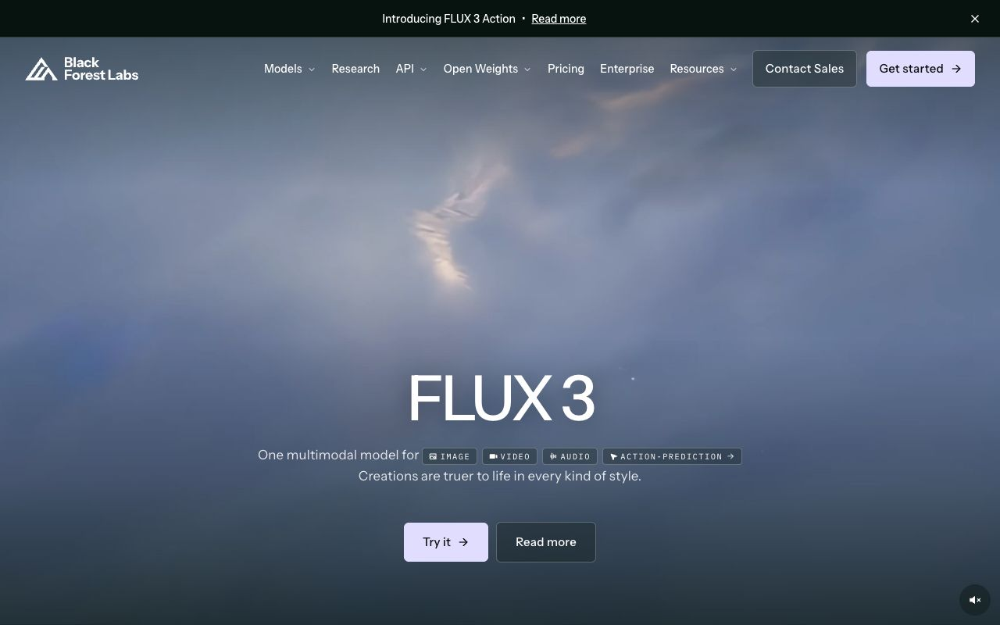</a><br/><b><a href="https://bfl.ai">Black Forest Labs</a></b><br/><sub>FLUX 3 hero over a misty generated-video sky, with small mono chips for image, video and audio.</sub></td><td width="33%" valign="top"><a href="https://deepmind.google">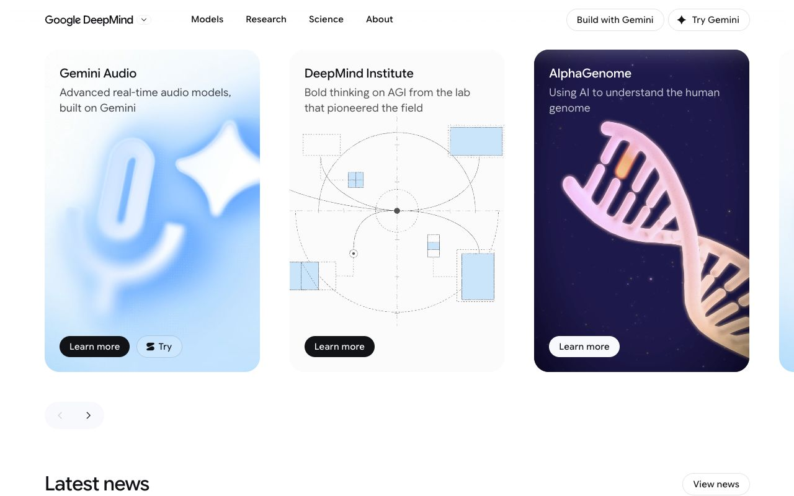</a><br/><b><a href="https://deepmind.google">Google DeepMind</a></b><br/><sub>Carousel of large rounded cards: a soft blue 3D mic, a line-diagram schematic, and a glowing DNA helix.</sub></td><td width="33%" valign="top"><a href="https://www.harvey.ai">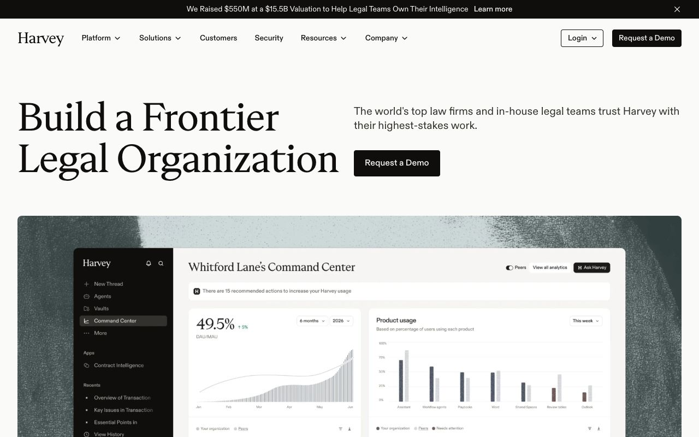</a><br/><b><a href="https://www.harvey.ai">Harvey</a></b><br/><sub>Editorial serif headline on cream, and a product dashboard set on a painterly textured background.</sub></td></tr>
<tr><td width="33%" valign="top"><a href="https://cohere.com">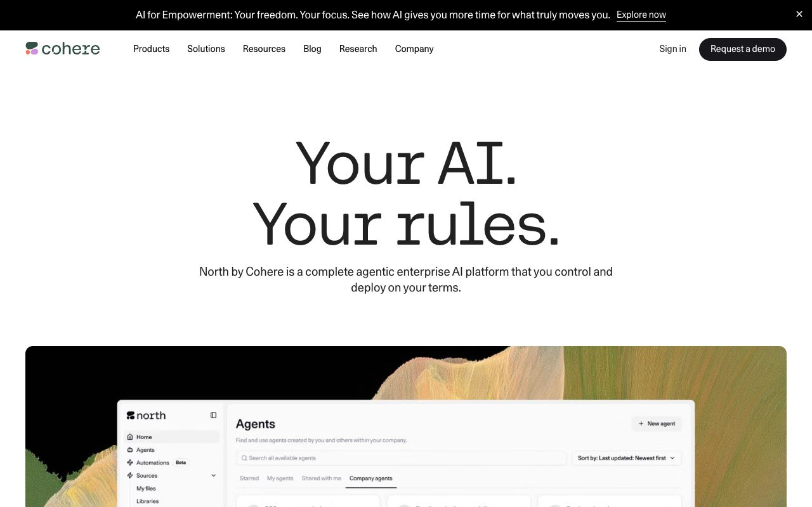</a><br/><b><a href="https://cohere.com">Cohere</a></b><br/><sub>Centred mono-serif 'Your AI. Your rules.' above a product UI set into an organic, painterly landscape.</sub></td><td width="33%" valign="top"><a href="https://poolside.ai">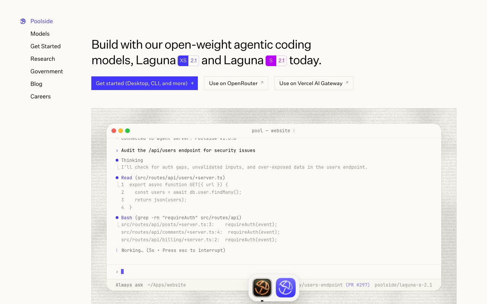</a><br/><b><a href="https://poolside.ai">Poolside</a></b><br/><sub>Quiet left-rail nav, one-line headline with coloured model badges, and a live agent terminal on noise.</sub></td></tr>
</table>

## Sources

- [Higgsfield](https://higgsfield.ai)
- [MDN: the video element](https://developer.mozilla.org/en-US/docs/Web/HTML/Element/video)
