<!-- generated by `pnpm export:md` from content/docs/how-to/draw-and-morph-svg.mdx. Edit the MDX, not this file. -->

# How to draw and morph SVG

*Draw strokes on, send things along a path, and morph one shape into another without twisting.*

<sub>📖 [Read this chapter on the live site](https://frontenddesignbasics.vercel.app/docs/how-to/draw-and-morph-svg) for the interactive version · [← Guide contents](../README.md)</sub>

> - DrawSVG animates a stroke from nothing to whole.
> - MotionPath moves any element along a path and can turn it to face the way it goes.
> - MorphSVG works best when both shapes have similar points in the same direction.

**Goal:** line art that draws itself, followers that ride it, and shapes that melt into each other.

## You need

- `gsap` with `DrawSVGPlugin`, `MotionPathPlugin` and `MorphSVGPlugin`. All free since GSAP 3.13.
- SVG paths, exported from Figma or drawn by hand.

```text
 DrawSVG     "0% 0%"  ─► "0% 100%"   stroke grows
             "0% 10%" ─► "90% 100%"  window travels
 MotionPath  ●═══════════►           rides the path
 MorphSVG    ■ ─► ♦ ─► ●             matched points
```

## Steps

### 1. Register the plugins

```ts
import gsap from 'gsap';
import { DrawSVGPlugin } from 'gsap/DrawSVGPlugin';
import { MotionPathPlugin } from 'gsap/MotionPathPlugin';
import { MorphSVGPlugin } from 'gsap/MorphSVGPlugin';
gsap.registerPlugin(DrawSVGPlugin, MotionPathPlugin, MorphSVGPlugin);
```

### 2. Draw a stroke on

```ts
gsap.from('.trace', { drawSVG: 0, duration: 1.2, ease: 'power2.inOut', stagger: 0.08 });
```

For a moving light, animate a window: `gsap.fromTo(path, { drawSVG: '0% 10%' }, { drawSVG: '90% 100%', ease: 'none', repeat: -1 })`.

### 3. Send a follower along the path

```ts
gsap.to('.dot', {
  motionPath: { path: '#trace-1', align: '#trace-1', alignOrigin: [0.5, 0.5], autoRotate: true },
  duration: 2, ease: 'none', repeat: -1,
});
```

`align` puts the follower on the path even if it lives elsewhere in the SVG.

### 4. Prepare shapes for a morph

Turn circles and rects into paths first: `MorphSVGPlugin.convertToPath('circle, rect')`. Then draw
both shapes starting at the same spot (top centre, say) and going the same way (clockwise). Similar
point counts help too.

### 5. Morph, and fix twisting with shapeIndex

```ts
gsap.to('#shape', { morphSVG: { shape: '#star', shapeIndex: 'auto' }, duration: 1, ease: 'power4.inOut' });
```

If it still twists, try whole numbers for `shapeIndex`. In development, `shapeIndex: 'log'` prints the
value it picked so you can hard-code it.

### 6. Glow without SVG filters

`feGaussianBlur` repaints the whole filter area on every frame. Instead, draw the same path three
times: wide and faint, medium, then thin and near-white. It looks like light, it stays sharp, and it
costs almost nothing. [Neon light paths](./neon-light-paths.md) has the code.

### 7. Honour reduced motion

Wrap it all in `gsap.matchMedia()` with `(prefers-reduced-motion: no-preference)`. Reduced motion gets
the fully drawn, final shape with no loop.

## Why it works

A drawn line shows how something is made, which is why diagrams feel clearer when they draw
themselves. Matched points keep a morph readable: the eye can follow each corner to its new place.

## See it live

- [Circuit board](/lab/circuit-board)

**In the wild · 14 examples**

<table>
<tr><td width="33%" valign="top"><a href="https://www.hellomonday.com">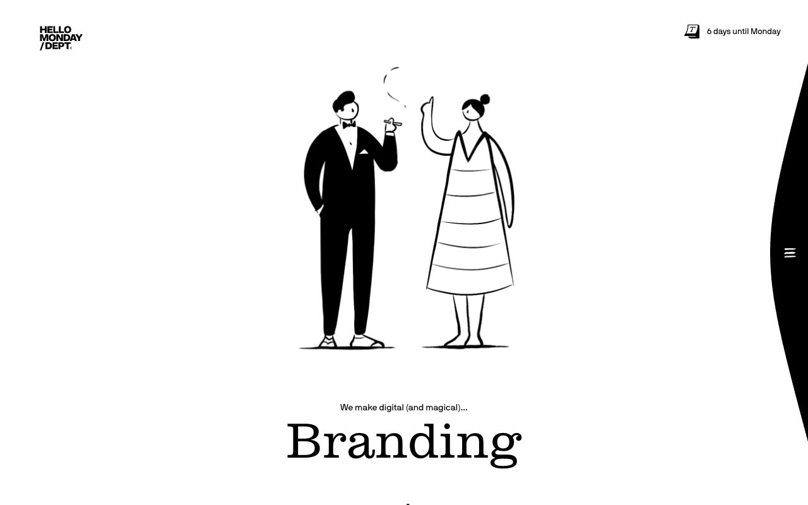</a><br/><b><a href="https://www.hellomonday.com">Hello Monday</a></b><br/><sub>Hand-drawn animated couple above a rotating serif word, with a curved black menu edge peeking in.</sub></td><td width="33%" valign="top"><a href="https://aristidebenoist.com">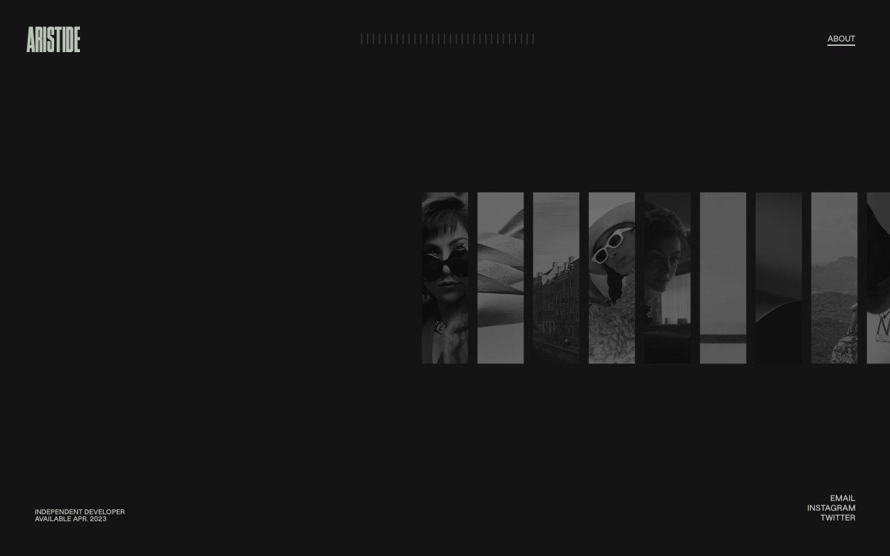</a><br/><b><a href="https://aristidebenoist.com">Aristide Benoist</a></b><br/><sub>Caught mid-intro: thin vertical photo strips sliding into place under a tick-mark progress bar.</sub></td><td width="33%" valign="top"><a href="https://activetheory.net">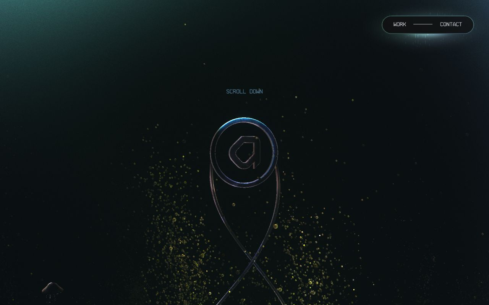</a><br/><b><a href="https://activetheory.net">Active Theory</a></b><br/><sub>Real-time WebGL scene: glossy chrome ribbon logo floating among drifting golden particles and a jellyfish.</sub></td></tr>
<tr><td width="33%" valign="top"><a href="https://monopo.london">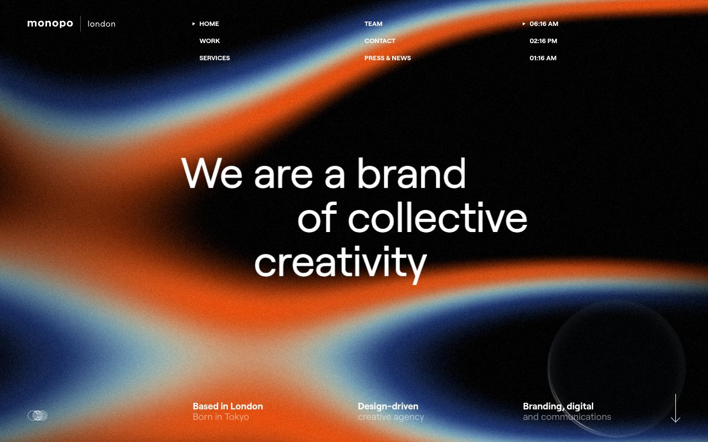</a><br/><b><a href="https://monopo.london">monopo london</a></b><br/><sub>Grainy animated orange-and-blue gradient waves behind the headline, with a glass lens cursor bottom right.</sub></td><td width="33%" valign="top"><a href="https://makemepulse.com">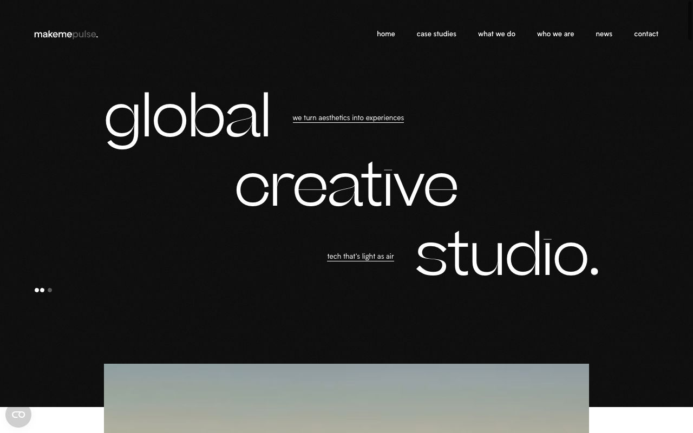</a><br/><b><a href="https://makemepulse.com">makemepulse</a></b><br/><sub>Kinetic staggered headline, 'global creative studio.', whose letters morph between typeface styles.</sub></td><td width="33%" valign="top"><a href="https://gsap.com">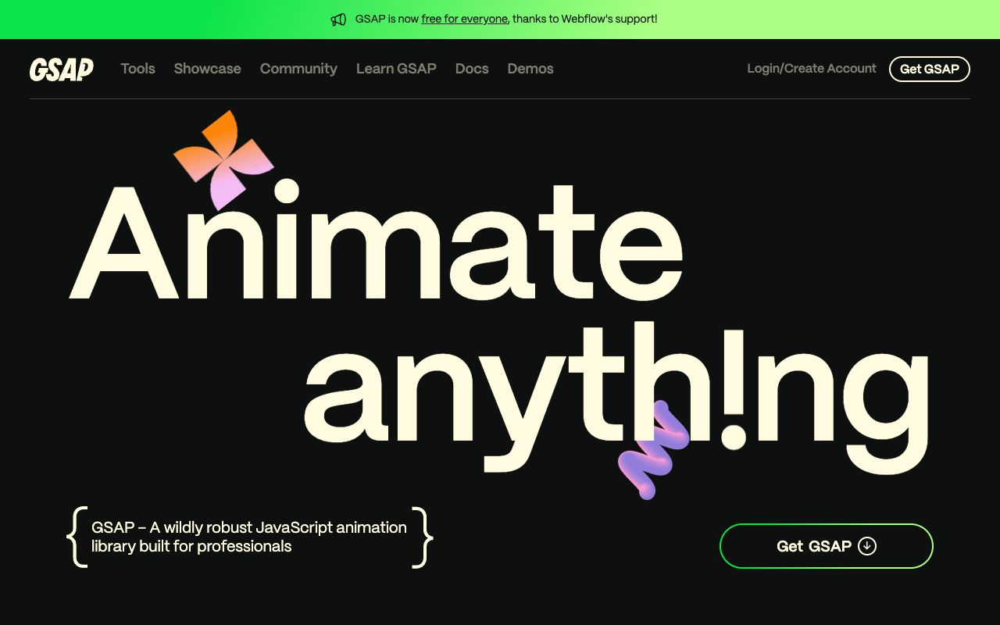</a><br/><b><a href="https://gsap.com">GSAP</a></b><br/><sub>'Animate anything' hero with playful 3D squiggle and pinwheel shapes animating over giant type.</sub></td></tr>
<tr><td width="33%" valign="top"><a href="https://rive.app">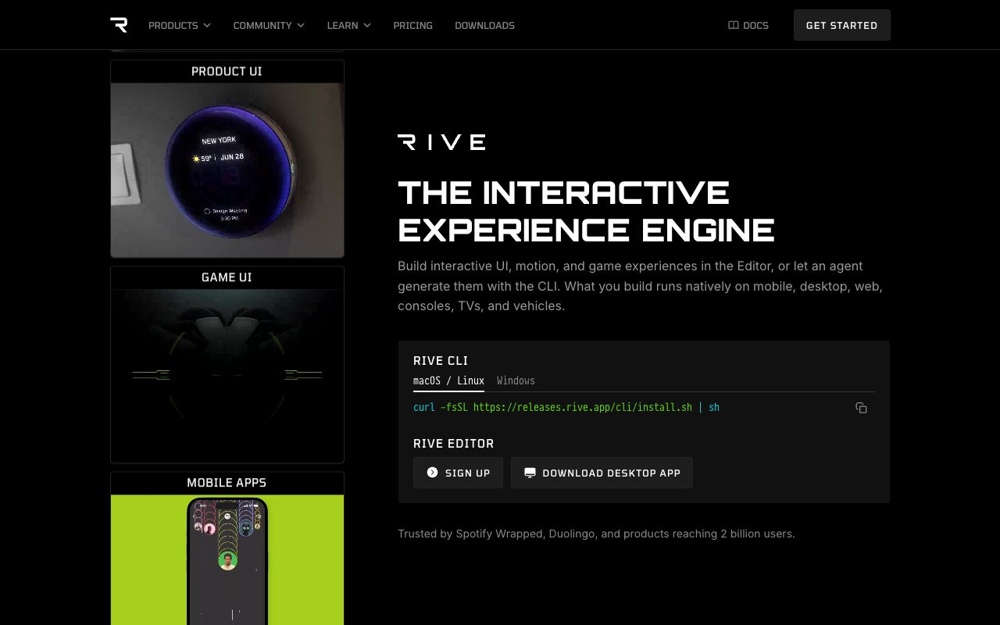</a><br/><b><a href="https://rive.app">Rive</a></b><br/><sub>Column of live interactive animation demos (thermostat, game UI, mobile app) running beside the pitch.</sub></td><td width="33%" valign="top"><a href="https://dogstudio.co">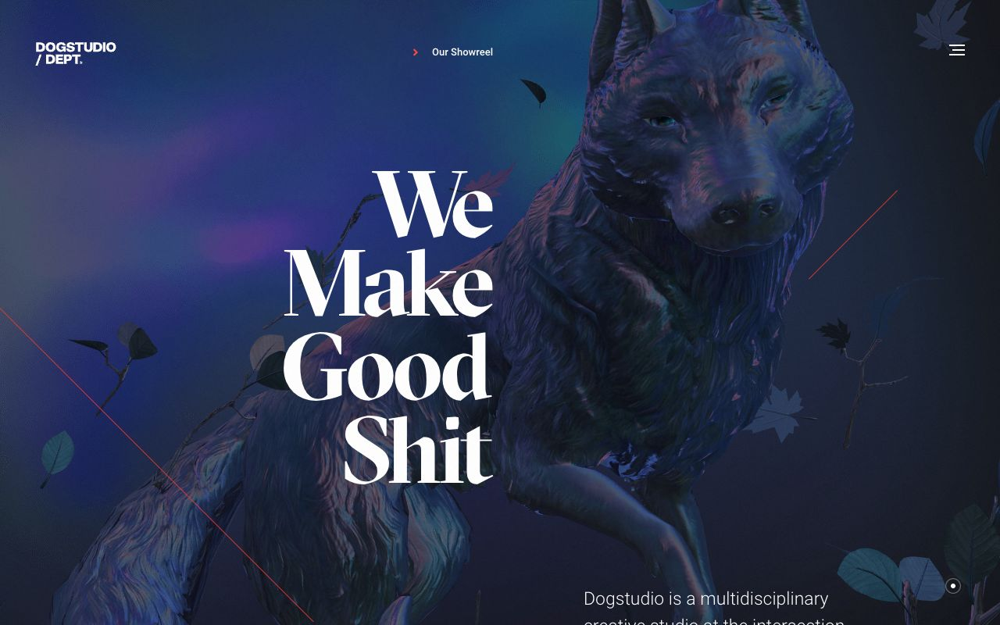</a><br/><b><a href="https://dogstudio.co">Dogstudio</a></b><br/><sub>Iridescent 3D wolf with drifting leaves behind a huge serif headline. Headline contains a swear word.</sub></td><td width="33%" valign="top"><a href="https://www.exoape.com"></a><br/><b><a href="https://www.exoape.com">Exo Ape</a></b><br/><sub>Full-bleed Venice dome photo with an oversized 'Digital' wordmark sliding up from the bottom edge.</sub></td></tr>
<tr><td width="33%" valign="top"><a href="https://boc.studio">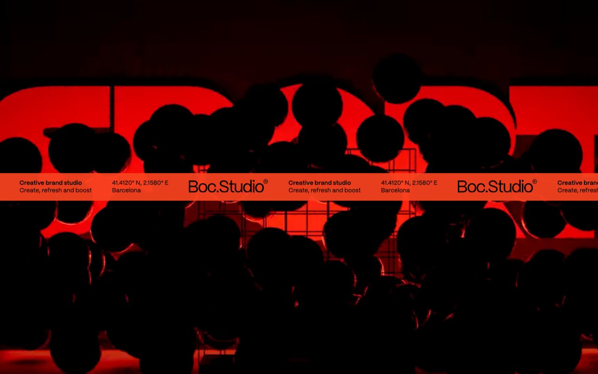</a><br/><b><a href="https://boc.studio">Boc.Studio</a></b><br/><sub>Black spheres tumble over glowing red letterforms, cut by a scrolling orange ticker band carrying the logo.</sub></td><td width="33%" valign="top"><a href="https://cuberto.com">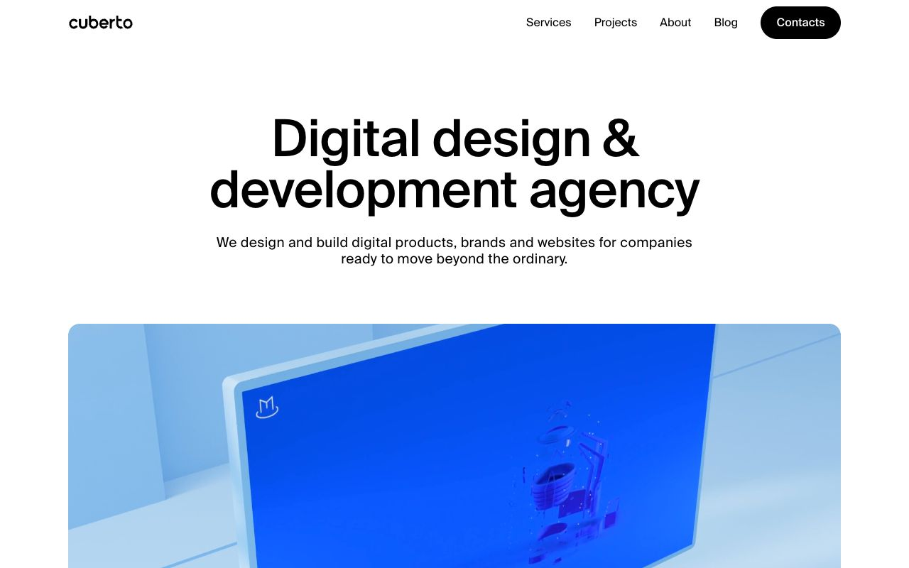</a><br/><b><a href="https://cuberto.com">Cuberto</a></b><br/><sub>Calm centred headline over a rounded video card of a 3D screen scene; motion lives inside the media.</sub></td><td width="33%" valign="top"><a href="https://pensatori-irrazionali.com/">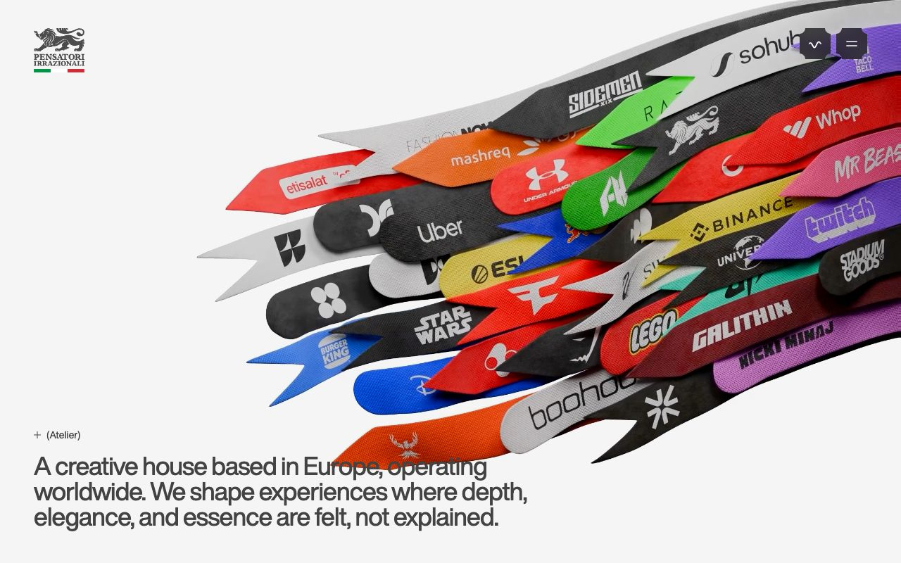</a><br/><b><a href="https://pensatori-irrazionali.com/">Pensatori Irrazionali</a></b><br/><sub>Rendered fabric ribbons with client logos sweep across the frame like a flag, beside a quiet grey statement.</sub></td></tr>
<tr><td width="33%" valign="top"><a href="https://poppr.be">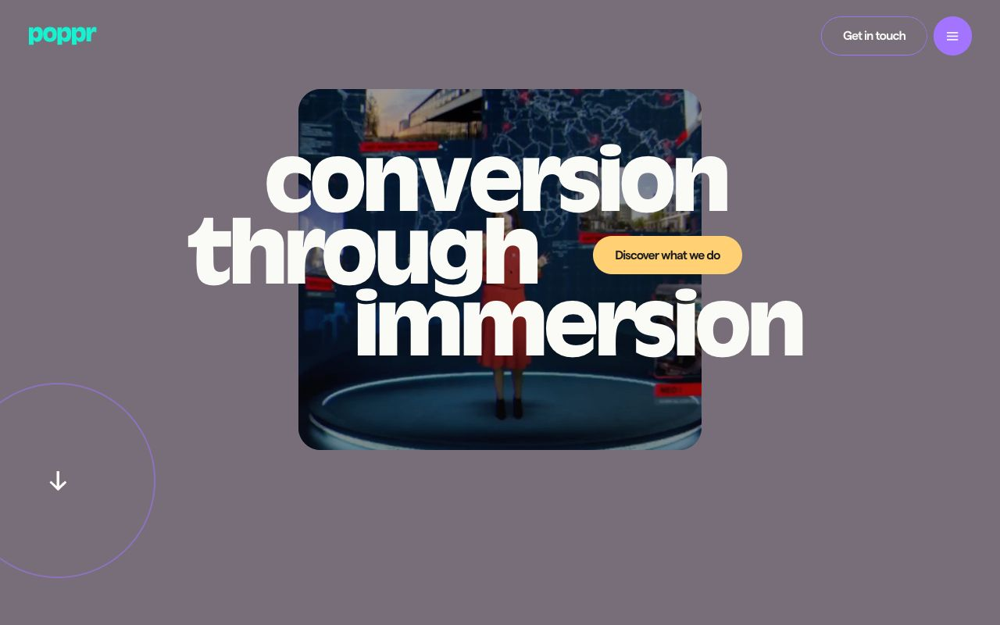</a><br/><b><a href="https://poppr.be">poppr</a></b><br/><sub>Heavy staggered headline overlaps a rounded video card, with a pill CTA and circular scroll cue.</sub></td><td width="33%" valign="top"><a href="https://www.rejouice.com">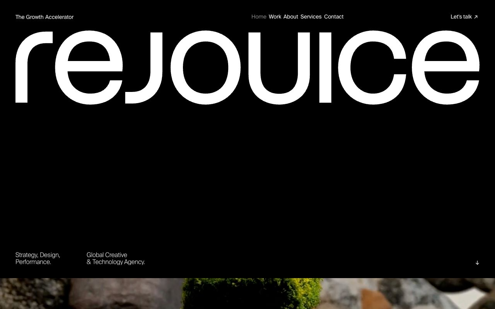</a><br/><b><a href="https://www.rejouice.com">Rejouice</a></b><br/><sub>Full-width white wordmark on black, with a video reel rising from below as the next reveal.</sub></td></tr>
</table>

## Sources

- [MDN: SVG paths](https://developer.mozilla.org/en-US/docs/Web/SVG/Tutorial/Paths)
- [GSAP: ScrollTrigger](https://gsap.com/docs/v3/Plugins/ScrollTrigger/)
