<!-- generated by `pnpm export:md` from content/docs/how-to/hero-bento-footer.mdx. Edit the MDX, not this file. -->

# How to build a hero, a bento grid and a footer

*The three sections every landing page needs, each built from type scale, one accent and space.*

<sub>📖 [Read this chapter on the live site](https://frontenddesignbasics.vercel.app/docs/how-to/hero-bento-footer) for the interactive version · [← Guide contents](../README.md)</sub>

> - Hero: one huge headline, one sentence, one primary action, a texture kept behind the text.
> - Bento: the biggest cell carries the idea, one gap value everywhere.
> - Footer: name, three to five links, a real sign-off, room above it.

**Goal:** a first screen that says what this is, a grid that ranks ideas, and an ending that feels like one.

## You need

- Your type scale and tokens. See [Scales and type](../rules/scales-and-type.md).
- Optional: a shader or image for the hero texture.

```text
 HERO                     BENTO
 ┌──────────────────┐     ┌──────┬───┬───┐
 │ eyebrow          │     │ BIG  │ ▪ │ ▪ │
 │ HEADLINE, HUGE   │     │ IDEA ├───┴───┤
 │ one line, 44ch   │     │      │ story │
 │ [primary] (alt)  │     ├───┬──┴───────┤
 └──────────────────┘     │ ▪ │ action   │
                          └───┴──────────┘
 FOOTER  name · contact · source · legal · sign-off
```

## Steps

### 1. Build the hero in layers

| Layer | Rule |
|---|---|
| Texture | A background with a subject, kept behind text |
| Headline | One huge thing per view: `clamp(3rem, 9vw, 8.5rem)`, tight leading |
| Support | One sentence, 44ch max |
| Actions | One solid button, one outline |
| Eyebrow | Small, mono, uppercase, tracked |

```tsx
<section className="relative min-h-[82svh] overflow-hidden">
  <Texture />
  <div className="relative flex min-h-[82svh] flex-col justify-between p-10">
    <p className="font-pixel text-[16px] uppercase">A field guide</p>
    <div>
      <h1 className="font-display text-[clamp(3rem,9vw,8.5rem)] leading-[0.9]">…</h1>
      <p className="mt-6 max-w-[44ch]">…</p>
    </div>
  </div>
</section>
```

### 2. Reveal the headline with a mask

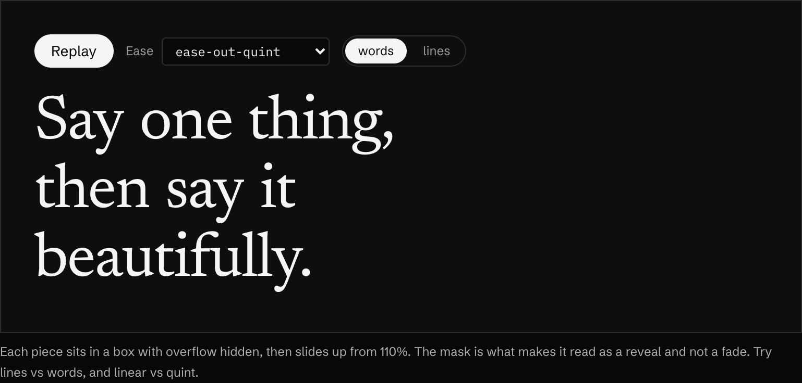

<sub>▶ Interactive on the [live site](https://frontenddesignbasics.vercel.app/docs/how-to/hero-bento-footer).</sub>

Each word sits in an overflow-hidden box and slides up into view. Use an ease-out and a short stagger.

### 3. Build the bento

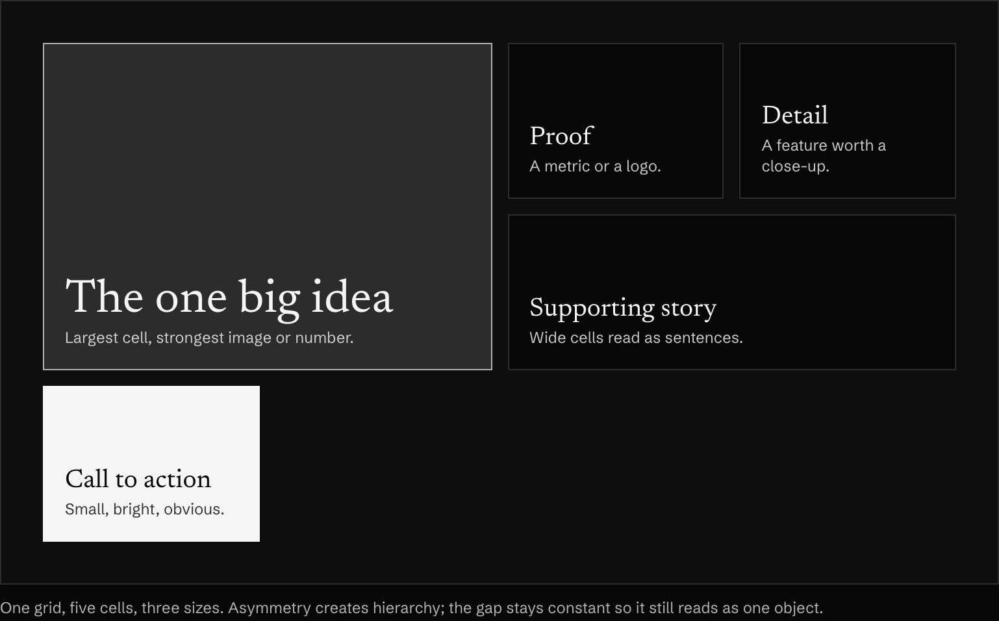

<sub>▶ Interactive on the [live site](https://frontenddesignbasics.vercel.app/docs/how-to/hero-bento-footer).</sub>

```tsx
<div className="grid auto-rows-[7.5rem] gap-3 sm:grid-cols-4">
  <div className="sm:col-span-2 sm:row-span-2">The one big idea</div>
  <div>Proof</div>
  <div>Detail</div>
  <div className="sm:col-span-2">Supporting story</div>
  <div>Call to action</div>
</div>
```

The biggest cell carries the idea. The accent cell carries the action. Keep one gap value.

### 4. Finish with a real footer

- The name and one line of what it is.
- The three to five links people look for: contact, source, legal.
- A sign-off with some personality.
- Enough space above it to feel like an ending.

## Pitfalls

- **Two primary buttons.** Only one thing can be the main action.
- **A magnetic button everywhere.** Use it once, on the hero action, never on forms or nav.

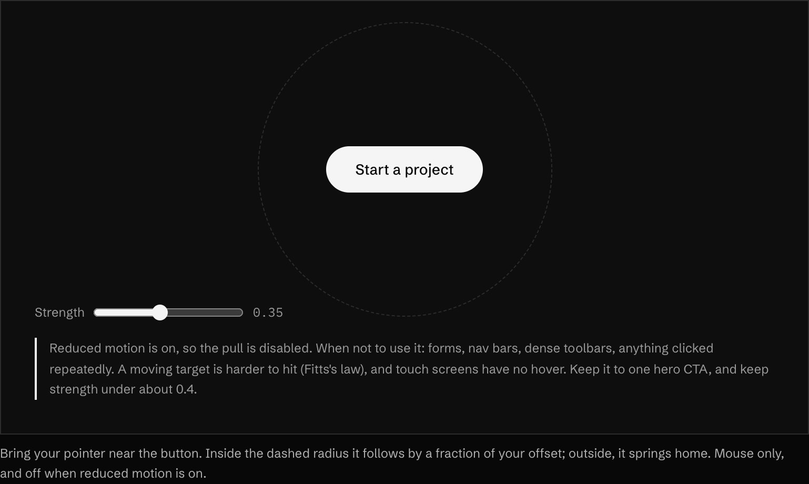

<sub>▶ Interactive on the [live site](https://frontenddesignbasics.vercel.app/docs/how-to/hero-bento-footer).</sub>

## Why it works

These sections are the rules under load: a type scale, one accent, space and motion applied to a
common job. That is why they can be reused without looking reused.

## See it live

- [Flip bento](/lab/flip-bento)
- [Kinetic poster](/lab/kinetic-poster)

**Heroes in the wild · 15 examples**

<table>
<tr><td width="33%" valign="top"><a href="https://www.wearecollins.com"></a><br/><b><a href="https://www.wearecollins.com">Collins</a></b><br/><sub>One serif line, 'Rewrite your worth.', centred in vast off-white space above small award laurels.</sub></td><td width="33%" valign="top"><a href="https://www.instrument.com"></a><br/><b><a href="https://www.instrument.com">Instrument</a></b><br/><sub>Edge-to-edge black ultra-heavy wordmark over a rounded case-study video panel; pill nav buttons.</sub></td><td width="33%" valign="top"><a href="https://14islands.com"></a><br/><b><a href="https://14islands.com">14islands</a></b><br/><sub>Huge staggered 'Design & Technology' type on grey, grey ampersand, tiny caps tagline, nothing else.</sub></td></tr>
<tr><td width="33%" valign="top"><a href="https://pangrampangram.com"></a><br/><b><a href="https://pangrampangram.com">Pangram Pangram</a></b><br/><sub>Rounded photo card of Alps with giant 'Neue Gstaad' set in the typeface, two small CTAs.</sub></td><td width="33%" valign="top"><a href="https://klim.co.nz">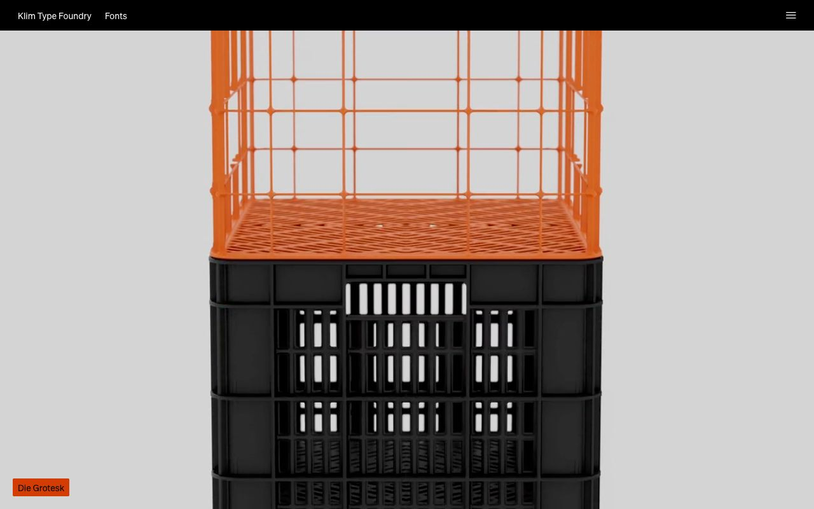</a><br/><b><a href="https://klim.co.nz">Klim Type Foundry</a></b><br/><sub>Single full-bleed image: orange crate stacked on black crate, grey ground, one tiny font label.</sub></td><td width="33%" valign="top"><a href="https://activetheory.net">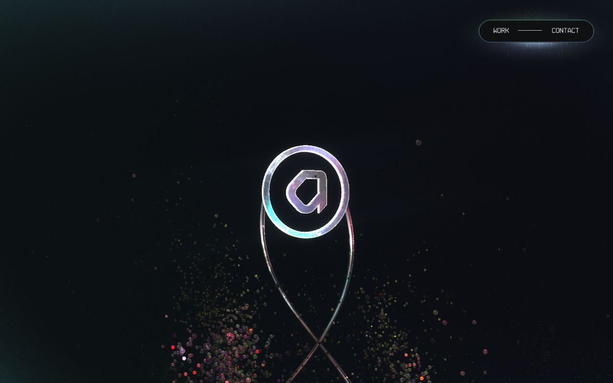</a><br/><b><a href="https://activetheory.net">Active Theory</a></b><br/><sub>Dark WebGL scene: iridescent 3D 'a' logo ring on a looping ribbon, bokeh particles, glass nav pill.</sub></td></tr>
<tr><td width="33%" valign="top"><a href="https://www.hellomonday.com">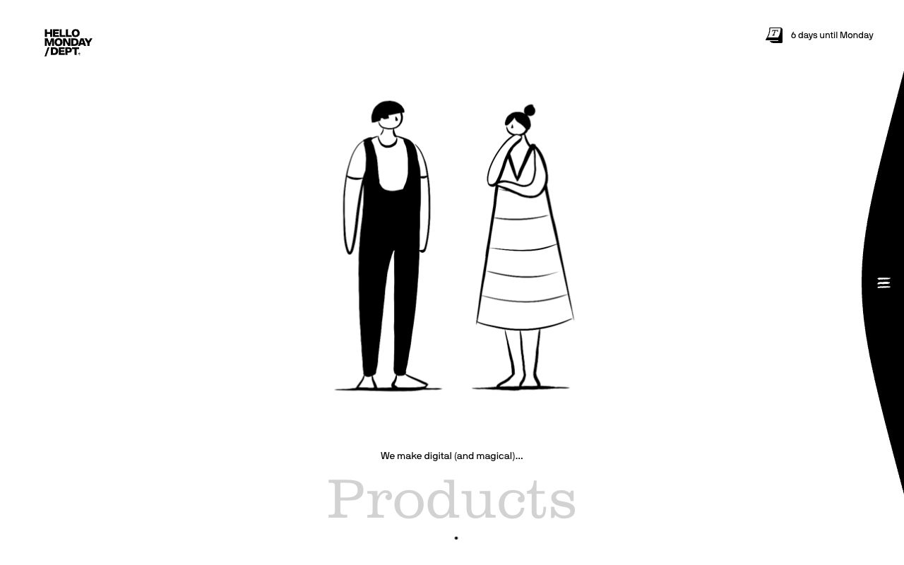</a><br/><b><a href="https://www.hellomonday.com">Hello Monday</a></b><br/><sub>Two hand-drawn characters above rotating serif word 'Products'; black blob menu on right edge.</sub></td><td width="33%" valign="top"><a href="https://arc.net">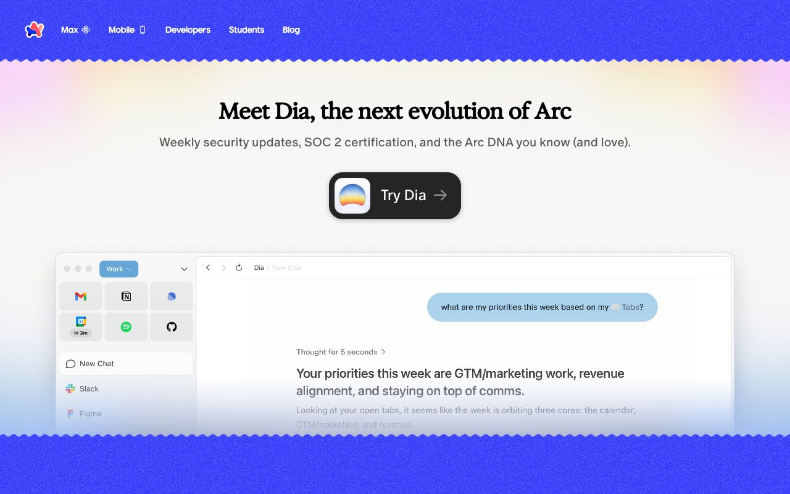</a><br/><b><a href="https://arc.net">Arc / Dia</a></b><br/><sub>Wavy blue frame, serif 'Meet Dia' headline, one dark app-icon CTA, browser product shot below.</sub></td><td width="33%" valign="top"><a href="https://www.pentagram.com">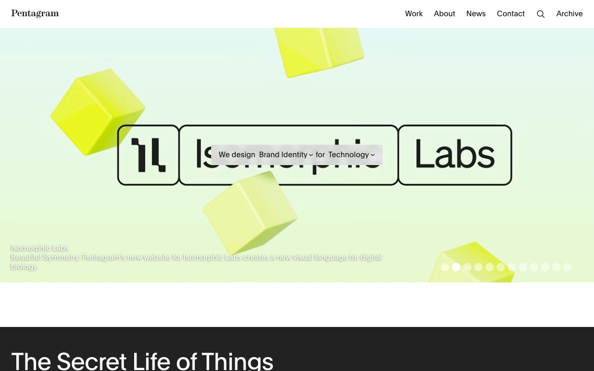</a><br/><b><a href="https://www.pentagram.com">Pentagram</a></b><br/><sub>Full-width case-study image (yellow cubes, Isomorphic Labs mark) with interactive 'We design ___ for ___' sentence.</sub></td></tr>
<tr><td width="33%" valign="top"><a href="https://www.paulkalkbrenner.net/">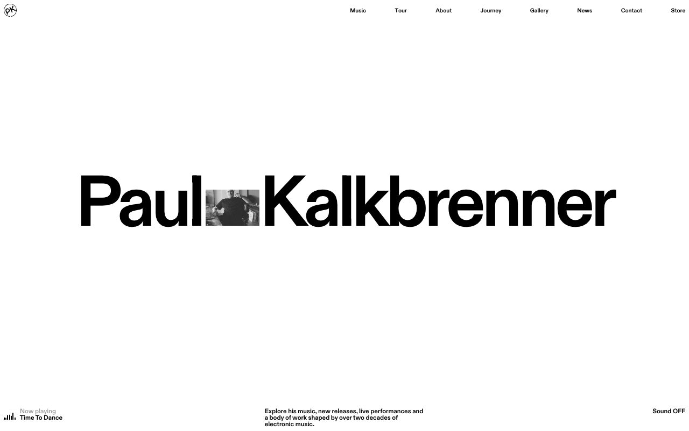</a><br/><b><a href="https://www.paulkalkbrenner.net/">Paul Kalkbrenner</a></b><br/><sub>Huge black name on white with a small photo set inside the wordmark; everything else stays tiny.</sub></td><td width="33%" valign="top"><a href="https://noho.ink">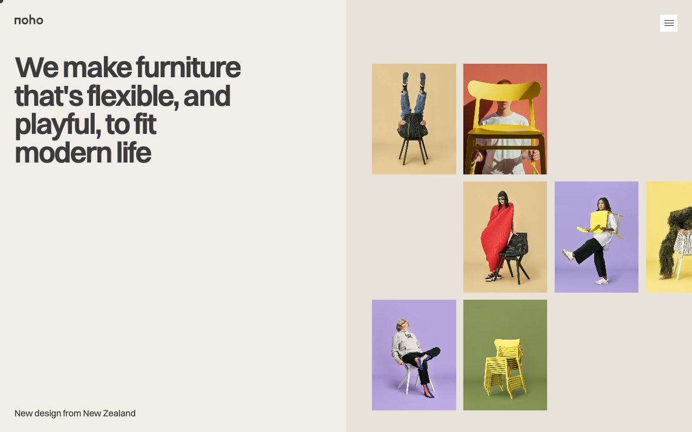</a><br/><b><a href="https://noho.ink">noho</a></b><br/><sub>Split hero: bold tight headline on warm cream at left, staggered grid of colourful product photos at right.</sub></td><td width="33%" valign="top"><a href="https://www.seasats.com/">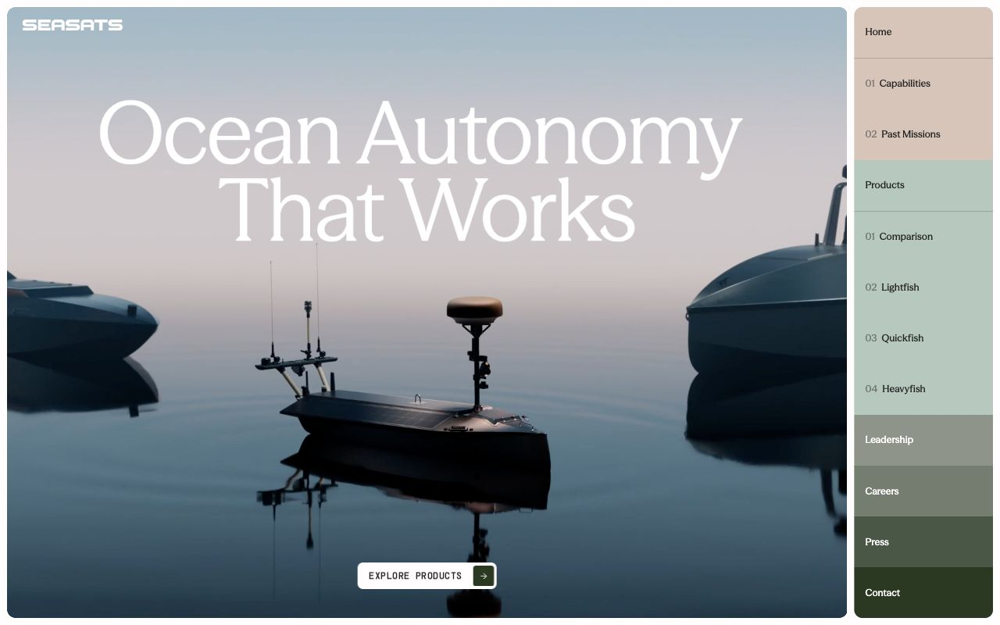</a><br/><b><a href="https://www.seasats.com/">Seasats</a></b><br/><sub>Calm full-bleed boat photo under a large serif headline, with a colour-stepped nav column on the right.</sub></td></tr>
<tr><td width="33%" valign="top"><a href="https://www.trevornoah.com/">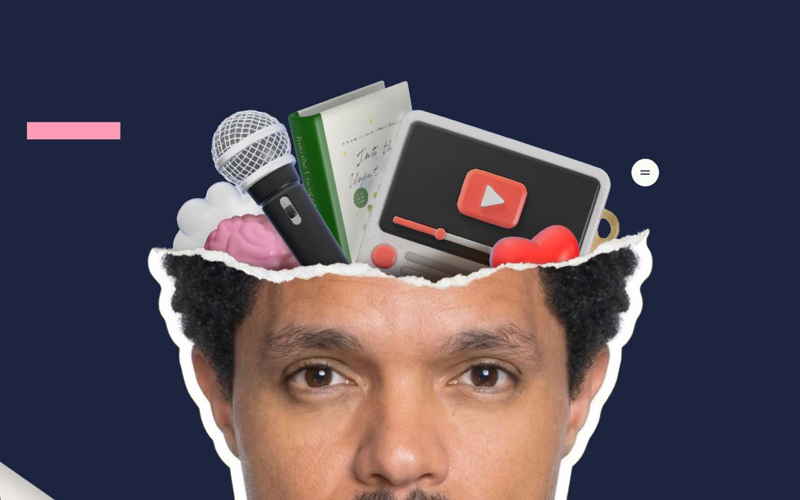</a><br/><b><a href="https://www.trevornoah.com/">Trevor Noah</a></b><br/><sub>Torn-paper portrait collage with 3D objects bursting from his head, on flat navy: personality over headline.</sub></td><td width="33%" valign="top"><a href="https://www.warmnfuzzy.tv/">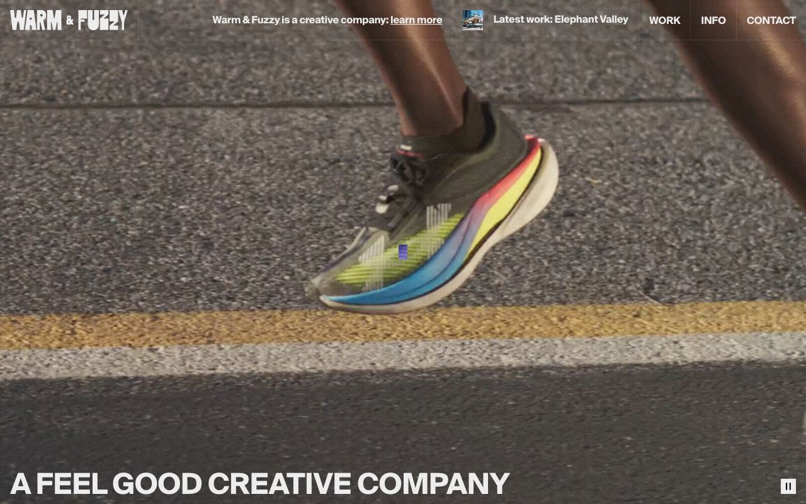</a><br/><b><a href="https://www.warmnfuzzy.tv/">Warm & Fuzzy</a></b><br/><sub>Full-screen video of a running shoe, a thin bar nav on top, heavy uppercase tagline anchored bottom-left.</sub></td><td width="33%" valign="top"><a href="https://white-desert.com/">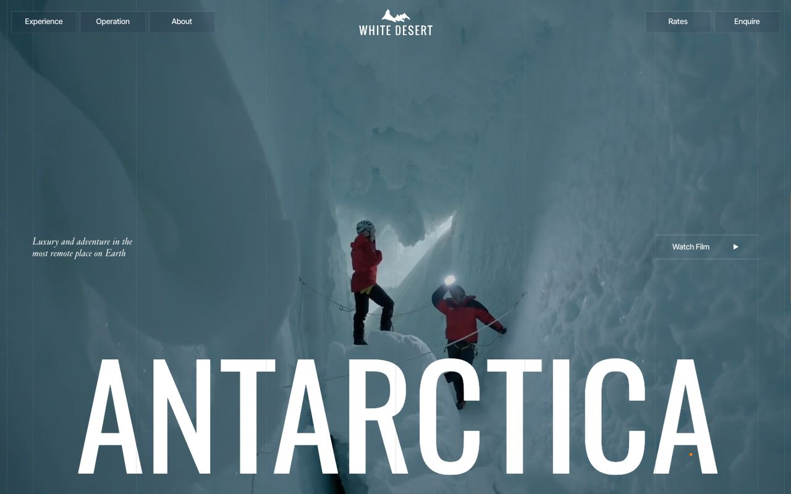</a><br/><b><a href="https://white-desert.com/">White Desert</a></b><br/><sub>Ice-cave film behind a giant condensed ANTARCTICA; small italic serif line and Watch Film link balance it.</sub></td></tr>
</table>

**Bento grids in the wild · 13 examples**

<table>
<tr><td width="33%" valign="top"><a href="https://www.apple.com/macbook-pro/"></a><br/><b><a href="https://www.apple.com/macbook-pro/">MacBook Pro</a></b><br/><sub>Dark rounded tiles of mixed sizes: photo tiles with big claims beside icon-only tiles for ports, gaming.</sub></td><td width="33%" valign="top"><a href="https://supabase.com"></a><br/><b><a href="https://supabase.com">Supabase</a></b><br/><sub>One wide Postgres tile plus seven product tiles, each with a small line-art illustration of its feature.</sub></td><td width="33%" valign="top"><a href="https://clerk.com"></a><br/><b><a href="https://clerk.com">Clerk</a></b><br/><sub>Dark bento of auth features: tall session-management tile, OTP boxes, SSO node graph, magic-link card.</sub></td></tr>
<tr><td width="33%" valign="top"><a href="https://www.notion.com">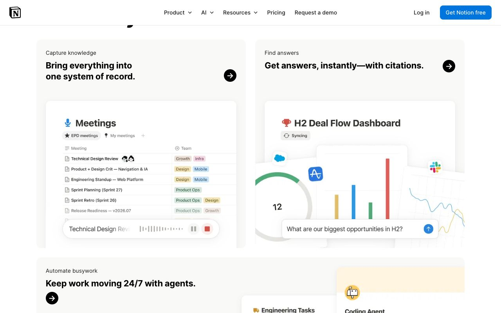</a><br/><b><a href="https://www.notion.com">Notion</a></b><br/><sub>Two big grey tiles with arrow buttons holding real product UI (meetings table, deal dashboard), wide tile below.</sub></td><td width="33%" valign="top"><a href="https://tailwindcss.com">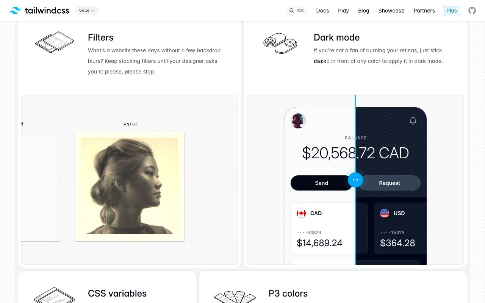</a><br/><b><a href="https://tailwindcss.com">Tailwind CSS</a></b><br/><sub>Feature tiles each with a live demo: sepia filter photo, draggable light/dark split on a banking card.</sub></td><td width="33%" valign="top"><a href="https://www.mintlify.com">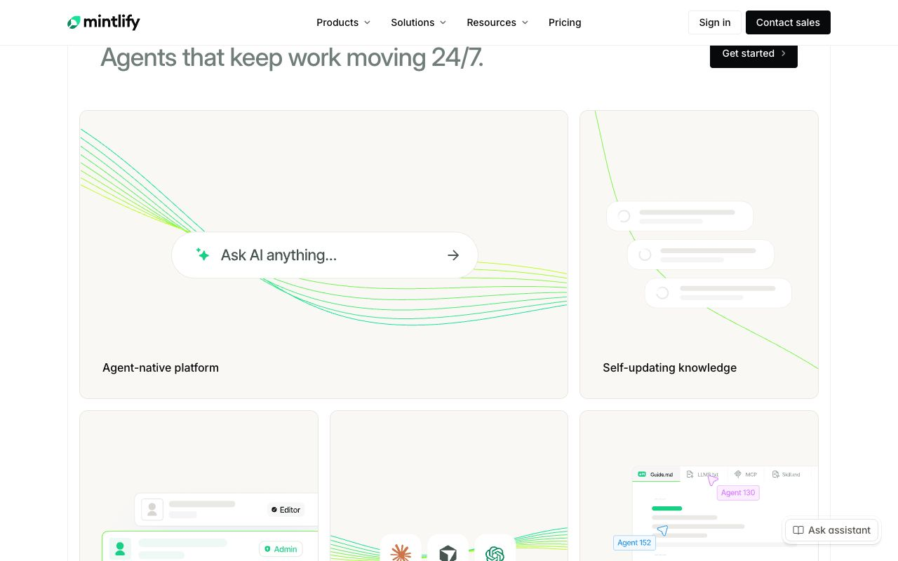</a><br/><b><a href="https://www.mintlify.com">Mintlify</a></b><br/><sub>Wide-plus-narrow top row, three tiles below; soft beige tiles tied together by flowing green lines.</sub></td></tr>
<tr><td width="33%" valign="top"><a href="https://cal.com">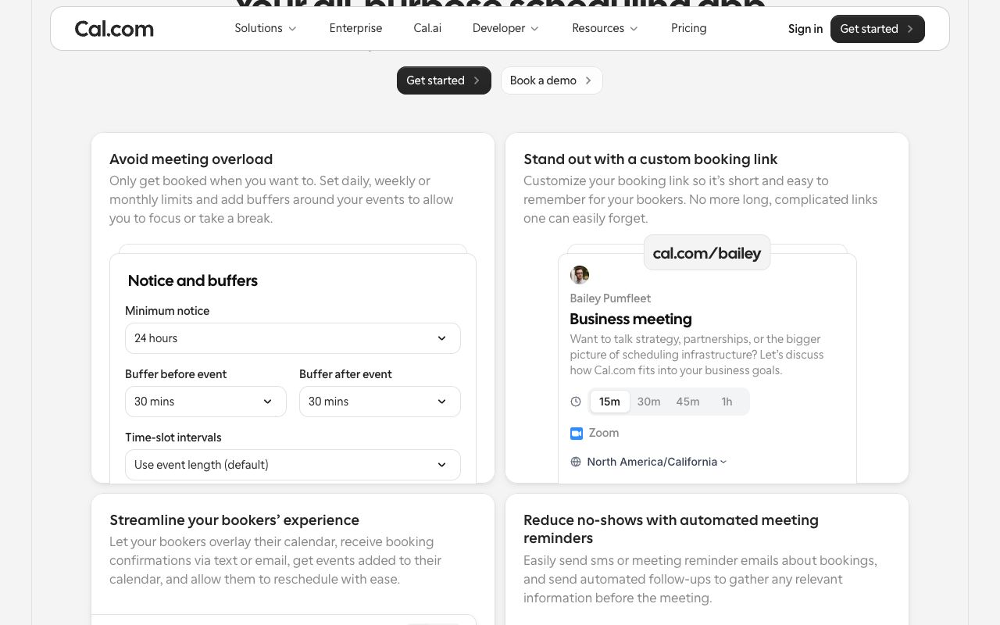</a><br/><b><a href="https://cal.com">Cal.com</a></b><br/><sub>2x2 grid of white cards, each a benefit headline over a real settings or booking-link UI fragment.</sub></td><td width="33%" valign="top"><a href="https://www.sketch.com">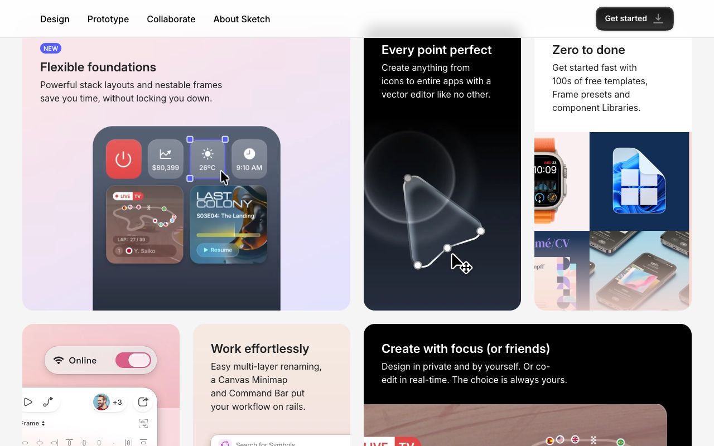</a><br/><b><a href="https://www.sketch.com">Sketch</a></b><br/><sub>Mixed-size pastel and black tiles: wide pink card with widget UI, dark vector-pen card, template collage.</sub></td><td width="33%" valign="top"><a href="https://cleanshot.com">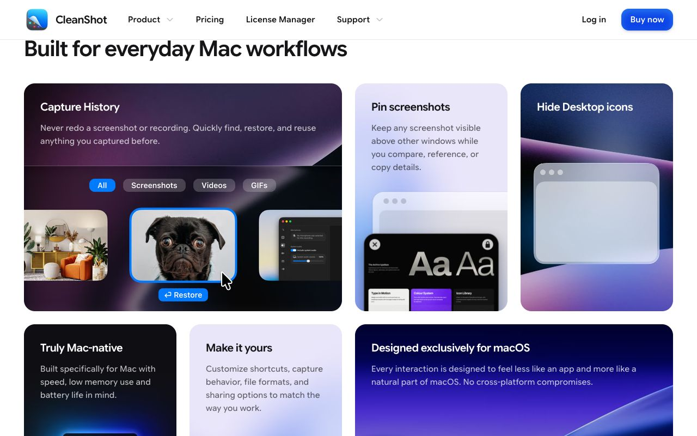</a><br/><b><a href="https://cleanshot.com">CleanShot X</a></b><br/><sub>'Built for everyday Mac workflows' bento: wide Capture History tile, lilac and aurora-gradient cards in uneven widths.</sub></td></tr>
<tr><td width="33%" valign="top"><a href="https://procreate.com">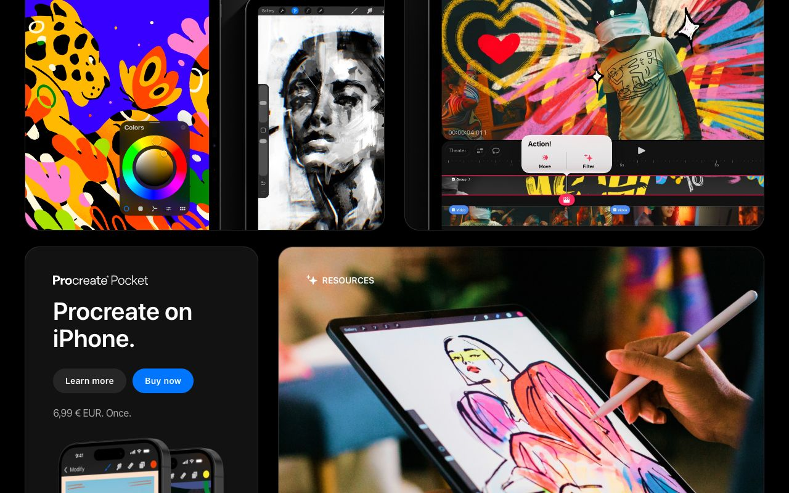</a><br/><b><a href="https://procreate.com">Procreate</a></b><br/><sub>Dark rounded tiles of different sizes: two large iPad product cards, narrow Pocket card, wide photo resources tile.</sub></td><td width="33%" valign="top"><a href="https://www.unkey.com">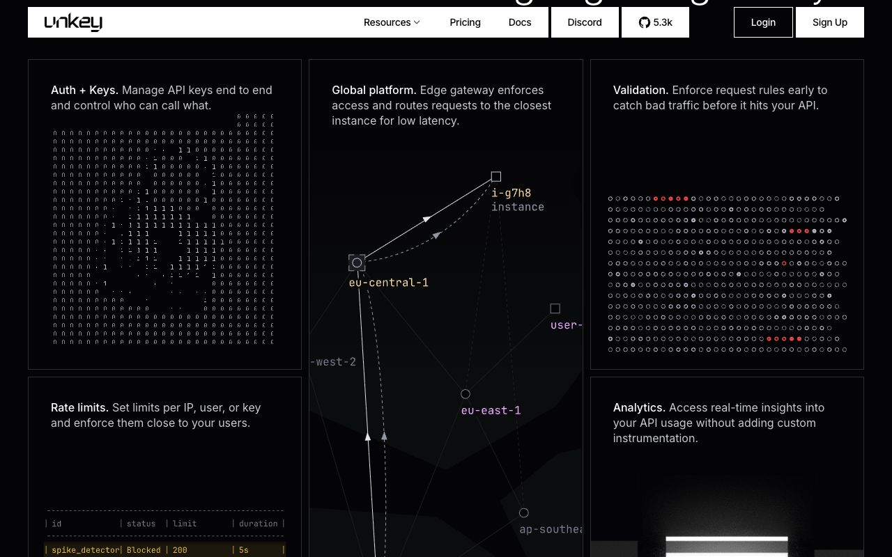</a><br/><b><a href="https://www.unkey.com">Unkey</a></b><br/><sub>Monochrome dev bento: ASCII-art keys tile, tall global-network map tile, dotted validation grid, terminal table.</sub></td><td width="33%" valign="top"><a href="https://e2b.dev">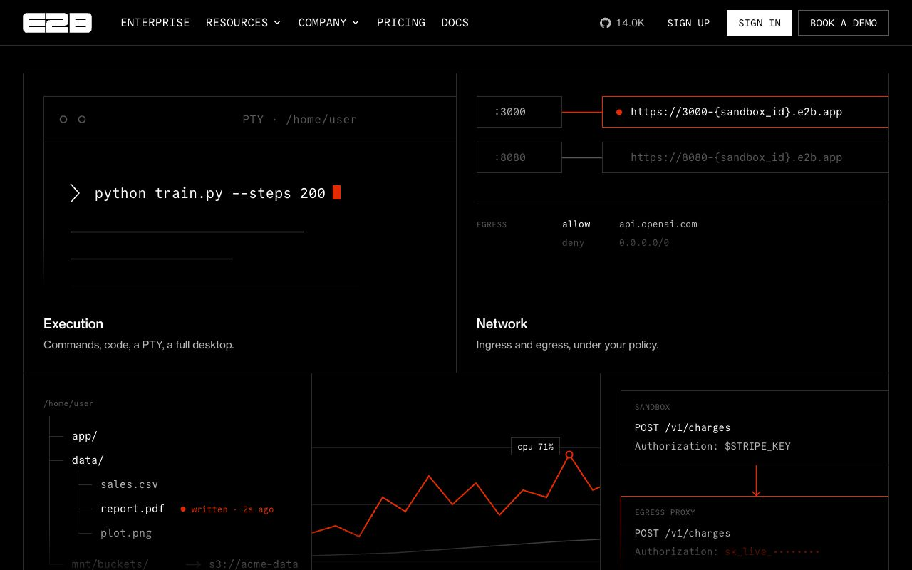</a><br/><b><a href="https://e2b.dev">E2B</a></b><br/><sub>Black hairline-bordered grid, mono type, red accents: terminal, ports and egress, file tree, CPU chart tiles.</sub></td></tr>
<tr><td width="33%" valign="top"><a href="https://upstash.com">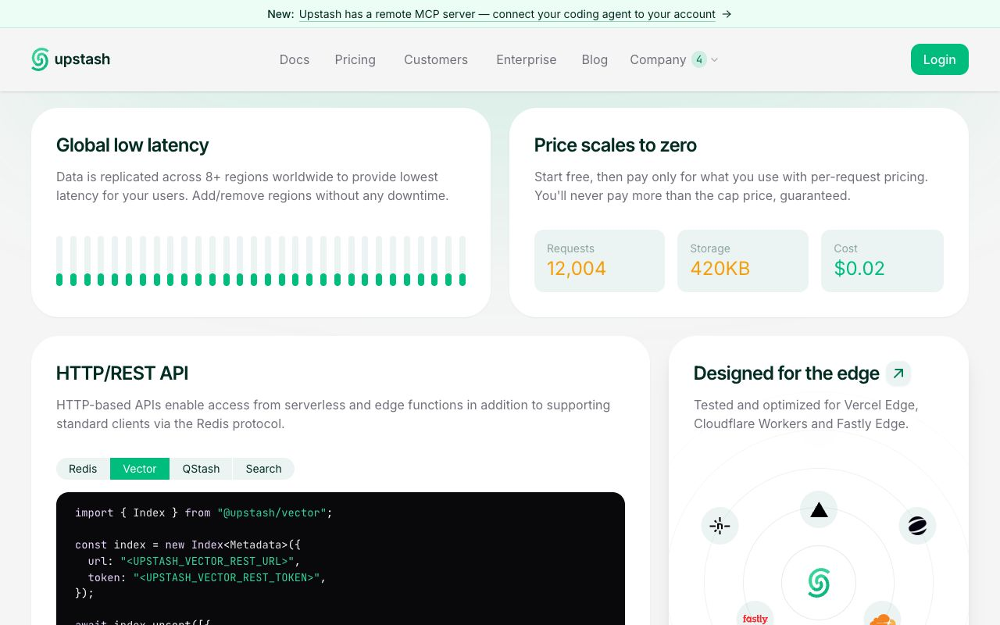</a><br/><b><a href="https://upstash.com">Upstash</a></b><br/><sub>Light rounded cards: latency bar chart, pricing stat chips, wide code tile, edge-network orbit diagram.</sub></td></tr>
</table>

**Footers in the wild · 18 examples**

<table>
<tr><td width="33%" valign="top"><a href="https://www.14islands.com"></a><br/><b><a href="https://www.14islands.com">14islands</a></b><br/><sub>The footer is a closing invitation: a big 'Let's make something great' line, a huge email address, and a minimal social row.</sub></td><td width="33%" valign="top"><a href="https://www.wearecollins.com"></a><br/><b><a href="https://www.wearecollins.com">Collins</a></b><br/><sub>A dark footer with big serif section links, a pill 'Work with us' button, a newsletter field and socials.</sub></td><td width="33%" valign="top"><a href="https://www.instrument.com"></a><br/><b><a href="https://www.instrument.com">Instrument</a></b><br/><sub>A complete footer: newsletter pitch, three labelled link columns and a legal bar, all on a strict grid.</sub></td></tr>
<tr><td width="33%" valign="top"><a href="https://pangrampangram.com">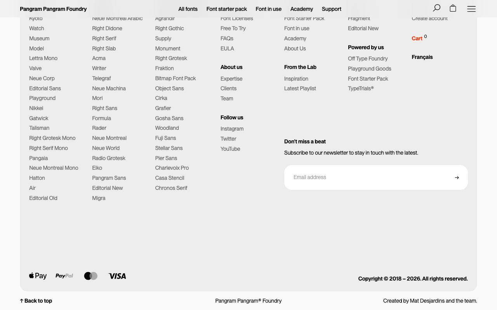</a><br/><b><a href="https://pangrampangram.com">Pangram Pangram</a></b><br/><sub>A rounded card holding the full font index, grouped links, a newsletter field and payment logos, plus 'Back to top'.</sub></td><td width="33%" valign="top"><a href="https://arc.net">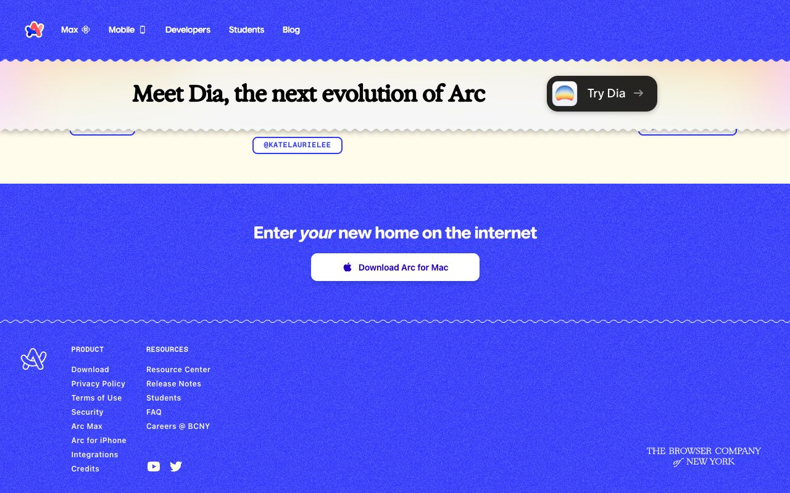</a><br/><b><a href="https://arc.net">Arc</a></b><br/><sub>A playful footer: a wavy edge, a download CTA band, then two link columns and a serif signature on grainy blue.</sub></td><td width="33%" valign="top"><a href="https://koto.studio">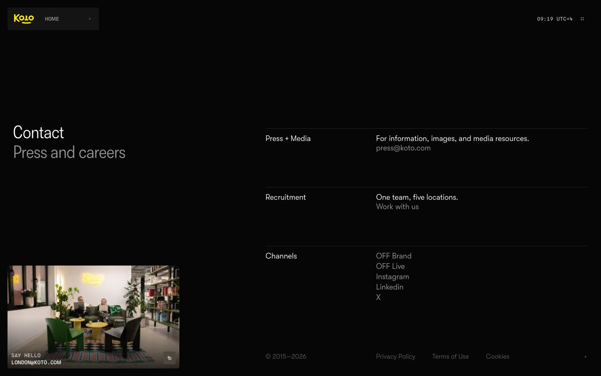</a><br/><b><a href="https://koto.studio">Koto</a></b><br/><sub>The footer is a contact page, with labelled rows for press, recruitment and channels, and a studio video tile.</sub></td></tr>
<tr><td width="33%" valign="top"><a href="https://sharptype.co">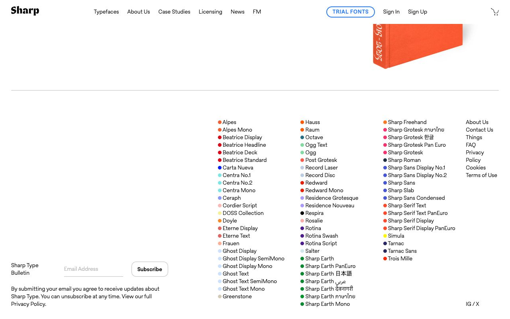</a><br/><b><a href="https://sharptype.co">Sharp Type</a></b><br/><sub>Every typeface is listed with a coloured dot, in three columns, beside a newsletter sign-up and utility links.</sub></td><td width="33%" valign="top"><a href="https://work.co">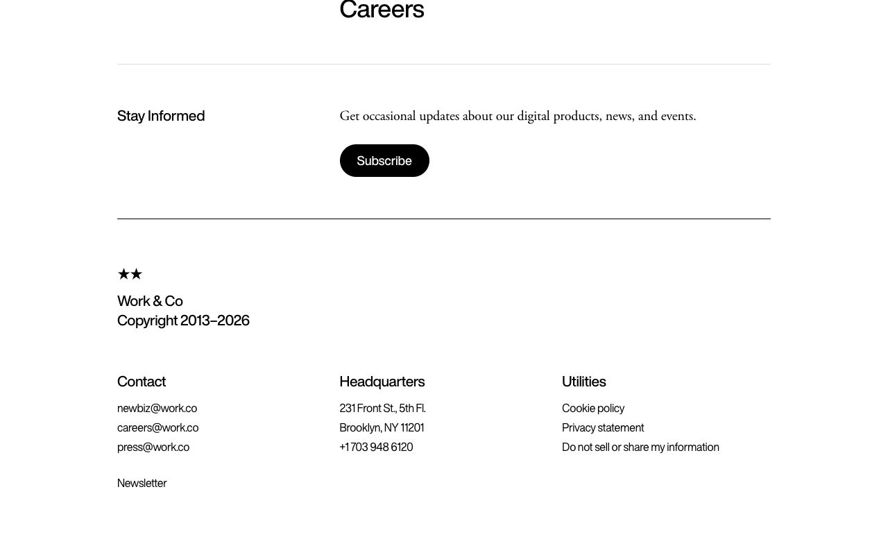</a><br/><b><a href="https://work.co">Work & Co</a></b><br/><sub>A calm, complete footer: subscribe prompt, then Contact, Headquarters and Utilities columns with real addresses.</sub></td><td width="33%" valign="top"><a href="https://rive.app">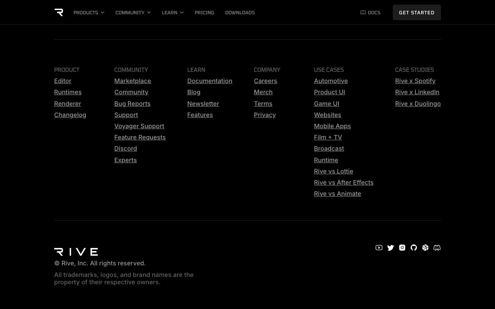</a><br/><b><a href="https://rive.app">Rive</a></b><br/><sub>A dark product footer: six labelled link columns (Product to Case Studies), a wordmark, legal text and a row of social icons.</sub></td></tr>
<tr><td width="33%" valign="top"><a href="https://displaay.net">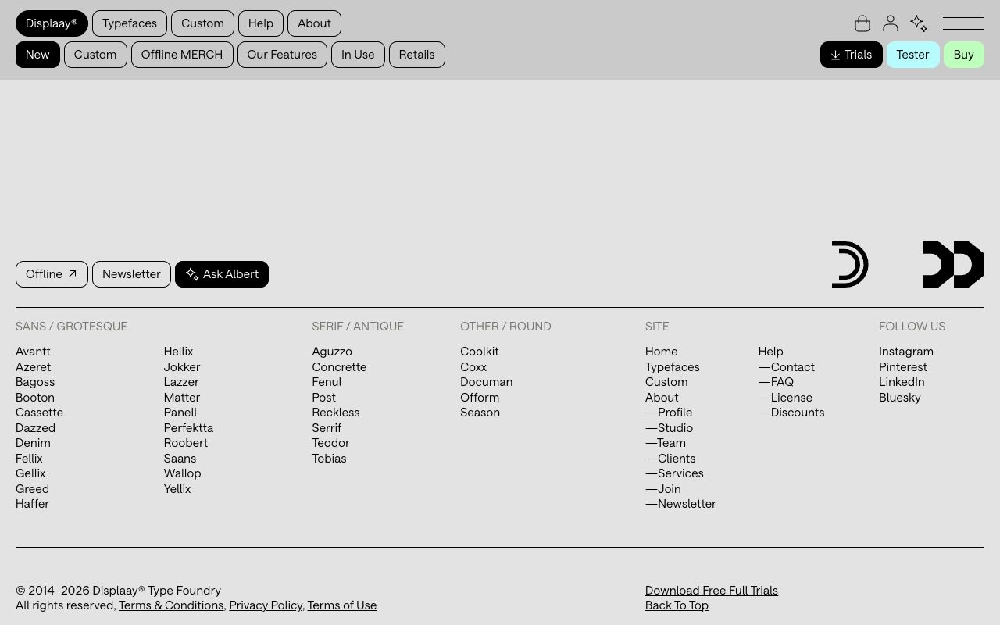</a><br/><b><a href="https://displaay.net">Displaay</a></b><br/><sub>Fonts are grouped by style (Sans, Serif, Other), with site links, socials, the 'DD' logo mark and a legal bar.</sub></td><td width="33%" valign="top"><a href="https://www.affinity.studio">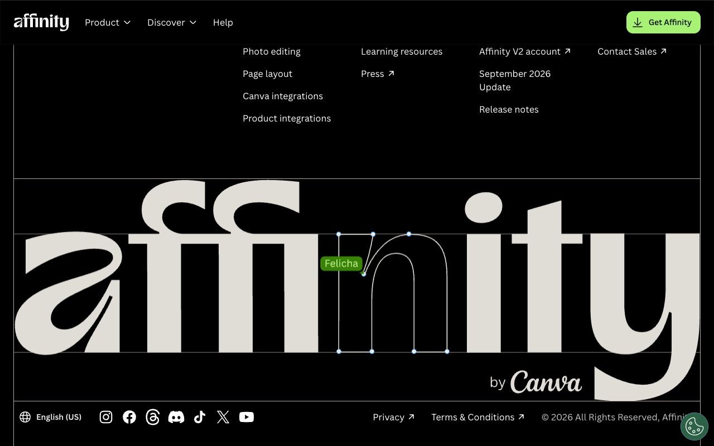</a><br/><b><a href="https://www.affinity.studio">Affinity</a></b><br/><sub>Giant cream 'affinity' wordmark on black, one letter shown as a vector outline with editing handles and a cursor label.</sub></td><td width="33%" valign="top"><a href="https://www.turionspace.com">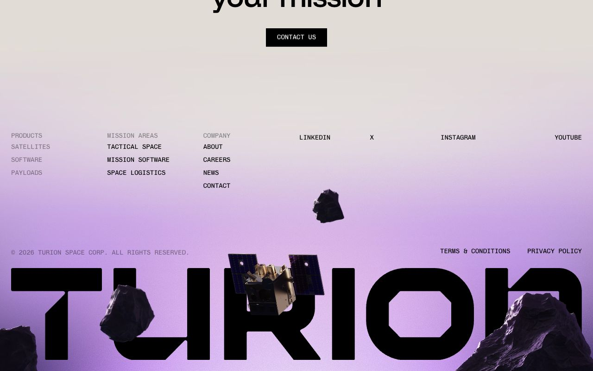</a><br/><b><a href="https://www.turionspace.com">Turion Space</a></b><br/><sub>Huge black TURION wordmark with 3D satellite and floating asteroids over lavender haze, mono link columns above.</sub></td></tr>
<tr><td width="33%" valign="top"><a href="https://www.eclipse.space">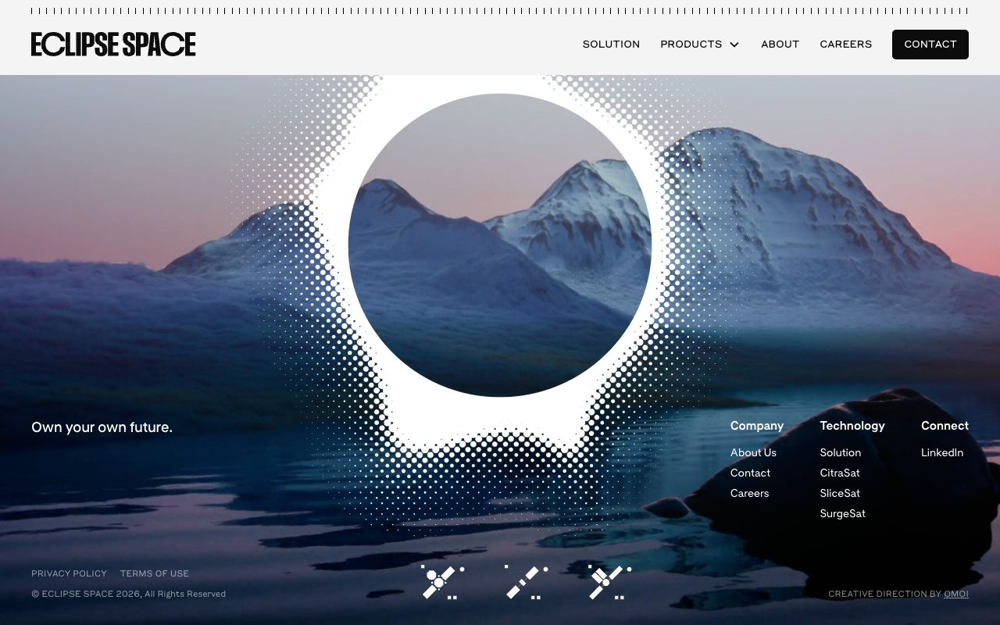</a><br/><b><a href="https://www.eclipse.space">Eclipse Space</a></b><br/><sub>Full-bleed mountain lake scene, halftone eclipse ring cut-out, link columns and satellite icons along the bottom.</sub></td><td width="33%" valign="top"><a href="https://playfolly.com">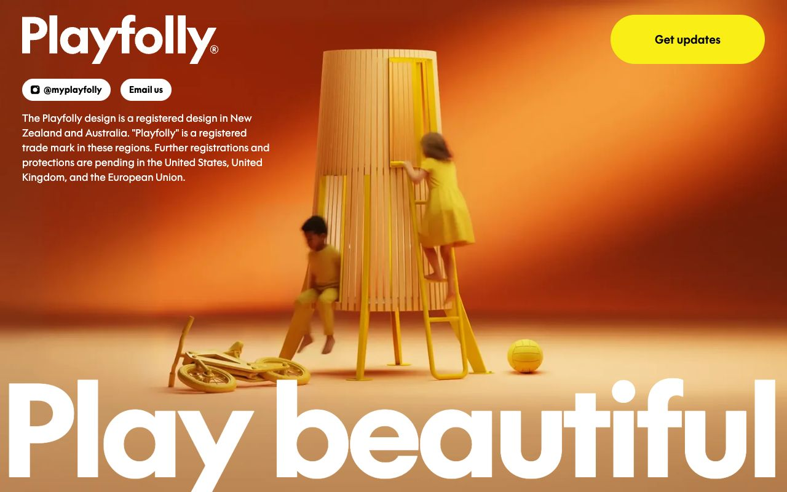</a><br/><b><a href="https://playfolly.com">Playfolly</a></b><br/><sub>Warm orange product photo of kids on play sculpture, giant white 'Play beautiful' slogan cropped at the bottom edge.</sub></td><td width="33%" valign="top"><a href="https://www.etched.com">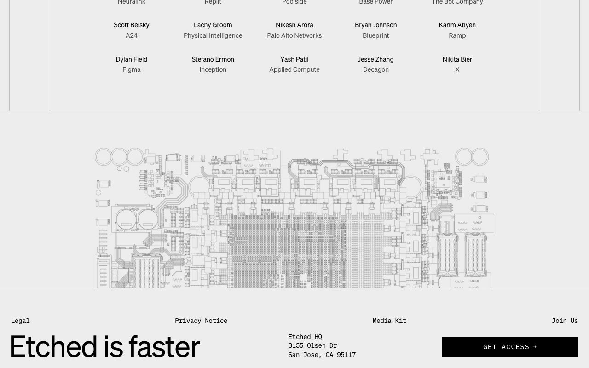</a><br/><b><a href="https://www.etched.com">Etched</a></b><br/><sub>Fine-line chip circuit drawing leads into a quiet footer: big 'Etched is faster', address, black Get Access button.</sub></td></tr>
<tr><td width="33%" valign="top"><a href="https://www.reality-is.com">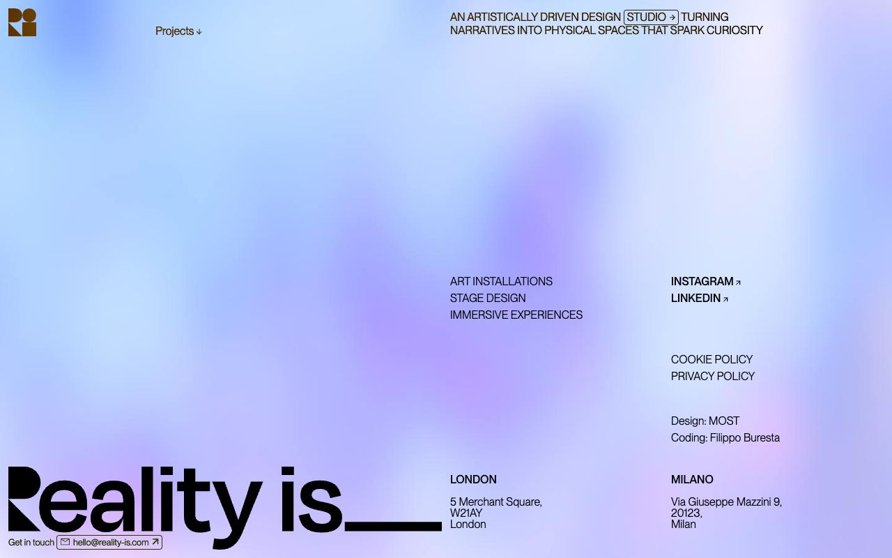</a><br/><b><a href="https://www.reality-is.com">Reality Is__</a></b><br/><sub>Soft blue-violet gradient, big 'Reality is__' wordmark bottom-left, London and Milano addresses in tidy uppercase columns.</sub></td><td width="33%" valign="top"><a href="https://buck.co">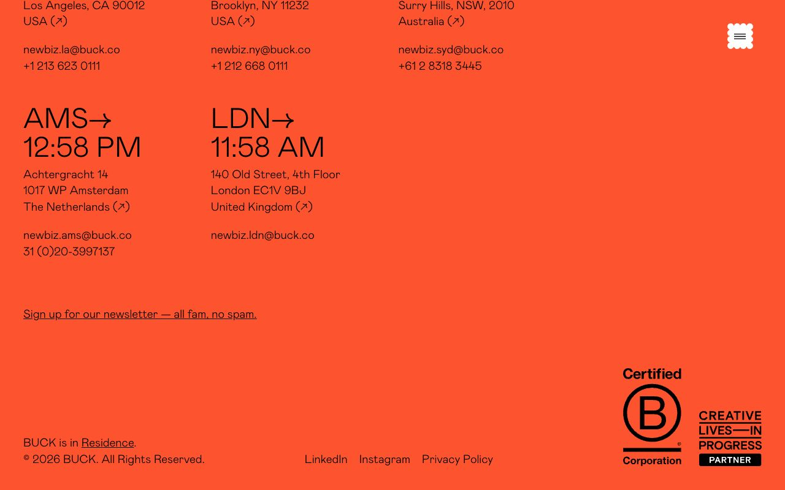</a><br/><b><a href="https://buck.co">BUCK</a></b><br/><sub>Solid orange-red footer listing studios with large live local times, addresses, emails and B Corp badge.</sub></td><td width="33%" valign="top"><a href="https://cronicle.me">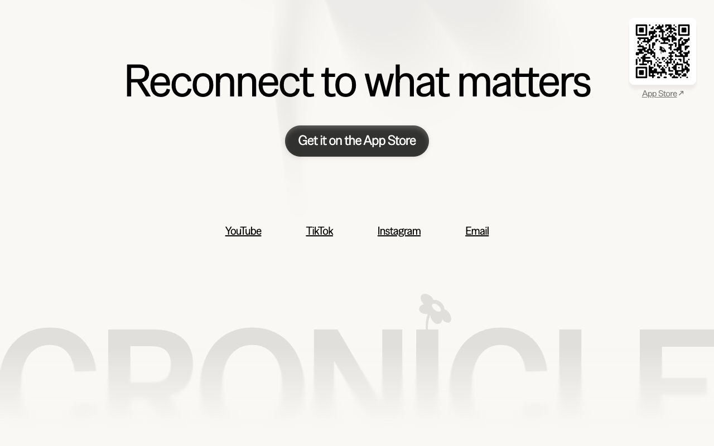</a><br/><b><a href="https://cronicle.me">Cronicle</a></b><br/><sub>Calm cream closing CTA, App Store QR code, underlined socials, faded giant CRONICLE wordmark with tiny flower.</sub></td></tr>
</table>

## Sources

- [Tailwind CSS: responsive design](https://tailwindcss.com/docs/responsive-design)
- [Vercel Web Interface Guidelines](https://vercel.com/design/guidelines)
