<!-- generated by `pnpm export:md` from content/docs/how-to/images-at-scale.mdx. Edit the MDX, not this file. -->

# How to show hundreds of images, and their palettes

*Put hundreds of screenshots in one 3D wall, print them as halftone, and pull a palette from each.*

<sub>📖 [Read this chapter on the live site](https://frontenddesignbasics.vercel.app/docs/how-to/images-at-scale) for the interactive version · [← Guide contents](../README.md)</sub>

> - Pack thumbnails into one 2048px atlas and give each instance its own UV rectangle.
> - Use `/_next/image` with a width and quality Next 16 allows, or the request fails.
> - Pixelate by distance as cheap level of detail. Sort palettes in OKLCH.

**Goal:** a wall of 300 sites that loads fast, plus colour you can learn from. Take the technique,
never the asset.

## You need

- three with `@react-three/fiber`, and `next/image`'s optimiser at `/_next/image`.
- `data/examples.json` (293 screenshots under `/examples/`).
- A 2D canvas for the atlas, halftone and palettes.

```text
 atlas 2048 × 2048: 16 × 16 cells of 128px
 ┌──┬──┬──┬──┐
 │00│01│02│..│   instance i
 ├──┼──┼──┼──┤   uvOffset = (i % 16, floor(i / 16)) / 16
 │16│17│..│  │   uvScale  = 1 / 16
 └──┴──┴──┴──┘
```

## Steps

### 1. Fetch thumbnails from the optimiser

```ts
const url = (src: string) => `/_next/image?url=${encodeURIComponent(src)}&w=128&q=75`;
```

In Next 16, `w` must be one of `imageSizes` (32, 48, 64, 96, 128, 256, 384) or `deviceSizes` (640, 750,
828, 1080, 1200, 1920, 2048, 3840). `q` must be in `images.qualities`, which is only `[75]` by default.
Any other value returns a 400, not a resized image. (Checked on this site: `w=130` and `q=80` both fail.)

### 2. Draw them into one atlas

```ts
const c = document.createElement('canvas'); c.width = c.height = 2048;
const ctx = c.getContext('2d')!;
await Promise.all(list.map(async (src, i) => {
  const img = new Image(); img.src = url(src); await img.decode();
  ctx.drawImage(img, (i % 16) * 128, Math.floor(i / 16) * 128, 128, 128);
}));
const tex = new THREE.CanvasTexture(c); tex.colorSpace = THREE.SRGBColorSpace;
```

One texture means one upload and one draw call for the whole wall.

### 3. Give each instance its UV rectangle

Add an `InstancedBufferAttribute` called `aUvOffset` (two floats per instance). In the vertex shader:
`vUv = uv / 16.0 + aUvOffset;`. See [instanced blocks](./instanced-blocks.md) for the mesh.

### 4. Pixelate by distance

Far tiles do not need detail. Snap their UVs to a coarser grid in the fragment shader:

```glsl
float cells = mix(128.0, 8.0, smoothstep(4.0, 30.0, vDist));   // near: sharp, far: blocky
vec2 local = floor(fract(vUv * 16.0) * cells) / cells;
vec3 col = texture2D(uAtlas, (floor(vUv * 16.0) + local) / 16.0).rgb;
```

It is level of detail for free, and it fits the pixel look.

### 5. Develop an image as halftone

Draw dots on a rotated grid. Each dot's radius comes from the brightness under it. Animate the dot size
down to zero while fading the real image in, and it looks like a print developing.

### 6. Pull a palette with k-means

Sample about 2,000 pixels. Start with 5 random centres. Assign each pixel to its nearest centre, move
each centre to the average of its pixels, and repeat about 8 times. Convert the centres to OKLCH and
sort by lightness, then hue. Sorted palettes read as a system. Unsorted ones look random.

## Pitfalls

- **The screenshots are not ours.** Show them for commentary with a link to the real site. Never reuse
  them as textures in a product.
- **Tainted canvas.** Same-origin `/_next/image` URLs are fine. Remote URLs need CORS or `getImageData` throws.

## Why it works

GPUs hate switching textures and love drawing one mesh many times. An atlas plus instancing turns 300
images into one texture and one call.

## See it live

- [Site wall 3D](/lab/site-wall-3d)
- [Halftone develop](/lab/halftone-develop)

**In the wild · 17 examples**

<table>
<tr><td width="33%" valign="top"><a href="https://gumroad.com">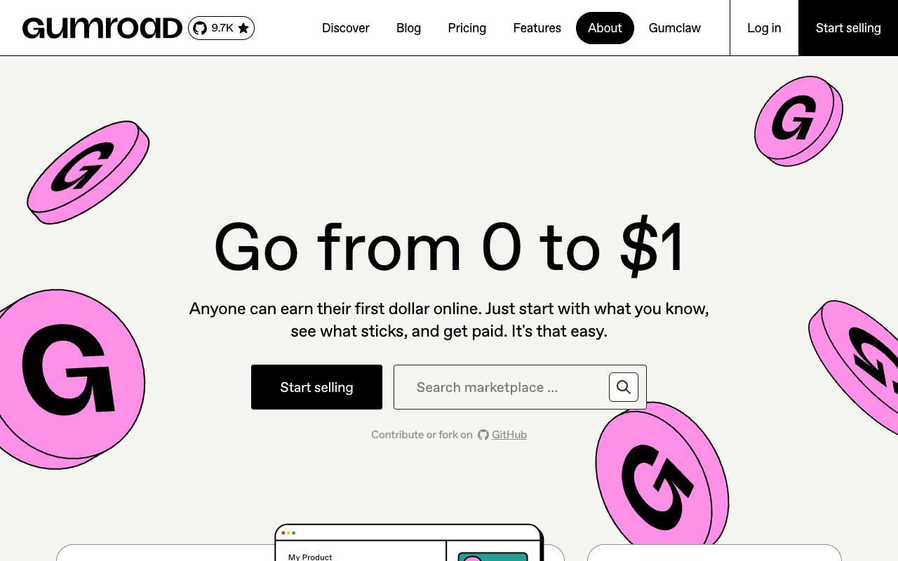</a><br/><b><a href="https://gumroad.com">Gumroad</a></b><br/><sub>Off-white page with black type and one loud pink on the floating outlined coins.</sub></td><td width="33%" valign="top"><a href="https://arc.net">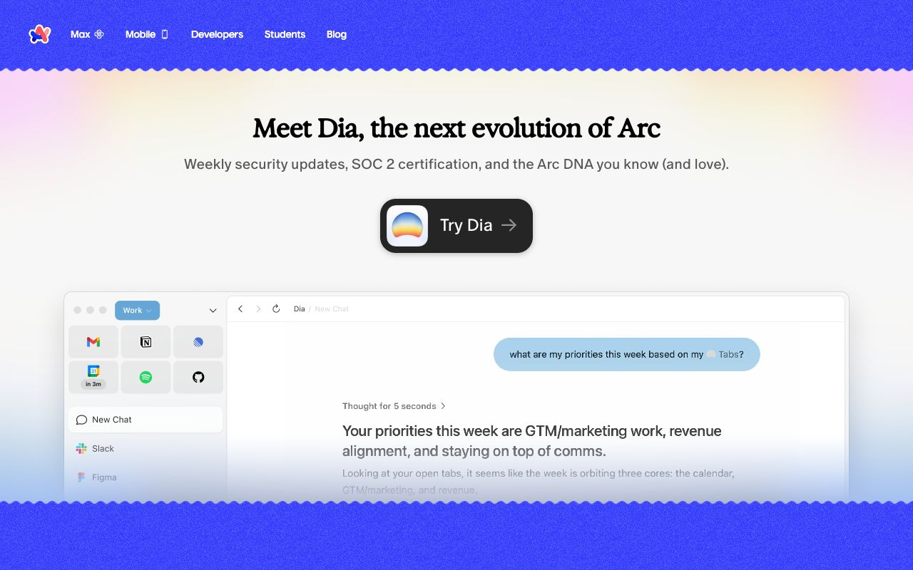</a><br/><b><a href="https://arc.net">Arc</a></b><br/><sub>Grainy electric-blue bands with wavy edges frame a soft pastel-and-white middle.</sub></td><td width="33%" valign="top"><a href="https://mschf.com">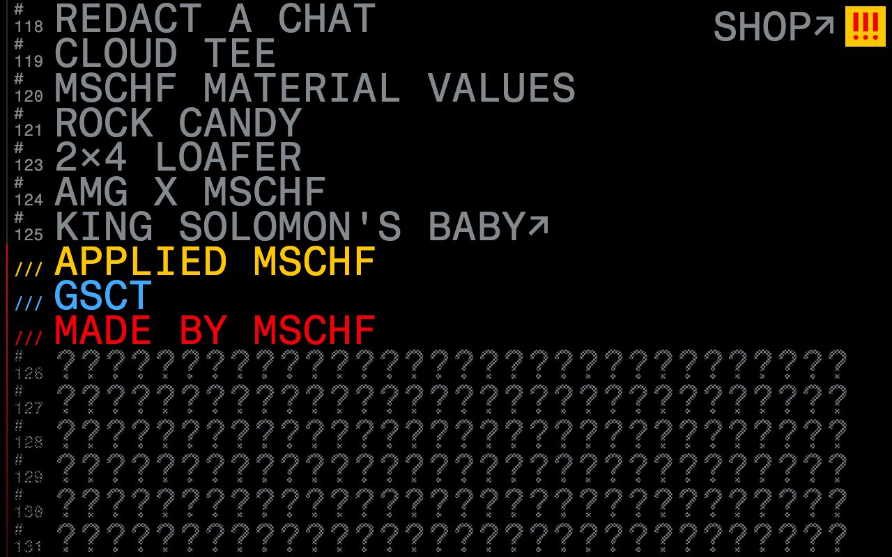</a><br/><b><a href="https://mschf.com">MSCHF</a></b><br/><sub>Black and grey mono list where only three lines glow yellow, blue and red.</sub></td></tr>
<tr><td width="33%" valign="top"><a href="https://resend.com">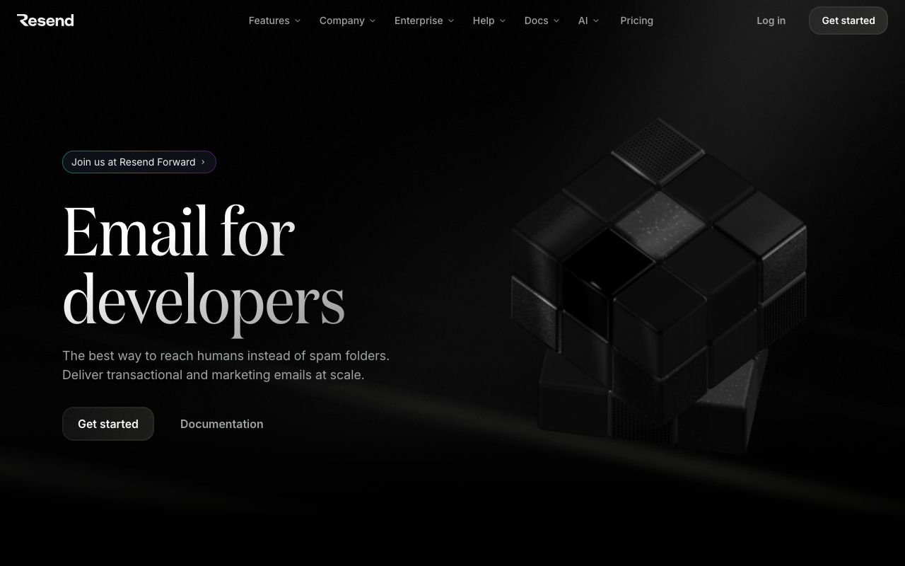</a><br/><b><a href="https://resend.com">Resend</a></b><br/><sub>All-black dark mode: grey-to-white gradient serif headline, matte black cube, and no accent hue.</sub></td><td width="33%" valign="top"><a href="https://www.hellomonday.com">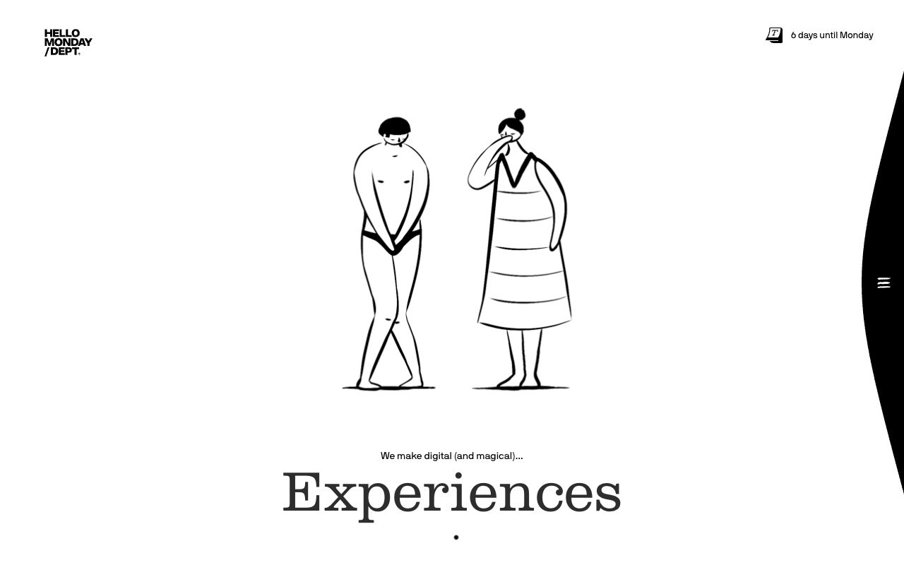</a><br/><b><a href="https://www.hellomonday.com">Hello Monday</a></b><br/><sub>Pure black-on-white line drawings and serif type, with a black curved panel as the only block.</sub></td><td width="33%" valign="top"><a href="https://wise.com">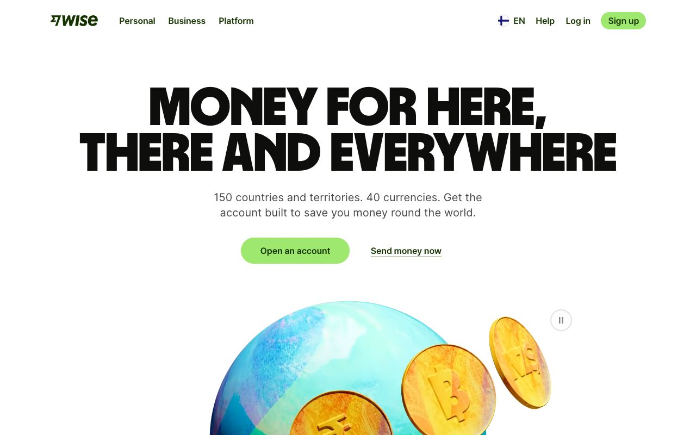</a><br/><b><a href="https://wise.com">Wise</a></b><br/><sub>Black heavy caps on white, with lime-green buttons as the single brand accent.</sub></td></tr>
<tr><td width="33%" valign="top"><a href="https://pitch.com">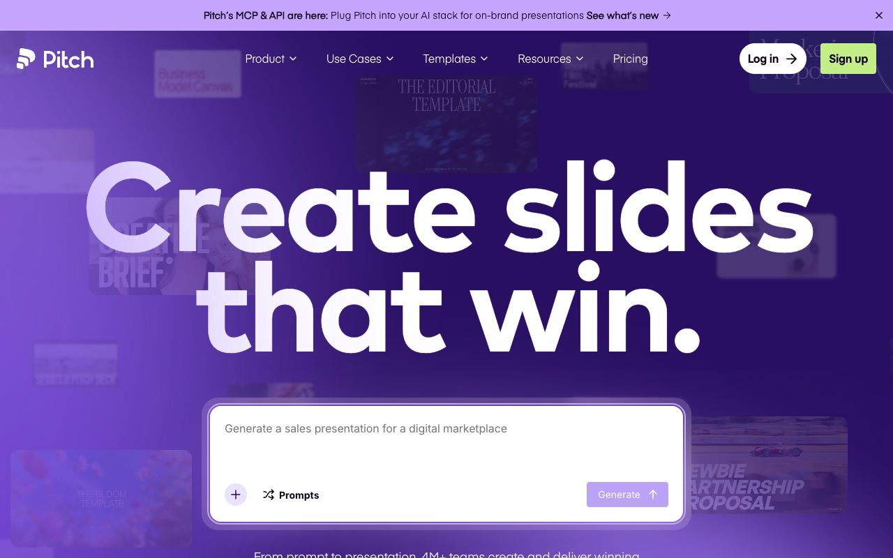</a><br/><b><a href="https://pitch.com">Pitch</a></b><br/><sub>Everything tinted one violet, from banner to background, with a lone lime 'Sign up' button.</sub></td><td width="33%" valign="top"><a href="https://supabase.com">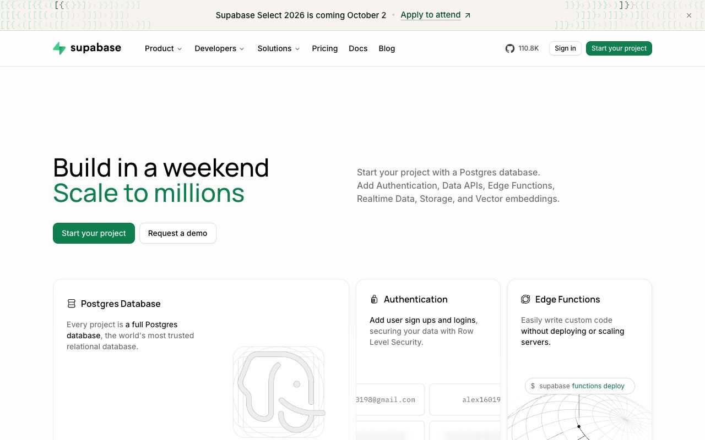</a><br/><b><a href="https://supabase.com">Supabase</a></b><br/><sub>Neutral white and grey UI where green only marks the second headline line and the main CTA.</sub></td><td width="33%" valign="top"><a href="https://www.duolingo.com">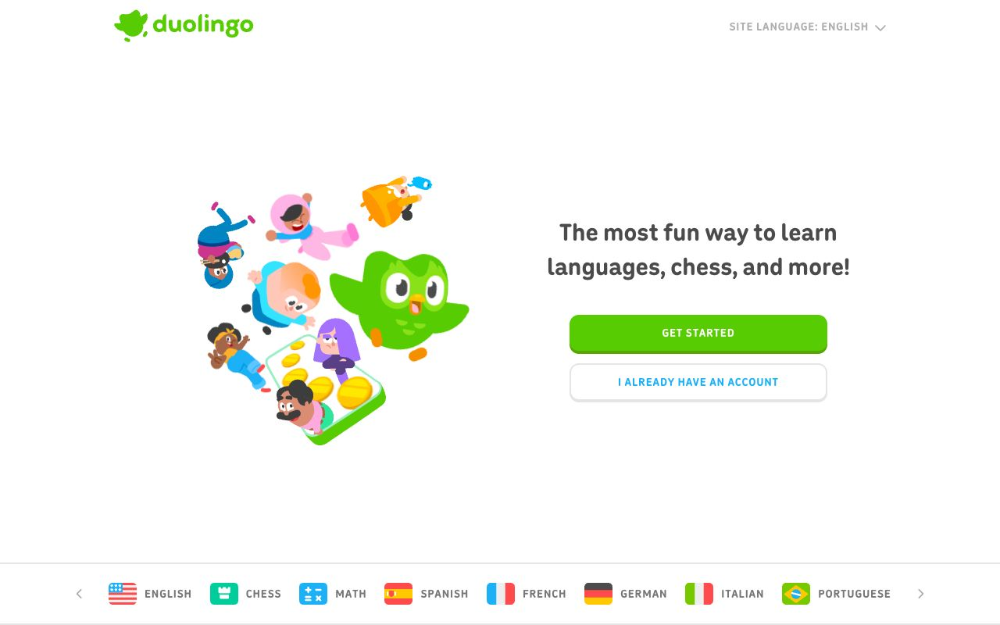</a><br/><b><a href="https://www.duolingo.com">Duolingo</a></b><br/><sub>Mostly white screen; bright owl green carries the logo, mascot and main button.</sub></td></tr>
<tr><td width="33%" valign="top"><a href="https://brand.dropbox.com/color">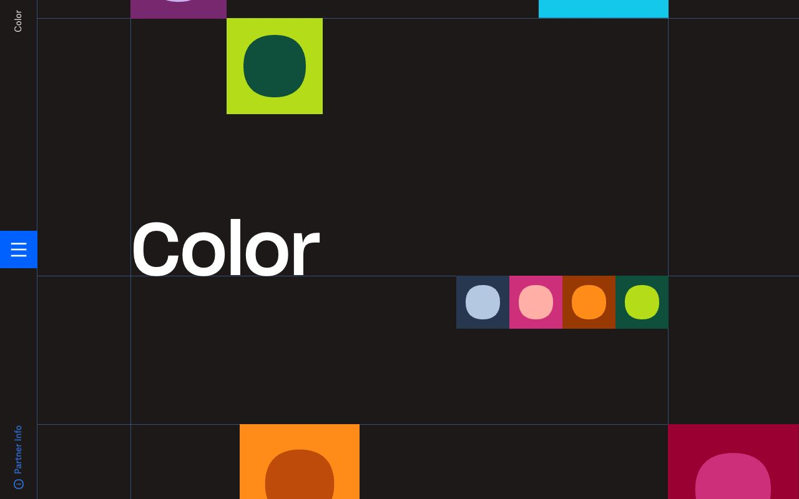</a><br/><b><a href="https://brand.dropbox.com/color">Dropbox Brand — Color</a></b><br/><sub>Paired swatches (lime/forest, pink/rose, orange/rust) on near-black grid show tone-on-tone colour pairing rules.</sub></td><td width="33%" valign="top"><a href="https://flybyjing.com">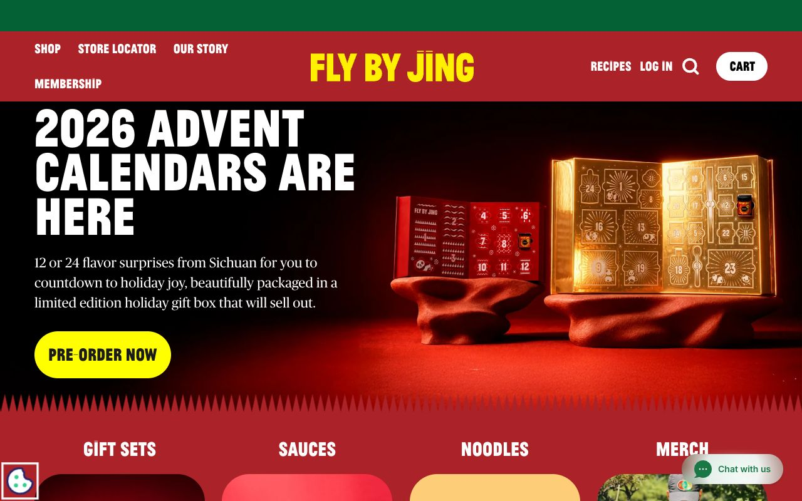</a><br/><b><a href="https://flybyjing.com">Fly By Jing</a></b><br/><sub>Chili red, jade green and hot yellow CTA carry the brand; yellow reserved for logo and button.</sub></td><td width="33%" valign="top"><a href="https://drinkghia.com">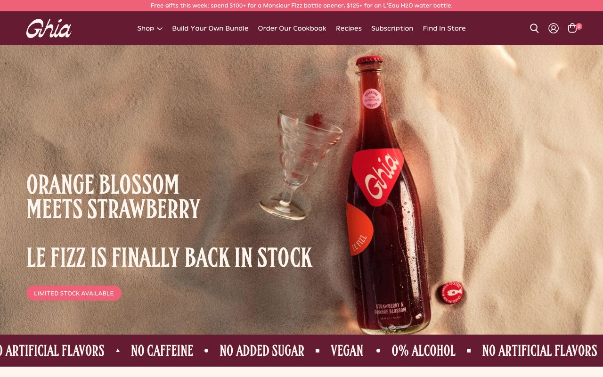</a><br/><b><a href="https://drinkghia.com">Ghia</a></b><br/><sub>Burgundy bars, pink accents and warm sand photo form one palette echoing the bottle itself.</sub></td></tr>
<tr><td width="33%" valign="top"><a href="https://drinkolipop.com">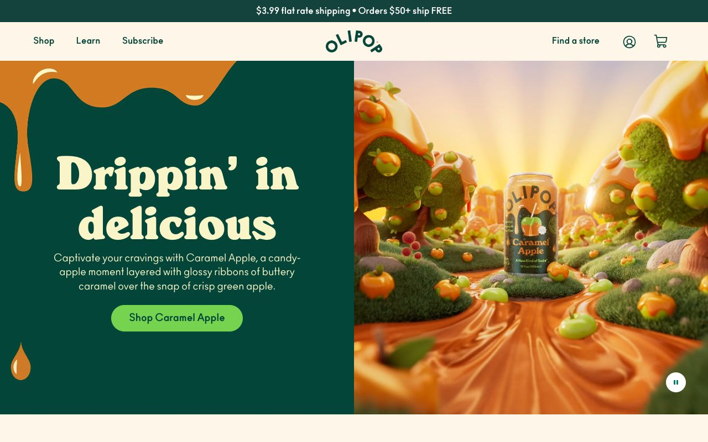</a><br/><b><a href="https://drinkolipop.com">OLIPOP</a></b><br/><sub>Deep green panel, cream type and caramel drips pull the hero palette straight from the flavour.</sub></td><td width="33%" valign="top"><a href="https://omsom.com">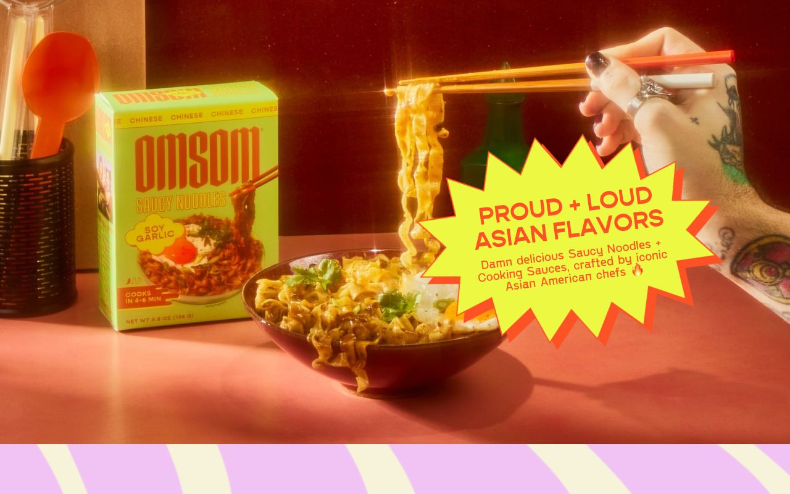</a><br/><b><a href="https://omsom.com">Omsom</a></b><br/><sub>Acid-yellow starburst with red type pops against warm terracotta photo; lilac stripe adds contrast.</sub></td><td width="33%" valign="top"><a href="https://partiful.com">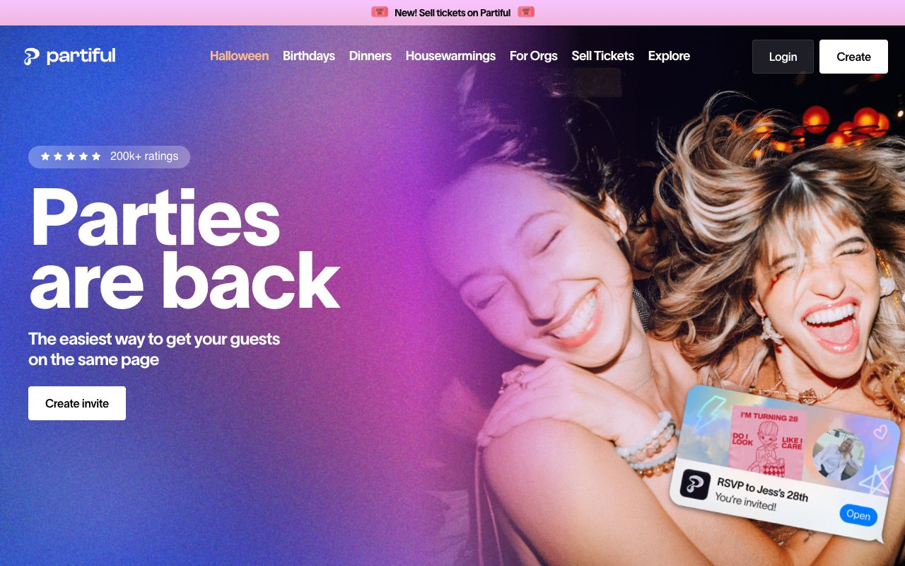</a><br/><b><a href="https://partiful.com">Partiful</a></b><br/><sub>Grainy blue-to-magenta gradient washes into the party photo, giving the brand one vivid mood.</sub></td></tr>
<tr><td width="33%" valign="top"><a href="https://play.date">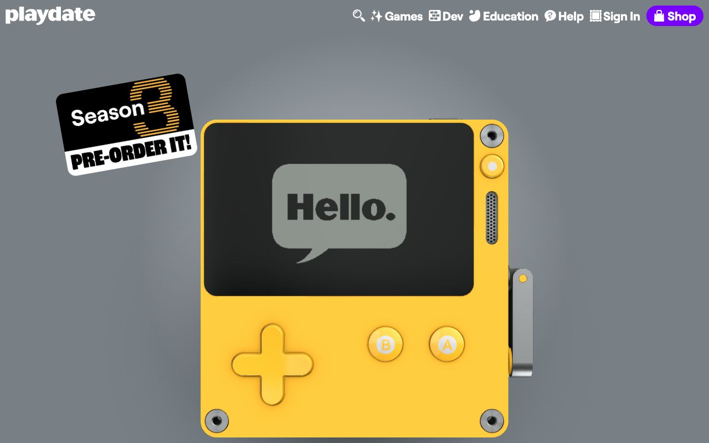</a><br/><b><a href="https://play.date">Playdate</a></b><br/><sub>Single signature yellow device on neutral grey; purple kept only for the Shop button.</sub></td><td width="33%" valign="top"><a href="https://drinkpoppi.com">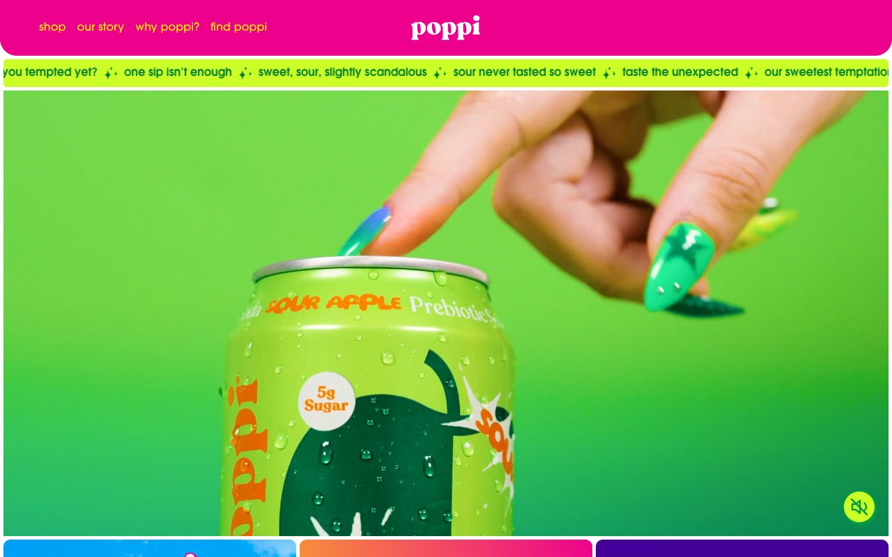</a><br/><b><a href="https://drinkpoppi.com">poppi</a></b><br/><sub>Hot magenta nav, acid-lime ticker and green product shot clash deliberately into a loud palette.</sub></td></tr>
</table>

## Sources

- [Next.js: Image component](https://nextjs.org/docs/app/api-reference/components/image)
- [web.dev: serve responsive images](https://web.dev/articles/serve-responsive-images)
- [Playwright: screenshots](https://playwright.dev/docs/screenshots)
