<!-- generated by `pnpm export:md` from content/docs/how-to/instanced-blocks.mdx. Edit the MDX, not this file. -->

# How to draw thousands of blocks in one call

*Build voxel type, cities and puzzles from one InstancedMesh, and keep them scrubbable.*

<sub>📖 [Read this chapter on the live site](https://frontenddesignbasics.vercel.app/docs/how-to/instanced-blocks) for the interactive version · [← Guide contents](../README.md)</sub>

> - One `InstancedMesh` draws every block in a single draw call.
> - Move a few thousand from JavaScript; move more in the vertex shader.
> - Store start and end positions as snapshots and blend between them with progress.

**Goal:** thousands of moving cubes at 60 fps on a laptop, and still smooth on a phone.

## You need

- three with `@react-three/fiber`. drei's `<Instances>` is an easier wrapper for small counts.
- A 2D canvas, if you want text as the shape.

```text
  1 geometry + 1 material + N matrices  ──►  1 draw call

  mesh ■ ■ ■ ■ ■     vs     ■■■■■  one InstancedMesh
  5 draw calls               1 draw call
```

## Steps

### 1. Make one InstancedMesh

```tsx
<instancedMesh ref={mesh} args={[undefined, undefined, COUNT]}>
  <boxGeometry args={[0.9, 0.9, 0.9]} />
  <meshStandardMaterial />
</instancedMesh>
```

### 2. Write matrices with one reused object

```ts
const o = new THREE.Object3D();
for (let i = 0; i < COUNT; i++) {
  o.position.set(x[i], y[i], z[i]);
  o.updateMatrix();
  mesh.current.setMatrixAt(i, o.matrix);
}
mesh.current.instanceMatrix.needsUpdate = true;
```

Never create a new `Object3D` or `Vector3` inside the loop. Garbage collection pauses show as jank.

### 3. Past about 5,000 moving blocks, move them in the shader

Put each block's start and end in `InstancedBufferAttribute`s and pass `uProgress` as a uniform. The
vertex shader mixes them. JavaScript then sets one number per frame instead of thousands of matrices.

```glsl
attribute vec3 aStart;
attribute vec3 aEnd;
uniform float uProgress;
// inside main():
vec3 p = mix(aStart, aEnd, smoothstep(0.0, 1.0, uProgress));
transformed += p;
```

### 4. Turn off frustum culling for shader-moved instances

three.js culls the mesh by its bounding sphere, and it does not know the shader moved the blocks.
Blocks vanish at the screen edge. Set `frustumCulled={false}` on the mesh.

### 5. Use text as a target shape

Draw the word on a small 2D canvas, read the pixels, and put a block wherever alpha is over half.

```ts
ctx.font = '64px "Web IBM VGA 8x16"';
ctx.fillText('HELLO', 0, 56);
const { data } = ctx.getImageData(0, 0, w, h);
for (let y = 0; y < h; y += step) for (let x = 0; x < w; x += step)
  if (data[(y * w + x) * 4 + 3] > 128) targets.push([x - w / 2, h / 2 - y, 0]);
```

Wait for `document.fonts.load('64px "Web IBM VGA 8x16"')` first, or you rasterise the fallback font.

### 6. Scrub between snapshots

For a puzzle or a city that rebuilds, store each state as an array of positions: `snapshots[0]`,
`snapshots[1]` and so on. Progress picks two neighbours and blends them. Do not re-parent objects into
groups mid-animation. It cannot run backwards, and scrolling up breaks it.

## Why it works

The GPU is fast at drawing the same thing many times. It is slow at being asked many times. Instancing
asks once. Snapshots make every frame a pure function of progress, so scroll can go either way.

## See it live

- [Voxel type assembly](/lab/voxel-type-assembly)
- [Neon block city](/lab/neon-block-city)
- [Tool blocks](/lab/tool-blocks)

**In the wild · 19 examples**

<table>
<tr><td width="33%" valign="top"><a href="https://threeui.com"></a><br/><b><a href="https://threeui.com">ThreeUI</a></b><br/><sub>A library of three.js landing pages, hero sections and shaders: browse, copy, install via CLI.</sub></td><td width="33%" valign="top"><a href="https://messenger.abeto.co"></a><br/><b><a href="https://messenger.abeto.co">Messenger</a></b><br/><sub>Tiny cel-shaded 3D planet of houses and trees with blocky 3D title letters floating over it.</sub></td><td width="33%" valign="top"><a href="https://oryzo.ai"></a><br/><b><a href="https://oryzo.ai">Oryzo</a></b><br/><sub>Photoreal real-time cork coaster on a cutting mat, pencils and knife lit like a product shoot.</sub></td></tr>
<tr><td width="33%" valign="top"><a href="https://dogstudio.co">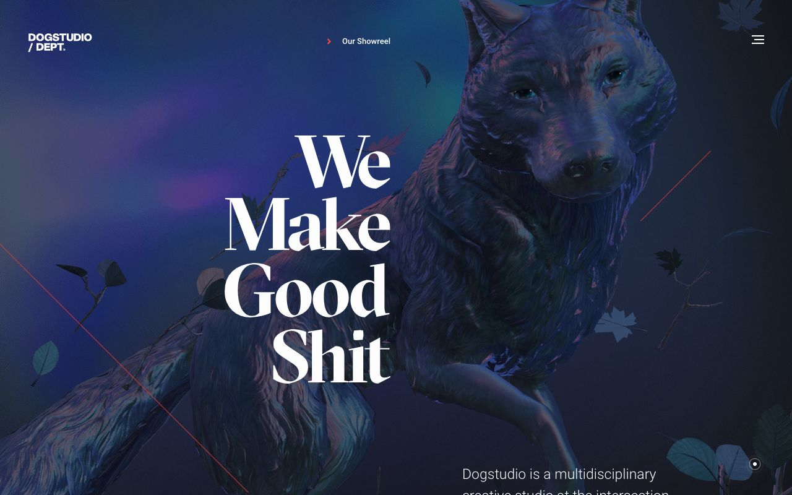</a><br/><b><a href="https://dogstudio.co">Dogstudio</a></b><br/><sub>Iridescent 3D wolf with drifting leaves behind a huge serif headline, lit in violet and teal.</sub></td><td width="33%" valign="top"><a href="https://spline.design">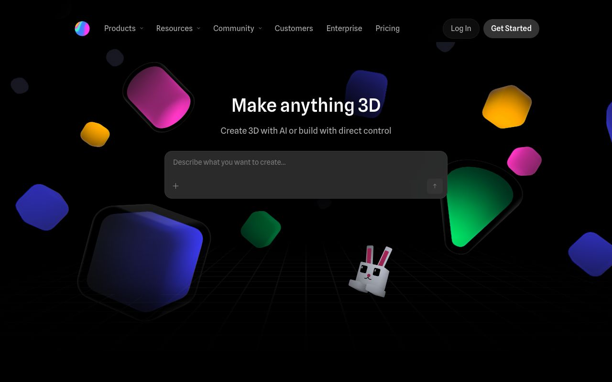</a><br/><b><a href="https://spline.design">Spline</a></b><br/><sub>Soft glossy 3D shapes and a voxel bunny float over a perspective grid around a prompt box.</sub></td><td width="33%" valign="top"><a href="https://www.shopify.com/editions/winter2024">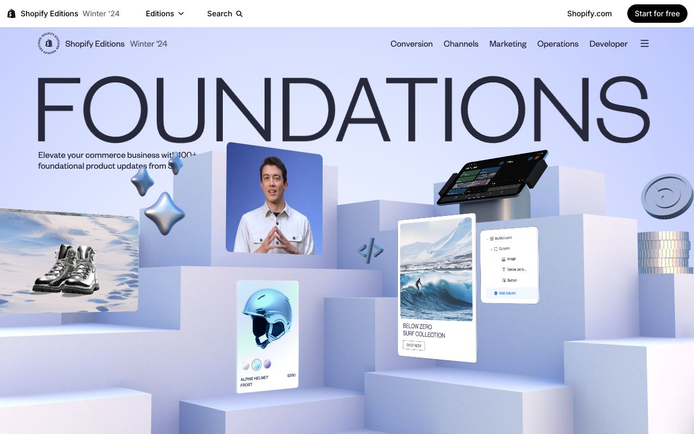</a><br/><b><a href="https://www.shopify.com/editions/winter2024">Shopify Editions Winter '24</a></b><br/><sub>Pale lilac 3D plinths hold product cards, chrome sparkles and a terminal, under giant FOUNDATIONS type.</sub></td></tr>
<tr><td width="33%" valign="top"><a href="https://dala.craftedbygc.com">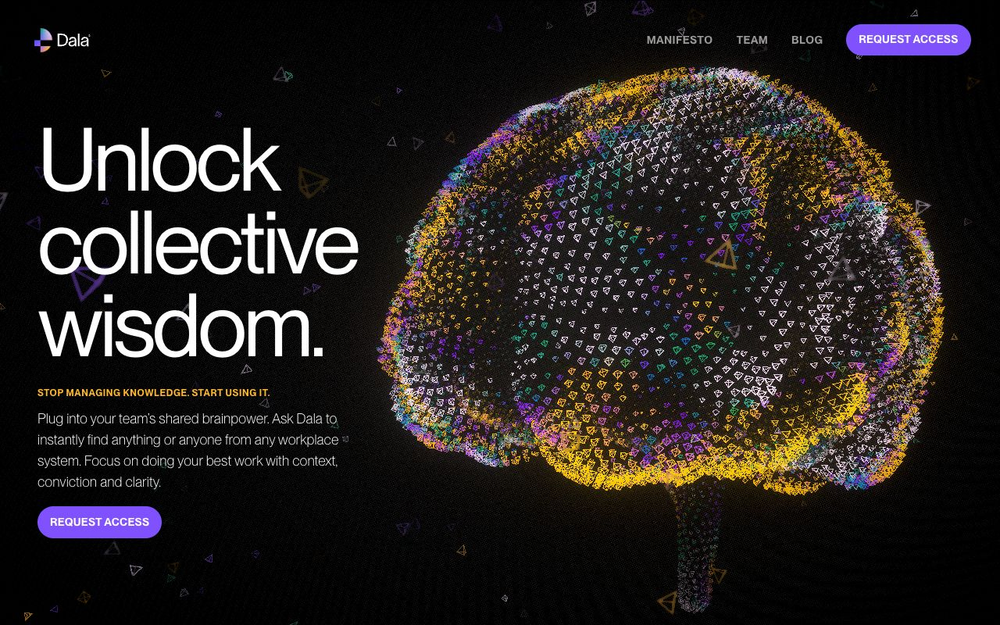</a><br/><b><a href="https://dala.craftedbygc.com">Dala</a></b><br/><sub>A brain built from thousands of colored 3D triangle particles beside a big white sans headline.</sub></td><td width="33%" valign="top"><a href="https://zentry.com">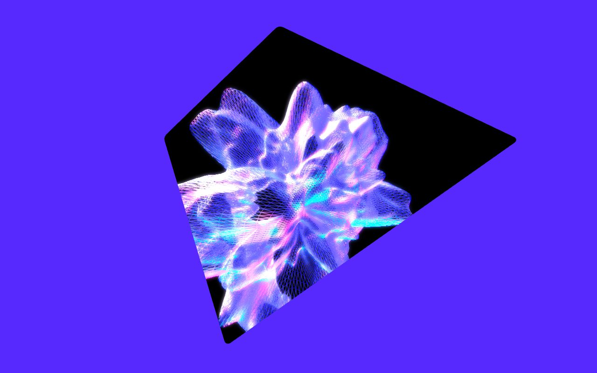</a><br/><b><a href="https://zentry.com">Zentry</a></b><br/><sub>Glowing wireframe crystal form rendered inside a clipped, tilted black frame on electric violet.</sub></td><td width="33%" valign="top"><a href="https://chipsa.design">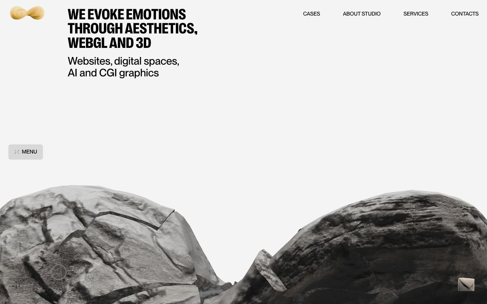</a><br/><b><a href="https://chipsa.design">Chipsa</a></b><br/><sub>Textured grey 3D rock forms rise from the bottom of a quiet light page with condensed caps headline.</sub></td></tr>
<tr><td width="33%" valign="top"><a href="https://david-hckh.com">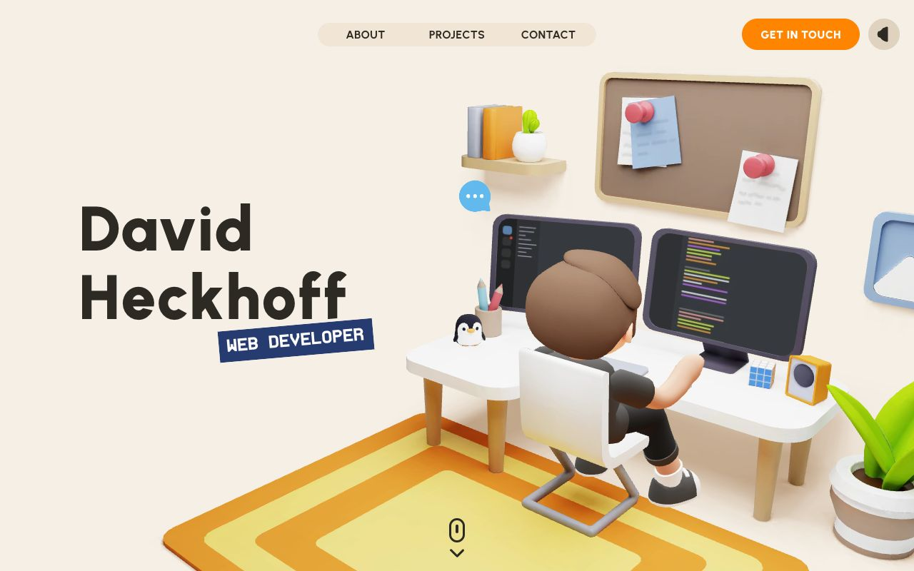</a><br/><b><a href="https://david-hckh.com">David Heckhoff</a></b><br/><sub>Clay-style 3D room of a developer at a desk with monitors, plant and penguin, as a portfolio hero.</sub></td><td width="33%" valign="top"><a href="https://noomoagency.com">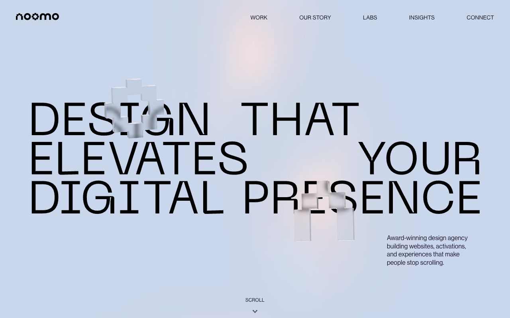</a><br/><b><a href="https://noomoagency.com">Noomo</a></b><br/><sub>Frosted-glass 3D pixel shapes refract and blur the large mono headline they float across.</sub></td><td width="33%" valign="top"><a href="https://www.butter.video/">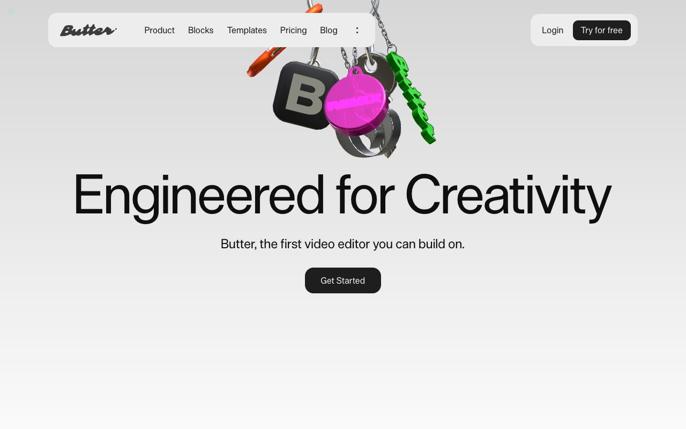</a><br/><b><a href="https://www.butter.video/">Butter</a></b><br/><sub>Glossy 3D keychain charms dangle above a huge neutral headline, making the product feel tactile.</sub></td></tr>
<tr><td width="33%" valign="top"><a href="https://www.mindrobotics.com/">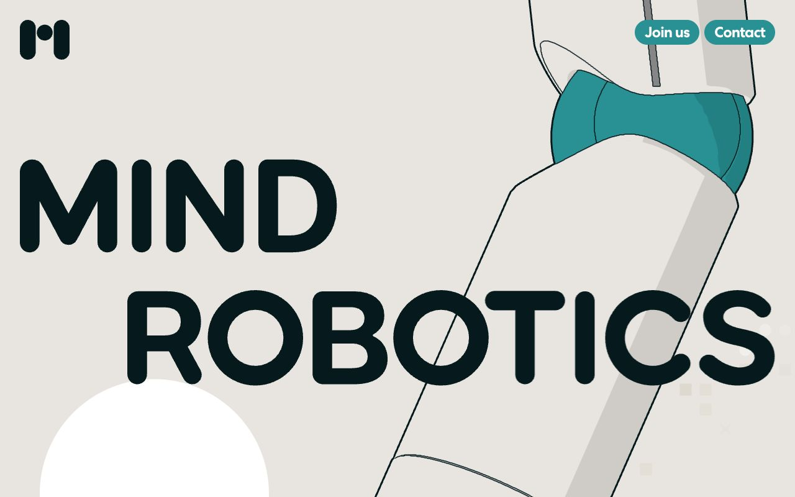</a><br/><b><a href="https://www.mindrobotics.com/">Mind Robotics</a></b><br/><sub>Outlined, toon-shaded robot arm cuts diagonally through giant rounded wordmark on warm grey.</sub></td><td width="33%" valign="top"><a href="https://shapeofintelligence.com/">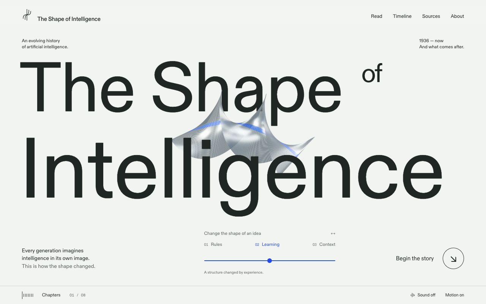</a><br/><b><a href="https://shapeofintelligence.com/">The Shape of Intelligence</a></b><br/><sub>Wireframe metallic surface weaves between huge title letters; slider reshapes it across three chapters.</sub></td><td width="33%" valign="top"><a href="https://singularity.engl.design/">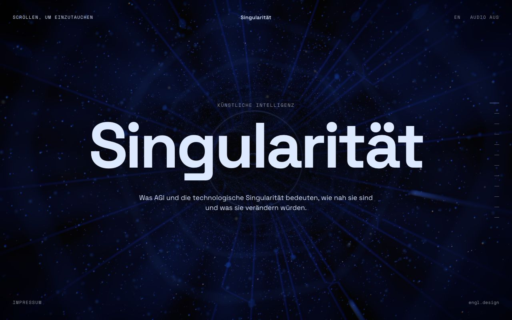</a><br/><b><a href="https://singularity.engl.design/">Singularität</a></b><br/><sub>Deep-blue particle tunnel with radiating lines frames a centred headline; 'scroll to dive in' cue.</sub></td></tr>
<tr><td width="33%" valign="top"><a href="https://sobha-privy-collection.com/">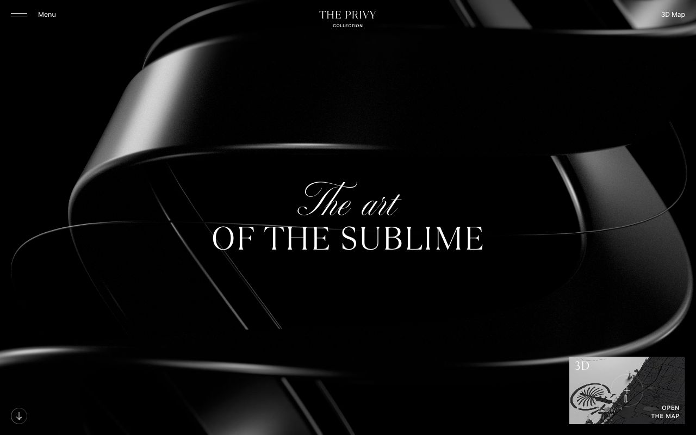</a><br/><b><a href="https://sobha-privy-collection.com/">The Privy Collection</a></b><br/><sub>Monochrome satin ribbon rendered in 3D behind serif type; a 3D map thumbnail sits bottom-right.</sub></td><td width="33%" valign="top"><a href="https://threeui.com/landing-pages/kage.html">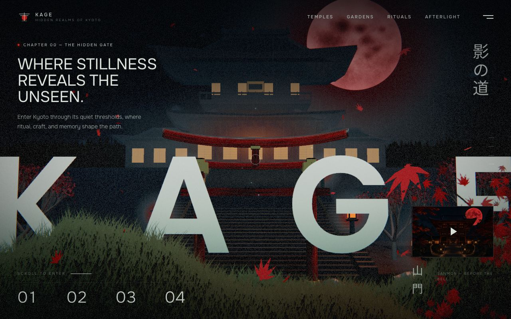</a><br/><b><a href="https://threeui.com/landing-pages/kage.html">Kage</a></b><br/><sub>Night temple scene with blood moon, falling maple leaves and grass; giant letters layered in depth.</sub></td><td width="33%" valign="top"><a href="https://threeui.com/three-js/sylva-living-world">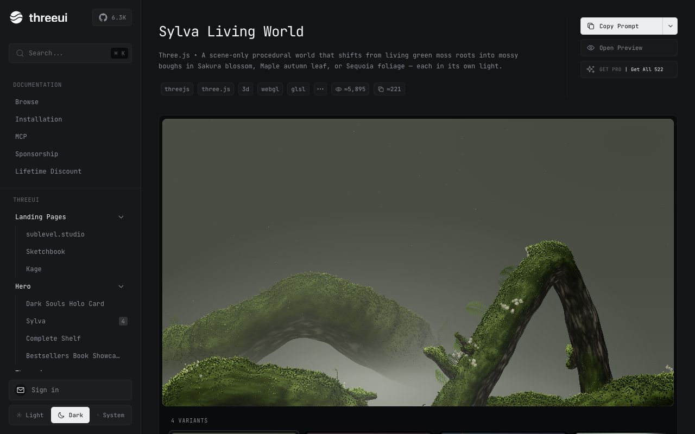</a><br/><b><a href="https://threeui.com/three-js/sylva-living-world">Sylva Living World</a></b><br/><sub>Procedural mossy root arches in soft fog, a whole Three.js world shown with four variants.</sub></td></tr>
<tr><td width="33%" valign="top"><a href="https://whiteout.overvac.com/">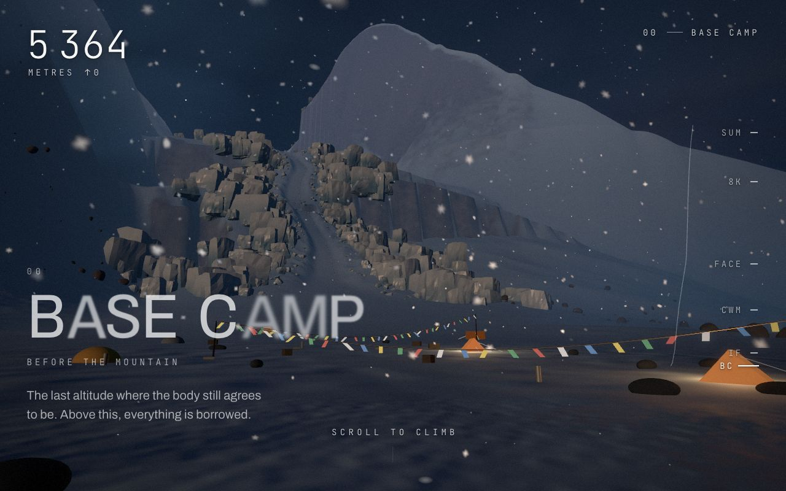</a><br/><b><a href="https://whiteout.overvac.com/">WHITEOUT · An Ascent</a></b><br/><sub>Real-time snowy mountain base camp; altitude counter and side altitude rail drive a scroll-to-climb story.</sub></td></tr>
</table>

## Sources

- [three.js: InstancedMesh](https://threejs.org/docs/#api/en/objects/InstancedMesh)
- [React Three Fiber](https://r3f.docs.pmnd.rs/getting-started/introduction)
