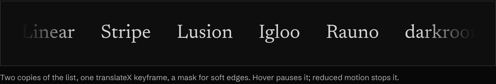
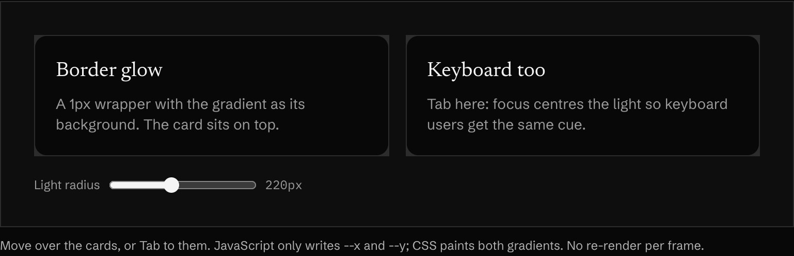
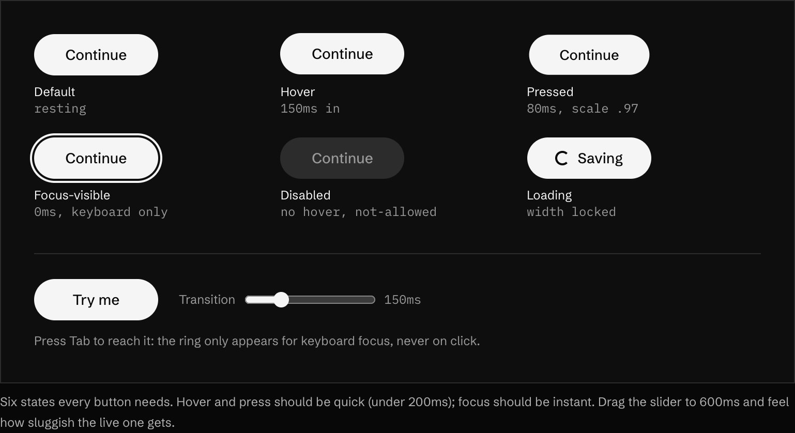

<!-- generated by `pnpm export:md` from content/docs/how-to/own-your-components.mdx. Edit the MDX, not this file. -->

# How to own your components

*Install components as source from registries, restyle them, and build the simple ones yourself.*

<sub>📖 [Read this chapter on the live site](https://frontenddesignbasics.vercel.app/docs/how-to/own-your-components) for the interactive version · [← Guide contents](../README.md)</sub>

> - Registries give you source files, not a package. You own and restyle them.
> - Add the registries to `components.json`, then `npx shadcn add @ns/name`.
> - One "wow" component per view. Design all six button states.

**Goal:** components that look like your site, not like the library's demo page.

## You need

- The shadcn CLI (or the shadcn MCP for your agent).
- Your tokens, so you can restyle what you install.

```text
 registry ─► shadcn CLI ─► components/ui ─► restyle
 @magicui    npx shadcn    your repo        your type,
 @react-bits add @ns/name  owns the code    colour, radius
```

## Steps

### 1. Add the registries

```json
"registries": {
  "@react-bits": "https://reactbits.dev/r/{name}.json",
  "@magicui":    "https://magicui.design/r/{name}.json",
  "@cult-ui":    "https://cult-ui.com/r/{name}.json",
  "@bklit":      "https://ui.bklit.com/r/{name}.json"
}
```

This repo ships that [`components.json`](https://github.com/br9704/frontenddesignbasics/blob/main/components.json).

### 2. Install from any of them

```bash
npx shadcn@latest add @magicui/marquee
npx shadcn@latest add @react-bits/SplitText-TS-TW
npx shadcn@latest add @bklit/line-chart
```

### 3. Pick the right library

| Library | Best for | Watch out for |
|---|---|---|
| **shadcn/ui** | Buttons, dialogs, forms | It is a neutral start. Restyle it |
| **React Bits** | Text effects, backgrounds, cursor toys | One or two per page, not ten |
| **Magic UI** | Marquee, bento, number ticker, beams | Defaults are recognisable. Change colour and type |
| **Cult UI** | Characterful interactive pieces | Check keyboard access |
| **21st.dev** | Many authors' patterns | Quality varies |
| **Bklit UI** | Charts and dashboards | Keep chart colours to your palette |

### 4. Restyle until it matches

Swap every colour, radius and font for your tokens. Check keyboard and screen-reader behaviour of
anything animated or custom.

### 5. Build the simple ones yourself

The marquee is one keyframe:



<sub>▶ Interactive on the [live site](https://frontenddesignbasics.vercel.app/docs/how-to/own-your-components).</sub>

```tsx
<div className="group flex overflow-hidden [mask-image:linear-gradient(90deg,transparent,#000_12%,#000_88%,transparent)]">
  {[0, 1].map((k) => (
    <ul key={k} aria-hidden={k === 1}
        className="flex shrink-0 gap-10 pr-10 motion-safe:animate-[marquee_28s_linear_infinite] group-hover:[animation-play-state:paused]">
      {items.map((i) => <li key={i}>{i}</li>)}
    </ul>
  ))}
</div>
```



<sub>▶ Interactive on the [live site](https://frontenddesignbasics.vercel.app/docs/how-to/own-your-components).</sub>

The spotlight card writes the pointer position into two CSS variables. A radial gradient does the
rest, and focus can light it for keyboard users too.

### 6. Design every button state



<sub>▶ Interactive on the [live site](https://frontenddesignbasics.vercel.app/docs/how-to/own-your-components).</sub>

Default, hover, pressed, focus, disabled and loading. Hover and press under 200ms, focus instant, and
lock the width while loading so nothing jumps. The full list is in
[Components and states](../rules/components-and-states.md).

## Why it works

Owning the source is what lets a site look like itself. Libraries are starting points. The design is
in what you change.

## See it live

- [Flip bento](/lab/flip-bento)

**In the wild · 19 examples**

<table>
<tr><td width="33%" valign="top"><a href="https://ui.shadcn.com"></a><br/><b><a href="https://ui.shadcn.com">shadcn/ui</a></b><br/><sub>Live component wall: pill buttons, inputs, badges, checkbox and toggle row, bar-chart card, QR card.</sub></td><td width="33%" valign="top"><a href="https://www.radix-ui.com/themes"></a><br/><b><a href="https://www.radix-ui.com/themes">Radix Themes</a></b><br/><sub>Serif headline beside real cards: team list with invite field, notification toggles in blue.</sub></td><td width="33%" valign="top"><a href="https://park-ui.com"></a><br/><b><a href="https://park-ui.com">Park UI</a></b><br/><sub>Tilted stack of working cards: sign-up form, payment method picker, black toggles, product tile.</sub></td></tr>
<tr><td width="33%" valign="top"><a href="https://rive.app"></a><br/><b><a href="https://rive.app">Rive</a></b><br/><sub>Column of interactive UI demos (smart-watch face, game menu, mobile puzzle) beside tabbed CLI install card.</sub></td><td width="33%" valign="top"><a href="https://www.8bitcn.com"></a><br/><b><a href="https://www.8bitcn.com">8bitcn</a></b><br/><sub>Playful pixel-art system: chunky 8-bit buttons, HP progress bars, dropdowns, dialogue box, command menu.</sub></td><td width="33%" valign="top"><a href="https://www.retroui.dev"></a><br/><b><a href="https://www.retroui.dev">NeoBrutalism (RetroUI)</a></b><br/><sub>Brutalist buttons with hard offset shadows, yellow highlight headline, bordered chat card with inline CTA.</sub></td></tr>
<tr><td width="33%" valign="top"><a href="https://ui.aceternity.com/components"></a><br/><b><a href="https://ui.aceternity.com/components">Aceternity UI components</a></b><br/><sub>Component gallery grid: each card previews an effect (generation loader, chromatic image, cloud shader).</sub></td><td width="33%" valign="top"><a href="https://motion.dev/examples"></a><br/><b><a href="https://motion.dev/examples">Motion Examples</a></b><br/><sub>Pattern library UI: ASCII-glyph banner, filter checkboxes, platform list, featured particle-morph spotlight card.</sub></td><td width="33%" valign="top"><a href="https://carbondesignsystem.com"></a><br/><b><a href="https://carbondesignsystem.com">Carbon Design System</a></b><br/><sub>Grid canvas of floating AI components: chat panel, tags, file chip, all sharing one visual language.</sub></td></tr>
<tr><td width="33%" valign="top"><a href="https://chakra-ui.com"></a><br/><b><a href="https://chakra-ui.com">Chakra UI</a></b><br/><sub>Hero sits above live component cards: slider, pin input and segmented tabs demoed right on the page.</sub></td><td width="33%" valign="top"><a href="https://www.cult-ui.com"></a><br/><b><a href="https://www.cult-ui.com">cult ui</a></b><br/><sub>Dot-matrix display headline, lime tags and a highlighted Shift Card component previewed in a framed stage.</sub></td><td width="33%" valign="top"><a href="https://daisyui.com"></a><br/><b><a href="https://daisyui.com">daisyUI</a></b><br/><sub>Tilted panel of real toggles, checkbox sizes and semantic colour swatches shows the component system at a glance.</sub></td></tr>
<tr><td width="33%" valign="top"><a href="https://kokonutui.com"></a><br/><b><a href="https://kokonutui.com">Kokonut UI</a></b><br/><sub>Split card: light live component previews for humans beside a dark install log for agents.</sub></td><td width="33%" valign="top"><a href="https://mui.com"></a><br/><b><a href="https://mui.com">MUI</a></b><br/><sub>Collage of working components: task card, chips, date picker, range slider and tabs in one blue theme.</sub></td><td width="33%" valign="top"><a href="https://ui.nuxt.com"></a><br/><b><a href="https://ui.nuxt.com">Nuxt UI</a></b><br/><sub>Theme code editor with colour presets above a strip of form cards sharing one theme.</sub></td></tr>
<tr><td width="33%" valign="top"><a href="https://react-spectrum.adobe.com/react-aria/"></a><br/><b><a href="https://react-spectrum.adobe.com/react-aria/">React Aria</a></b><br/><sub>App mockup with callout labels naming each part: SearchField, Popover, Tooltip, Modal.</sub></td><td width="33%" valign="top"><a href="https://reactbits.dev"></a><br/><b><a href="https://reactbits.dev">React Bits</a></b><br/><sub>Dark hero over a live ColorBends background, with an editable props panel driving the effect.</sub></td><td width="33%" valign="top"><a href="https://tremor.so"></a><br/><b><a href="https://tremor.so">Tremor</a></b><br/><sub>Dashboard components on show: multi-line chart, stacked bar chart with tabs, legend totals, date range picker.</sub></td></tr>
<tr><td width="33%" valign="top"><a href="https://www.untitledui.com"></a><br/><b><a href="https://www.untitledui.com">Untitled UI</a></b><br/><sub>Isometric wall of full page templates beside the pitch shows a kit's breadth in one image.</sub></td></tr>
</table>

## Sources

- [shadcn/ui: registry](https://ui.shadcn.com/docs/registry)
