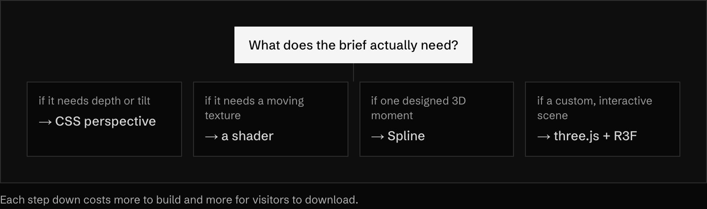
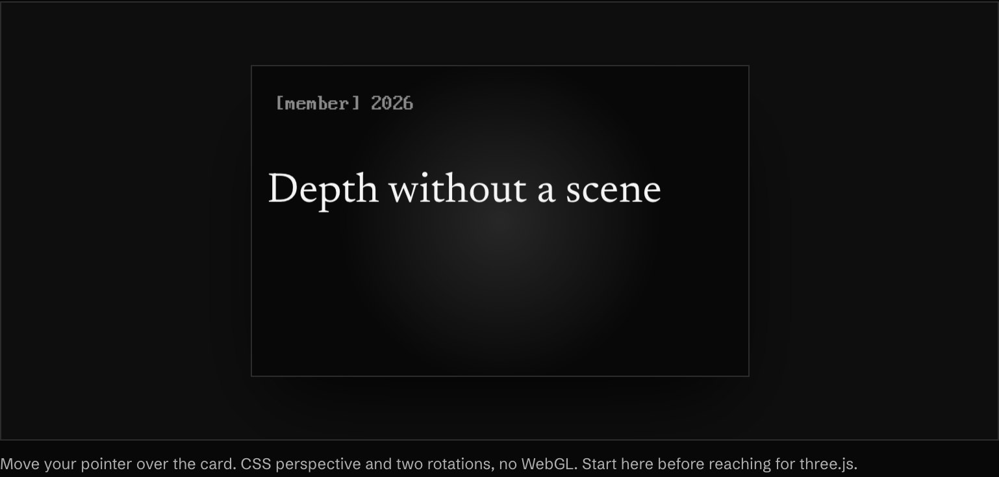

<!-- generated by `pnpm export:md` from content/docs/how-to/pick-a-3d-tool.mdx. Edit the MDX, not this file. -->

# How to decide if you need 3D, and which tool

*Start from the lightest option that does the job, then set up a scene that stays smooth.*

<sub>📖 [Read this chapter on the live site](https://frontenddesignbasics.vercel.app/docs/how-to/pick-a-3d-tool) for the interactive version · [← Guide contents](../README.md)</sub>

> - Most "make it 3D" briefs need depth, not a scene. Try CSS perspective first.
> - Use real 3D when the object is the story. React sites use three.js with React Three Fiber.
> - Cap DPR, compress models, pause off screen, and give reduced motion a still.

**Goal:** 3D only where it earns its weight, and a scene that runs well when it does.

## You need

- A clear answer to "what is the 3D for?".
- For a scene: `three`, `@react-three/fiber` and `@react-three/drei`.



<sub>Each step down costs more to build and more for visitors to download.</sub>

## Steps

### 1. Try CSS depth first



<sub>▶ Interactive on the [live site](https://frontenddesignbasics.vercel.app/docs/how-to/pick-a-3d-tool).</sub>

```tsx
<div style={{ perspective: 900 }}>
  <div style={{ transform: `rotateX(${x}deg) rotateY(${y}deg)`, transformStyle: 'preserve-3d' }}>
    <p style={{ transform: 'translateZ(60px)' }}>Depth without a scene</p>
  </div>
</div>
```

### 2. Pick the tool

| Brief | Reach for |
|---|---|
| React site, custom scene | **three.js + React Three Fiber + drei** |
| SvelteKit site | **Threlte** |
| A designed moment, fast | **Spline** |
| Game-like, edited by a team | **PlayCanvas** |
| Ready 3D UI pieces | **ThreeUI** (`npx @designcodeio/threeui-cli add <name>`, Pro) |
| An object from a photo | **img2threejs** skill |
| A scroll-driven 3D world | **scroll-world** skill |

All of them are on the [tools page](/tools) with install commands.

### 3. Set up a minimal scene

```tsx
'use client';
import { Canvas } from '@react-three/fiber';
import { Environment, Float } from '@react-three/drei';

export function Scene({ active }: { active: boolean }) {
  return (
    <Canvas dpr={[1, 1.75]} camera={{ position: [0, 0, 4], fov: 40 }} frameloop={active ? 'always' : 'never'}>
      <Float speed={1.4} rotationIntensity={0.6}>
        <mesh>
          <torusKnotGeometry args={[0.8, 0.28, 220, 32]} />
          <meshPhysicalMaterial color="#f5f5f5" roughness={0.25} clearcoat={1} />
        </mesh>
      </Float>
      <Environment preset="studio" />
    </Canvas>
  );
}
```

### 4. Follow the performance rules

- Cap device pixel ratio with `dpr={[1, 1.75]}`. 3× draws 2.25 times the pixels of 2× for almost no gain.
- Compress models with Draco or Meshopt, and textures with KTX2. BR95's retro computer ships at 1.0 MB.
- Pause when off screen and when the tab is hidden.
- Instance repeated meshes. See [instanced blocks](./instanced-blocks.md).
- Show a poster while the scene loads, and a still under reduced motion.

### 5. Skip heavy 3D on deep links

People who land on an inner page came for the content. BR95 boots its 3D computer only on `/`.

## Why it works

3D feels real because light, material and parallax say "this is physical". That same weight makes it
expensive, so spend it only where it carries the story.

## See it live

- [Pixel to HD cube](/lab/pixel-to-hd-cube)
- [BR95 case study](../cases/br95.md)

**In the wild · 19 examples**

<table>
<tr><td width="33%" valign="top"><a href="https://threeui.com"></a><br/><b><a href="https://threeui.com">ThreeUI</a></b><br/><sub>A library of three.js landing pages, hero sections and shaders: browse, copy, install via CLI.</sub></td><td width="33%" valign="top"><a href="https://messenger.abeto.co"></a><br/><b><a href="https://messenger.abeto.co">Messenger</a></b><br/><sub>Tiny cel-shaded 3D planet of houses and trees with blocky 3D title letters floating over it.</sub></td><td width="33%" valign="top"><a href="https://oryzo.ai"></a><br/><b><a href="https://oryzo.ai">Oryzo</a></b><br/><sub>Photoreal real-time cork coaster on a cutting mat, pencils and knife lit like a product shoot.</sub></td></tr>
<tr><td width="33%" valign="top"><a href="https://dogstudio.co"></a><br/><b><a href="https://dogstudio.co">Dogstudio</a></b><br/><sub>Iridescent 3D wolf with drifting leaves behind a huge serif headline, lit in violet and teal.</sub></td><td width="33%" valign="top"><a href="https://spline.design"></a><br/><b><a href="https://spline.design">Spline</a></b><br/><sub>Soft glossy 3D shapes and a voxel bunny float over a perspective grid around a prompt box.</sub></td><td width="33%" valign="top"><a href="https://www.shopify.com/editions/winter2024"></a><br/><b><a href="https://www.shopify.com/editions/winter2024">Shopify Editions Winter '24</a></b><br/><sub>Pale lilac 3D plinths hold product cards, chrome sparkles and a terminal, under giant FOUNDATIONS type.</sub></td></tr>
<tr><td width="33%" valign="top"><a href="https://dala.craftedbygc.com"></a><br/><b><a href="https://dala.craftedbygc.com">Dala</a></b><br/><sub>A brain built from thousands of colored 3D triangle particles beside a big white sans headline.</sub></td><td width="33%" valign="top"><a href="https://zentry.com"></a><br/><b><a href="https://zentry.com">Zentry</a></b><br/><sub>Glowing wireframe crystal form rendered inside a clipped, tilted black frame on electric violet.</sub></td><td width="33%" valign="top"><a href="https://chipsa.design"></a><br/><b><a href="https://chipsa.design">Chipsa</a></b><br/><sub>Textured grey 3D rock forms rise from the bottom of a quiet light page with condensed caps headline.</sub></td></tr>
<tr><td width="33%" valign="top"><a href="https://david-hckh.com"></a><br/><b><a href="https://david-hckh.com">David Heckhoff</a></b><br/><sub>Clay-style 3D room of a developer at a desk with monitors, plant and penguin, as a portfolio hero.</sub></td><td width="33%" valign="top"><a href="https://noomoagency.com"></a><br/><b><a href="https://noomoagency.com">Noomo</a></b><br/><sub>Frosted-glass 3D pixel shapes refract and blur the large mono headline they float across.</sub></td><td width="33%" valign="top"><a href="https://www.butter.video/"></a><br/><b><a href="https://www.butter.video/">Butter</a></b><br/><sub>Glossy 3D keychain charms dangle above a huge neutral headline, making the product feel tactile.</sub></td></tr>
<tr><td width="33%" valign="top"><a href="https://www.mindrobotics.com/"></a><br/><b><a href="https://www.mindrobotics.com/">Mind Robotics</a></b><br/><sub>Outlined, toon-shaded robot arm cuts diagonally through giant rounded wordmark on warm grey.</sub></td><td width="33%" valign="top"><a href="https://shapeofintelligence.com/"></a><br/><b><a href="https://shapeofintelligence.com/">The Shape of Intelligence</a></b><br/><sub>Wireframe metallic surface weaves between huge title letters; slider reshapes it across three chapters.</sub></td><td width="33%" valign="top"><a href="https://singularity.engl.design/"></a><br/><b><a href="https://singularity.engl.design/">Singularität</a></b><br/><sub>Deep-blue particle tunnel with radiating lines frames a centred headline; 'scroll to dive in' cue.</sub></td></tr>
<tr><td width="33%" valign="top"><a href="https://sobha-privy-collection.com/"></a><br/><b><a href="https://sobha-privy-collection.com/">The Privy Collection</a></b><br/><sub>Monochrome satin ribbon rendered in 3D behind serif type; a 3D map thumbnail sits bottom-right.</sub></td><td width="33%" valign="top"><a href="https://threeui.com/landing-pages/kage.html"></a><br/><b><a href="https://threeui.com/landing-pages/kage.html">Kage</a></b><br/><sub>Night temple scene with blood moon, falling maple leaves and grass; giant letters layered in depth.</sub></td><td width="33%" valign="top"><a href="https://threeui.com/three-js/sylva-living-world"></a><br/><b><a href="https://threeui.com/three-js/sylva-living-world">Sylva Living World</a></b><br/><sub>Procedural mossy root arches in soft fog, a whole Three.js world shown with four variants.</sub></td></tr>
<tr><td width="33%" valign="top"><a href="https://whiteout.overvac.com/"></a><br/><b><a href="https://whiteout.overvac.com/">WHITEOUT · An Ascent</a></b><br/><sub>Real-time snowy mountain base camp; altitude counter and side altitude rail drive a scroll-to-climb story.</sub></td></tr>
</table>

## Sources

- [React Three Fiber](https://r3f.docs.pmnd.rs/getting-started/introduction)
- [drei](https://github.com/pmndrs/drei)
- [OGL](https://oframe.github.io/ogl/)
