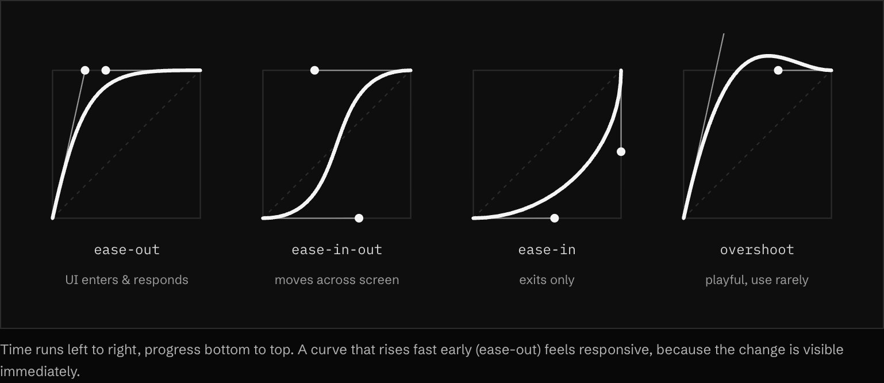
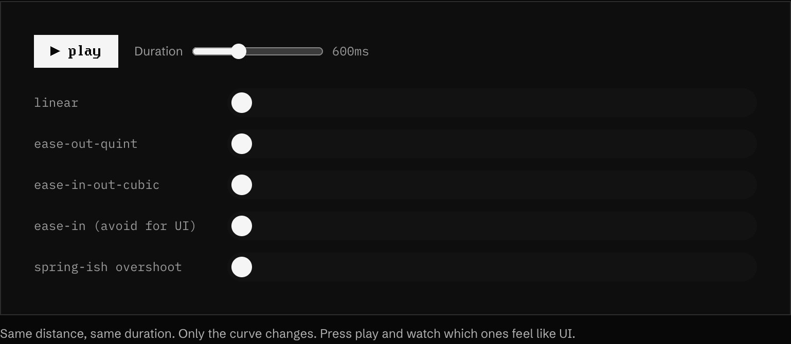
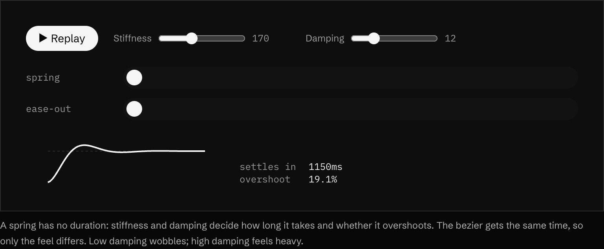

<!-- generated by `pnpm export:md` from content/docs/how-to/pick-an-ease.mdx. Edit the MDX, not this file. -->

# How to pick the right ease (and when to use a spring)

*Choose a curve in seconds, with a default set that covers almost every move.*

<sub>📖 [Read this chapter on the live site](https://frontenddesignbasics.vercel.app/docs/how-to/pick-an-ease) for the interactive version · [← Guide contents](../README.md)</sub>

> - Entering or responding: `expo.out`. Moving between two states: `power4.inOut`.
> - Retro and pixel pieces: `steps(n)`. Continuous loops: `none`.
> - Anything people can grab or interrupt: a spring.

**Goal:** motion that feels intentional, with no time spent guessing curves.

## You need

- GSAP (or CSS `cubic-bezier`). Motion (`motion/react`) for springs.
- The [motion tokens](../rules/motion-tokens.md), so every component uses the same names.

```text
 expo.out      █▓▒░░···   enter, respond
 power4.inOut  ·░▒██▒░·   between states
 steps(6)      ··██··██   retro, pixel
 none          ▒▒▒▒▒▒▒▒   loops, marquees
 (speed over time: solid is fast)
```

## See them side by side





<sub>▶ Interactive on the [live site](https://frontenddesignbasics.vercel.app/docs/how-to/pick-an-ease).</sub>

## Steps

### 1. Ask what the thing is doing

- **Arriving or reacting** (menu opens, toast appears, hover): ease-out. It starts fast so it feels
  instant, then settles.
- **Already on screen and moving** (a card to a new slot, a drawer): ease-in-out. It speeds up and
  brakes like a real object.
- **Leaving for good**: ease-in is allowed here, and only here.

### 2. Use the default set

```ts
gsap.defaults({ ease: 'expo.out', duration: 0.6 });
gsap.to(card, { x: 240, ease: 'power4.inOut', duration: 0.8 });   // between states
gsap.to(sprite, { x: 96, ease: 'steps(6)', duration: 0.6 });      // retro
gsap.to(track, { xPercent: -50, ease: 'none', repeat: -1, duration: 20 }); // loop
```

In CSS, `expo.out` is close to `cubic-bezier(0.16, 1, 0.3, 1)` and `power4.inOut` to
`cubic-bezier(0.76, 0, 0.24, 1)`.

### 3. Keep durations short

Hover and press 100 to 200ms. Menus 150 to 250ms. Modals and sections 250 to 400ms. If you notice the
animation itself, it is too long.

### 4. Reach for a spring when people can interrupt

A curve has a fixed duration. If someone grabs a sheet halfway, a curve has to restart. A spring keeps
its current speed and carries on from where it is.



<sub>▶ Interactive on the [live site](https://frontenddesignbasics.vercel.app/docs/how-to/pick-an-ease).</sub>

```tsx
<motion.div drag="x" dragConstraints={{ left: 0, right: 0 }}
  transition={{ type: 'spring', stiffness: 400, damping: 36 }} />
```

Keep bounce off for functional UI. Save a little overshoot for one playful moment.

### 5. Never use ease-in for a response

It starts slowly, so a click feels laggy. The browser keyword `ease` has the same problem in a milder
form.

## Why it works

Real objects never start or stop instantly. Ease-out mimics something thrown into place, ease-in-out
mimics something pushed and braked. People read both as physical, so the interface feels solid.

## See it live

- [Easing lab](/lab/easing-lab)

**In the wild · 14 examples**

<table>
<tr><td width="33%" valign="top"><a href="https://www.hellomonday.com"></a><br/><b><a href="https://www.hellomonday.com">Hello Monday</a></b><br/><sub>Hand-drawn animated couple above a rotating serif word, with a curved black menu edge peeking in.</sub></td><td width="33%" valign="top"><a href="https://aristidebenoist.com"></a><br/><b><a href="https://aristidebenoist.com">Aristide Benoist</a></b><br/><sub>Caught mid-intro: thin vertical photo strips sliding into place under a tick-mark progress bar.</sub></td><td width="33%" valign="top"><a href="https://activetheory.net"></a><br/><b><a href="https://activetheory.net">Active Theory</a></b><br/><sub>Real-time WebGL scene: glossy chrome ribbon logo floating among drifting golden particles and a jellyfish.</sub></td></tr>
<tr><td width="33%" valign="top"><a href="https://monopo.london"></a><br/><b><a href="https://monopo.london">monopo london</a></b><br/><sub>Grainy animated orange-and-blue gradient waves behind the headline, with a glass lens cursor bottom right.</sub></td><td width="33%" valign="top"><a href="https://makemepulse.com"></a><br/><b><a href="https://makemepulse.com">makemepulse</a></b><br/><sub>Kinetic staggered headline, 'global creative studio.', whose letters morph between typeface styles.</sub></td><td width="33%" valign="top"><a href="https://gsap.com"></a><br/><b><a href="https://gsap.com">GSAP</a></b><br/><sub>'Animate anything' hero with playful 3D squiggle and pinwheel shapes animating over giant type.</sub></td></tr>
<tr><td width="33%" valign="top"><a href="https://rive.app"></a><br/><b><a href="https://rive.app">Rive</a></b><br/><sub>Column of live interactive animation demos (thermostat, game UI, mobile app) running beside the pitch.</sub></td><td width="33%" valign="top"><a href="https://dogstudio.co"></a><br/><b><a href="https://dogstudio.co">Dogstudio</a></b><br/><sub>Iridescent 3D wolf with drifting leaves behind a huge serif headline. Headline contains a swear word.</sub></td><td width="33%" valign="top"><a href="https://www.exoape.com"></a><br/><b><a href="https://www.exoape.com">Exo Ape</a></b><br/><sub>Full-bleed Venice dome photo with an oversized 'Digital' wordmark sliding up from the bottom edge.</sub></td></tr>
<tr><td width="33%" valign="top"><a href="https://boc.studio"></a><br/><b><a href="https://boc.studio">Boc.Studio</a></b><br/><sub>Black spheres tumble over glowing red letterforms, cut by a scrolling orange ticker band carrying the logo.</sub></td><td width="33%" valign="top"><a href="https://cuberto.com"></a><br/><b><a href="https://cuberto.com">Cuberto</a></b><br/><sub>Calm centred headline over a rounded video card of a 3D screen scene; motion lives inside the media.</sub></td><td width="33%" valign="top"><a href="https://pensatori-irrazionali.com/"></a><br/><b><a href="https://pensatori-irrazionali.com/">Pensatori Irrazionali</a></b><br/><sub>Rendered fabric ribbons with client logos sweep across the frame like a flag, beside a quiet grey statement.</sub></td></tr>
<tr><td width="33%" valign="top"><a href="https://poppr.be"></a><br/><b><a href="https://poppr.be">poppr</a></b><br/><sub>Heavy staggered headline overlaps a rounded video card, with a pill CTA and circular scroll cue.</sub></td><td width="33%" valign="top"><a href="https://www.rejouice.com"></a><br/><b><a href="https://www.rejouice.com">Rejouice</a></b><br/><sub>Full-width white wordmark on black, with a video reel rising from below as the next reveal.</sub></td></tr>
</table>

## Sources

- [Material 3: easing and duration](https://m3.material.io/styles/motion/easing-and-duration)
- [GSAP: ScrollTrigger](https://gsap.com/docs/v3/Plugins/ScrollTrigger/)
