<!-- generated by `pnpm export:md` from content/docs/how-to/scroll-without-hijacking.mdx. Edit the MDX, not this file. -->

# How to add scroll effects without hijacking the page

*Pin, scrub, skew and zoom inside one section, while the rest of the page scrolls normally.*

<sub>📖 [Read this chapter on the live site](https://frontenddesignbasics.vercel.app/docs/how-to/scroll-without-hijacking) for the interactive version · [← Guide contents](../README.md)</sub>

> - Scope Lenis to a container, drive it from the GSAP ticker, and mark inner scrollers with `data-lenis-prevent`.
> - Tell ScrollTrigger about the scroller, use `pinType: 'transform'`, and refresh only that container.
> - Skew by velocity and zoom exponentially, both clamped.

**Goal:** one section feels like a film, and the page around it still feels like a web page.

## You need

- `gsap` with `ScrollTrigger`, and `lenis`.
- A container with its own scroll (`overflow-y: auto`) and a fixed height.

```text
 page: native scroll
┌ section: overflow-y auto ────────────┐
│ Lenis(wrapper) ─ gsap.ticker         │
│ ScrollTrigger({ scroller })          │
│ [pin] ── scrub timeline ── [release] │
│                                      │
│ inner list: data-lenis-prevent       │
│ └ scrolls natively again             │
└──────────────────────────────────────┘
 page: native scroll again
```

## Steps

### 1. Scope Lenis to the container

```ts
const lenis = new Lenis({ wrapper: box, content: box.firstElementChild as HTMLElement, autoRaf: false, lerp: 0.1 });
const tick = (t: number) => lenis.raf(t * 1000);
gsap.ticker.add(tick);
lenis.on('scroll', ScrollTrigger.update);
```

`autoRaf: false` means GSAP drives Lenis, so both run on one clock. Remove the ticker callback and call
`lenis.destroy()` on cleanup.

### 2. Let inner scrollers scroll natively

Add `data-lenis-prevent` to a code block, a list or a map inside the section. Lenis ignores wheel and
touch events there.

### 3. Point ScrollTrigger at the container

```ts
ScrollTrigger.create({
  trigger: chapter, scroller: box, start: 'top top', end: '+=150%',
  pin: true, pinType: 'transform', scrub: true, animation: tl,
});
```

The default pin uses `position: fixed`, which breaks inside a transformed or scrolling container.
`pinType: 'transform'` pins by moving the element instead.

### 4. Refresh only your triggers

When images load or the box resizes, refresh the triggers you made, not the whole page:

```ts
new ResizeObserver(() => triggers.forEach((t) => t.refresh())).observe(box);
```

`ScrollTrigger.refresh()` recalculates every trigger on the site, which causes a jump elsewhere.

### 5. Skew by velocity

```ts
const skew = gsap.quickTo(cards, 'skewY', { duration: 0.4, ease: 'power3' });
lenis.on('scroll', ({ velocity }) => skew(gsap.utils.clamp(-8, 8, velocity * 0.4)));
```

Clamp it. Unclamped skew on a fast trackpad flick looks broken.

### 6. Zoom exponentially

For a Droste or "zoom into the picture" effect, scale by a power, not a line: `scale = 2 ** (progress * 6)`.
Linear zoom feels slow at the start and wild at the end. Exponential zoom feels steady all the way.

### 7. Give reduced motion a plain scroll

Inside `gsap.matchMedia()`, create Lenis and the pins only for `(prefers-reduced-motion: no-preference)`.
Reduced motion gets normal scrolling and every chapter shown in its final state.

## Why it works

People trust the scroll bar. Taking over one clearly framed section keeps the effect and keeps that
trust. The rest of the page, the back button and the keyboard all still behave.

## See it live

- [Pinned chapters](/lab/pinned-chapters)
- [Velocity gallery](/lab/velocity-gallery)

**In the wild · 17 examples**

<table>
<tr><td width="33%" valign="top"><a href="https://jeskojets.com"></a><br/><b><a href="https://jeskojets.com">Jesko Jets</a></b><br/><sub>Scroll-scrubbed paragraph: words fill from faded to solid white as you scroll over clouds.</sub></td><td width="33%" valign="top"><a href="https://oryzo.ai"></a><br/><b><a href="https://oryzo.ai">Oryzo</a></b><br/><sub>Pinned 3D cork coaster rotating mid-scroll between the headline and copy, lit like a product film.</sub></td><td width="33%" valign="top"><a href="https://zentry.com"></a><br/><b><a href="https://zentry.com">Zentry</a></b><br/><sub>Mid-scroll, a skewed 3D-tilted media card sits under heavy condensed type, transforming as the page moves.</sub></td></tr>
<tr><td width="33%" valign="top"><a href="https://www.shopify.com/editions/summer2025">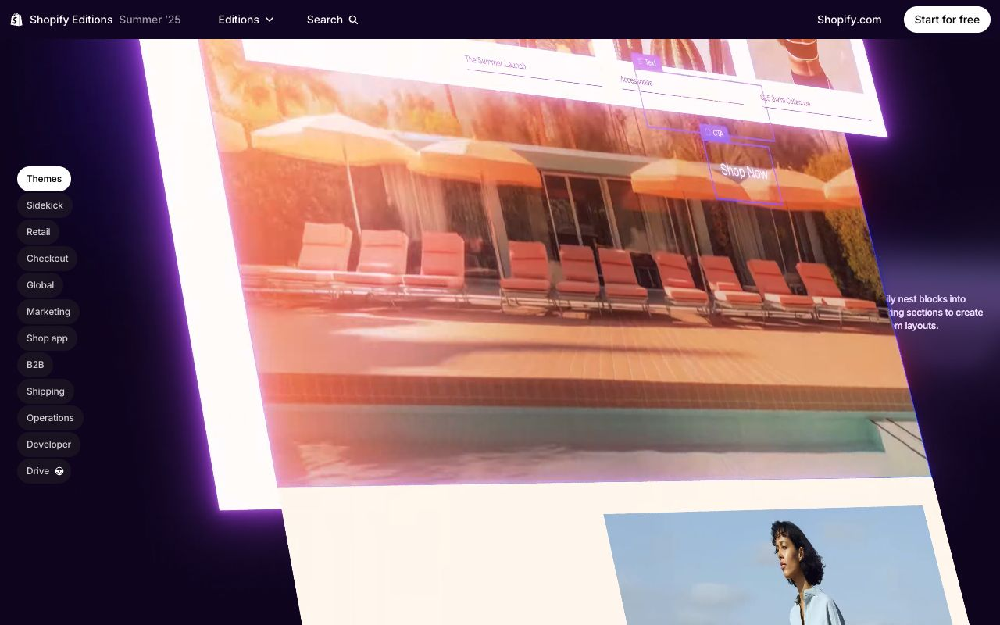</a><br/><b><a href="https://www.shopify.com/editions/summer2025">Shopify Editions Summer '25</a></b><br/><sub>Storefront mockup tilted in 3D perspective with a purple glow, and a pill-shaped chapter nav on the left.</sub></td><td width="33%" valign="top"><a href="https://www.adaline.ai">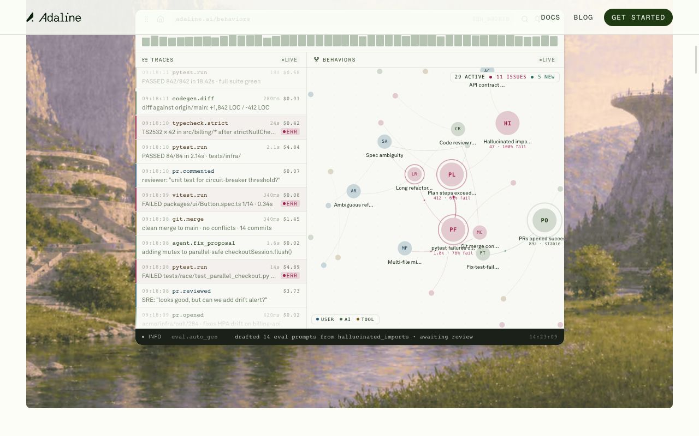</a><br/><b><a href="https://www.adaline.ai">Adaline</a></b><br/><sub>Product UI panel pinned over a painted fantasy landscape, zooming in as the story scrolls.</sub></td><td width="33%" valign="top"><a href="https://landonorris.com">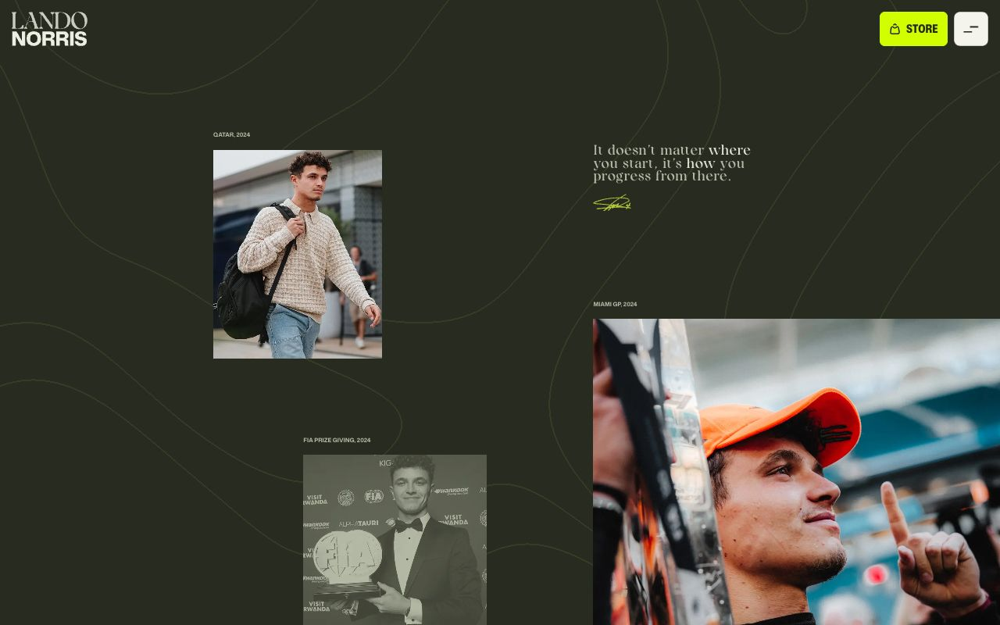</a><br/><b><a href="https://landonorris.com">Lando Norris</a></b><br/><sub>Staggered parallax photos and a signed quote drifting at different speeds over contour-line background.</sub></td></tr>
<tr><td width="33%" valign="top"><a href="https://opalcamera.com">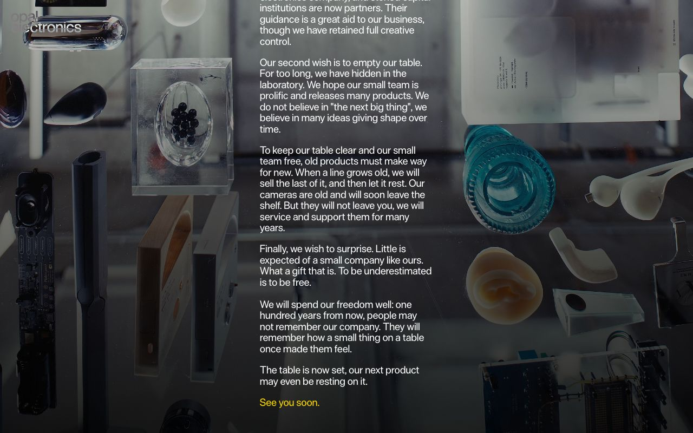</a><br/><b><a href="https://opalcamera.com">Opal</a></b><br/><sub>Manifesto text scrolls over a pinned still life of prototypes and parts on a glass table.</sub></td><td width="33%" valign="top"><a href="https://pudding.cool/2017/05/song-repetition/">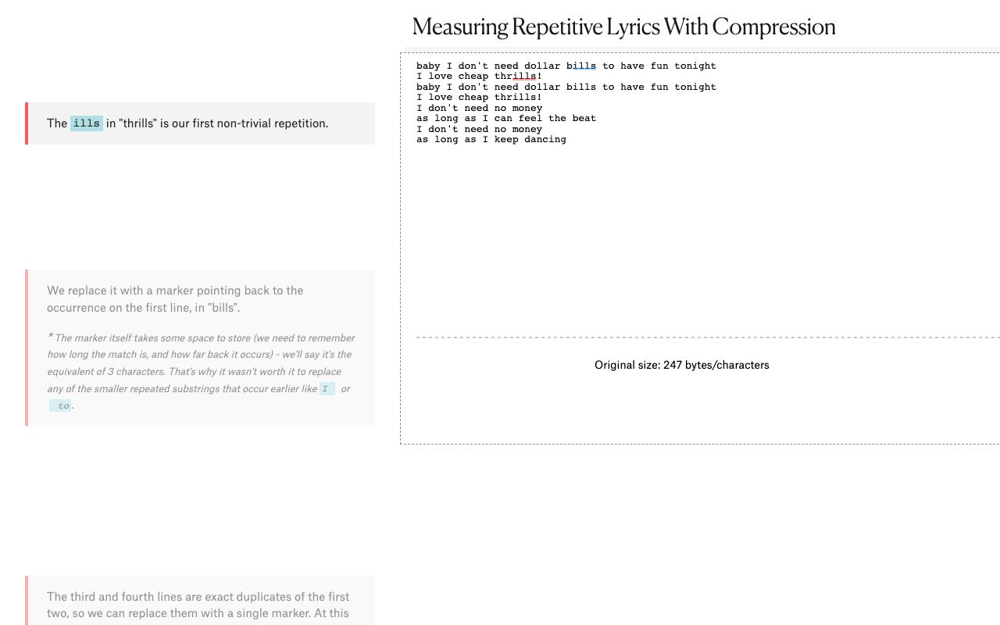</a><br/><b><a href="https://pudding.cool/2017/05/song-repetition/">The Pudding: Song Repetition</a></b><br/><sub>Classic scrollytelling: step cards on the left update a sticky lyrics graphic on the right.</sub></td><td width="33%" valign="top"><a href="https://www.apple.com/apple-vision-pro/">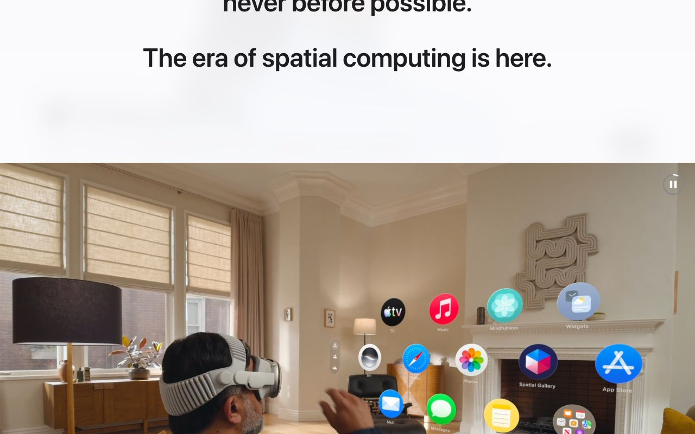</a><br/><b><a href="https://www.apple.com/apple-vision-pro/">Apple Vision Pro</a></b><br/><sub>Headline fades out as a full-bleed video of floating app icons scrolls into view.</sub></td></tr>
<tr><td width="33%" valign="top"><a href="https://aardvarkbookclub.com">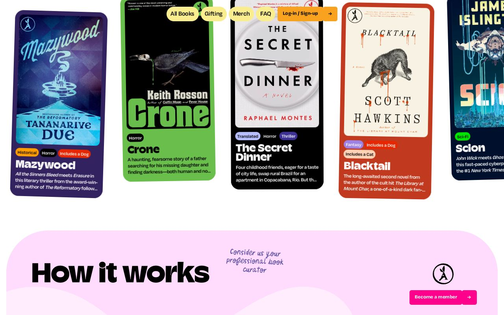</a><br/><b><a href="https://aardvarkbookclub.com">Aardvark Book Club</a></b><br/><sub>Tilted colourful book cards drift in a row above a rounded pink 'How it works' panel.</sub></td><td width="33%" valign="top"><a href="https://cerebrium.ai/">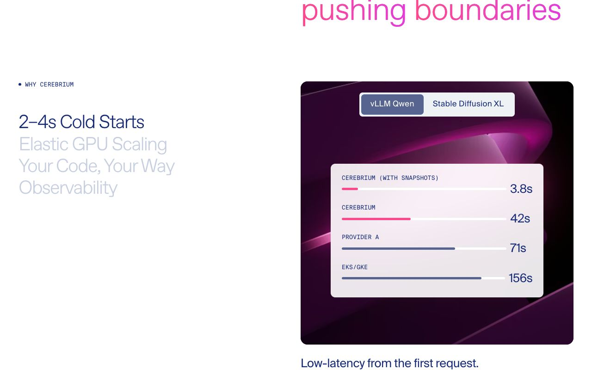</a><br/><b><a href="https://cerebrium.ai/">Cerebrium</a></b><br/><sub>Sticky feature list highlights the active item while the right panel swaps to a benchmark chart.</sub></td><td width="33%" valign="top"><a href="https://ciechanow.ski/mechanical-watch/">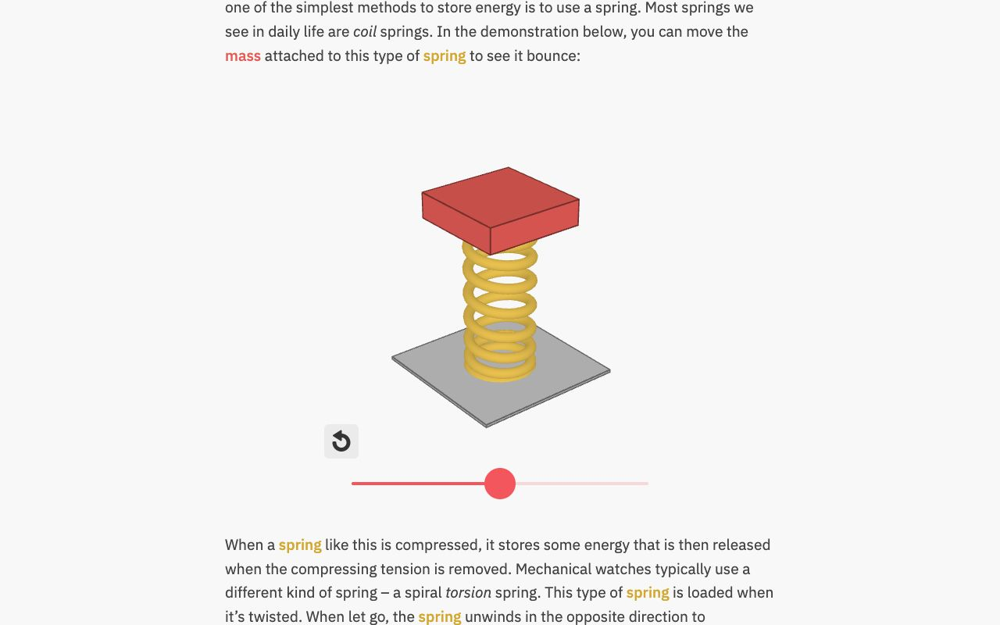</a><br/><b><a href="https://ciechanow.ski/mechanical-watch/">Mechanical Watch</a></b><br/><sub>Long-form article pauses for an interactive 3D spring with a slider, colour-keyed to the text.</sub></td></tr>
<tr><td width="33%" valign="top"><a href="https://www.era-residence.com">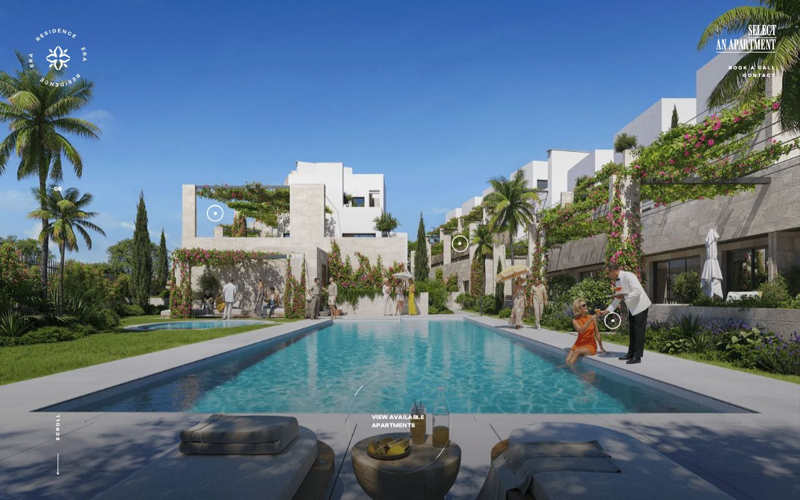</a><br/><b><a href="https://www.era-residence.com">ERA Residence</a></b><br/><sub>Full-bleed poolside render with hotspot markers, a vertical scroll cue and a 'view apartments' ring.</sub></td><td width="33%" valign="top"><a href="https://www.firewatchgame.com">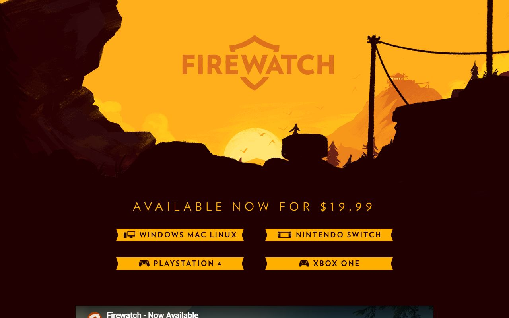</a><br/><b><a href="https://www.firewatchgame.com">Firewatch</a></b><br/><sub>Layered painted silhouettes of cliffs and trees sit ready to parallax over an orange sunset.</sub></td><td width="33%" valign="top"><a href="https://www.rockstargames.com/VI">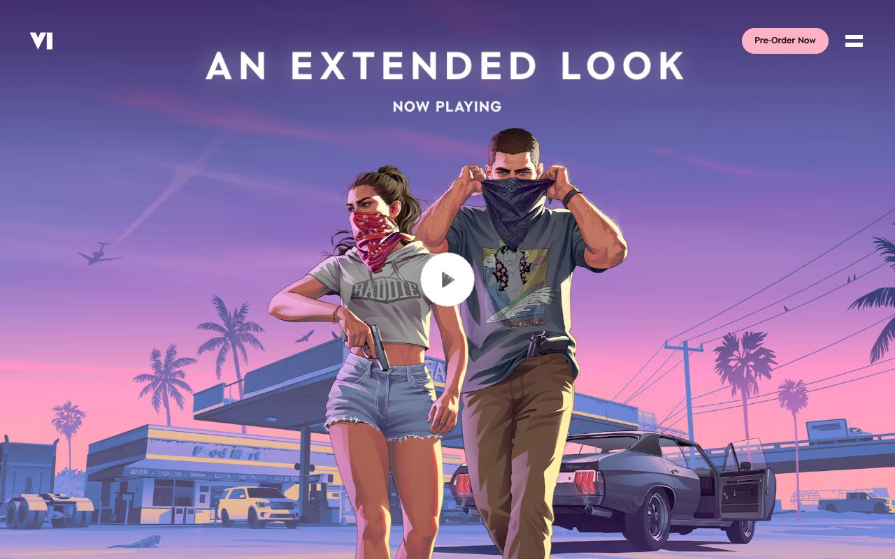</a><br/><b><a href="https://www.rockstargames.com/VI">Grand Theft Auto VI</a></b><br/><sub>Full-bleed key art of two characters at dusk, with a centred title and play button.</sub></td></tr>
<tr><td width="33%" valign="top"><a href="https://global.honda/jp/wingmark/">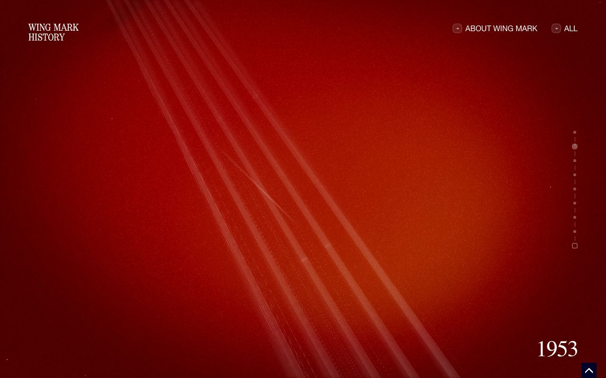</a><br/><b><a href="https://global.honda/jp/wingmark/">Wing Mark History</a></b><br/><sub>Red light-streak scene with a year counter (1953) and vertical progress dots tracking the timeline.</sub></td><td width="33%" valign="top"><a href="https://whiteout.overvac.com">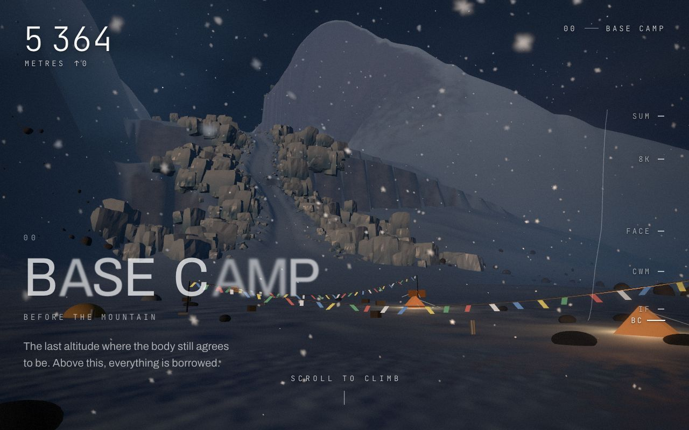</a><br/><b><a href="https://whiteout.overvac.com">WHITEOUT</a></b><br/><sub>3D snowy base camp with an altitude counter and camp-by-camp side index; 'scroll to climb'.</sub></td></tr>
</table>

## Sources

- [Lenis](https://lenis.darkroom.engineering)
- [GSAP: ScrollTrigger](https://gsap.com/docs/v3/Plugins/ScrollTrigger/)
- [MDN: prefers-reduced-motion](https://developer.mozilla.org/en-US/docs/Web/CSS/@media/prefers-reduced-motion)
