<!-- generated by `pnpm export:md` from content/docs/how-to/shader-background.mdx. Edit the MDX, not this file. -->

# How to write a shader background

*One full-screen triangle and a fragment shader that drifts like ink, stays behind the text, and freezes for reduced motion.*

<sub>📖 [Read this chapter on the live site](https://frontenddesignbasics.vercel.app/docs/how-to/shader-background) for the interactive version · [← Guide contents](../README.md)</sub>

> - Layer noise (fbm), then warp it with more noise.
> - Turn the field into shapes with `smoothstep`, multiply the colours, add grain.
> - Keep text readable, cap DPR, pause off screen, freeze for reduced motion.

**Goal:** a living texture that sets the mood without fighting the words on top.

## You need

- [OGL](https://github.com/oframe/ogl), a tiny WebGL library. No three.js needed.
- The full example: [`components/ink-field.tsx`](https://github.com/br9704/frontenddesignbasics/blob/main/components/ink-field.tsx).

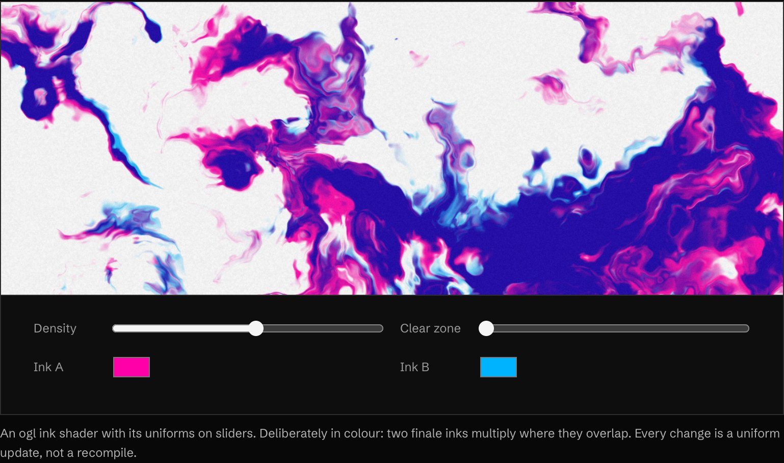

<sub>▶ Interactive on the [live site](https://frontenddesignbasics.vercel.app/docs/how-to/shader-background).</sub>

```text
 noise ─► warp ─► threshold ─► multiply ─► grain
 smooth   noise    field to     inks over    print
 random   bends    ink shapes   paper        texture
          noise
```

## Steps

### 1. Draw one full-screen triangle

A single triangle bigger than the screen covers every pixel with no seam. OGL's `Triangle` geometry
does it for you. All the work happens in the fragment shader.

### 2. Layer noise

`noise(p)` gives smooth random values. Add several layers at doubling frequency and halving strength.
That is fbm (fractal Brownian motion), and it looks like clouds.

### 3. Warp it

Feed noise into the coordinates of more noise. Straight bands turn into ink swirling in water.

```glsl
vec2 q = vec2(fbm(p + vec2(0.0, t)), fbm(p + vec2(5.2, 1.3) - t));
vec2 r = vec2(fbm(p + 3.0 * q + vec2(1.7, 9.2) + t * 1.4),
              fbm(p + 3.0 * q + vec2(8.3, 2.8) - t * 1.1));
float f = fbm(p + 3.2 * r);
```

### 4. Threshold, multiply, grain

```glsl
float inkA = smoothstep(0.56 - uDensity, 0.66 - uDensity, f + 0.12 * r.x);
vec3 col = mix(uPaper, uPaper * uInkA, inkA * 0.92);          // multiply, like ink
col += (hash(uv * uRes + fract(uTime) * 91.0) - 0.5) * 0.045;  // grain hides banding
```

### 5. Keep the text readable

Fade the shader towards the paper colour behind the headline (a `clear` zone uniform), or put copy on
a solid plate. Check contrast at the darkest point the text can sit on.

### 6. Pause, cap and freeze

Cap DPR, because fragment cost grows with every pixel. Stop the loop off screen with an
IntersectionObserver. Under reduced motion, render one good frame and stop.

## Or use a tool

| You want | Use |
|---|---|
| A living gradient, tuned by eye | **ShaderGradient** |
| A premium background, fast | **GetLayers** |
| Animated backgrounds as React components | **React Bits** |
| Something that is yours | Write it. Start with [The Book of Shaders](https://thebookofshaders.com) |

## Why it works

A shader background is like paper stock in print. It sets the mood before a word is read, as long as
it stays behind the words.

## See it live

- [Liquid gradient](/lab/liquid-gradient)
- [Make colour look expensive](./make-colour-look-expensive.md) for OKLab mixing

**In the wild · 14 examples**

<table>
<tr><td width="33%" valign="top"><a href="https://monopo.london">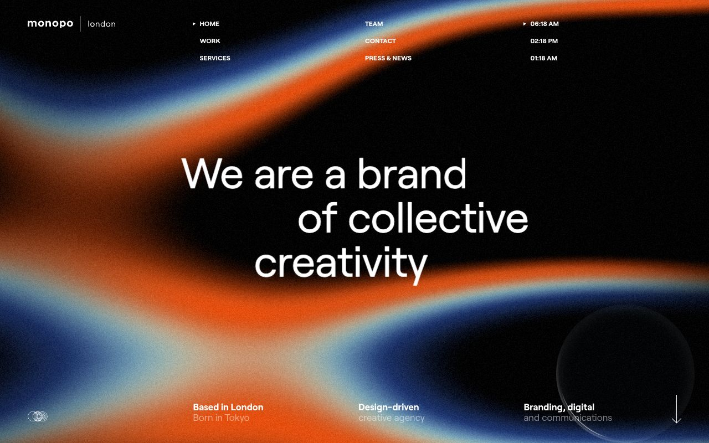</a><br/><b><a href="https://monopo.london">Monopo London</a></b><br/><sub>Grainy orange and blue light ribbons sweep across black behind white headline, full-bleed shader field.</sub></td><td width="33%" valign="top"><a href="https://shadergradient.co">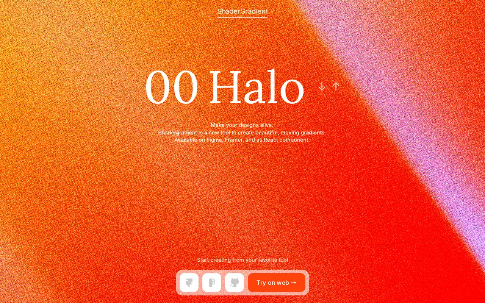</a><br/><b><a href="https://shadergradient.co">ShaderGradient</a></b><br/><sub>Full-screen grainy orange-to-pink moving gradient with an elegant serif title laid over it.</sub></td><td width="33%" valign="top"><a href="https://shaders.paper.design">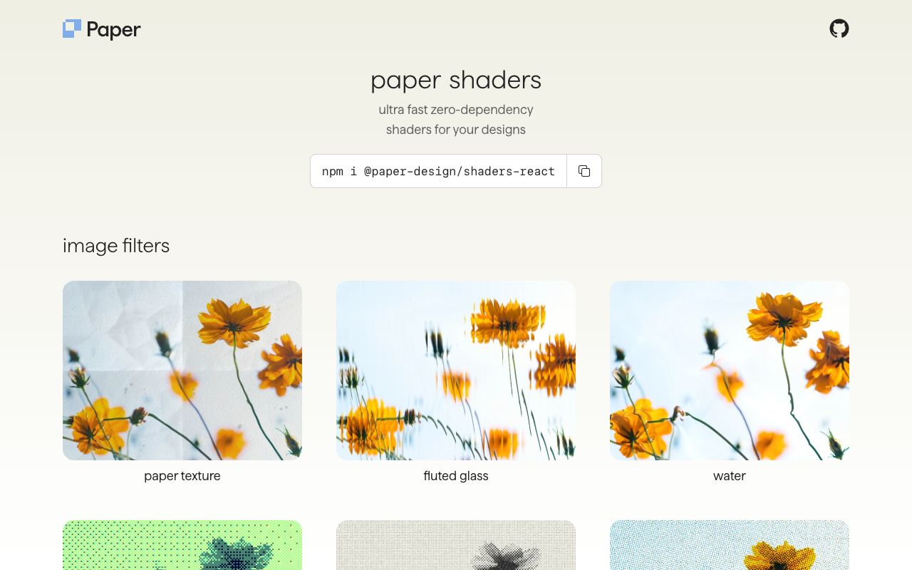</a><br/><b><a href="https://shaders.paper.design">Paper Shaders</a></b><br/><sub>Grid of the same flower photo run through paper texture, fluted glass, water and halftone shaders.</sub></td></tr>
<tr><td width="33%" valign="top"><a href="https://radiant-shaders.com">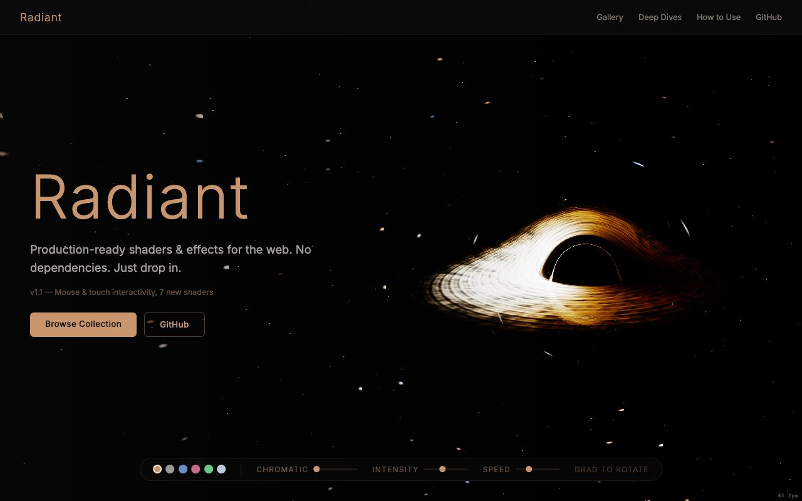</a><br/><b><a href="https://radiant-shaders.com">Radiant</a></b><br/><sub>A glowing black-hole accretion disk shader in a starfield, with live chromatic, intensity and speed sliders.</sub></td><td width="33%" valign="top"><a href="https://unicorn.studio">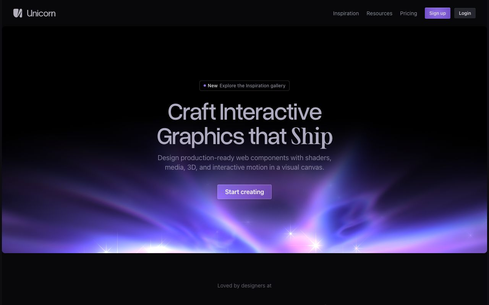</a><br/><b><a href="https://unicorn.studio">Unicorn Studio</a></b><br/><sub>Violet aurora light beams with sparkles glow up from the bottom of a dark hero card.</sub></td><td width="33%" valign="top"><a href="https://ertdfgcvb.xyz">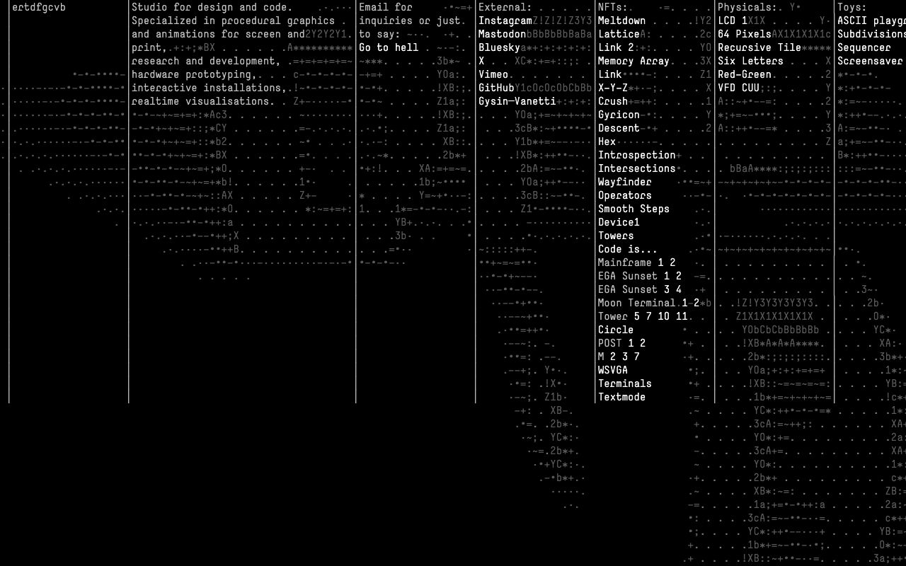</a><br/><b><a href="https://ertdfgcvb.xyz">ertdfgcvb</a></b><br/><sub>The whole page is a generative ASCII field: characters flow in columns around plain text links.</sub></td></tr>
<tr><td width="33%" valign="top"><a href="https://www.kentatoshikura.com">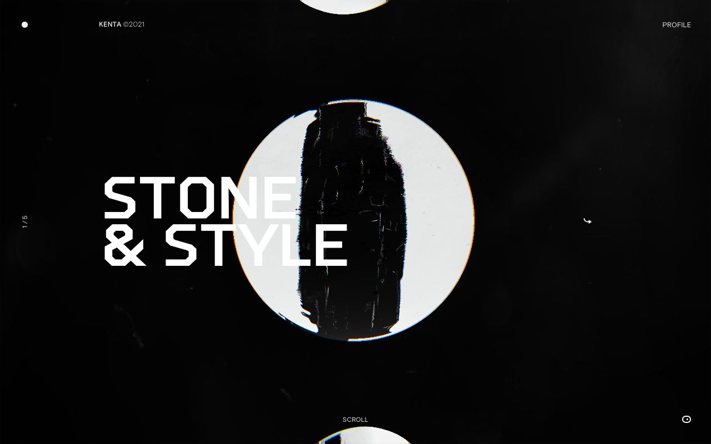</a><br/><b><a href="https://www.kentatoshikura.com">Kenta Toshikura</a></b><br/><sub>Film-grain, dust and RGB-split distortion on a circular image behind bold stencil type.</sub></td><td width="33%" valign="top"><a href="https://www.hume.ai"></a><br/><b><a href="https://www.hume.ai">Hume AI</a></b><br/><sub>Generative flowing line waves in pink, peach and lilac fill a rounded panel under a warm light hero.</sub></td><td width="33%" valign="top"><a href="https://alexharri.com/blog/webgl-gradients">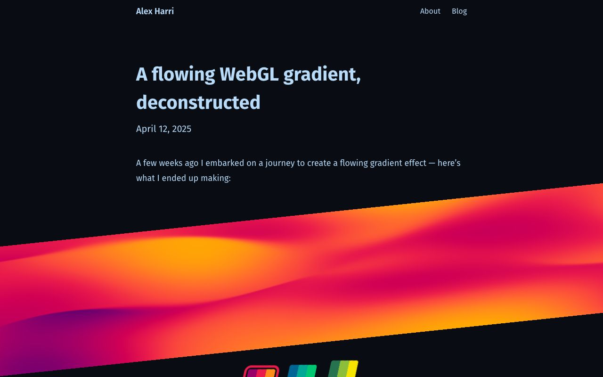</a><br/><b><a href="https://alexharri.com/blog/webgl-gradients">A flowing WebGL gradient</a></b><br/><sub>A live tilted band of flowing magenta-orange noise gradient cuts across a dark article page.</sub></td></tr>
<tr><td width="33%" valign="top"><a href="https://cobe.vercel.app">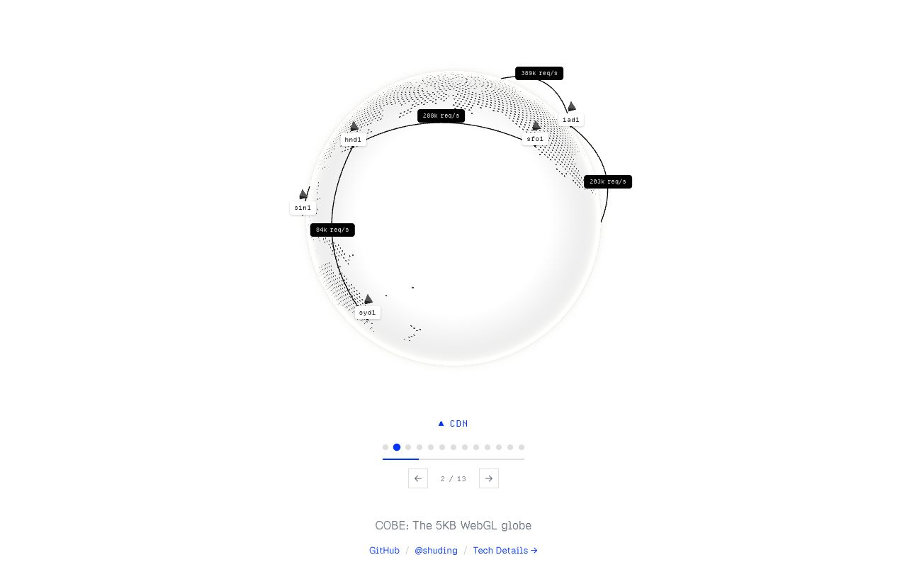</a><br/><b><a href="https://cobe.vercel.app">COBE</a></b><br/><sub>Minimal white dotted WebGL globe with arcs and labelled markers, drawn by a 5KB shader.</sub></td><td width="33%" valign="top"><a href="https://austensor.com">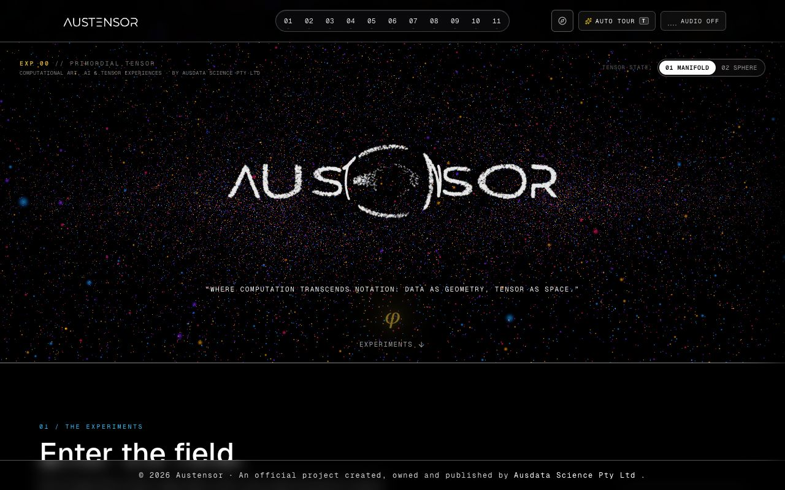</a><br/><b><a href="https://austensor.com">Austensor</a></b><br/><sub>Wordmark formed from thousands of coloured particles; toggles switch tensor state between manifold and sphere.</sub></td><td width="33%" valign="top"><a href="https://digitalmeadow.studio/">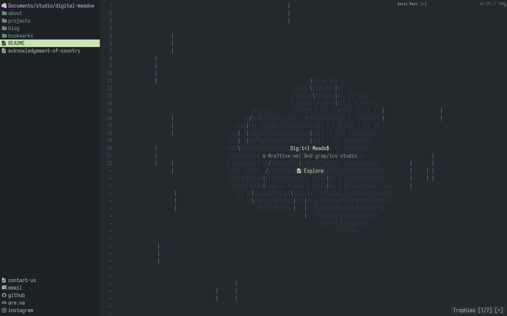</a><br/><b><a href="https://digitalmeadow.studio/">Digital Meadow</a></b><br/><sub>ASCII rain and glyph cloud rendered live inside an editor-style layout with file-tree navigation.</sub></td></tr>
<tr><td width="33%" valign="top"><a href="https://huly.io"></a><br/><b><a href="https://huly.io">Huly</a></b><br/><sub>Volumetric blue light beam crashes onto the product screenshot, glowing edges lead the eye downward.</sub></td><td width="33%" valign="top"><a href="https://juncastudio.com/"></a><br/><b><a href="https://juncastudio.com/">Junca Studio</a></b><br/><sub>Smoky red noise field washes over a 3D robot terminal, tinting the whole hero one colour.</sub></td></tr>
</table>

## Sources

- [The Book of Shaders](https://thebookofshaders.com)
- [OGL](https://oframe.github.io/ogl/)
