<!-- generated by `pnpm export:md` from content/docs/how-to/start-a-project.mdx. Edit the MDX, not this file. -->

# How to start a project with the toolkit

*Go from a brief to one working, verified experience in six steps.*

<sub>📖 [Read this chapter on the live site](https://frontenddesignbasics.vercel.app/docs/how-to/start-a-project) for the interactive version · [← Guide contents](../README.md)</sub>

> - Pick one stage and two or three tools. Not ten.
> - Put every colour in tokens before you write a component.
> - Build one experience, then prove it moves, stops and fits at 390px.

**Goal:** a first piece of the site that looks designed, not generated, and passes every check.

## You need

- The brief, and [`DESIGN.md`](https://github.com/br9704/frontenddesignbasics/blob/main/DESIGN.md) open beside it.
- [`toolkit/toolkit.json`](https://github.com/br9704/frontenddesignbasics/blob/main/toolkit/toolkit.json) (or the [tools page](/tools)).
- A Next.js app with Tailwind 4, and Playwright for the check at the end.

```text
 brief ─► stage ─► tools ─► tokens ─► build ─► verify
 why      look     2 or 3   values    one      frames
                                      piece    + 390px
```

## Steps

### 1. Read the brief, then write one line

Say what the thing *is* and who it is for, in one sentence. A coffee roaster, a bank dashboard and a
game studio should never share a template. Write the line at the top of your plan.

### 2. Pick a stage

This site has three looks. Choose the one the brief needs, or one per section:

- **win95**: grey bevels, pixel fonts, ASCII. Nostalgic and playful.
- **mono**: black and white with 3D and shaders. Calm and precise.
- **colour**: loud, full-bleed colour fields. The finale.

### 3. Pick two or three tools

Open [/tools](/tools) or ask your agent *"what in toolkit.json fits this brief?"*. A typical site needs
one motion library, at most one 3D or shader approach, and one component source. For example: `gsap`
plus `lenis` for a scroll story, or `threejs` plus `gsap` for a 3D hero.

### 4. Set the tokens

Every colour, font and curve lives in `app/global.css`, inside Tailwind 4's `@theme`. Components use
the names, never the hex.

```css
@theme {
  /* mono */
  --color-v-bg: #080808;
  --color-v-ink: #f5f5f5;
  --color-v-dim: #8a8a8a;
  /* win95 */
  --color-w-face: #c0c0c0;
  --color-w-shadow: #808080;
  /* colour finale */
  --color-c-1: #ff2e00;
  --color-c-4: #00b3ff;
  /* type and motion */
  --font-pixel: 'Web IBM VGA 8x16', var(--font-mono), monospace;
  --ease-out-expo: cubic-bezier(0.16, 1, 0.3, 1);
}
```

Now `bg-v-bg`, `text-c-1` and `font-pixel` work as utilities.

### 5. Build one experience

Make one self-contained component that takes `active`, `reducedMotion` and an optional `progress`.
Register it in `lib/experiences/` so it shows at `/lab/<id>`. The contract is in
[Drive any component from progress](./progress-driven-components.md).

### 6. Verify it

```bash
npx tsx scripts/validate-exp.ts <your-id>
```

It checks that two frames 1.5 s apart differ, that reduced motion is still, and that 390px has no
sideways scroll. Then open the screenshots in `.validate/<id>/` and look at them yourself.

## Pitfalls

- **Too many tools.** The site starts to look like its dependencies. Three is plenty.
- **Raw hex in a component.** It will drift from the palette. Add a token instead.
- **Trusting a green check.** A black canvas "moves" if one pixel flickers. Read the screenshots.

## Why it works

Each step removes a kind of choice. Once the stage, tools and tokens are fixed, every later decision is
a lookup, so the result stays consistent even when an agent writes most of the code.

## See it live

Every experience in the [/make](/make) gallery was started this way. Open any one full screen from there.

**Sites with a clear point of view · 15 examples**

<table>
<tr><td width="33%" valign="top"><a href="https://dennissnellenberg.com"></a><br/><b><a href="https://dennissnellenberg.com">Dennis Snellenberg</a></b><br/><sub>Cut-out portrait with his name as a giant marquee running behind, plus a location pill and role.</sub></td><td width="33%" valign="top"><a href="https://gilhuybrecht.com/"></a><br/><b><a href="https://gilhuybrecht.com/">Gil Huybrecht</a></b><br/><sub>Black index page: services and awards up top, then numbered project screenshots in a strict grid.</sub></td><td width="33%" valign="top"><a href="https://www.gionatannese.com"></a><br/><b><a href="https://www.gionatannese.com">GN.D</a></b><br/><sub>Small work thumbnails float in a loose sphere on white space, with a tiny tabbed header.</sub></td></tr>
<tr><td width="33%" valign="top"><a href="https://jesperlandberg.com">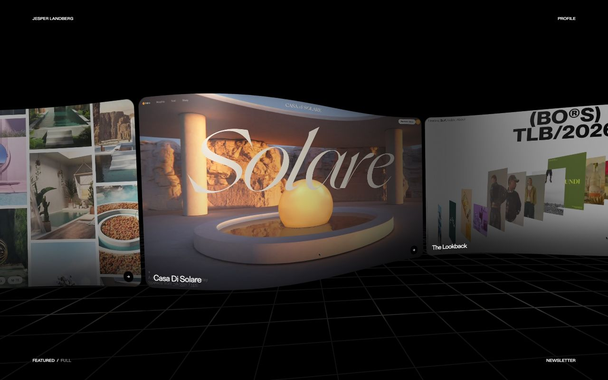</a><br/><b><a href="https://jesperlandberg.com">Jesper Landberg</a></b><br/><sub>Project cards curve around a 3D carousel over a grid floor; minimal corner labels frame the work.</sub></td><td width="33%" valign="top"><a href="https://www.meermohsin.me/">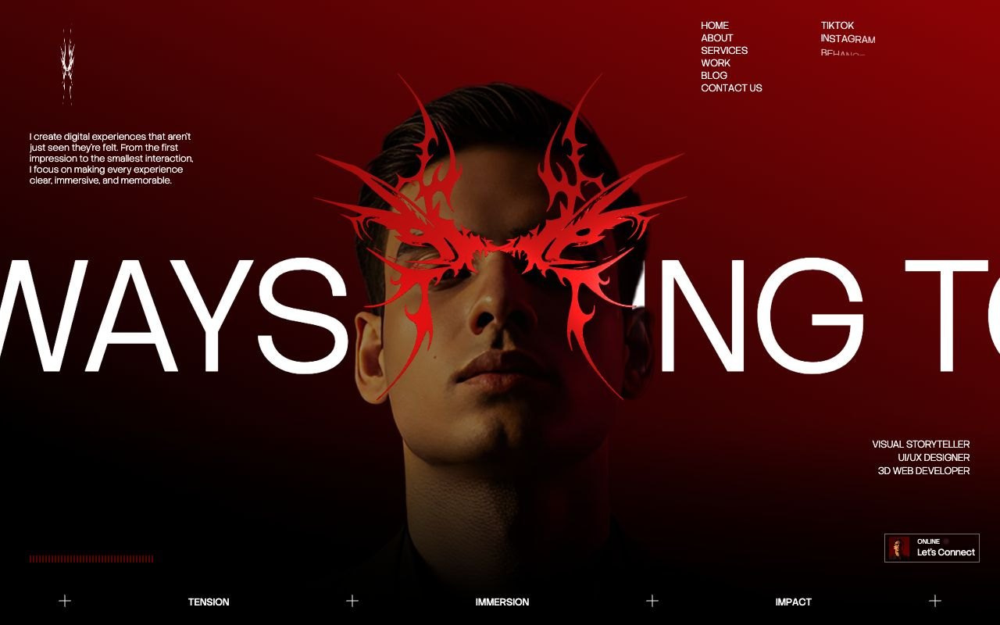</a><br/><b><a href="https://www.meermohsin.me/">Meer Mohsin</a></b><br/><sub>Red-graded portrait with a chrome tribal mask, giant slogan type behind, and a Tension/Immersion/Impact footer bar.</sub></td><td width="33%" valign="top"><a href="https://olivierlarose.com">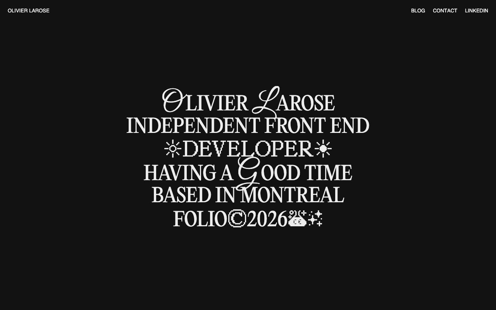</a><br/><b><a href="https://olivierlarose.com">Olivier Larose</a></b><br/><sub>One centred type block mixing serif, script initials and pixel glyphs to carry the whole personality.</sub></td></tr>
<tr><td width="33%" valign="top"><a href="https://www.robin-noguier.com">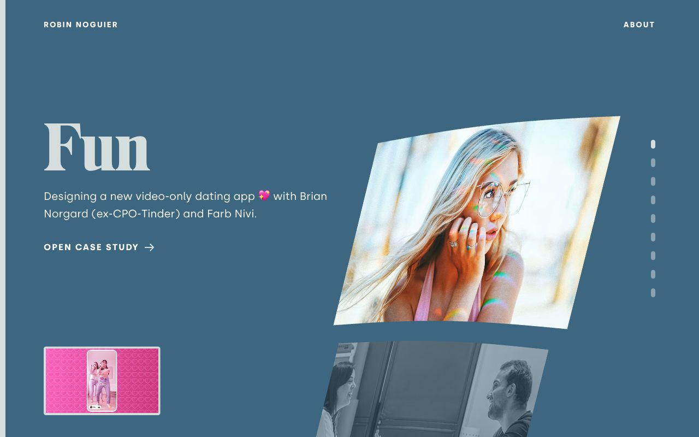</a><br/><b><a href="https://www.robin-noguier.com">Robin Noguier</a></b><br/><sub>Case study slider: big serif title and blurb left, warped project images right, dot pagination.</sub></td><td width="33%" valign="top"><a href="https://brittanychiang.com">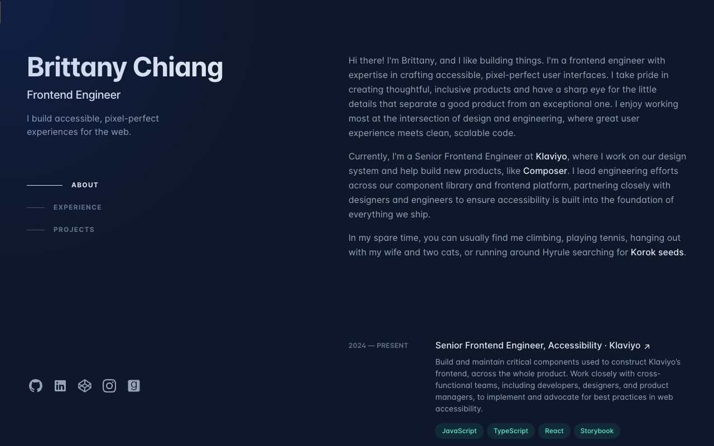</a><br/><b><a href="https://brittanychiang.com">Brittany Chiang</a></b><br/><sub>Deep navy two-column layout: sticky name and section nav left, bio and experience scrolling right.</sub></td><td width="33%" valign="top"><a href="https://lynnandtonic.com">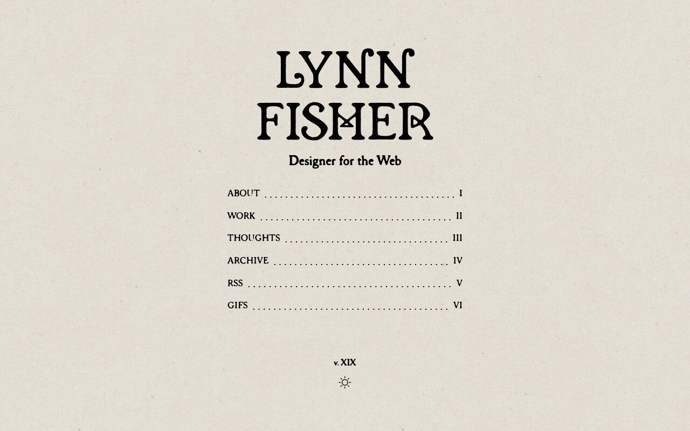</a><br/><b><a href="https://lynnandtonic.com">Lynn Fisher</a></b><br/><sub>Paper-textured page, ornate display serif name, table-of-contents menu with dotted leaders and roman numerals.</sub></td></tr>
<tr><td width="33%" valign="top"><a href="https://cydstumpel.nl">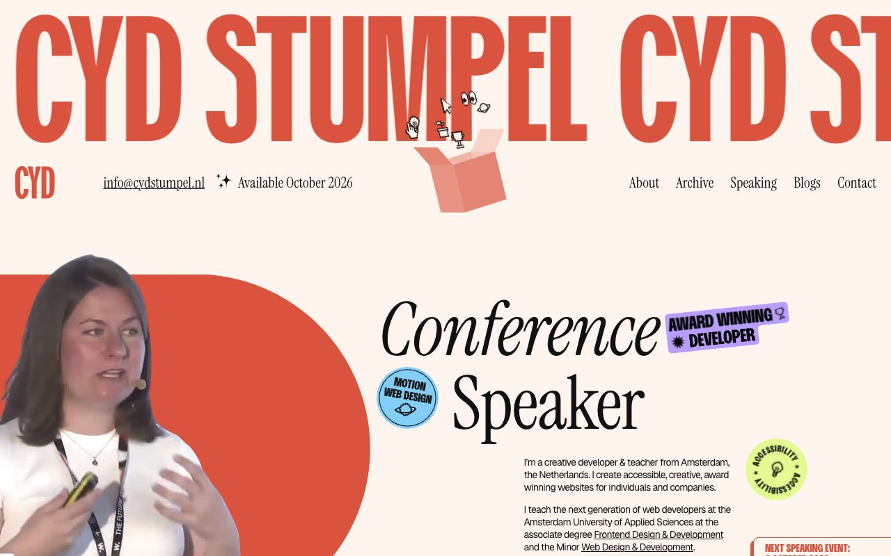</a><br/><b><a href="https://cydstumpel.nl">Cyd Stumpel</a></b><br/><sub>Giant red condensed name marquee, playful stickers, italic serif headline and cut-out speaker photo.</sub></td><td width="33%" valign="top"><a href="https://paco.me">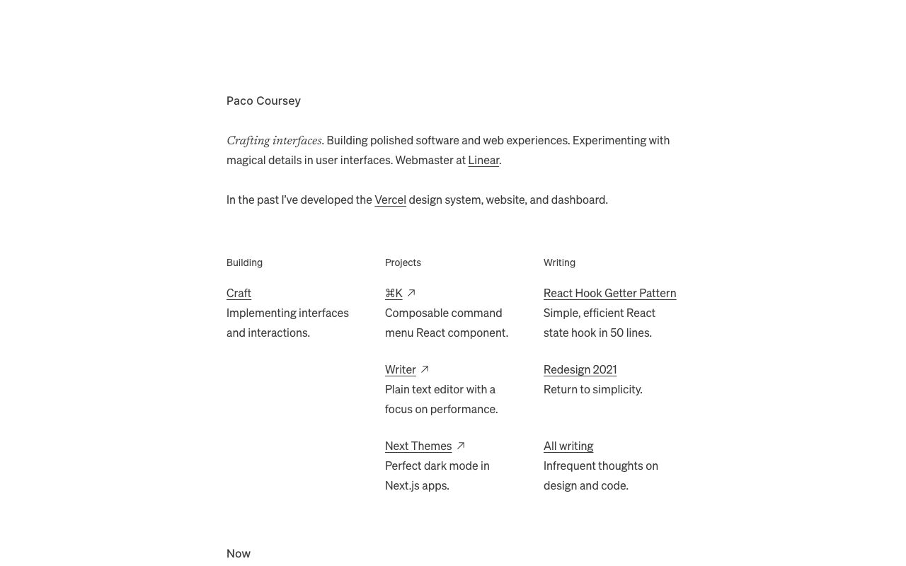</a><br/><b><a href="https://paco.me">Paco Coursey</a></b><br/><sub>Quiet text-only page: short bio, then three tidy columns of Building, Projects and Writing links.</sub></td><td width="33%" valign="top"><a href="https://www.niccolomiranda.com">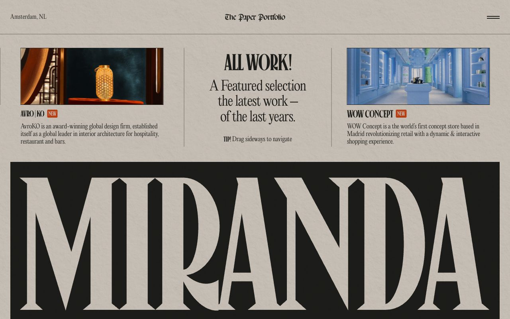</a><br/><b><a href="https://www.niccolomiranda.com">The Paper Portfolio</a></b><br/><sub>Newspaper-style paper texture, condensed serif headlines, draggable work strip above a huge MIRANDA masthead.</sub></td></tr>
<tr><td width="33%" valign="top"><a href="https://jhey.dev">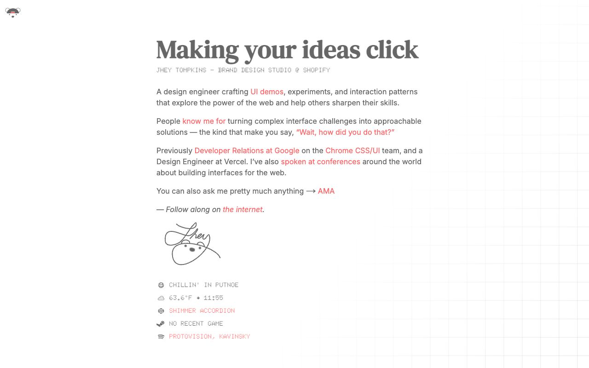</a><br/><b><a href="https://jhey.dev">Jhey Tompkins</a></b><br/><sub>Bold serif headline, red inline links, hand-drawn signature and live status widgets over a faint grid.</sub></td><td width="33%" valign="top"><a href="https://matthieugivelet.com">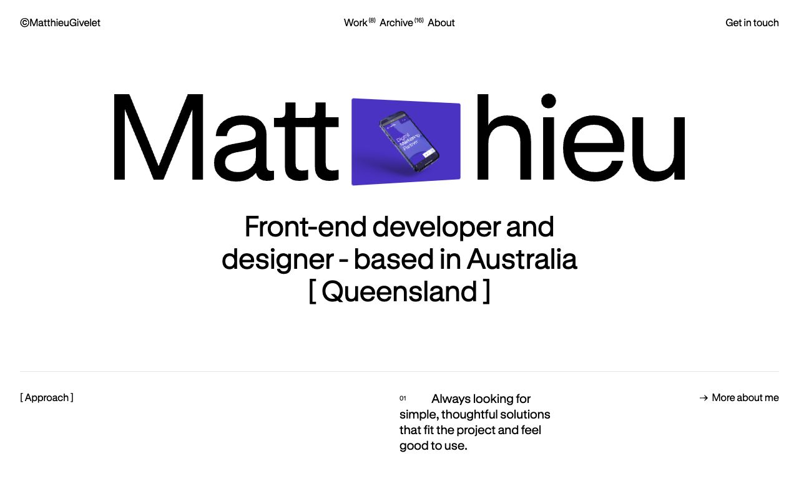</a><br/><b><a href="https://matthieugivelet.com">Matthieu Givelet</a></b><br/><sub>Huge black grotesk name with a project image set inside the word, clean white Swiss layout.</sub></td><td width="33%" valign="top"><a href="https://vanschneider.com">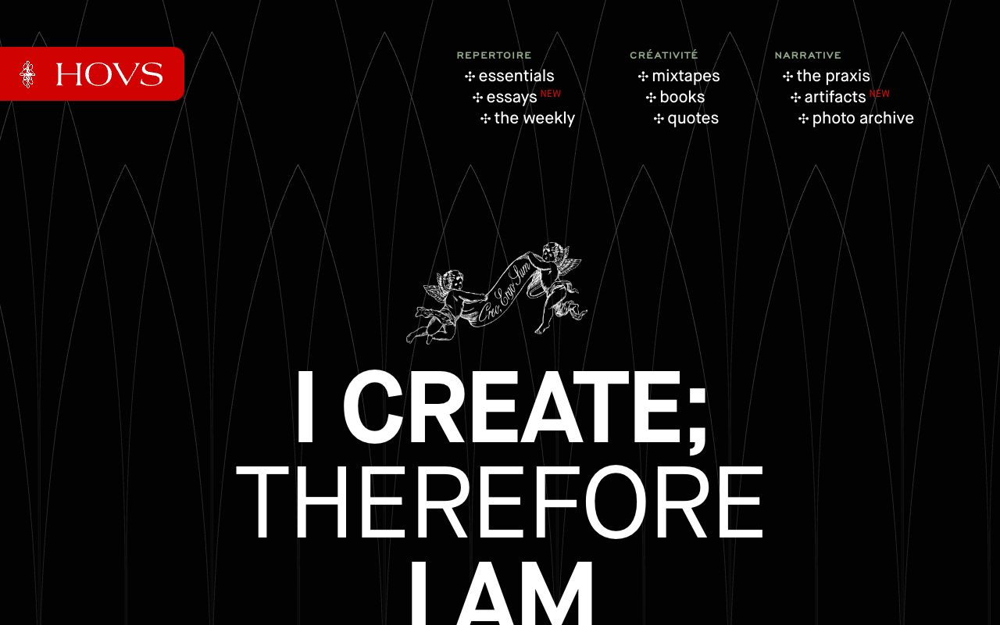</a><br/><b><a href="https://vanschneider.com">Tobias van Schneider</a></b><br/><sub>Black page with fine gothic-arch linework, engraved cherubs, red HOVS tab and a giant 'I create' manifesto.</sub></td></tr>
</table>

## Sources

- [Vercel Web Interface Guidelines](https://vercel.com/design/guidelines)
- [Tailwind CSS: theme variables](https://tailwindcss.com/docs/theme)
