<!-- generated by `pnpm export:md` from content/docs/rules/index.mdx. Edit the MDX, not this file. -->

# The rules

*Twelve rules to decide once, write down and check before anything ships. Each one links to its detail page.*

📖 [Read this chapter on the live site](https://frontenddesignbasics.vercel.app/docs/rules) for the interactive version · [← Guide contents](../README.md)

> - Every value is a token. Every size is on a scale.
> - It works at 390px, by keyboard, and with reduced motion on.
> - Every state is designed. Every word says what it does.
> - Read the twelve lines below. Open a page only when you need the detail.

## The twelve rules

1. **Every value is a token.** Pages hold no hex codes, pixel values or z-index numbers. [Tokens and colour](./tokens-and-colour.md)
2. **Name tokens by role, not by value.** `--color-text-soft`, never `--grey-600`. [Tokens and colour](./tokens-and-colour.md)
3. **One accent, one meaning.** Body text meets 4.5:1, large text 3:1. [Tokens and colour](./tokens-and-colour.md)
4. **Every size comes from a scale.** Type, 4pt spacing, radius, shadow, z-index. [Scales and type](./scales-and-type.md)
5. **Type is chosen and set for reading.** Body 16px or more, lines 65ch or fewer. [Scales and type](./scales-and-type.md)
6. **Mobile first, and 390px never scrolls sideways.** [Breakpoints and layout](./breakpoints-and-layout.md)
7. **Every state is designed.** Hover, focus-visible, disabled, loading, error, empty. Targets 44 × 44px. [Components and states](./components-and-states.md)
8. **Motion uses four curves and four durations.** UI changes stay under 400ms. [Motion tokens](./motion-tokens.md)
9. **Reduced motion gets a still, composed frame.** Loops stop. Canvases pause off screen. [Motion tokens](./motion-tokens.md)
10. **Every image and video has a reserved box.** AVIF first, real `sizes`, a poster for video. [Media](./media.md)
11. **It meets WCAG 2.2 AA.** Visible focus, keyboard access, labels, `lang`. [Accessibility](./accessibility.md)
12. **Words and speed are part of the design.** Buttons say what they do. LCP 2.5 s, INP 200ms, CLS 0.1. [Copy](./copy.md) and [Structure and performance](./structure-and-performance.md)

## How to read MUST and SHOULD

The keywords follow [RFC 2119](https://www.rfc-editor.org/rfc/rfc2119), as the Vercel
[Web Interface Guidelines](https://vercel.com/design/guidelines) do.

- **MUST** means no exceptions without a written reason in the pull request.
- **SHOULD** means the default. Break it when you can say why in one sentence.
- **SHOULD NOT** means avoid it unless you can say why in one sentence.

## Decisions flow one way

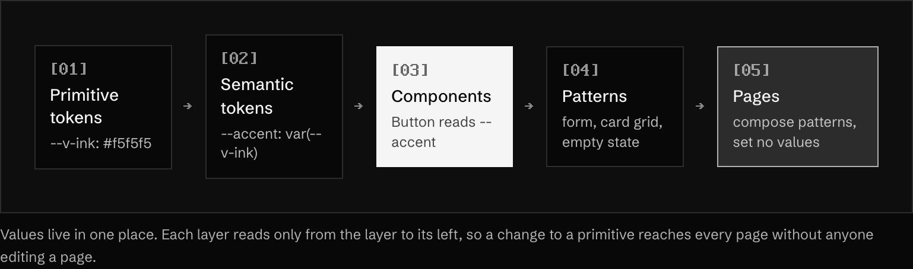

Values live in one place. Each layer reads only from the layer to its left, so a change to a primitive reaches every page without anyone editing a page.

The test is simple. If a page file contains a hex code, a pixel value or a `z-index` number, a
decision has leaked out of the token layer.

## Hierarchy by contrast, not quantity

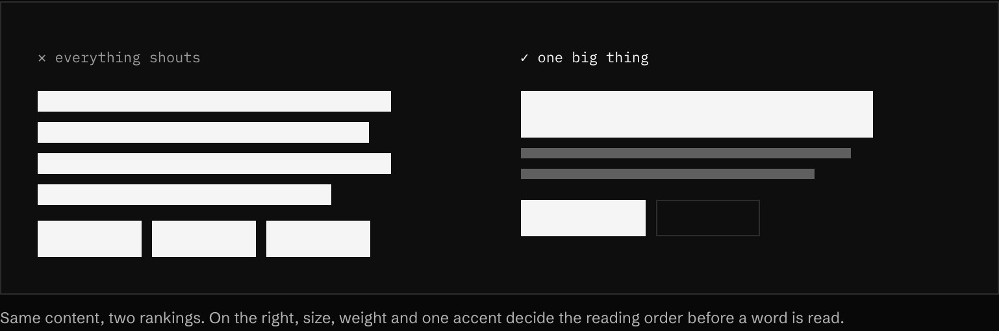

One big thing per view. Size, weight, colour and space do the ranking. Boxes and borders are the last
resort.

**In the wild · 13 examples**

<table>
<tr><td width="33%" valign="top"> <b><a href="https://www.wearecollins.com">Collins</a></b> One large serif line in empty space, then a small row of award laurels. The reading order is obvious.</td><td width="33%" valign="top"> <b><a href="https://www.instrument.com">Instrument</a></b> A full-width black INSTRUMENT wordmark dominates, and the featured case study sits clearly below it.</td><td width="33%" valign="top"> <b><a href="https://commercialtype.com">Commercial Type</a></b> Each colour band has one huge typeface name first, with a tiny style count as the second read.</td></tr>
<tr><td width="33%" valign="top"> <b><a href="https://pangrampangram.com">Pangram Pangram</a></b> Reads top to bottom: a huge 'Neue Gstaad' name, a short tagline, then two buttons.</td><td width="33%" valign="top"><a href="https://www.hellomonday.com">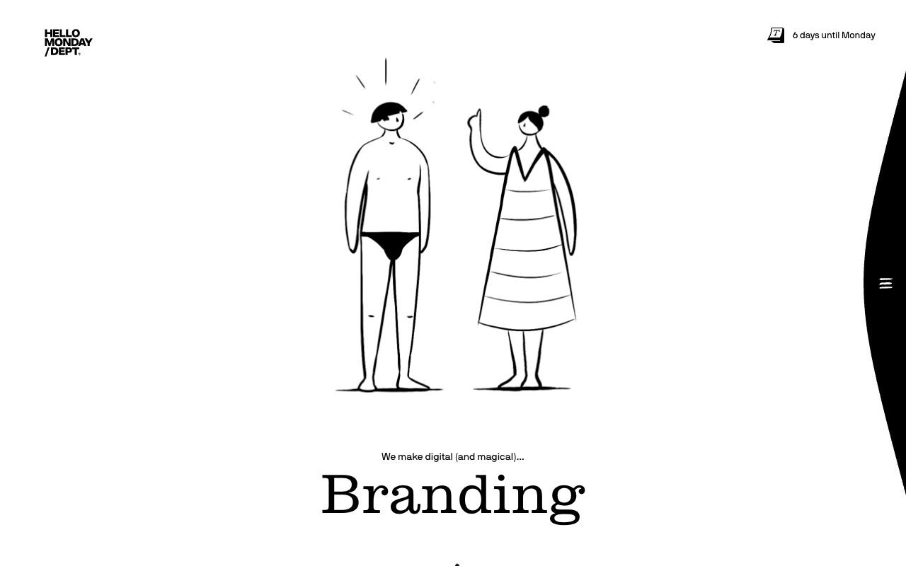</a> <b><a href="https://www.hellomonday.com">Hello Monday / DEPT</a></b> A line illustration leads, then a tiny eyebrow line, then the big serif word 'Branding'.</td><td width="33%" valign="top"><a href="https://arc.net">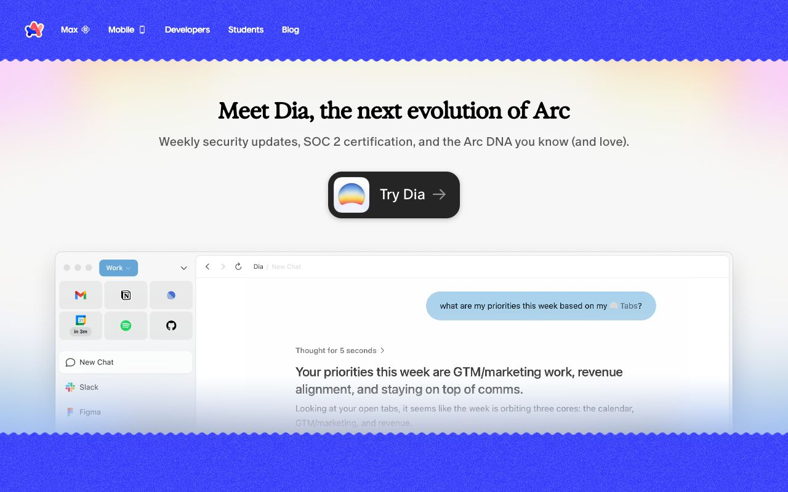</a> <b><a href="https://arc.net">Arc</a></b> A centred serif headline, a grey subline, one dark 'Try Dia' button, then the product screenshot.</td></tr>
<tr><td width="33%" valign="top"><a href="https://www.loewe.com">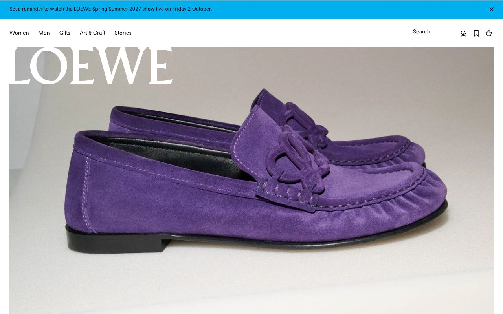</a> <b><a href="https://www.loewe.com">LOEWE</a></b> A giant white LOEWE wordmark over one full-bleed product photo. Only two things compete for attention.</td><td width="33%" valign="top"><a href="https://www.apple.com/fi/airpods-pro/">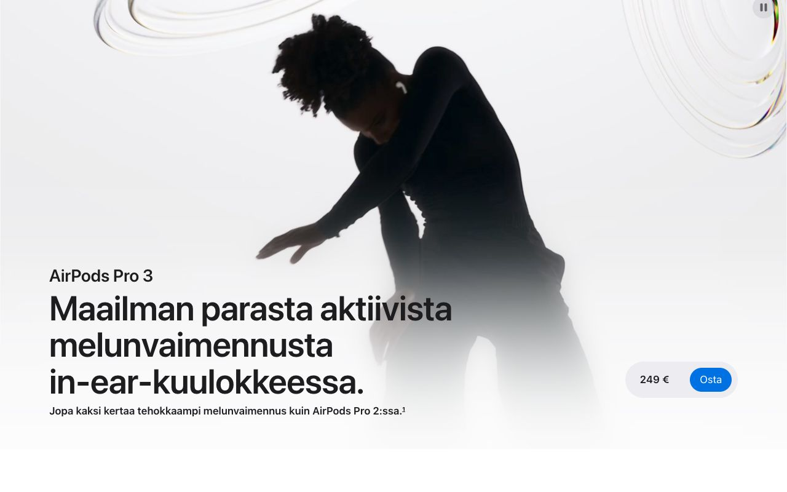</a> <b><a href="https://www.apple.com/fi/airpods-pro/">Apple AirPods Pro 3</a></b> Finnish page. Product name, then a huge bold claim, then a small subline, with price and Buy set apart.</td><td width="33%" valign="top"><a href="https://www.are.na">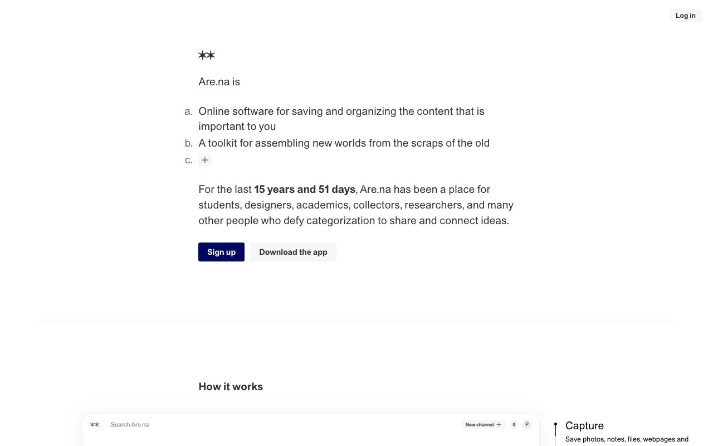</a> <b><a href="https://www.are.na">Are.na</a></b> One quiet column: a lettered list, a single bolded fact, then one dark primary button beside a grey one.</td></tr>
<tr><td width="33%" valign="top"><a href="https://www.itsnicethat.com">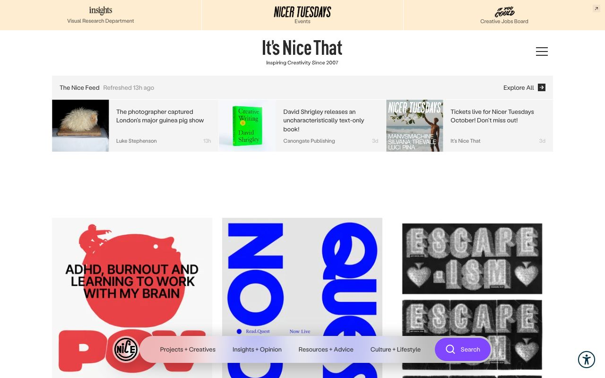</a> <b><a href="https://www.itsnicethat.com">It's Nice That</a></b> Centred masthead, a compact thumbnail news strip, then large image cards; a floating pill nav holds sections.</td><td width="33%" valign="top"><a href="https://monocle.com">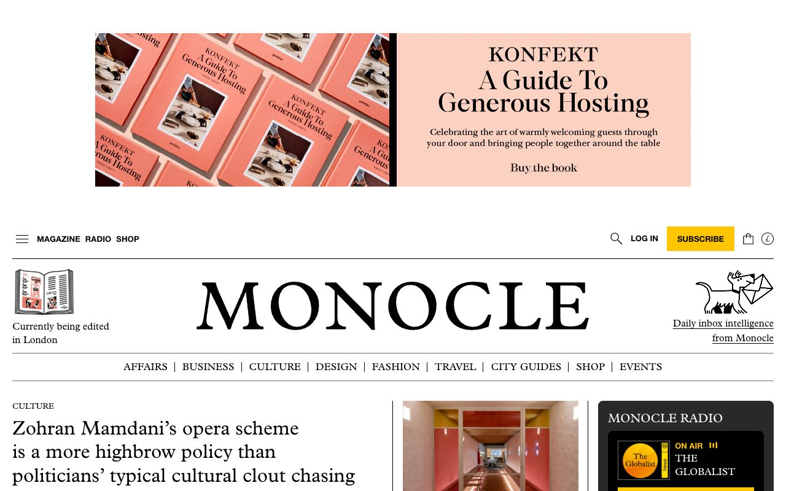</a> <b><a href="https://monocle.com">Monocle</a></b> Serif masthead, ruled section nav, then small caps label over a large serif headline: classic editorial order.</td><td width="33%" valign="top"><a href="https://dennissnellenberg.com">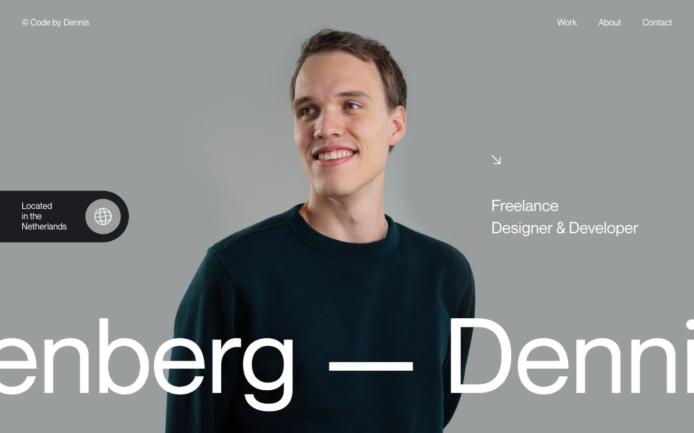</a> <b><a href="https://dennissnellenberg.com">Dennis Snellenberg</a></b> Portrait centre, huge name running across the bottom, role in medium type, location tucked in a pill.</td></tr>
<tr><td width="33%" valign="top"><a href="https://culturedcode.com/things/">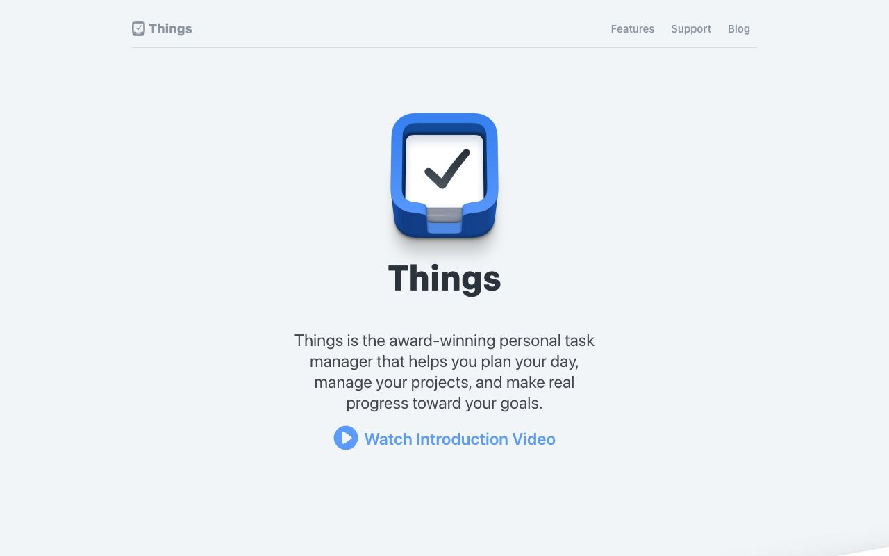</a> <b><a href="https://culturedcode.com/things/">Things</a></b> Icon, then bold product name, then a short grey paragraph, then one blue video link: a clear top-down read.</td></tr>
</table>

## The ship checklist

Run this before anything goes live.

**Layout and type**

- **MUST** work at 390px wide with no horizontal scroll.
- **MUST** keep body text at 16px or more and lines at about 65ch or fewer.
- **SHOULD** use `tabular-nums` for numbers that change or line up.
- **SHOULD** balance headings (`text-wrap: balance`) and avoid single-word last lines.

**Colour**

- **MUST** meet 4.5:1 for body text and 3:1 for large text and UI boundaries.
- **MUST** design dark mode as its own palette, if you ship one.

**Interaction**

- **MUST** show a visible focus state on every interactive element.
- **MUST** give touch targets at least 44 × 44px.
- **MUST** keep hover-only information reachable by keyboard and touch.
- **SHOULD** give instant feedback: pressed states, optimistic UI, skeletons over spinners.

**Motion**

- **MUST** honour `prefers-reduced-motion`: fade instead of move, stop loops.
- **MUST** pause off-screen canvases and loops.
- **SHOULD NOT** animate layout properties (`width`, `top`) when `transform` will do.

**Completeness**

- **MUST** design empty, loading and error states.
- **MUST** give every page a real `<title>`, a description and an OG image.
- **SHOULD** have a favicon that reads at 16px.
- **MUST** prove motion with frames about 1.5 s apart, not one screenshot. See [how to verify](../how-to/win95-chrome-and-verify.md).

## Why it works

A rule turns a taste argument into a lookup. Reviews get shorter because the question changes from
"does this look right?" to "is this the token?". New people and AI agents match the system on the
first try, because the answer is written down.
