<!-- generated by `pnpm export:md` from content/docs/rules/breakpoints-and-layout.mdx. Edit the MDX, not this file. -->

# Breakpoints and layout

*Five named breakpoints, three containers, gutters and grid columns, proximity, and the 390px rule.*

<sub>📖 [Read this chapter on the live site](https://frontenddesignbasics.vercel.app/docs/rules/breakpoints-and-layout) for the interactive version · [← Guide contents](../README.md)</sub>

> - Mobile first. Use Tailwind's breakpoint names as they are: `sm md lg xl 2xl`.
> - Three containers: prose 65ch, page 1200px, wide 1440px.
> - Gutters of 16px or more on phones. Grid columns use `minmax(0, 1fr)`.
> - Gaps between groups are about twice the gaps inside them.
> - Every page works at 390px and 320px with no sideways scroll.

Design mobile first and add layout as the screen grows. Use Tailwind's five breakpoint names and
values unchanged, so every developer and every AI agent already knows them.

## Breakpoints

<details><summary>Breakpoints: table (6 rows)</summary>

| Name | Min width | Typical device | Tailwind |
|---|---|---|---|
| (base) | 0 | Phones, portrait | no prefix |
| `sm` | 640px | Large phones landscape, small tablets | `sm:` |
| `md` | 768px | Tablets portrait | `md:` |
| `lg` | 1024px | Tablets landscape, small laptops | `lg:` |
| `xl` | 1280px | Laptops, desktops | `xl:` |
| `2xl` | 1536px | Large desktops | `2xl:` |

</details>

- **MUST** write base styles for the phone and add `min-width` overrides upwards. No `max-width` media queries except for a one-off fix.
- **MUST** keep breakpoints in tokens (`--breakpoint-md: 48rem` in `@theme`). Never write `@media (min-width: 812px)` by hand.
- **SHOULD** change layout at no more than 3 breakpoints per page. Most pages need only `md` and `lg`.
- **SHOULD** use container queries for components that appear in different column widths. Tailwind v4 has them built in: `@container` on the parent, `@md:grid-cols-2` on the child.

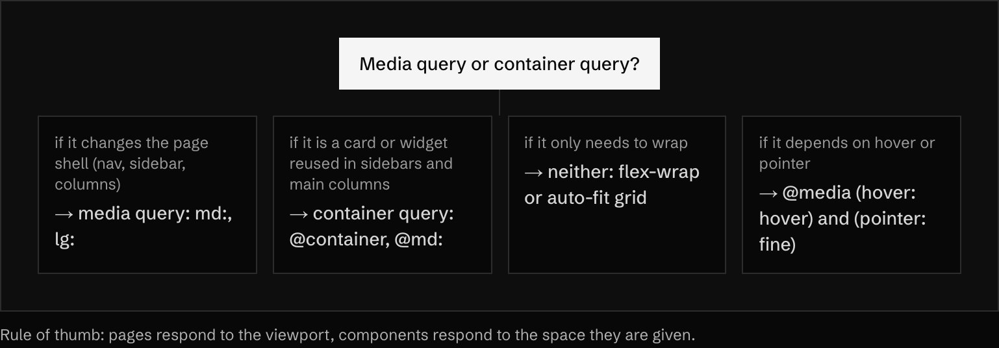

<sub>Rule of thumb: pages respond to the viewport, components respond to the space they are given.</sub>

## Test widths

Check every page at these widths before calling it done.

<details><summary>Test widths: table (7 rows)</summary>

| Width | Why |
|---|---|
| 320px | The reflow width in WCAG 2.2 (1.4.10). Content must work without two-way scrolling |
| 390px | The standard modern iPhone width. The house rule below |
| 768px | Tablet portrait, the first layout change |
| 1024px | Tablet landscape, where sidebars usually appear |
| 1280px | Common laptop |
| 1440px | Common desktop. Check the container stops growing |
| 1920px | Full HD. Check nothing stretches edge to edge by accident |

</details>

## Containers

Three widths cover almost every page.

<details><summary>Containers: table (3 rows)</summary>

| Token | Value | Use |
|---|---|---|
| `--container-prose` | 65ch (about 680px at 16px) | Articles, docs, long text |
| `--container-page` | 1200px | Standard page content |
| `--container-wide` | 1440px | Dashboards, galleries, wide tables |

</details>

<details><summary>Containers: copy the css (12 lines)</summary>

```css
@theme {
  --container-prose: 65ch;
  --container-page: 1200px;
  --container-wide: 1440px;
}

.container-page {
  width: 100%;
  max-width: var(--container-page);
  margin-inline: auto;
  padding-inline: var(--gutter);
}
```

</details>

- **MUST** cap reading text at 65ch, even inside a wider container.
- **MUST** let backgrounds go full bleed and keep content inside the container. The section is wide; the text is not.
- **SHOULD NOT** add a fourth container width. Use a grid span instead.

## Gutters and grid columns

The grid follows Material's responsive layout grid: 4 columns on phones, 8 on tablets, 12 on desktop.

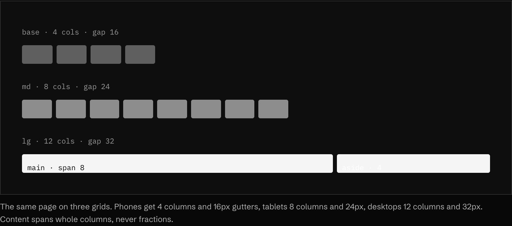

<sub>The same page on three grids. Phones get 4 columns and 16px gutters, tablets 8 columns and 24px, desktops 12 columns and 32px. Content spans whole columns, never fractions.</sub>

<sub>▶ Interactive on the [live site](https://frontenddesignbasics.vercel.app/docs/rules/breakpoints-and-layout).</sub>

<details><summary>Gutters and grid columns: table (3 rows)</summary>

| Breakpoint | Columns | Gutter (side padding) | Column gap | Section spacing |
|---|---|---|---|---|
| base (0 to 639px) | 4 | 16px | 16px | 64px |
| `sm` / `md` (640 to 1023px) | 8 | 24px | 24px | 80px |
| `lg` and up (1024px+) | 12 | 32px | 32px | 96px |

</details>

<details><summary>Gutters and grid columns: copy the css (13 lines)</summary>

```css
:root {
  --gutter: 16px;
  --grid-cols: 4;
  --grid-gap: 16px;
}
@media (min-width: 40rem) { :root { --gutter: 24px; --grid-cols: 8;  --grid-gap: 24px; } }
@media (min-width: 64rem) { :root { --gutter: 32px; --grid-cols: 12; --grid-gap: 32px; } }

.grid-page {
  display: grid;
  grid-template-columns: repeat(var(--grid-cols), minmax(0, 1fr));
  gap: var(--grid-gap);
}
```

</details>

- **MUST** keep side gutters at 16px or more on phones. Text touching the screen edge is the most common phone bug.
- **MUST** use `minmax(0, 1fr)`, not `1fr`, for grid columns that hold text or code, so long content cannot force the column wider.
- **SHOULD** use 12 columns on desktop because it divides into halves, thirds, quarters and sixths.
- **SHOULD** span whole columns (`col-span-8`, `col-span-4`), never set widths like `width: 63%`.
- **SHOULD** use `repeat(auto-fit, minmax(16rem, 1fr))` for card grids that should not need breakpoints at all.

## Safe areas and viewport height

Phones have notches, rounded corners and home indicators. Opt in to the full screen, then pad away
from the unsafe edges.

<details><summary>Safe areas and viewport height: copy the tsx (8 lines)</summary>

```tsx
// app/layout.tsx (Next.js)
import type { Viewport } from 'next';

export const viewport: Viewport = {
  width: 'device-width',
  initialScale: 1,
  viewportFit: 'cover',
};
```

</details>

<details><summary>Safe areas and viewport height: copy the css (14 lines)</summary>

```css
.site-header {
  padding-top: env(safe-area-inset-top);
  padding-inline: max(var(--gutter), env(safe-area-inset-left)) max(var(--gutter), env(safe-area-inset-right));
}

.bottom-bar {
  position: fixed;
  inset-inline: 0;
  bottom: 0;
  padding-bottom: calc(12px + env(safe-area-inset-bottom));
}

.hero { min-height: 100svh; }   /* small viewport: never jumps when the toolbar hides */
.app-shell { height: 100dvh; }  /* dynamic viewport: tracks the toolbar */
```

</details>

- **MUST** add `env(safe-area-inset-bottom)` to anything fixed to the bottom of the screen once `viewport-fit=cover` is set.
- **MUST** use `max()` so the gutter is never smaller than the normal 16px when the inset is 0.
- **MUST NOT** use `100vh` for full-height layouts on phones. It is taller than the visible area while the browser toolbar shows. Use `100svh` for heroes and `100dvh` for app shells.
- **MUST NOT** use `100vw` for full-bleed sections. It includes the scrollbar width on desktop and causes a horizontal scroll.

## The 390px rule

Every page MUST work at 390px wide with no horizontal scroll. This is the house rule from
[the rules](./README.md). Test it in the browser's device mode, then run this in the console:

```js
[...document.querySelectorAll('*')].filter((el) => el.getBoundingClientRect().right > innerWidth + 1);
```

An empty array passes. Anything listed is wider than the screen. The usual causes and fixes:

<details><summary>The 390px rule: table (8 rows)</summary>

| Cause | Fix |
|---|---|
| Fixed widths (`width: 480px`) | `max-width: 100%` or a grid span |
| Long URLs, emails, IDs | `overflow-wrap: anywhere` on the text container |
| Flex children that refuse to shrink | `min-width: 0` (`min-w-0`) on the child |
| Wide tables and code blocks | Wrap in a container with `overflow-x: auto`; scroll the block, not the page |
| `100vw` sections | `width: 100%` |
| Three columns with no base style | `grid-cols-1 md:grid-cols-3` |
| Images and embeds without limits | `max-width: 100%; height: auto` |
| Negative margins for bleed effects | Put `overflow-x: clip` on the section wrapper |

</details>

- **MUST** check at 390px and at 320px, which is the WCAG reflow width.
- **MUST** keep inputs at 16px text so iOS does not zoom and shift the layout on focus.
- **SHOULD** use `overflow-x: clip` rather than `hidden` on wrappers, because `clip` does not create a scroll container and does not break `position: sticky`.

## Group by proximity

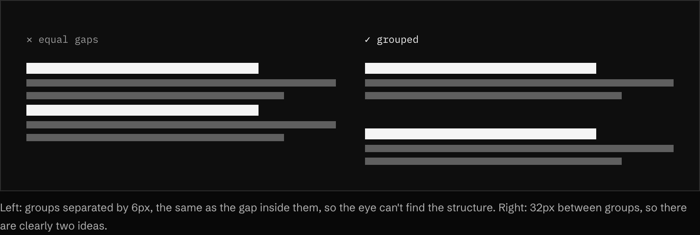

Related things sit close. Unrelated things sit far apart. The gap *between* groups should be about
twice the gap *within* them. This does more for structure than any border or card.

- **SHOULD** allow asymmetry. A 1:2 split feels more designed than three equal columns.
- **SHOULD** give major sections 80 to 120px of vertical space on desktop.

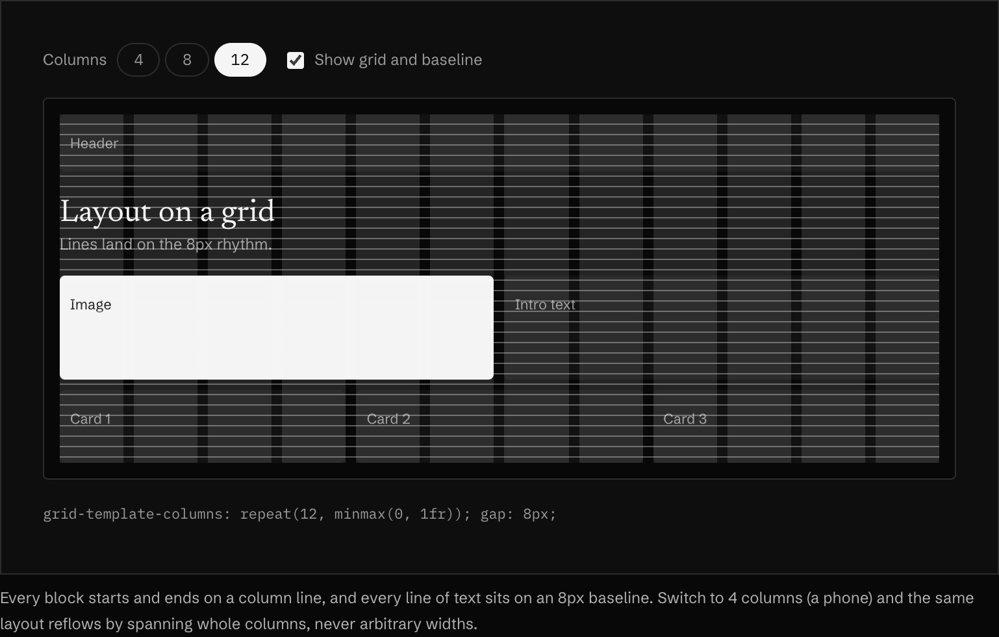

<sub>▶ Interactive on the [live site](https://frontenddesignbasics.vercel.app/docs/rules/breakpoints-and-layout).</sub>

Turn the overlay on. Every block lines up with a column edge and every line of text with the 8px
baseline. Drop to 4 columns and the layout reflows by spanning whole columns.

**In the wild · 12 examples**

<table>
<tr><td width="33%" valign="top"><a href="https://www.grillitype.com"></a><br/><b><a href="https://www.grillitype.com">Grilli Type</a></b><br/><sub>A narrow label column on the left and a wide content column; typeface names line up on a strict grid.</sub></td><td width="33%" valign="top"><a href="https://www.14islands.com"></a><br/><b><a href="https://www.14islands.com">14islands</a></b><br/><sub>The headline is staggered across columns, with a small label offset to the right and wide margins all round.</sub></td><td width="33%" valign="top"><a href="https://sharptype.co"></a><br/><b><a href="https://sharptype.co">Sharp Type</a></b><br/><sub>Asymmetric: the logo sits in a side column, the storefront image is pushed right, with open white space around it.</sub></td></tr>
<tr><td width="33%" valign="top"><a href="https://obys.agency">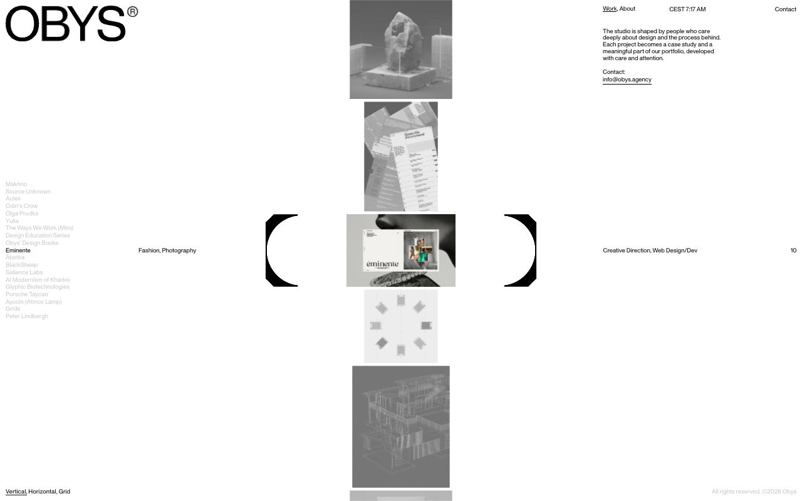</a><br/><b><a href="https://obys.agency">Obys Agency</a></b><br/><sub>An editorial three-zone layout: project index on the left, a centred column of images, studio info on the right.</sub></td><td width="33%" valign="top"><a href="https://work.co">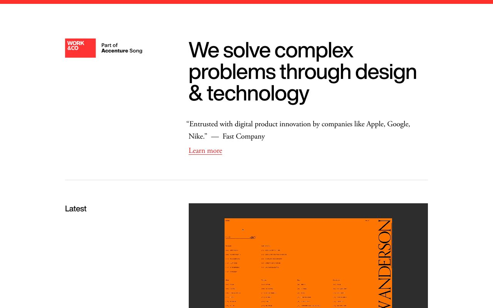</a><br/><b><a href="https://work.co">Work & Co</a></b><br/><sub>A classic two-column grid: labels in a narrow left column, content in the wide right one, with hairline rules between sections.</sub></td><td width="33%" valign="top"><a href="https://www.kinfolk.com">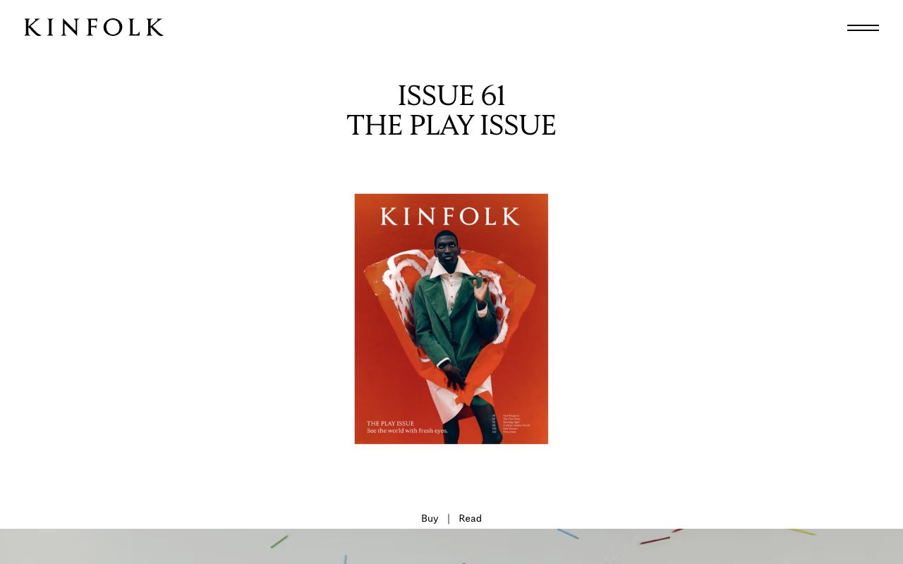</a><br/><b><a href="https://www.kinfolk.com">Kinfolk</a></b><br/><sub>Generous white space: one centred cover and a serif title with lots of room around them.</sub></td></tr>
<tr><td width="33%" valign="top"><a href="https://www.pentagram.com/work">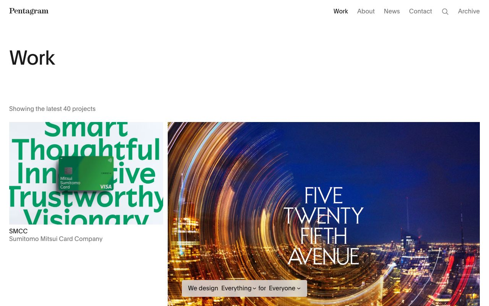</a><br/><b><a href="https://www.pentagram.com/work">Pentagram — Work</a></b><br/><sub>An uneven one-third / two-thirds project grid under a large 'Work' title, with a consistent left edge.</sub></td><td width="33%" valign="top"><a href="https://www.anothermag.com">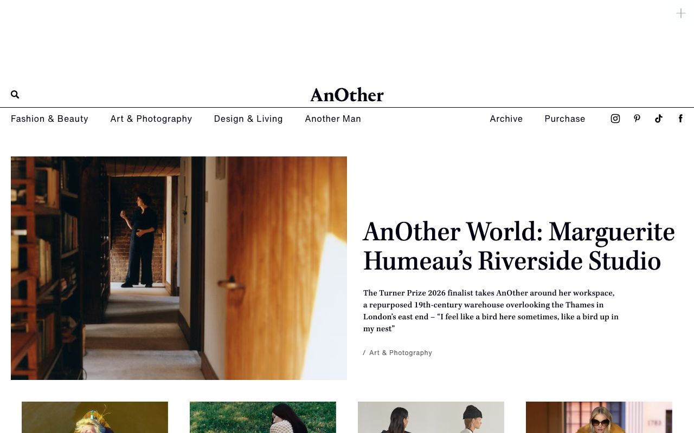</a><br/><b><a href="https://www.anothermag.com">AnOther Magazine</a></b><br/><sub>An editorial split: a half-width photo next to a serif headline, with a four-column row of stories below.</sub></td><td width="33%" valign="top"><a href="https://www.basedesign.com">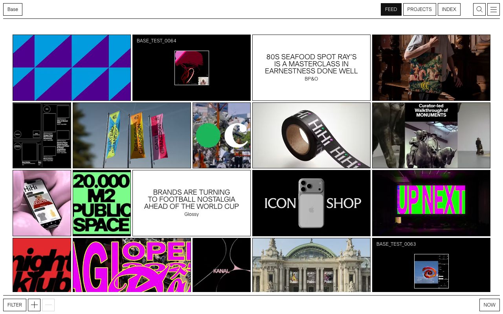</a><br/><b><a href="https://www.basedesign.com">Base</a></b><br/><sub>Dense four-column feed grid mixing image tiles and text tiles, framed by thin-ruled top and bottom bars.</sub></td></tr>
<tr><td width="33%" valign="top"><a href="https://big.dk">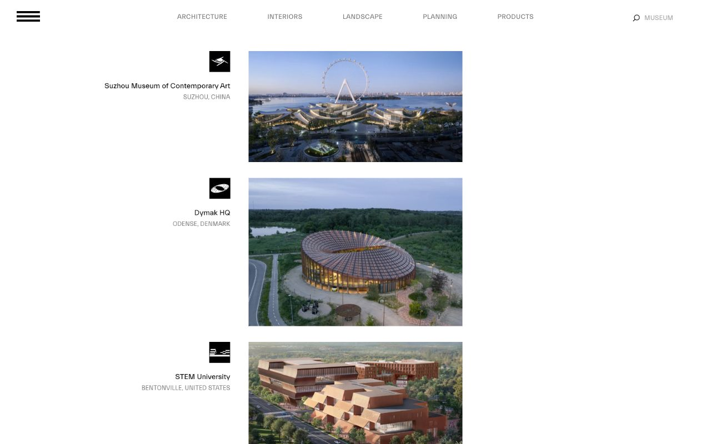</a><br/><b><a href="https://big.dk">BIG</a></b><br/><sub>Project list on a strict two-column axis: logo and caption right-aligned left, photo left-aligned right.</sub></td><td width="33%" valign="top"><a href="https://readymag.com">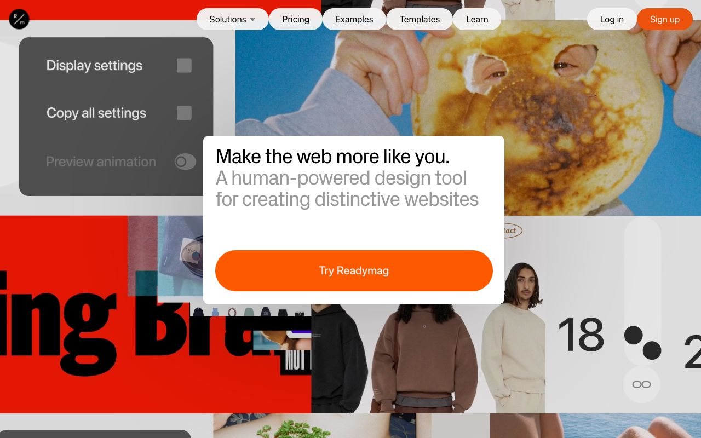</a><br/><b><a href="https://readymag.com">Readymag</a></b><br/><sub>Overlapping collage of site previews with a white card on top holding headline and one orange button.</sub></td><td width="33%" valign="top"><a href="https://www.stedelijk.nl/en"></a><br/><b><a href="https://www.stedelijk.nl/en">Stedelijk Museum</a></b><br/><sub>Full-width stacked rows between heavy rules, huge uppercase type running off the edge, small thumbnails inline.</sub></td></tr>
</table>

## Why it works

Shared breakpoint names mean "it breaks at md" is a complete bug report. A small, fixed set of
containers and a column grid make alignment automatic, so edges line up across sections without
anyone measuring. The 390px check catches the one failure that makes a site feel broken on the device
most people will actually use.

## Sources

<details><summary>3 sources</summary>

- [Tailwind CSS: responsive design](https://tailwindcss.com/docs/responsive-design)
- [MDN: container queries](https://developer.mozilla.org/en-US/docs/Web/CSS/CSS_containment/Container_queries)
- [WCAG 2.2](https://www.w3.org/TR/WCAG22/)

</details>
