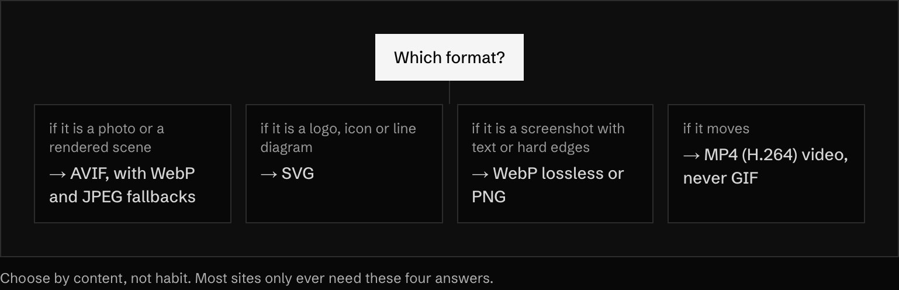
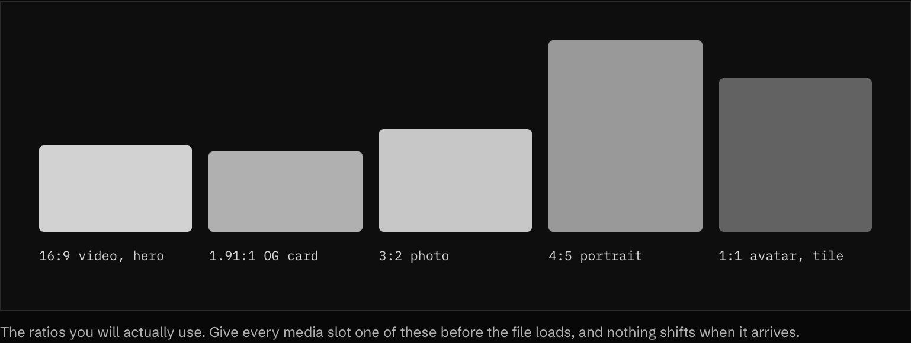

<!-- generated by `pnpm export:md` from content/docs/rules/media.mdx. Edit the MDX, not this file. -->

# Media

*AVIF first, real sizes, a reserved box for every image and video, and alt text that says what the picture is for.*

<sub>📖 [Read this chapter on the live site](https://frontenddesignbasics.vercel.app/docs/rules/media) for the interactive version · [← Guide contents](../README.md)</sub>

> - Photos in AVIF with WebP and JPEG fallbacks. Logos in SVG. Motion in MP4, never GIF.
> - Set `sizes` on every responsive image.
> - Reserve the box: `width` and `height`, or `aspect-ratio`.
> - Lazy-load below the fold, never the LCP image.
> - Alt text says what the picture is for. Empty `alt` for decoration.

Images and video are usually the heaviest thing on a page and the most common cause of layout shift. The conventions below fix both. Serve modern formats, send the size the screen needs, reserve the space before the file arrives, and describe the picture for people who cannot see it.

## Pick the format



<sub>Choose by content, not habit. Most sites only ever need these four answers.</sub>

<details><summary>Pick the format: table (6 rows)</summary>

| Format | Use for | Quality setting | Notes |
|---|---|---|---|
| AVIF | Photos, gradients, hero art | 50 to 60 | Smallest files. Slower to encode. Supported by all current major browsers. |
| WebP | Fallback for AVIF, screenshots | 75 to 80 lossy, or lossless | Good middle ground. |
| JPEG | Last-resort fallback, email | 75 to 82, progressive | Everything opens it. |
| PNG | Screenshots that need exact pixels | lossless | Run it through `oxipng` or similar. |
| SVG | Logos, icons, diagrams | n/a | Optimise with SVGO. Set `viewBox`, drop fixed `width` and `height`. |
| GIF | Nothing | n/a | Convert to MP4. It is many times larger for the same clip. |

</details>

- **MUST NOT** ship a photo as PNG or an animation as GIF.
- **MUST** strip EXIF and location metadata from photos before publishing.
- **SHOULD** let the framework convert formats. `next/image` serves AVIF or WebP when you set `images.formats` in `next.config`.

```js
// next.config.mjs
export default {
  images: { formats: ['image/avif', 'image/webp'] },
};
```

## Weight targets

<details><summary>Weight targets: table (5 rows)</summary>

| Asset | Target | Hard ceiling |
|---|---|---|
| Hero or LCP image | 150 KB | 250 KB |
| Content image in the flow | 80 KB | 150 KB |
| Thumbnail or avatar | 15 KB | 30 KB |
| Background video loop (10 s or less) | 1.5 MB | 3 MB |
| OG image | 150 KB | 300 KB |

</details>

These are this guide's budgets, not a standard. Pick your own, write them down, and check them in review.

## Send the right size

A 2400px photo on a 390px phone wastes most of its bytes. Give the browser a list of widths and tell it how wide the image will be drawn.

<details><summary>Send the right size: copy the html (8 lines)</summary>

```html

```

</details>

<details><summary>Send the right size: copy the tsx (8 lines)</summary>

```tsx
import Image from 'next/image';

<Image
  src={hero}
  alt="Two riso inks mixing in water, orange over blue"
  sizes="(min-width: 1024px) 50vw, 100vw"
  preload            // only for the LCP image (was `priority` before Next 16)
/>
```

</details>

- **MUST** set `sizes` on every responsive image. Without it the browser assumes `100vw` and downloads the largest file.
- **MUST** generate widths up to 2× the largest drawn size, and no further.
- **MUST** use `loading="lazy"` on images below the fold, and **MUST NOT** lazy-load the LCP image.
- **SHOULD** use widths from one shared list, for example `640, 750, 828, 1080, 1200, 1920, 2048`. These are the `next/image` defaults.

## Reserve the box



<sub>The ratios you will actually use. Give every media slot one of these before the file loads, and nothing shifts when it arrives.</sub>

<sub>▶ Interactive on the [live site](https://frontenddesignbasics.vercel.app/docs/rules/media).</sub>

<details><summary>Reserve the box: copy the css (12 lines)</summary>

```css
.media {
  aspect-ratio: 16 / 9;
  width: 100%;
  overflow: hidden;
  background: var(--surface-raised); /* the placeholder colour */
}
.media > img,
.media > video {
  width: 100%;
  height: 100%;
  object-fit: cover;
}
```

</details>

- **MUST** give every `img` and `video` either `width` and `height` attributes or a CSS `aspect-ratio`.
- **SHOULD** use a flat placeholder colour or a tiny blurred preview, never a spinner.
- **SHOULD** crop with `object-fit: cover` and set `object-position` when the subject is off-centre.

## Video

<details><summary>Video: copy the html (14 lines)</summary>

```html
<video
  autoplay
  muted
  loop
  playsinline
  preload="metadata"
  poster="/video/loop-poster.avif"
  width="1920"
  height="1080"
  aria-hidden="true"
>
  <source src="/video/loop.webm" type="video/webm" />
  <source src="/video/loop.mp4" type="video/mp4" />
</video>
```

</details>

<details><summary>Video: table (5 rows)</summary>

| Attribute | Why |
|---|---|
| `muted` | Browsers only allow autoplay without sound. |
| `playsinline` | Stops iOS Safari from opening the video full screen. |
| `poster` | Shows at once, and is what reduced-motion users see. |
| `preload="metadata"` | Fetches size and duration, not the whole file. |
| `aria-hidden="true"` | Only for purely decorative loops. Remove it for content video. |

</details>

- **MUST** strip the audio track from any video that autoplays muted. It is dead weight.
- **MUST** show a visible pause control on any decorative loop longer than 5 seconds (WCAG 2.2.2).
- **MUST** show the poster and no autoplay under `prefers-reduced-motion: reduce`.
- **MUST** caption any video with speech (WCAG 1.2.2) and provide a transcript for audio-only content.
- **SHOULD** encode loops at 1080p or less, 24 to 30 fps, H.264 MP4 plus an optional WebM (VP9 or AV1) listed first.
- **SHOULD** host long video on a streaming service or use HLS. A 2-minute MP4 in `public/` is a bandwidth bill.

```bash
# A web-ready silent loop: H.264, no audio, streamable
ffmpeg -i in.mov -an -vf "scale=1920:-2,fps=30" -c:v libx264 -crf 26 -preset slow \
  -pix_fmt yuv420p -movflags +faststart loop.mp4
```

## Alt text

<details><summary>Alt text: table (6 rows)</summary>

| Image | Alt | Rule |
|---|---|---|
| Decorative texture | `alt=""` | Empty, not missing. Screen readers skip it. |
| Product photo | `alt="Walnut desk, 140 cm wide, with two drawers"` | Say what matters for the decision. |
| Chart | `alt="Sign-ups doubled from March to June"` | Give the takeaway, and put the data in a table nearby. |
| Logo as a link | `alt="Acme home"` | Describe where the link goes. |
| Screenshot of text | the text itself, or a summary | Better still, use real text. |
| Icon button | no image alt; `aria-label="Close"` on the button | Label the control, not the drawing. |

</details>

- **MUST** give every `img` an `alt` attribute. Empty for decoration, meaningful for content.
- **MUST NOT** start with "Image of" or "Picture of". Screen readers already say "image".
- **MUST NOT** repeat the caption or the nearby text word for word.
- **SHOULD** keep alt to one sentence. Longer descriptions go in the page or a `figcaption`.

## Social cards and icons

<details><summary>Social cards and icons: table (6 rows)</summary>

| File | Size | Next.js file convention |
|---|---|---|
| Open Graph image | 1200 × 630 px (1.91:1) | `app/opengraph-image.png` or `.tsx` |
| X (Twitter) card | 1200 × 630 px, `summary_large_image` | `app/twitter-image.png`, or reuse the OG image |
| Favicon (legacy) | 32 × 32 px `.ico`, with 16 × 16 inside | `app/favicon.ico` |
| Favicon (modern) | SVG, with its own dark-mode `@media` rule | `app/icon.svg` |
| Apple touch icon | 180 × 180 px PNG, no transparency | `app/apple-icon.png` |
| Web app manifest icons | 192 × 192 and 512 × 512 px PNG, plus a 512 maskable | `app/manifest.ts` |

</details>

- **SHOULD** keep the OG image's text away from the outer 60px or so. Some platforms crop or round the edges.
- **MUST** set `og:image:alt` when the card carries information.
- **SHOULD** check the favicon at 16px. If it does not read, simplify it to one shape or one letter.

## Why it works

Format and size rules remove most of a page's weight without anyone seeing a difference. Reserved boxes mean nothing jumps as files arrive, which is what CLS measures. Alt text rules turn "add some alt" into a checkable habit, and fixed card and icon sizes mean a link looks right wherever it is shared.

## Sources

<details><summary>3 sources</summary>

- [web.dev: serve responsive images](https://web.dev/articles/serve-responsive-images)
- [MDN: the video element](https://developer.mozilla.org/en-US/docs/Web/HTML/Element/video)
- [Next.js: Image component](https://nextjs.org/docs/app/api-reference/components/image)

</details>
