<!-- generated by `pnpm export:md` from content/docs/rules/scales-and-type.mdx. Edit the MDX, not this file. -->

# Scales and type

*Pick type on purpose, then take every size from a short, named list: type, spacing, radius, shadow, z-index and icons.*

<sub>📖 [Read this chapter on the live site](https://frontenddesignbasics.vercel.app/docs/rules/scales-and-type) for the interactive version · [← Guide contents](../README.md)</sub>

> - Choose a typeface that suits the subject. One family, or two clearly different ones.
> - Type ratio 1.25 for product UI, 1.333 for editorial. Body 16px or more.
> - Lines 55 to 75 characters. Body line-height 1.5 to 1.7, display 0.9 to 1.1.
> - Spacing on the 4pt scale: 4, 8, 12, 16, 24, 32, 48, 64, 96.
> - Named z-index layers. Never `z-index: 9999`.

If a number is not on a scale, it is not allowed. Scales are short lists of named values that every
component picks from. They are why a page feels calm even when nobody can say why.

Each scale below is copyable as tokens. Where Tailwind v4 already ships the same scale, use its
defaults and do not reinvent them.

## Type scale

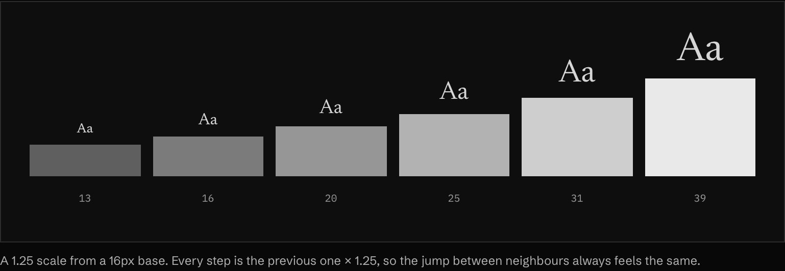

Use a ratio of **1.25** (major third) for product UI, where many levels sit close together. Use
**1.333** (perfect fourth) for editorial and marketing pages, where fewer levels need more contrast.
This guide uses 1.333.

For product UI, Tailwind's default size and line-height pairs are a sound scale. Use them as they are.

| Token | Size | Line height | Use |
|---|---|---|---|
| `text-xs` | 12px | 16px | Legal, badges, table meta. Never body |
| `text-sm` | 14px | 20px | Secondary text, labels, dense tables |
| `text-base` | 16px | 24px | Body text, inputs. The minimum for reading |
| `text-lg` | 18px | 28px | Lead paragraph, large body |
| `text-xl` | 20px | 28px | Card titles, h4 |
| `text-2xl` | 24px | 32px | h3 |
| `text-3xl` | 30px | 36px | h2 |
| `text-4xl` | 36px | 40px | h1 in product UI |
| `text-5xl` | 48px | 1 | Page hero on small screens |
| `text-6xl` | 60px | 1 | Marketing hero |
| `text-7xl` | 72px | 1 | Display, one per page at most |

- **MUST** keep body text at 16px or more. Inputs too: iOS Safari zooms the page when a focused input is under 16px.
- **MUST** use no more than 6 sizes on a single screen. More sizes means the hierarchy is guessed.
- **SHOULD** make fluid display sizes with `clamp()`, keeping the minimum on the scale: `font-size: clamp(2.25rem, 5vw + 1rem, 4.5rem)`.
- **SHOULD** set sizes in `rem`, so they follow the reader's browser font setting.

## Line-height and tracking

Line-height shrinks as size grows. Big type with body line-height looks loose and falls apart.

| Token | Value | Use |
|---|---|---|
| `--leading-none` | 1 | Display type 48px and up, single-line numbers |
| `--leading-tight` | 1.1 | Headings 30 to 48px |
| `--leading-snug` | 1.3 | Headings 20 to 24px, UI labels, buttons |
| `--leading-normal` | 1.5 | Body text, inputs |
| `--leading-relaxed` | 1.65 | Long-form reading at 16 to 18px |

| Token | Value | Use |
|---|---|---|
| `--tracking-tighter` | -0.03em | Display 48px and up |
| `--tracking-tight` | -0.015em | Headings 24 to 48px |
| `--tracking-normal` | 0 | Body text. Never change it |
| `--tracking-wide` | 0.08em | All-caps labels only, 12px and under |

- **MUST** add positive tracking to any all-caps text. Capitals set at 0 look cramped.
- **MUST NOT** add letter-spacing to body text.

## Spacing: the 4pt scale

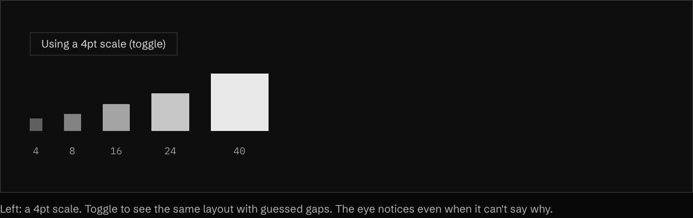

<sub>▶ Interactive on the [live site](https://frontenddesignbasics.vercel.app/docs/rules/scales-and-type).</sub>

| Token | px | Tailwind | Typical use |
|---|---|---|---|
| `--space-1` | 4 | `1` | Icon to label, stacked label to input |
| `--space-2` | 8 | `2` | Gap inside a button group, between chips |
| `--space-3` | 12 | `3` | Input padding, list row padding |
| `--space-4` | 16 | `4` | Phone gutter, card padding on phones, form field gap |
| `--space-6` | 24 | `6` | Card padding, grid gap |
| `--space-8` | 32 | `8` | Between groups inside a section |
| `--space-12` | 48 | `12` | Between sub-sections |
| `--space-16` | 64 | `16` | Section spacing on phones |
| `--space-24` | 96 | `24` | Section spacing on desktop |
| `--space-32` | 128 | `32` | Hero padding on large screens |

- **MUST** use only these steps. 5, 10, 13 and 18 do not exist.
- **MUST** make the gap between groups at least twice the gap inside them: 8 inside, 16 or more between.
- **SHOULD** use 1px and 2px only for borders, outlines and focus-ring offsets. Those are the only off-scale values.
- **SHOULD** keep component padding to 3 steps: 12, 16 and 24.

## Radius scale

Tailwind v4 defaults. Pick two or three for a product and ban the rest.

| Token | px | Use |
|---|---|---|
| `rounded-none` | 0 | Tables, full-bleed images, brutalist styles |
| `rounded-xs` | 2 | Checkboxes, tiny tags |
| `rounded-sm` | 4 | Inputs, small buttons |
| `rounded-md` | 6 | Buttons, menus |
| `rounded-lg` | 8 | Cards, popovers |
| `rounded-xl` | 12 | Large cards, sheets |
| `rounded-2xl` | 16 | Modals, feature panels |
| `rounded-3xl` | 24 | Hero media, bottom sheets on phones |
| `rounded-full` | 9999px | Pills, avatars, icon buttons |

- **MUST** make nested corners concentric: inner radius = outer radius minus the padding between them. A 16px card with 8px padding holds an 8px image.
- **SHOULD** use no more than 3 radii in one product, plus `full`.
- **SHOULD** grow radius with size. A 4px chip and a 16px modal look related; a 16px chip does not.

## Shadow and elevation

Shadows say how far above the page something floats. Use a few named levels, each with one job.

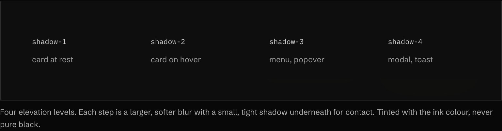

<sub>Four elevation levels. Each step is a larger, softer blur with a small, tight shadow underneath for contact. Tinted with the ink colour, never pure black.</sub>

<sub>▶ Interactive on the [live site](https://frontenddesignbasics.vercel.app/docs/rules/scales-and-type).</sub>

```css
:root {
  --shadow-1: 0 1px 2px rgb(22 20 15 / 0.08);
  --shadow-2: 0 1px 2px rgb(22 20 15 / 0.06), 0 4px 12px rgb(22 20 15 / 0.08);
  --shadow-3: 0 2px 4px rgb(22 20 15 / 0.06), 0 12px 24px rgb(22 20 15 / 0.12);
  --shadow-4: 0 4px 8px rgb(22 20 15 / 0.08), 0 24px 48px rgb(22 20 15 / 0.18);
}
```

| Level | Token | Use |
|---|---|---|
| 0 | none | Page, sections, anything in the flow |
| 1 | `--shadow-1` | Cards at rest, inputs if you use shadows at all |
| 2 | `--shadow-2` | Hovered or dragged cards, sticky header once scrolled |
| 3 | `--shadow-3` | Dropdowns, popovers, select lists |
| 4 | `--shadow-4` | Modals, drawers, toasts |

- **MUST** tie elevation to z-index: a higher shadow never sits under a lower one.
- **MUST** show elevation in dark mode with a lighter surface, not a stronger shadow. Shadows barely read on near-black. Material's dark theme does the same.
- **SHOULD** tint shadows with the ink colour (`rgb(22 20 15 / …)`), never `rgba(0,0,0,…)`.
- **SHOULD NOT** combine a shadow and a border on the same card. Pick one.

## Z-index: named layers

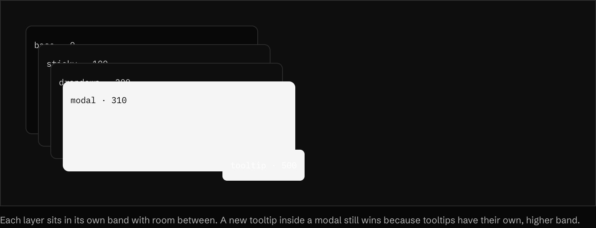

<sub>Each layer sits in its own band with room between. A new tooltip inside a modal still wins because tooltips have their own, higher band.</sub>

<sub>▶ Interactive on the [live site](https://frontenddesignbasics.vercel.app/docs/rules/scales-and-type).</sub>

| Layer | Token | Value | What lives there |
|---|---|---|---|
| Base | `--z-base` | 0 | Normal flow |
| Raised | `--z-raised` | 10 | A card lifted over its neighbours, sticky table headers inside a section |
| Sticky | `--z-sticky` | 100 | Site header, sticky sidebars, bottom tab bar |
| Dropdown | `--z-dropdown` | 200 | Menus, popovers, select lists, combobox results |
| Overlay | `--z-overlay` | 300 | Modal and drawer backdrops |
| Modal | `--z-modal` | 310 | Dialogs, drawers, sheets |
| Toast | `--z-toast` | 400 | Toasts and banners that must beat modals |
| Tooltip | `--z-tooltip` | 500 | Tooltips, which can appear anywhere |

- **MUST** use only these tokens. `z-index: 9999` or `z-50` chosen by feel is a bug.
- **MUST** add `isolation: isolate` to a component that uses z-index inside itself, so its numbers cannot leak and fight the page layers.
- **SHOULD** use the native top layer where you can. `<dialog>` opened with `showModal()` and elements using the `popover` attribute sit above everything without any z-index.

## Icon sizes

| Size | Pairs with | Use |
|---|---|---|
| 12px | `text-xs` | Inline status dots, table sort arrows. Rare |
| 16px | `text-sm`, `text-base` | Inline with text, inside small buttons and inputs |
| 20px | `text-base` | Buttons, inputs, nav items. The UI default |
| 24px | `text-lg` and up | Standalone icons, toolbars, tab bars. Material's default size |
| 32px | headings | Feature lists, settings rows |
| 48px | `text-2xl` and up | Empty states, onboarding |

- **MUST** size the icon to the line-height of the text beside it, or one step below. A 16px icon suits 14px text on a 20px line.
- **MUST** give icon-only buttons a 44×44px hit area, whatever the icon size, and an `aria-label`.
- **SHOULD** keep one stroke width across the set: 1.5px or 2px at 24px (Lucide's default is 2). Mixing icon libraries mixes stroke widths.
- **SHOULD** colour icons with `currentColor`, so they follow the text colour in every state and theme.

## Choose a voice, not a default

The fastest way to make a site look generated is to use the font every generator uses. Pick type that
belongs to the subject:

- **Editorial, cultural, craft**: a serif with character for display (this guide uses *Newsreader*),
  paired with a plain grotesk for text.
- **Product and tools**: one well-drawn grotesk family doing everything. Weight and size make the hierarchy.
- **Playful or nostalgic**: a display face with a strong period flavour, used sparingly. Never for body copy.
  This site uses the IBM VGA 8x16 pixel font, at multiples of 16px only.

One family, or two clearly different ones. Never two that are *almost* the same.

**In the wild · 24 examples**

<table>
<tr><td width="33%" valign="top"><a href="https://klim.co.nz"></a><br/><b><a href="https://klim.co.nz">Klim Type Foundry</a></b><br/><sub>One huge inflated black 'A' fills an orange screen; a single letterform is the whole hero.</sub></td><td width="33%" valign="top"><a href="https://www.instrument.com"></a><br/><b><a href="https://www.instrument.com">Instrument</a></b><br/><sub>Ultra-heavy wordmark set edge to edge as the masthead, with small condensed caps in pill nav.</sub></td><td width="33%" valign="top"><a href="https://commercialtype.com"></a><br/><b><a href="https://commercialtype.com">Commercial Type</a></b><br/><sub>Full-width bands each set one typeface huge: hairline New Doric, fat Orlando serif, Arabic.</sub></td></tr>
<tr><td width="33%" valign="top"><a href="https://www.futurefonts.xyz">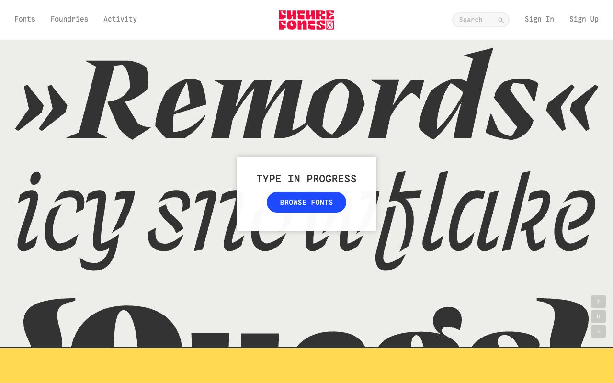</a><br/><b><a href="https://www.futurefonts.xyz">Future Fonts</a></b><br/><sub>Giant specimen lines of quirky display serifs and italics fill the page behind a tiny CTA.</sub></td><td width="33%" valign="top"><a href="https://velvetyne.fr">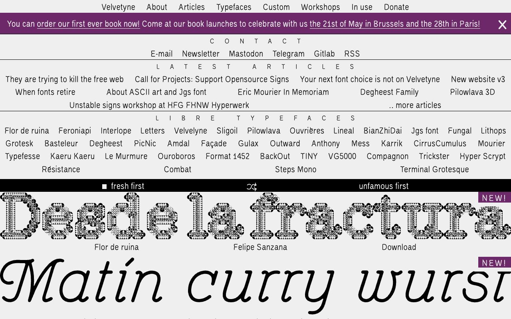</a><br/><b><a href="https://velvetyne.fr">Velvetyne</a></b><br/><sub>Brutalist text-only index with letterspaced labels, then full-bleed specimens like ornate 'Deede la fractura'.</sub></td><td width="33%" valign="top"><a href="https://sharptype.co">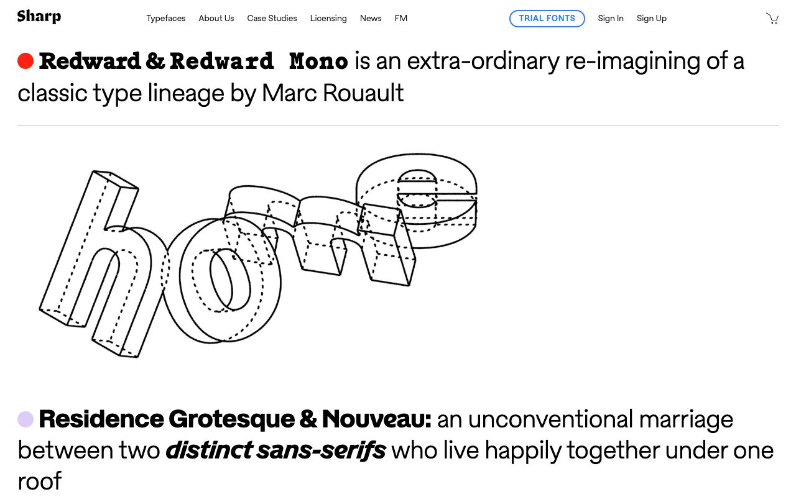</a><br/><b><a href="https://sharptype.co">Sharp Type</a></b><br/><sub>Sentences mix the fonts they describe inline: slab, mono, grotesque, italic, beside an outline 3D word.</sub></td></tr>
<tr><td width="33%" valign="top"><a href="https://lineto.com">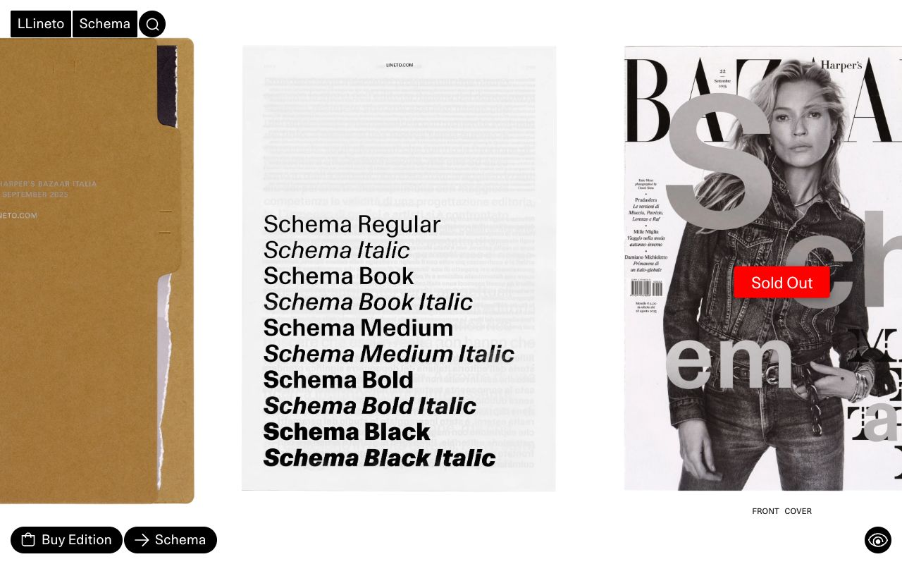</a><br/><b><a href="https://lineto.com">Lineto</a></b><br/><sub>A printed weight ladder, Regular to Black Italic, beside a magazine cover using the same face.</sub></td><td width="33%" valign="top"><a href="https://www.grillitype.com"></a><br/><b><a href="https://www.grillitype.com">Grilli Type</a></b><br/><sub>Test-card hero spelling MCNK, then a clean two-column list where each name is set in itself.</sub></td><td width="33%" valign="top"><a href="https://ohnotype.co">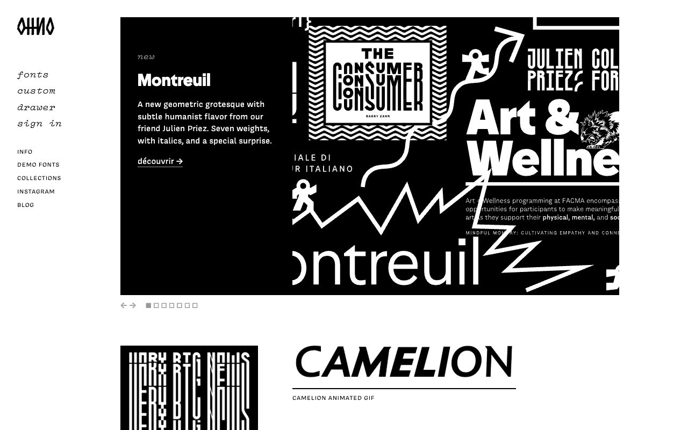</a><br/><b><a href="https://ohnotype.co">OH no Type Co</a></b><br/><sub>Italic mono nav, then black-and-white posters and a bold CAMELION specimen that show the fonts in use.</sub></td></tr>
<tr><td width="33%" valign="top"><a href="https://www.typotheque.com">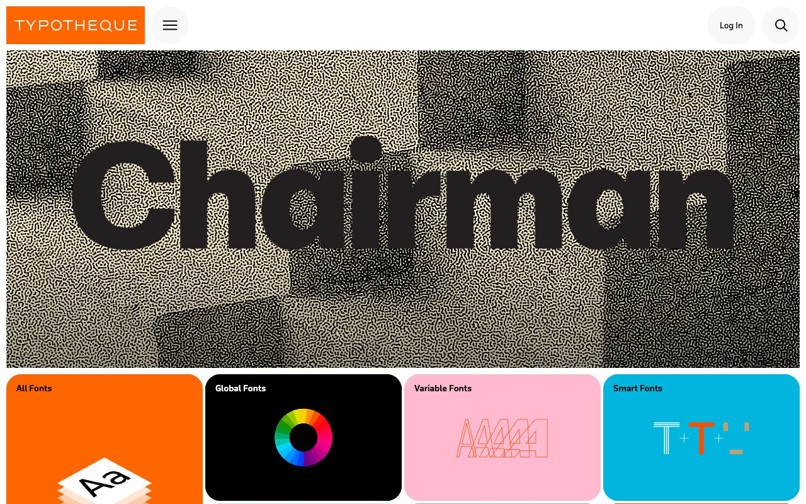</a><br/><b><a href="https://www.typotheque.com">Typotheque</a></b><br/><sub>Heavy 'Chairman' wordmark over a dense halftone texture, above a row of bright category cards.</sub></td><td width="33%" valign="top"><a href="https://www.wearecollins.com">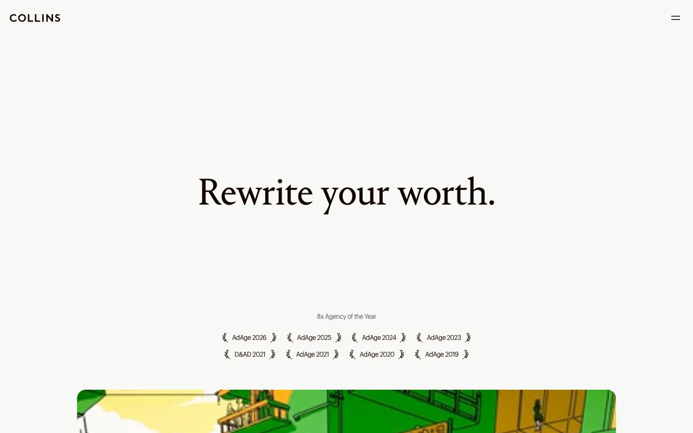</a><br/><b><a href="https://www.wearecollins.com">COLLINS</a></b><br/><sub>A lone classical serif line, 'Rewrite your worth.', centred in a lot of empty space.</sub></td><td width="33%" valign="top"><a href="https://pangrampangram.com">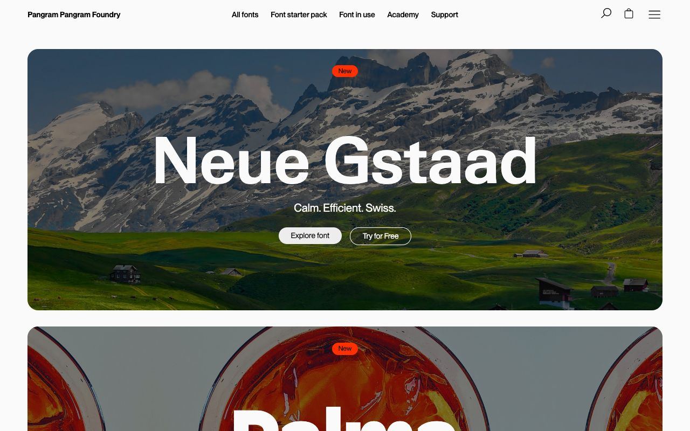</a><br/><b><a href="https://pangrampangram.com">Pangram Pangram Foundry</a></b><br/><sub>Rounded photo cards, each named with its own typeface in huge bold white text, like 'Neue Gstaad'.</sub></td></tr>
<tr><td width="33%" valign="top"><a href="https://www.205.tf">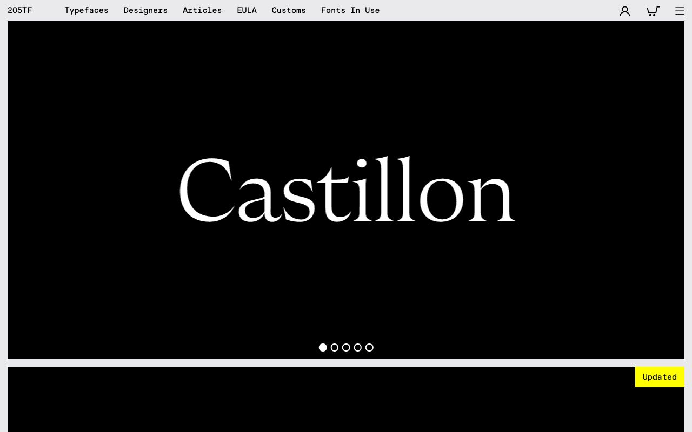</a><br/><b><a href="https://www.205.tf">205TF</a></b><br/><sub>One serif word, white on black, fills the slide; monospace nav keeps the interface quiet.</sub></td><td width="33%" valign="top"><a href="https://boldmonday.com">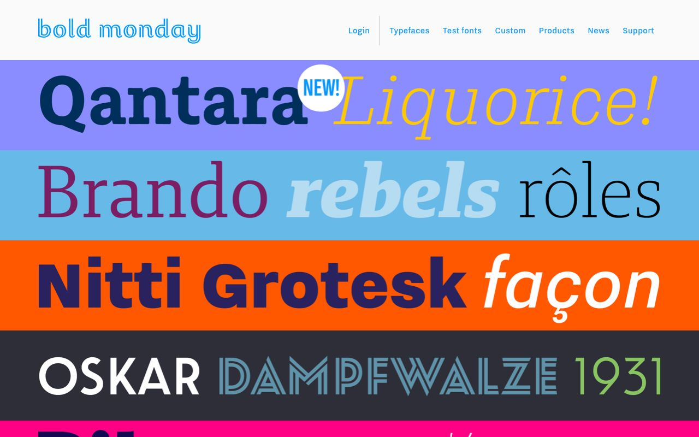</a><br/><b><a href="https://boldmonday.com">Bold Monday</a></b><br/><sub>Stacked colour bands each set a typeface in weights and italics, mixing families per line.</sub></td><td width="33%" valign="top"><a href="https://bureauroffa.com">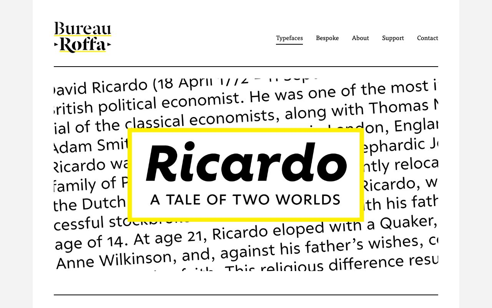</a><br/><b><a href="https://bureauroffa.com">Bureau Roffa</a></b><br/><sub>Rotated running text behind a boxed display title shows a typeface at two scales at once.</sub></td></tr>
<tr><td width="33%" valign="top"><a href="https://cotypefoundry.com">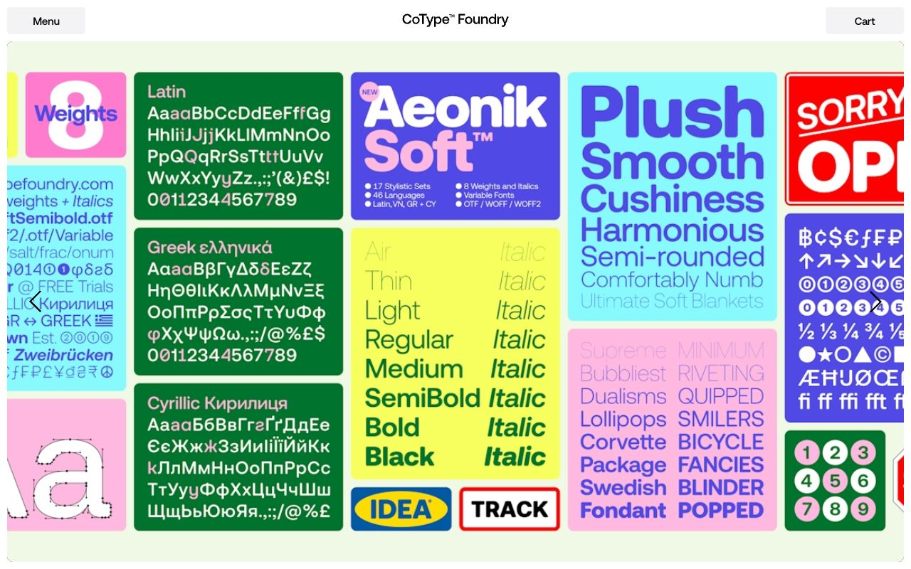</a><br/><b><a href="https://cotypefoundry.com">CoType Foundry</a></b><br/><sub>Specimen tiles show weights, scripts, glyphs and numerals of Aeonik Soft in bright colour blocks.</sub></td><td width="33%" valign="top"><a href="https://fontwerk.com">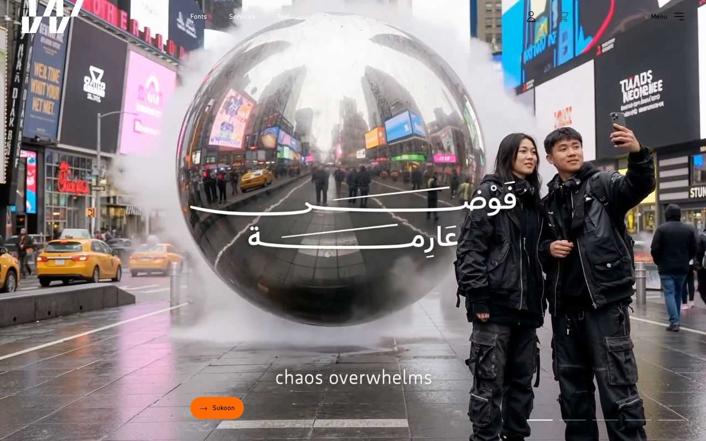</a><br/><b><a href="https://fontwerk.com">Fontwerk</a></b><br/><sub>Arabic display type and Latin caption share one hero, showing a bilingual family in use.</sub></td><td width="33%" valign="top"><a href="https://nouvellenoire.ch">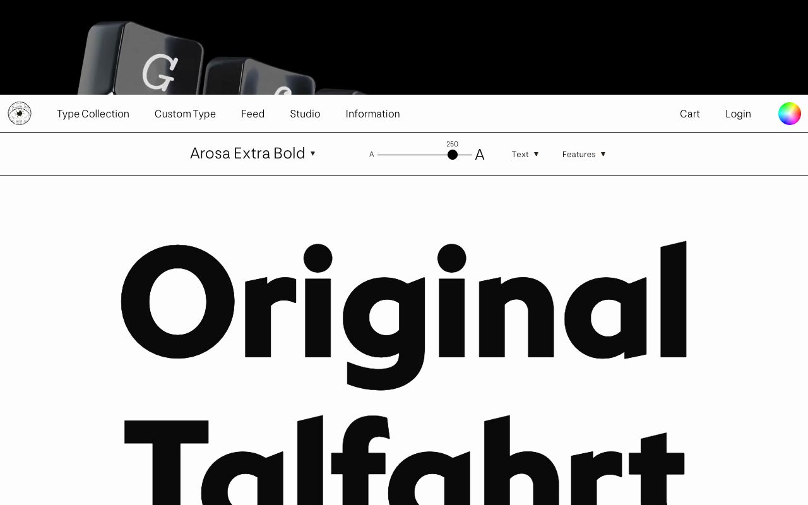</a><br/><b><a href="https://nouvellenoire.ch">Nouvelle Noire</a></b><br/><sub>Live type tester bar with size slider above huge Arosa Extra Bold sample text.</sub></td></tr>
<tr><td width="33%" valign="top"><a href="https://optimo.ch">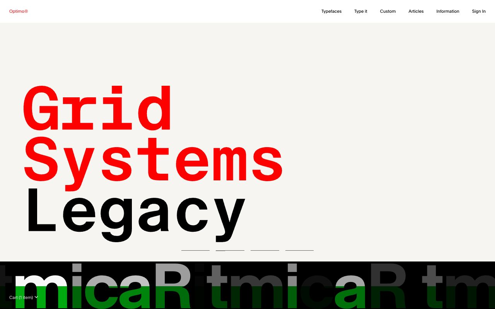</a><br/><b><a href="https://optimo.ch">Optimo</a></b><br/><sub>Huge monospaced headline in red and black on warm paper; a cropped marquee of type below.</sub></td><td width="33%" valign="top"><a href="https://www.productiontype.com">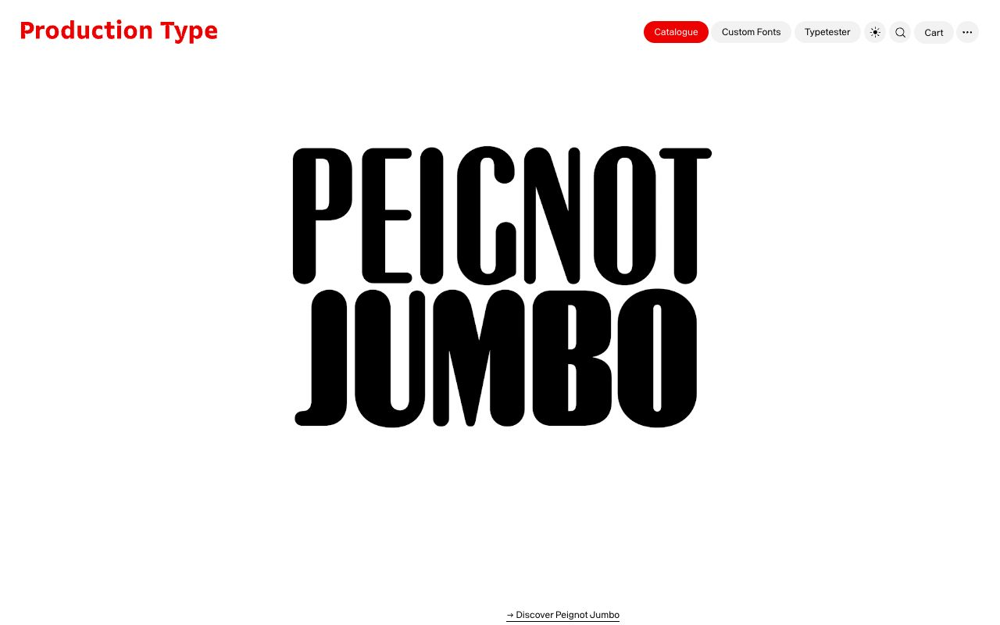</a><br/><b><a href="https://www.productiontype.com">Production Type</a></b><br/><sub>One typeface name set enormous in its own condensed face, surrounded by generous white space.</sub></td><td width="33%" valign="top"><a href="https://www.schick-toikka.com">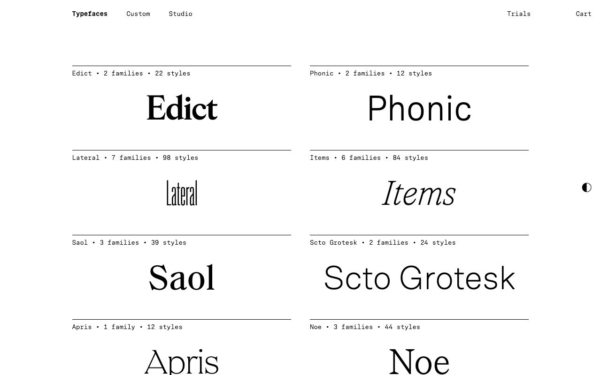</a><br/><b><a href="https://www.schick-toikka.com">Schick Toikka</a></b><br/><sub>Two-column catalogue: each family name set in itself, with monospace metadata above hairline rules.</sub></td></tr>
<tr><td width="33%" valign="top"><a href="https://www.swisstypefaces.com">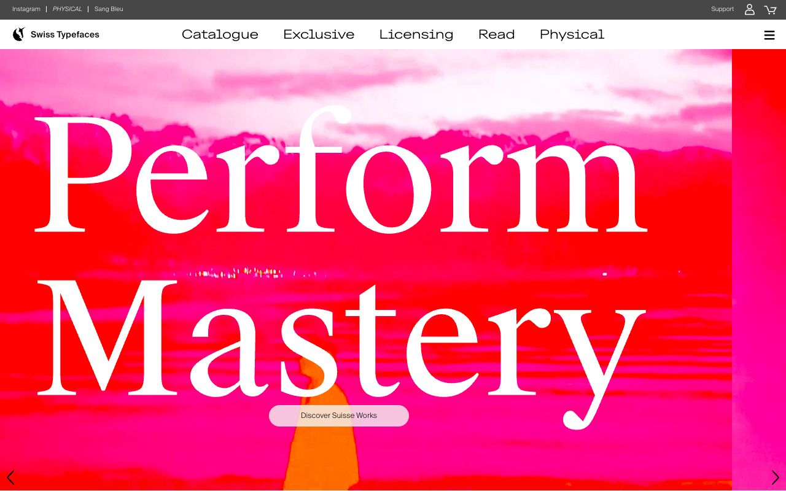</a><br/><b><a href="https://www.swisstypefaces.com">Swiss Typefaces</a></b><br/><sub>Giant white serif headline over a saturated red-magenta photo makes the type the hero.</sub></td><td width="33%" valign="top"><a href="https://tightype.com">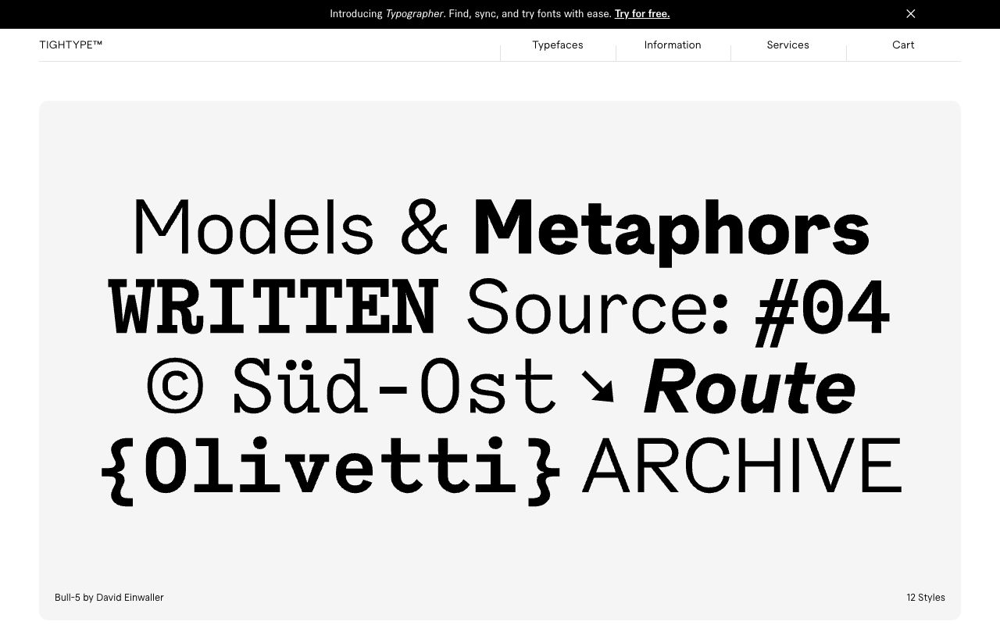</a><br/><b><a href="https://tightype.com">Tightype</a></b><br/><sub>Bull-5 specimen mixes weights, widths and mono styles line by line in one centred block.</sub></td><td width="33%" valign="top"><a href="https://www.typemates.com">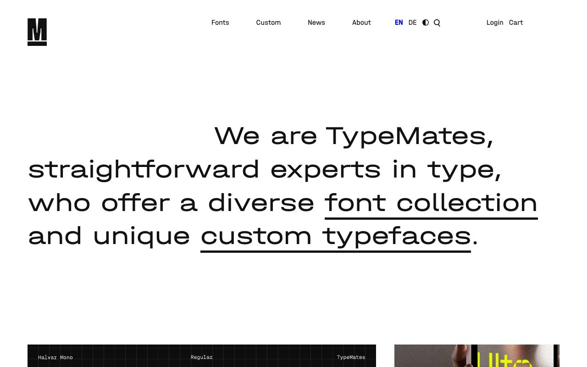</a><br/><b><a href="https://www.typemates.com">TypeMates</a></b><br/><sub>Intro sentence set as large wide display text, with thick underlines doubling as links.</sub></td></tr>
</table>

## Set it for reading

| Setting | Body text | Display text |
|---|---|---|
| Line length | 55 to 75 characters (`max-width: 65ch`) | Short. Break lines by meaning |
| Line height | 1.5 to 1.7 | 0.9 to 1.1 |
| Letter spacing | 0 | Slightly negative (−0.01 to −0.035em) |
| Numbers in tables | `font-variant-numeric: tabular-nums` | n/a |

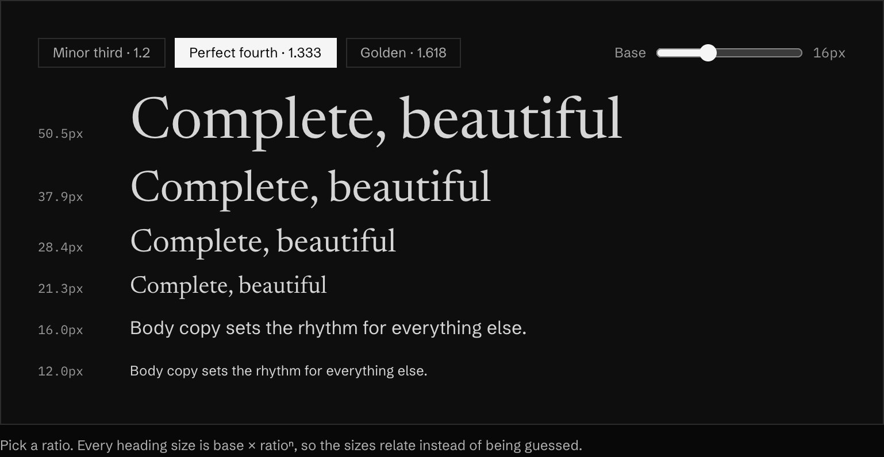

<sub>▶ Interactive on the [live site](https://frontenddesignbasics.vercel.app/docs/rules/scales-and-type).</sub>

Change the ratio and every setting still looks *related*. That relationship is what "clean" really means.

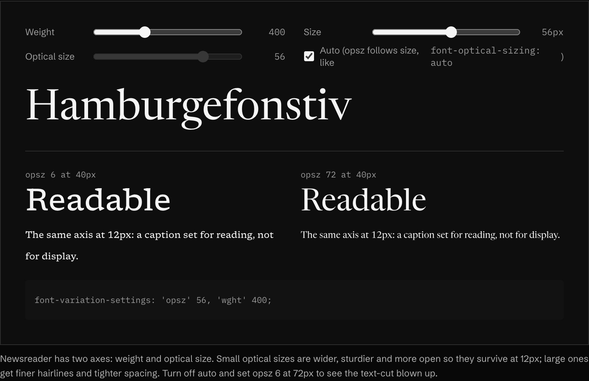

<sub>▶ Interactive on the [live site](https://frontenddesignbasics.vercel.app/docs/rules/scales-and-type).</sub>

Variable fonts put weight and optical size on sliders. Small optical sizes are drawn wider and sturdier,
so they stay readable at caption sizes. Let the size set the axis automatically.

## Why it works

A scale shrinks the number of choices from infinite to about ten. The eye reads repeated intervals as
order, so a page built from ten values looks intentional even to someone who cannot name a single
one. It also makes reviews mechanical: a value is either on the list or it is a bug.

## Sources

- [Type Scale calculator](https://type-scale.com)
- [web.dev: font best practices](https://web.dev/articles/font-best-practices)
- [Tailwind CSS: theme variables](https://tailwindcss.com/docs/theme)
