<!-- generated by `pnpm export:md` from content/docs/rules/tokens-and-colour.mdx. Edit the MDX, not this file. -->

# Tokens and colour

*Two tiers of tokens, one naming pattern, a palette of neutrals plus one accent, and contrast you measure.*

<sub>📖 [Read this chapter on the live site](https://frontenddesignbasics.vercel.app/docs/rules/tokens-and-colour) for the interactive version · [← Guide contents](../README.md)</sub>

> - Two tiers: primitives hold values, semantic tokens give them a job.
> - Components read semantic tokens only. Themes redefine semantic tokens only.
> - Names follow `--{category}-{role}-{variant}-{state}`, in kebab-case.
> - Palette: about 90% neutrals, 8% one accent, 2% semantic colours.
> - Body text 4.5:1, large text 3:1. Build ramps in OKLCH.

Name things by what they do, not by what they look like. `--color-text-soft` survives a rebrand.
`--grey-600` does not, because the day the soft text turns warm, the name lies.

This page sets the token tiers, the naming pattern for CSS variables, how they plug into Tailwind v4,
and how to name components, files and classes.

## Two tiers, one direction

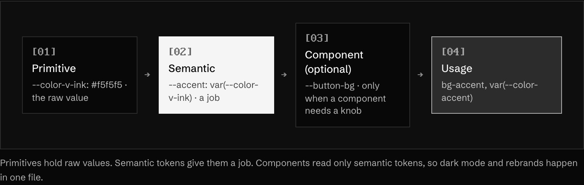

<sub>Primitives hold raw values. Semantic tokens give them a job. Components read only semantic tokens, so dark mode and rebrands happen in one file.</sub>

| Tier | Example | Value | Who may read it |
|---|---|---|---|
| Primitive | `--color-v-ink` | `#f5f5f5` | Semantic tokens only |
| Primitive | `--color-v-bg` | `#080808` | Semantic tokens only |
| Primitive | `--color-c-4` | `#00b3ff` | Semantic tokens, colour experiences |
| Semantic | `--accent` | `var(--color-v-ink)` | Components, patterns |
| Semantic | `--text-soft` | `var(--color-v-dim)` | Components, patterns |
| Component | `--button-height-md` | `40px` | That component only |

- **MUST** keep components off primitives. A button reads `--accent`, never `--color-v-ink` or a raw hex.
- **MUST** switch themes by redefining semantic tokens only. Primitives never change between light and dark.
- **SHOULD** number primitive ramps 50, 100, 200 to 900, 950, as Tailwind does, with 50 lightest.
- **SHOULD** add component tokens only when a value is shared by several parts of one component or needs overriding from outside.
- **SHOULD NOT** create a semantic token used in exactly one place. Use the primitive through an existing role, or add the role properly.

## The naming pattern

Every CSS variable follows one shape, read left to right from general to specific:

```txt
--{category}-{role}-{variant}-{state}

--color-text                 category + role
--color-text-soft            + variant
--color-bg-raised            + variant
--color-border-strong        + variant
--color-accent-hover         + state
--color-danger-text          role + part
```

Use a fixed list of categories and roles, so names are guessable:

| Category | Roles and variants | Examples |
|---|---|---|
| `color` | `bg`, `surface`, `text`, `border`, `accent`, `focus`, `success`, `warning`, `danger` | `--color-bg`, `--color-surface-raised`, `--color-text-soft`, `--color-border-strong` |
| `font` | `sans`, `display`, `mono` | `--font-display` |
| `text` | size steps `xs` to `7xl` | `--text-sm`, `--text-2xl` |
| `leading` | `tight`, `snug`, `normal`, `relaxed` | `--leading-snug` |
| `tracking` | `tight`, `normal`, `wide` | `--tracking-tight` |
| `space` | scale steps `1` to `32` (× 4px) | `--space-4` is 16px |
| `radius` | `xs`, `sm`, `md`, `lg`, `xl`, `full` | `--radius-md` |
| `shadow` | `1` to `4` by elevation | `--shadow-2` |
| `z` | named layers | `--z-modal` |
| `duration` | `instant`, `fast`, `base`, `slow` | `--duration-fast` |
| `ease` | `out`, `in-out`, `in` | `--ease-out` |

Rules for the names themselves:

- **MUST** use lowercase kebab-case: `--color-text-soft`, not `--colorTextSoft` or `--color_text_soft`.
- **MUST** put state last: `--color-accent-hover`, never `--color-hover-accent`.
- **MUST NOT** put a value or a hue in a semantic name: no `--color-accent-white`, no `--space-16px`.
- **SHOULD** use `soft` and `strong` for the two variants either side of a default, and stop there. Three tones of one role is enough.
- **SHOULD** name paired foregrounds `-fg`: `--color-accent` and `--color-accent-fg` (the text that sits on it).

## Tokens in Tailwind v4

Tailwind v4 reads tokens from `@theme` and turns each namespace into utilities. The namespace decides
the utility, so the naming pattern above maps straight across.

| `@theme` namespace | Utilities it creates |
|---|---|
| `--color-*` | `bg-*`, `text-*`, `border-*`, `fill-*`, `ring-*` |
| `--font-*` | `font-*` |
| `--text-*` | `text-*` (size) |
| `--leading-*` | `leading-*` |
| `--radius-*` | `rounded-*` |
| `--shadow-*` | `shadow-*` |
| `--ease-*` | `ease-*` |
| `--breakpoint-*` | `sm:`, `md:` and so on |
| `--spacing` | one base unit; `p-4` is `calc(var(--spacing) * 4)` |

Primitives go in `@theme`. Semantic tokens are plain variables on `:root` that change per theme, then
exposed to Tailwind with `@theme inline`, so the utility points at the live variable:

```css
@import 'tailwindcss';

/* 1. Primitives: fixed values. Mono first, one loud layer for colour moments. */
@theme {
  --color-v-bg: #080808;
  --color-v-surface: #0e0e0e;
  --color-v-ink: #f5f5f5;
  --color-v-dim: #8a8a8a;
  --color-v-steel: #2c2c2c;
  --color-c-2: #ff00a8; /* colour stage only */
  --color-c-4: #00b3ff; /* colour stage only */
}

/* 2. Semantic tokens: jobs. A light theme would redefine only these. */
:root {
  --bg: var(--color-v-bg);
  --surface-raised: var(--color-v-surface);
  --text: var(--color-v-ink);
  --text-soft: var(--color-v-dim);
  --border: var(--color-v-steel);
  --accent: var(--color-v-ink); /* the accent is white: the mono stage is pure black and white */
}

/* 3. Expose them as utilities: bg-bg, text-text-soft, border-border, bg-accent. */
@theme inline {
  --color-bg: var(--bg);
  --color-surface-raised: var(--surface-raised);
  --color-text: var(--text);
  --color-text-soft: var(--text-soft);
  --color-border: var(--border);
  --color-accent: var(--accent);
}
```

This guide's own `app/global.css` is a worked example of the split. The primitives live in `@theme`:
`--color-v-*` for the mono stage (`#080808` ground, `#f5f5f5` ink), `--color-w-*` for the Win95
opening, and `--color-c-1` to `--color-c-6` for the colour finale. Semantic tokens such as `--surface`,
`--text-soft`, `--rule` and `--accent` sit on `:root`. The accent is white, because the mono stage is
pure black and white; colour only arrives inside colour experiences. The site drops the `color-`
prefix on semantic names because it has only a handful. Past about 20, use the full pattern.

- **MUST** use `@theme inline` for tokens whose value is another variable, or the utility freezes the light value.
- **MUST NOT** use arbitrary values (`bg-[#00b3ff]`, `mt-[13px]`) in components. Add a token or use the scale.
- **SHOULD** remove Tailwind's default palette (`--color-*: initial;` inside `@theme`) once your own is complete, so `bg-blue-500` cannot sneak in.

## Components and files

One rule per kind of name. Match what the framework already does, so nothing needs explaining.

| Thing | Convention | Example |
|---|---|---|
| Component | PascalCase, a noun | `PriceCard`, `DatePicker` |
| Component file | kebab-case, matches the component | `price-card.tsx` |
| Props type | Component name + `Props` | `PriceCardProps` |
| Hook | `use` + PascalCase, file in kebab-case | `useMediaQuery` in `use-media-query.ts` |
| Event prop | `on` + noun + verb | `onValueChange`, `onOpenChange` |
| Handler inside a component | `handle` + event | `handleSubmit` |
| Boolean prop | the HTML word when one exists | `disabled`, `open`, `required` |
| Other boolean | `is`, `has`, `can` + adjective | `isPending`, `hasError` |
| Constant | SCREAMING_SNAKE_CASE | `MAX_UPLOAD_MB` |
| CSS variable | kebab-case, pattern above | `--color-text-soft` |
| Data attribute for state | `data-` + state name | `data-state="open"`, `data-disabled` |
| Next.js route file | fixed names | `page.tsx`, `layout.tsx`, `loading.tsx`, `error.tsx`, `not-found.tsx` |

- **MUST** keep one exported component per file, unless the others are its parts (`Card`, `CardHeader`, `CardBody`).
- **MUST** prefix compound parts with the parent name: `DialogTitle`, not `Title`.
- **SHOULD** use kebab-case for every file and folder name. It avoids case-sensitivity bugs between macOS and Linux builds.
- **SHOULD NOT** name by position or look: no `LeftPanel`, `BlueButton`, `BigText`. Name the job: `FilterPanel`, `PrimaryAction`, `PageTitle`.

## Classes without BEM

With Tailwind and components, the component is the block. You do not need `.card__title--large`,
because the file already scopes the styles and props replace modifiers.

```tsx
import { cva, type VariantProps } from 'class-variance-authority';
import { cn } from '@/lib/cn'; // clsx + tailwind-merge

const badge = cva('inline-flex items-center gap-1 rounded-full font-medium', {
  variants: {
    tone: {
      neutral: 'bg-surface-raised text-text-soft',
      accent: 'bg-accent text-white',
      danger: 'bg-danger text-white',
    },
    size: { sm: 'h-5 px-2 text-xs', md: 'h-6 px-2.5 text-sm' },
  },
  defaultVariants: { tone: 'neutral', size: 'md' },
});

export function Badge({ tone, size, className, ...props }: React.ComponentProps<'span'> & VariantProps<typeof badge>) {
  return <span className={cn(badge({ tone, size }), className)} {...props} />;
}
```

- **MUST** let `prettier-plugin-tailwindcss` order classes. It sorts by Tailwind's own order: layout and position first, then box model, typography, visuals, and variants such as `hover:` and `md:` after the base classes. Never hand-sort.
- **MUST** merge incoming `className` last with `cn()`, so callers can override without `!important`.
- **MUST** express modifiers as props (`tone="danger"`), never as extra class names the caller has to know.
- **MUST** style state from attributes, not from state classes: `aria-expanded:rotate-180`, `data-[state=open]:bg-surface-raised`, not `.is-open`.
- **SHOULD** keep a class list under about 12 utilities. Past that, move variants into `cva` or split the element.

In plain CSS, keep the same idea: one class on the component root, children reached with `:where()`
so specificity stays at one class, and state read from attributes.

```css
.price-card { padding: var(--space-6); border-radius: var(--radius-lg); }
.price-card :where(h3) { font-size: var(--text-xl); }
.price-card[data-state='selected'] { outline: 2px solid var(--color-accent); }
```

## Build the palette in three layers

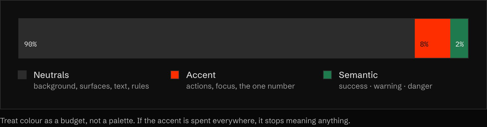

1. **Neutrals (about 90% of the page).** A background, a raised surface, two text tones and a rule
   colour. Tint them slightly towards your subject instead of pure grey.
2. **One accent (about 8%).** Links, the primary button, focus rings, the one number that matters.
   If everything is accented, nothing is.
3. **Semantic colours (about 2%).** Success, warning, danger. Used only for those meanings.

This site's own tokens live in `app/global.css`: `--v-*` for the mono stages, `--w-*` for the Win95
act and `--c-1` to `--c-6` for the colour finale. Colour arrives gradually, and text on colour is
always `#080808` or `#ffffff`, whichever passes 4.5:1.

**In the wild · 17 examples**

<table>
<tr><td width="33%" valign="top"><a href="https://gumroad.com"></a><br/><b><a href="https://gumroad.com">Gumroad</a></b><br/><sub>Off-white page with black type and one loud pink on the floating outlined coins.</sub></td><td width="33%" valign="top"><a href="https://arc.net"></a><br/><b><a href="https://arc.net">Arc</a></b><br/><sub>Grainy electric-blue bands with wavy edges frame a soft pastel-and-white middle.</sub></td><td width="33%" valign="top"><a href="https://mschf.com"></a><br/><b><a href="https://mschf.com">MSCHF</a></b><br/><sub>Black and grey mono list where only three lines glow yellow, blue and red.</sub></td></tr>
<tr><td width="33%" valign="top"><a href="https://resend.com"></a><br/><b><a href="https://resend.com">Resend</a></b><br/><sub>All-black dark mode: grey-to-white gradient serif headline, matte black cube, and no accent hue.</sub></td><td width="33%" valign="top"><a href="https://www.hellomonday.com"></a><br/><b><a href="https://www.hellomonday.com">Hello Monday</a></b><br/><sub>Pure black-on-white line drawings and serif type, with a black curved panel as the only block.</sub></td><td width="33%" valign="top"><a href="https://wise.com"></a><br/><b><a href="https://wise.com">Wise</a></b><br/><sub>Black heavy caps on white, with lime-green buttons as the single brand accent.</sub></td></tr>
<tr><td width="33%" valign="top"><a href="https://pitch.com"></a><br/><b><a href="https://pitch.com">Pitch</a></b><br/><sub>Everything tinted one violet, from banner to background, with a lone lime 'Sign up' button.</sub></td><td width="33%" valign="top"><a href="https://supabase.com"></a><br/><b><a href="https://supabase.com">Supabase</a></b><br/><sub>Neutral white and grey UI where green only marks the second headline line and the main CTA.</sub></td><td width="33%" valign="top"><a href="https://www.duolingo.com"></a><br/><b><a href="https://www.duolingo.com">Duolingo</a></b><br/><sub>Mostly white screen; bright owl green carries the logo, mascot and main button.</sub></td></tr>
<tr><td width="33%" valign="top"><a href="https://brand.dropbox.com/color"></a><br/><b><a href="https://brand.dropbox.com/color">Dropbox Brand — Color</a></b><br/><sub>Paired swatches (lime/forest, pink/rose, orange/rust) on near-black grid show tone-on-tone colour pairing rules.</sub></td><td width="33%" valign="top"><a href="https://flybyjing.com"></a><br/><b><a href="https://flybyjing.com">Fly By Jing</a></b><br/><sub>Chili red, jade green and hot yellow CTA carry the brand; yellow reserved for logo and button.</sub></td><td width="33%" valign="top"><a href="https://drinkghia.com"></a><br/><b><a href="https://drinkghia.com">Ghia</a></b><br/><sub>Burgundy bars, pink accents and warm sand photo form one palette echoing the bottle itself.</sub></td></tr>
<tr><td width="33%" valign="top"><a href="https://drinkolipop.com"></a><br/><b><a href="https://drinkolipop.com">OLIPOP</a></b><br/><sub>Deep green panel, cream type and caramel drips pull the hero palette straight from the flavour.</sub></td><td width="33%" valign="top"><a href="https://omsom.com"></a><br/><b><a href="https://omsom.com">Omsom</a></b><br/><sub>Acid-yellow starburst with red type pops against warm terracotta photo; lilac stripe adds contrast.</sub></td><td width="33%" valign="top"><a href="https://partiful.com"></a><br/><b><a href="https://partiful.com">Partiful</a></b><br/><sub>Grainy blue-to-magenta gradient washes into the party photo, giving the brand one vivid mood.</sub></td></tr>
<tr><td width="33%" valign="top"><a href="https://play.date"></a><br/><b><a href="https://play.date">Playdate</a></b><br/><sub>Single signature yellow device on neutral grey; purple kept only for the Shop button.</sub></td><td width="33%" valign="top"><a href="https://drinkpoppi.com"></a><br/><b><a href="https://drinkpoppi.com">poppi</a></b><br/><sub>Hot magenta nav, acid-lime ticker and green product shot clash deliberately into a loud palette.</sub></td></tr>
</table>

## Check contrast, every time

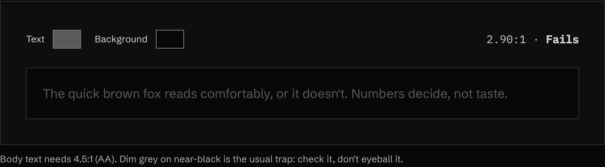

<sub>▶ Interactive on the [live site](https://frontenddesignbasics.vercel.app/docs/rules/tokens-and-colour).</sub>

- Body text: at least **4.5:1**. Large text (24px+, or 19px bold): at least **3:1**.
- Soft grey on a tinted ground is the most common failure on "clean" sites. Measure it.
- Dark mode is its own palette, not an inversion. Reduce saturation and lift the accent.

**Dark mode done well · 17 examples**

<table>
<tr><td width="33%" valign="top"><a href="https://betterstack.com"></a><br/><b><a href="https://betterstack.com">Better Stack</a></b><br/><sub>Navy-black hero, tilted dark product screenshot fading into the background, one violet call to action.</sub></td><td width="33%" valign="top"><a href="https://huly.io"></a><br/><b><a href="https://huly.io">Huly</a></b><br/><sub>A beam of blue-white light splits the black hero and lights the product window below.</sub></td><td width="33%" valign="top"><a href="https://modal.com"></a><br/><b><a href="https://modal.com">Modal</a></b><br/><sub>Pure black with neon green accents: glowing cube, green headline words, greyed logo wall.</sub></td></tr>
<tr><td width="33%" valign="top"><a href="https://neon.com">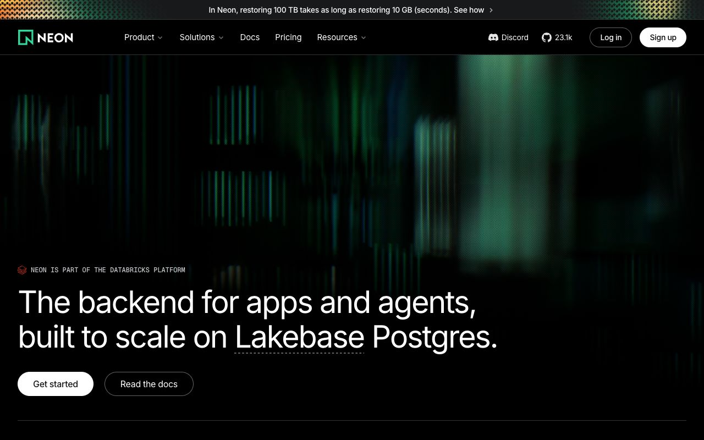</a><br/><b><a href="https://neon.com">Neon</a></b><br/><sub>Blurred green streaks on black behind crisp white type; outline and filled buttons stay legible.</sub></td><td width="33%" valign="top"><a href="https://obsidian.md">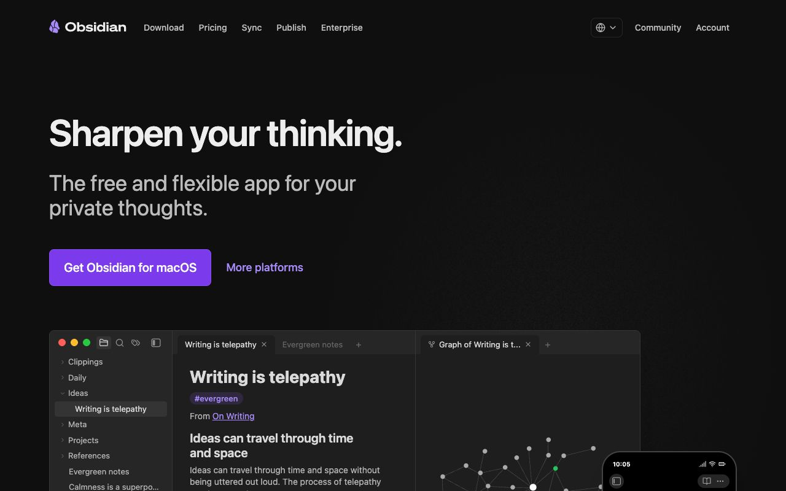</a><br/><b><a href="https://obsidian.md">Obsidian</a></b><br/><sub>Charcoal, not pure black, with one purple accent and a real dark app screenshot below.</sub></td><td width="33%" valign="top"><a href="https://phantom.land">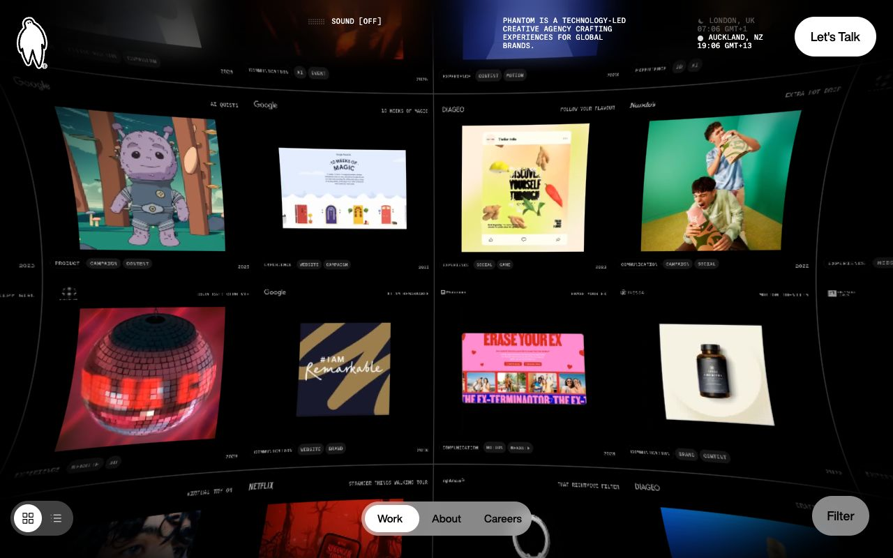</a><br/><b><a href="https://phantom.land">Phantom</a></b><br/><sub>Curved black grid of colourful project tiles; dark frame makes the work glow, tiny mono labels.</sub></td></tr>
<tr><td width="33%" valign="top"><a href="https://polar.sh">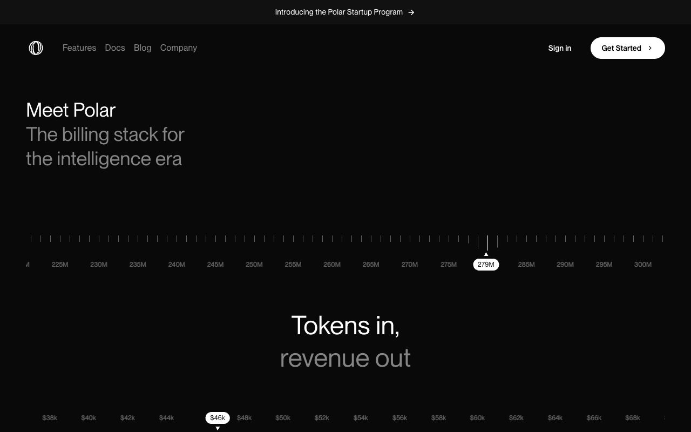</a><br/><b><a href="https://polar.sh">Polar</a></b><br/><sub>Near-black with white and grey type as the only hierarchy; ruler tickers with white pill markers.</sub></td><td width="33%" valign="top"><a href="https://www.rabbit.tech">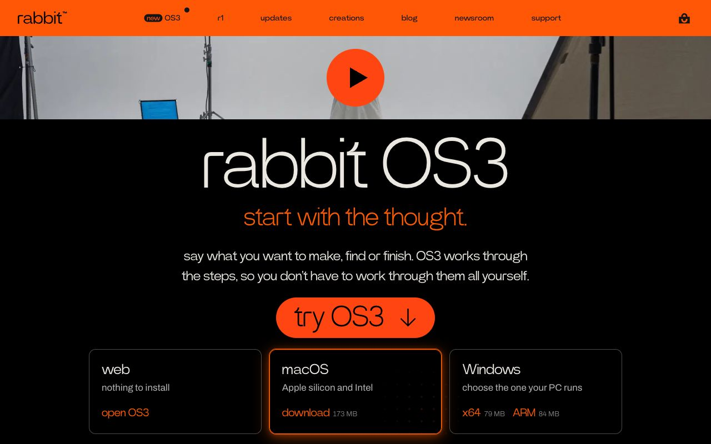</a><br/><b><a href="https://www.rabbit.tech">rabbit</a></b><br/><sub>Black body with signal orange for nav, subhead, button and the glowing selected download card.</sub></td><td width="33%" valign="top"><a href="https://reflect.app">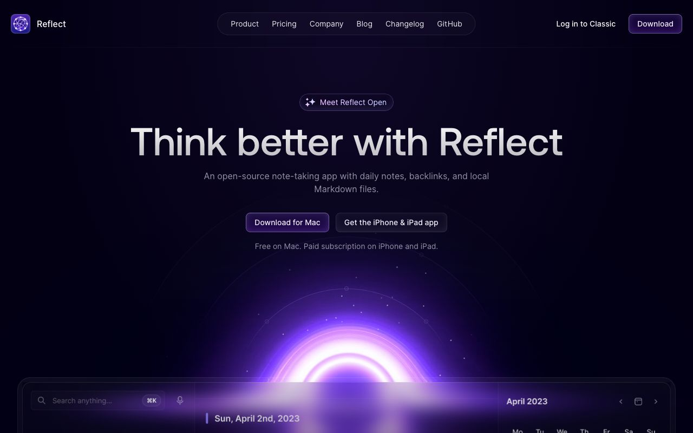</a><br/><b><a href="https://reflect.app">Reflect</a></b><br/><sub>Deep indigo-black with a purple glowing arc rising behind the app; subtle bordered pill nav.</sub></td></tr>
<tr><td width="33%" valign="top"><a href="https://railway.com">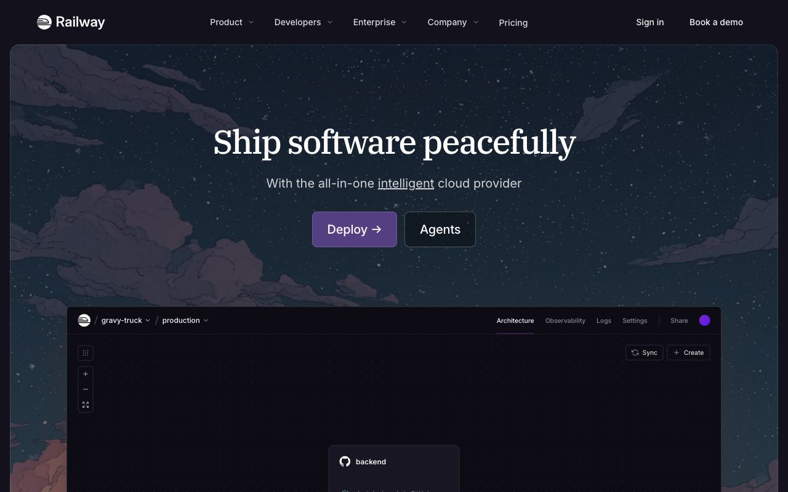</a><br/><b><a href="https://railway.com">Railway</a></b><br/><sub>Illustrated starry night-cloud sky, serif headline, purple CTA, dark product canvas rising from below.</sub></td><td width="33%" valign="top"><a href="https://graphite.dev">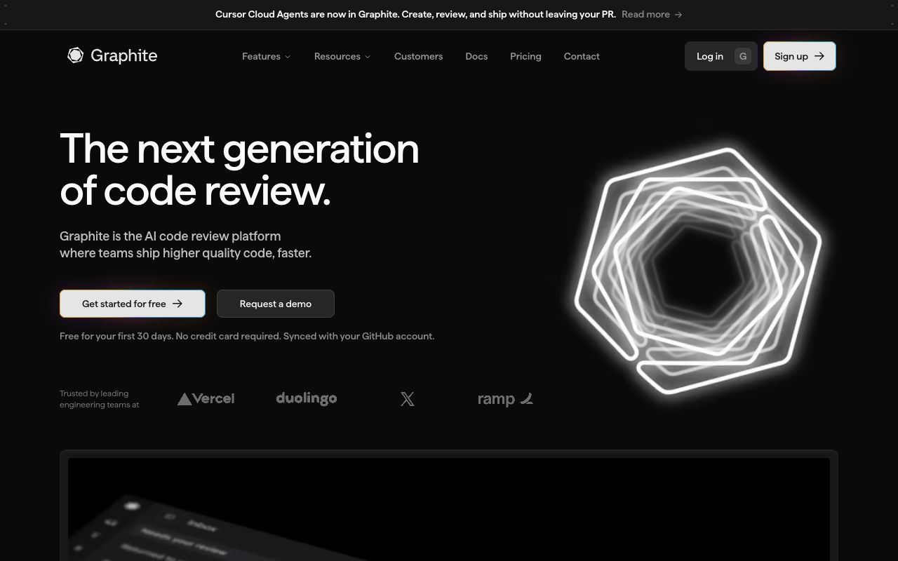</a><br/><b><a href="https://graphite.dev">Graphite</a></b><br/><sub>Near-black page with a glowing white hexagon ring, big tight headline, soft-glow buttons.</sub></td><td width="33%" valign="top"><a href="https://www.inngest.com">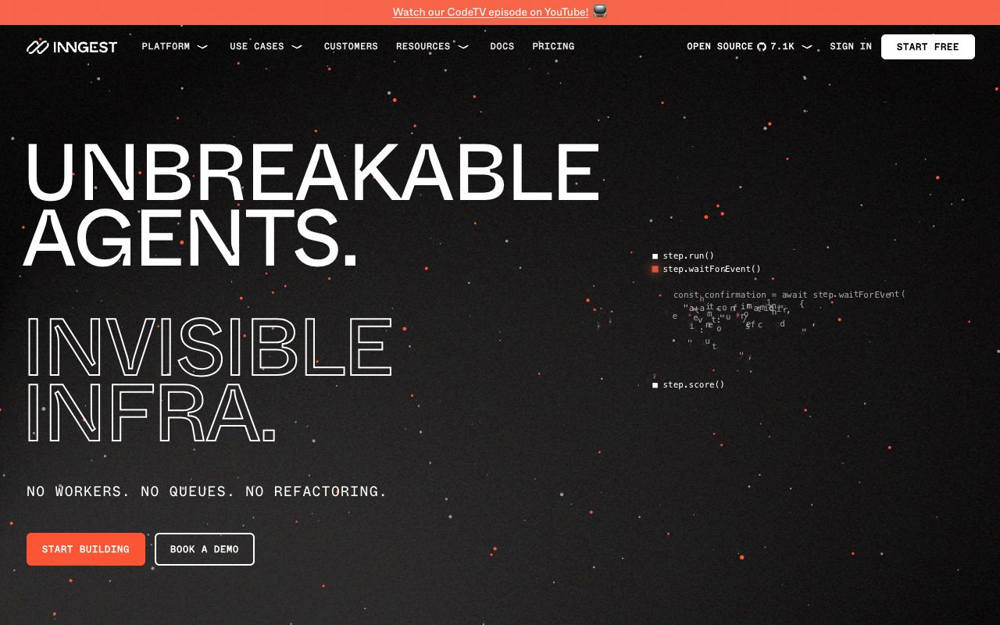</a><br/><b><a href="https://www.inngest.com">Inngest</a></b><br/><sub>Huge solid and outlined uppercase headline on charcoal, orange particle specks, mono code fragments.</sub></td></tr>
<tr><td width="33%" valign="top"><a href="https://www.unkey.com">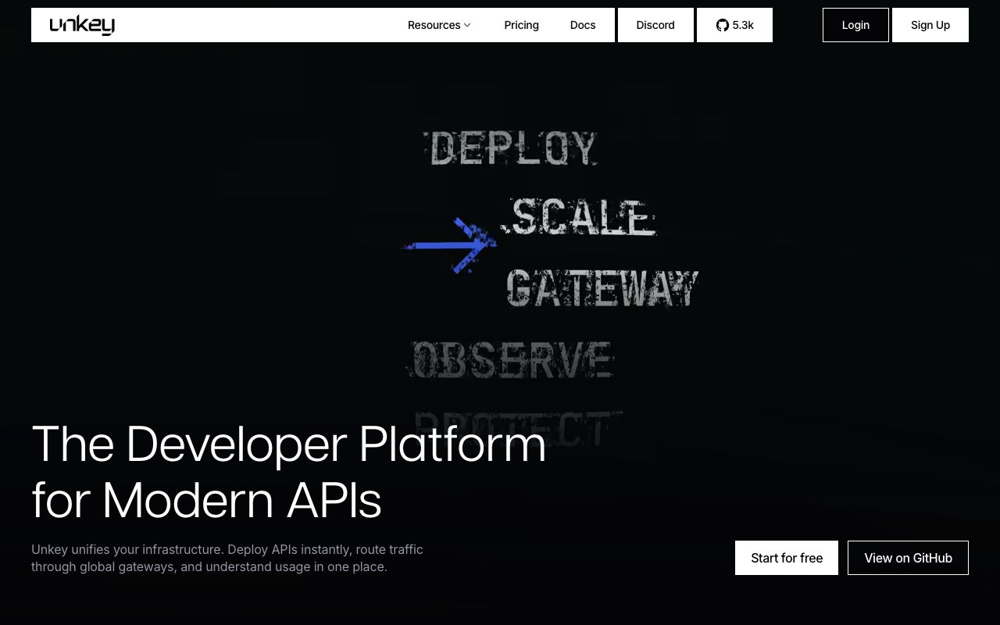</a><br/><b><a href="https://www.unkey.com">Unkey</a></b><br/><sub>Black stage with distressed stencil words cycling past a blue arrow; stark white boxed nav.</sub></td><td width="33%" valign="top"><a href="https://trigger.dev">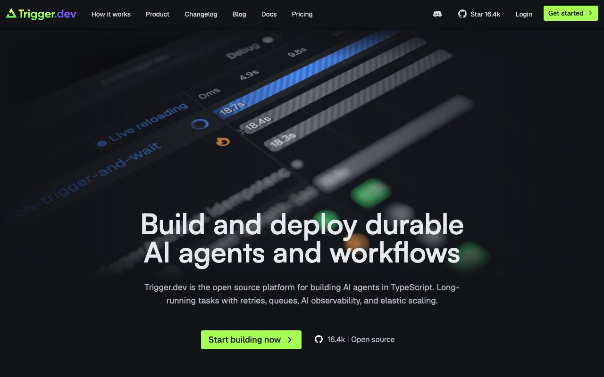</a><br/><b><a href="https://trigger.dev">Trigger.dev</a></b><br/><sub>Tilted, blurred run-timeline UI behind a bold headline; one acid-green CTA on graphite.</sub></td><td width="33%" valign="top"><a href="https://letterboxd.com">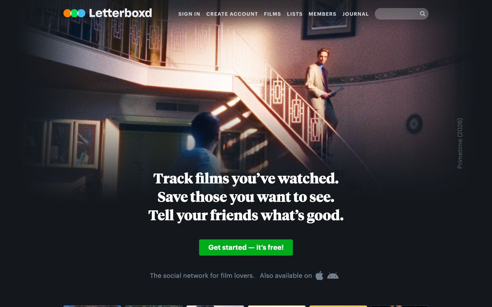</a><br/><b><a href="https://letterboxd.com">Letterboxd</a></b><br/><sub>Film still fades into slate-blue dark UI; bold serif tagline and a single green button.</sub></td></tr>
<tr><td width="33%" valign="top"><a href="https://evervault.com">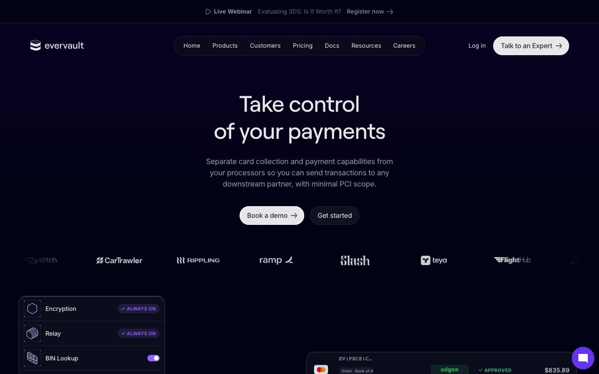</a><br/><b><a href="https://evervault.com">Evervault</a></b><br/><sub>Deep navy-violet hero, pill nav, grey logo strip, dark product cards with purple toggles.</sub></td><td width="33%" valign="top"><a href="https://www.spacex.com"></a><br/><b><a href="https://www.spacex.com">SpaceX</a></b><br/><sub>Full-bleed Starship launch photo, heavy condensed uppercase title, thin outline button, spaced nav.</sub></td></tr>
</table>

## Generate ramps in OKLCH

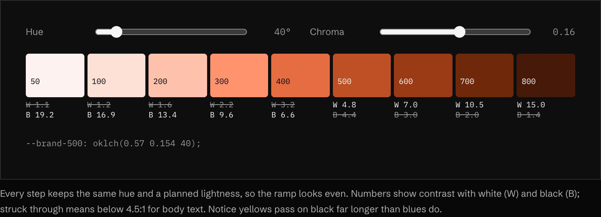

<sub>▶ Interactive on the [live site](https://frontenddesignbasics.vercel.app/docs/rules/tokens-and-colour).</sub>

OKLCH keeps lightness even to the eye, so a ramp built by stepping lightness at one hue looks balanced
from 50 to 900. Check the contrast numbers before choosing which step carries text.

## Why it works

Role names put the decision where it belongs. When the accent changes, one line in the semantic layer
changes and every button follows. When a name follows a fixed pattern, people can guess it without
opening the token file, which is the real test of a naming system.

## Sources

- [Tailwind CSS: theme variables](https://tailwindcss.com/docs/theme)
- [MDN: CSS custom properties](https://developer.mozilla.org/en-US/docs/Web/CSS/Using_CSS_custom_properties)
- [MDN: oklch()](https://developer.mozilla.org/en-US/docs/Web/CSS/color_value/oklch)
